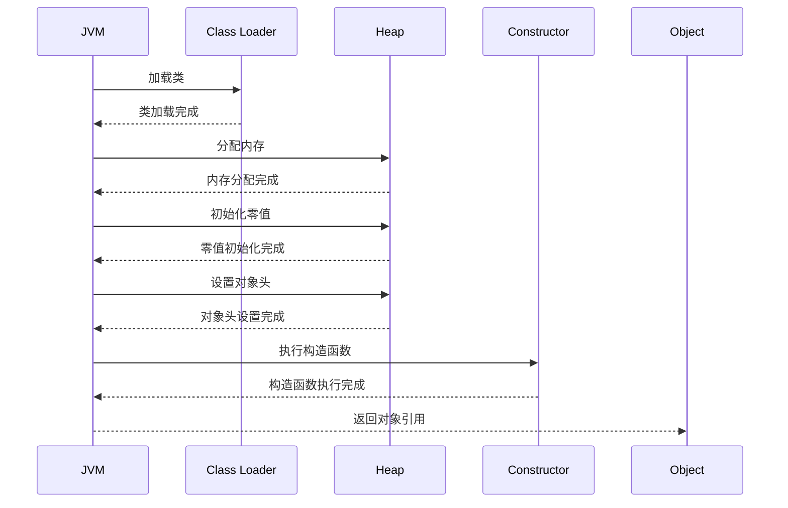
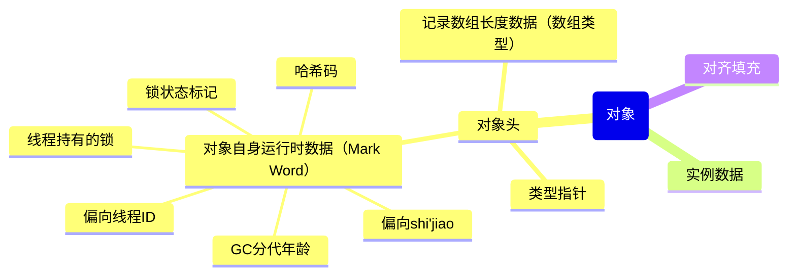
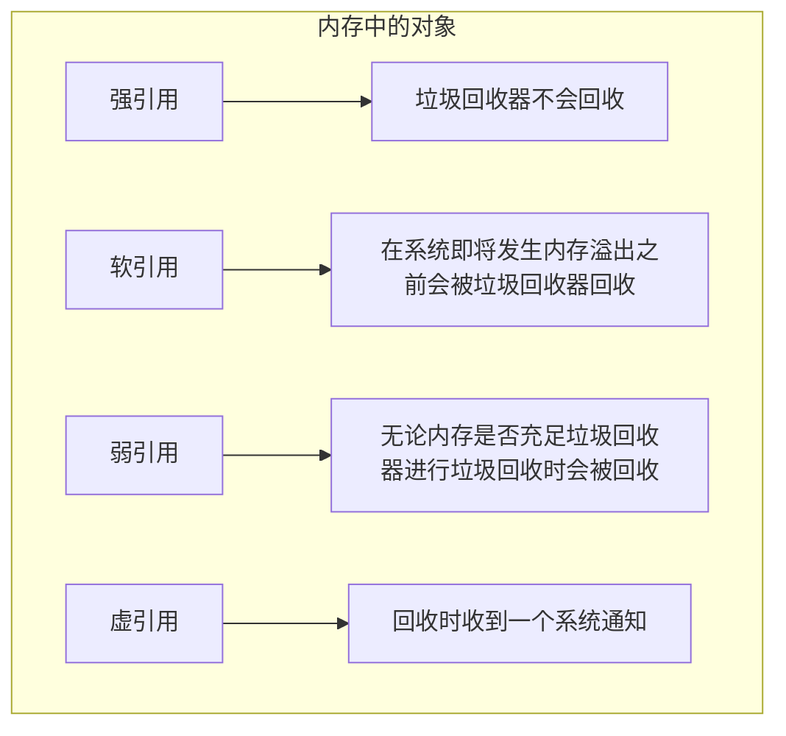

## 能说一下JVM的内存区域吗？

JVM的内存区域分为多个部分，每个部分有其特定的用途和生命周期。主要的内存区域包括：

1. **方法区（Method Area）**：
    - **作用**：存储已加载的类信息、常量、静态变量、即时编译器编译后的代码等。
    - **生命周期**：在JVM启动时创建，在JVM退出时销毁。
    - **特点**：对于HotSpot JVM，它的一部分也被称为永久代（PermGen），从Java 8开始被移除，替换为元空间（Metaspace），元空间使用的是本地内存而不是堆内存。

2. **堆（Heap）**：
    - **作用**：存储对象实例和数组，所有对象都在堆上分配。
    - **生命周期**：在JVM启动时创建，在JVM退出时销毁。
    - **特点**：堆是垃圾回收的主要区域，可以分为新生代（Young Generation）和老年代（Old Generation），新生代又可以进一步划分为伊甸园区（Eden Space）和两个幸存者区（Survivor Space）。

3. **Java栈（Java Stack）**：
    - **作用**：每个线程有一个独立的Java栈，存储方法调用的局部变量、操作数栈、动态链接、方法出口等信息。
    - **生命周期**：与线程相同，线程创建时创建，线程结束时销毁。
    - **特点**：栈中的变量是线程私有的，不会出现线程间的数据共享问题。

4. **程序计数器（Program Counter Register）**：
    - **作用**：当前线程执行的字节码的行号指示器。如果当前线程正在执行的是本地方法，这个计数器的值是未定义的。
    - **生命周期**：与线程相同，线程创建时创建，线程结束时销毁。
    - **特点**：它是线程私有的，每个线程都有独立的程序计数器。

5. **本地方法栈（Native Method Stack）**：
    - **作用**：与Java栈类似，但为Native方法服务，存储本地方法的调用信息。
    - **生命周期**：与线程相同，线程创建时创建，线程结束时销毁。
    - **特点**：也是线程私有的，支持Native方法调用。

JVM的内存区域分为方法区、堆、Java栈、程序计数器和本地方法栈。每个区域都有其特定的用途和生命周期，合理地管理这些内存区域对于JVM高效运行和垃圾回收有着至关重要的作用。

## 说一下JDK1.6、1.7、1.8内存区域的变化？

在不同版本的Java开发工具包（JDK）中，Java虚拟机（JVM）的内存区域有一些重要的变化。以下是JDK 1.6、1.7和1.8之间内存区域的主要变化：

### JDK 1.6

在JDK 1.6中，JVM的内存区域主要包括：

1. **方法区（Method Area）**：用于存储类结构（例如运行时常量池、字段、方法代码），由永久代（Permanent Generation, PermGen）实现。
2. **堆（Heap）**：用于存储对象实例，分为新生代和老年代。
3. **Java栈（Java Stack）**：每个线程有一个独立的Java栈，用于存储局部变量、操作数栈、方法返回值等。
4. **程序计数器（Program Counter Register）**：每个线程有一个独立的程序计数器，用于记录当前线程执行的字节码行号。
5. **本地方法栈（Native Method Stack）**：用于支持Native方法的执行。

### JDK 1.7

在JDK 1.7中，主要变化是永久代（PermGen）的逐步移除，部分数据迁移到堆中（如运行时常量池），以解决PermGen空间不足的问题：

1. **永久代逐步移除**：运行时常量池（Runtime Constant Pool）从永久代移出，变为堆的一部分。
2. **字符串池移出永久代**：字符串常量池被移到Java堆中，解决了因为PermGen空间不足导致的OutOfMemoryError的问题。

### JDK 1.8

在JDK 1.8中，永久代被完全移除，替换为元空间（Metaspace）：

1. **元空间（Metaspace）**：用于替代永久代，存储类的元数据。元空间在本地内存中分配，不再使用堆内存，从而可以避免PermGen空间不足的问题。
2. **其他内存区域**：堆、Java栈、程序计数器、本地方法栈仍然保留，功能基本不变。

### 详细变化对比

#### 永久代（PermGen）与元空间（Metaspace）

- **JDK 1.6和1.7**：永久代用于存储类元数据、方法信息等。
- **JDK 1.8**：永久代被移除，元空间用于存储类元数据。元空间在本地内存中动态扩展，不受堆内存大小限制。

#### 字符串常量池

- **JDK 1.6**：字符串常量池在永久代中。
- **JDK 1.7和1.8**：字符串常量池移到Java堆中，解决了字符串常量池引起的内存管理问题。
  - 物理上存放在堆中，逻辑上属于方法区


#### 运行时常量池

- **JDK 1.6**：运行时常量池在永久代中。
- **JDK 1.7和1.8**：运行时常量池移到Java堆中，避免了永久代空间不足的问题。
  - 物理上存放在堆中，逻辑上属于方法区


### 总结

1. **JDK 1.6**：使用永久代来存储类元数据、运行时常量池和字符串常量池等。
2. **JDK 1.7**：开始移除永久代，运行时常量池和字符串常量池迁移到Java堆中。
3. **JDK 1.8**：永久代完全移除，使用元空间替代，用于存储类元数据，字符串常量池和运行时常量池继续在Java堆中。

这些变化主要是为了改进内存管理，减少OutOfMemoryError的发生，提升JVM的性能和稳定性。

## 字符串常量池和运行时常量池有啥区别？

字符串常量池和运行时常量池虽然名称相似，但它们在Java虚拟机（JVM）中的用途和实现方式有所不同。以下是它们的主要区别：

### 字符串常量池

1. **定义**：
    - 字符串常量池（String Constant Pool）是一个专门用于存储字符串字面值（String literals）的区域。

2. **位置**：
    - 在JDK 1.6及之前，字符串常量池位于永久代（PermGen）。
    - 从JDK 1.7开始，字符串常量池被移到Java堆（Heap）。

3. **实现**：
    - 当一个字符串字面值被创建时，JVM会先检查字符串常量池中是否已经存在相同的字符串。如果存在，则返回该字符串的引用；如果不存在，则在池中创建该字符串并返回引用。
    - 可以通过调用`String`类的`intern()`方法将字符串添加到字符串常量池中。

4. **示例**：
    ```java
    String str1 = "Hello";
    String str2 = "Hello";
    boolean isSame = (str1 == str2);  // true，因为str1和str2指向同一个字符串常量池中的对象
    ```

### 运行时常量池

1. **定义**：
    - 运行时常量池（Runtime Constant Pool）是每个类文件中的常量池（常量表）在运行时的表示形式。它包含类中所有字面值和符号引用。

2. **位置**：
    - 在JDK 1.6及之前，运行时常量池也位于永久代。
    - 从JDK 1.7开始，运行时常量池被移到Java堆。

3. **实现**：
    - 运行时常量池包含类加载后所需的各种常量，包括数值常量（例如整数、浮点数）、字符串常量、类和接口的符号引用、字段引用、方法引用等。
    - 运行时常量池在类加载时从类文件的常量池（Class File Constant Pool）中提取，并且在运行时为常量池中的符号引用进行解析。

4. **示例**：
    ```java
    public class Example {
        public static void main(String[] args) {
            int a = 10;  // 数值常量10存储在运行时常量池中
            String str = "Hello";  // 字符串字面值"Hello"存储在字符串常量池中，并且字符串常量池的引用在运行时常量池中
        }
    }
    ```

### 区别总结

1. **用途**：
    - 字符串常量池：专门用于存储字符串字面值，确保相同的字符串字面值在内存中只有一个副本，以节省内存。
    - 运行时常量池：用于存储类加载后所需的各种常量和符号引用，支持类和方法的运行。

2. **位置**：
    - 字符串常量池：在JDK 1.6及之前位于永久代，从JDK 1.7开始位于堆中。
    - 运行时常量池：在JDK 1.6及之前位于永久代，从JDK 1.7开始位于堆中。

3. **内容**：
    - 字符串常量池：仅包含字符串字面值。
    - 运行时常量池：包含数值常量、字符串常量、类和接口的符号引用、字段引用、方法引用等。

4. **管理机制**：
    - 字符串常量池：由JVM自动管理，`intern()`方法可手动将字符串添加到池中。
    - 运行时常量池：在类加载时从类文件常量池中提取，并动态解析符号引用。

通过上述对比，可以清晰地看出字符串常量池和运行时常量池在用途、实现和管理机制上的不同。

## 上面的代码示例中int a = 10不应该存放在栈中吗？

在Java中，`int a = 10;` 这样的局部变量的值确实存储在Java栈中。然而，这个示例中提到的“运行时常量池”涉及的是字面值 `10` 这个常量的存储位置和引用机制。因此，为了更好地解释它们的区别，我们需要澄清几点：

### 运行时常量池和栈中的局部变量

- **运行时常量池**：存储类文件中的各种常量，包括字面值（如整数、浮点数）和符号引用（如类、字段、方法的符号引用）。这些常量在类加载时被加载到内存中，并用于程序运行时的各种操作。
- **Java栈**：每个线程都有一个Java栈，存储方法调用的局部变量和部分方法执行时的中间结果。

### 解释 `int a = 10;`

在代码 `int a = 10;` 中：
1. **10 这个字面值**：
    - 作为字面值 `10`，它在编译时会被存储在类文件的常量池中。
    - 在运行时，类加载器会将类文件的常量池中的字面值 `10` 加载到运行时常量池中。
  
2. **局部变量 `a`**：
    - `a` 是一个局部变量，它在方法调用时存储在当前线程的Java栈的当前栈帧中。

3. **存储过程**：
    - 当执行 `int a = 10;` 时，运行时常量池中的字面值 `10` 被取出并赋值给局部变量 `a`，这个局部变量 `a` 实际上是存储在栈中的。

因此，在这段代码中：
- **字面值 `10`**：最初存储在运行时常量池中。
- **局部变量 `a`**：存储在栈中，并引用运行时常量池中的 `10` 的值。

### 修正后的解释和示例代码

```java
public class Example {
    public static void main(String[] args) {
        int a = 10;  // 数值常量10存储在运行时常量池中，局部变量a存储在Java栈中
        String str = "Hello";  // 字符串字面值"Hello"存储在字符串常量池中
    }
}
```

### 总结

- **运行时常量池**：存储类加载时从类文件中提取的常量，包括字面值和符号引用。
- **字符串常量池**：专门存储字符串字面值，确保相同的字符串字面值在内存中只有一个副本。
- **Java栈**：存储方法调用的局部变量，包括方法执行的中间结果。

在上述示例中，`int a = 10;` 中的 `10` 作为常量被存储在运行时常量池中，而 `a` 这个局部变量本身存储在Java栈中。

## 为什么使用元空间替代永久代作为方法区的实现？

在JDK 1.8中，Java虚拟机（JVM）用元空间（Metaspace）替代了永久代（PermGen）来实现方法区。这一变化有多方面的原因和好处，包括规避内存溢出问题、提高性能、简化内存管理等。

### 使用元空间替代永久代的原因

#### 客观原因

1. **内存溢出问题**：
    - **永久代的限制**：永久代的大小在JVM启动时设定，无法动态调整。一旦应用加载了大量类或使用了大量字符串常量，永久代可能会填满，从而导致`java.lang.OutOfMemoryError: PermGen space`错误。虽然可以通过`-XX:MaxPermSize`参数调整其大小，但这增加了内存管理的复杂性。
    - **其他JVM的优势**：其他JVM如J9和JRockit不会因为固定大小的永久代而遭遇内存溢出问题，只要总内存没有达到系统限制。

2. **方法行为不一致**：
    - **`String::intern()`的影响**：永久代的设计可能导致某些方法在不同JVM下表现不同，例如`String::intern()`方法在处理字符串常量池时可能表现出不同的性能和行为。

#### 主观原因

1. **Oracle收购BEA后的整合**：
    - **整合JRockit功能**：Oracle收购BEA后，计划将JRockit中的优秀功能（如Java Mission Control管理工具）移植到HotSpot虚拟机中。但由于HotSpot和JRockit对方法区实现的差异，移植工作面临诸多困难。
    - **未来发展规划**：为了HotSpot未来的发展，Oracle在JDK 6时就计划放弃永久代，逐步改用本地内存（Native Memory）来实现方法区。在JDK 7中，部分数据（如字符串常量池、静态变量）已移出永久代；在JDK 8中，永久代被完全废弃，改用元空间。

### 元空间的优势

1. **动态调整内存大小**：
    - **避免OOM错误**：元空间在本地内存中分配，可以根据需要动态增长，不受堆内存大小的限制，减少了因类加载过多而导致的内存不足问题。
    - **减少配置复杂性**：不再需要手动调整类似`-XX:MaxPermSize`参数，简化了内存管理。

2. **改进的性能和垃圾回收**：
    - **更高的回收效率**：元空间利用新的垃圾回收算法，提高了回收效率，减少了Full GC的频率和停顿时间。
    - **与分代垃圾回收协同工作**：元空间设计使其更好地与分代垃圾回收器协同工作，提高整体性能。

3. **统一的内存管理**：
    - **简化管理**：类元数据存储在本地内存中，简化了JVM的内存管理，使得内存使用更加高效和一致。

4. **更好的类加载和卸载支持**：
    - **支持更多类加载和卸载**：元空间提供更好的类加载和卸载支持，特别是对于大量动态生成和卸载类的应用，提高了内存利用率和性能。

### 总结

使用元空间（Metaspace）替代永久代（PermGen）作为方法区的实现带来了以下好处：

1. **避免永久代空间不足问题**，减少`OutOfMemoryError`的发生。
2. **改进性能和内存管理**，提高垃圾回收效率，减少Full GC的频率和停顿时间。
3. **简化内存管理**，通过动态调整减少配置的复杂性。
4. **提供更好的类加载和卸载支持**，提高内存利用率和性能。
5. **整合JRockit功能**，支持HotSpot的未来发展。

这些改进使得JVM在性能、稳定性和可维护性方面都有显著提升，因此在JDK 1.8中引入了元空间来替代永久代。

## 对象创建的过程了解吗？

当创建一个对象时，Java虚拟机（JVM）会执行以下步骤：

1. **类加载**：
   - 如果该类尚未加载，则先执行类加载过程。类加载过程包括加载、验证、准备、解析和初始化阶段。

2. **分配内存**：
   - 在堆内存中为对象分配内存空间。在JDK 1.7及之前的版本中，对象的内存分配是连续的，使用指针碰撞或空闲列表实现。在JDK 1.8及之后的版本中，引入了TLAB（Thread-Local Allocation Buffer）来提高内存分配的效率。

3. **初始化零值**：
   - JVM会将分配的内存空间初始化为零值，这包括基本类型的零值（如int类型的0）和引用类型的null。

4. **设置对象头**：
   - JVM会为对象设置对象头信息，包括对象的哈希码、GC分代信息、锁状态标志等。对象头的大小取决于虚拟机的具体实现和运行环境（如32位或64位JVM）。

5. **执行构造函数**：
   - 执行对象的构造函数，进行对象的初始化。构造函数可以是类的直接构造函数，也可以是从父类继承而来的构造函数。构造函数会对对象的实例变量进行初始化，包括设置初始值或通过参数传递的值。

6. **返回对象引用**：
   - 当构造函数执行完毕后，会返回一个指向新创建对象的引用。通过这个引用，程序可以访问和操作对象的属性和方法。



总的来说，对象创建的过程包括类加载、内存分配、初始化、构造函数执行等步骤，确保对象在内存中被正确地创建和初始化。

## 什么是指针碰撞？什么是空闲列表？

在 JVM 中，内存分配的方式通常是指针碰撞和空闲列表两种。

1. **指针碰撞**：
   - 指针碰撞适用于 Java 堆中内存是绝对规整的情况。在这种情况下，所有已被使用的内存和空闲的内存分别放在堆的两端，中间有一个指针作为分界点指示器。
   - JVM 通过移动指针来分配内存，将指针向空闲空间方向挪动与对象大小相等的距离即可。这种方式称为“指针碰撞”，因为指针碰到对象后会被挪动到下一个可用位置。

2. **空闲列表**：
   - 空闲列表适用于 Java 堆中的内存不规整的情况。在这种情况下，已被使用的内存和空闲的内存相互交错。
   - JVM 需要维护一个列表，记录哪些内存块是可用的。在分配内存时，JVM 会从列表中找到一块足够大的空间，划分给对象实例，并更新列表上的记录。
   - 这种分配方式称为“空闲列表”，它相对于指针碰撞更加灵活，因为不要求内存是连续的，能更好地处理内存碎片化的情况。

选择使用指针碰撞还是空闲列表取决于堆内存的布局情况以及 JVM 的具体实现。指针碰撞适用于内存连续的情况，而空闲列表适用于内存不规整的情况。

两种方式的选择由Java堆是否规整决定，Java堆是否规整是由选择的垃圾收集器是否具有压缩整理能力决定的

## 什么是TLAB（Thread-Local Allocation Buffer）

TLAB（Thread-Local Allocation Buffer）是 Java 虚拟机（JVM）中一种用于提高多线程并发性能的技术。

TLAB 是为每个线程分配的一块私有的内存区域，用于线程独立地分配对象。它的作用在于减少线程间因为对象分配而频繁竞争内存分配的情况，从而提高并发性能。

TLAB 的工作原理如下：

1. **每个线程分配自己的 TLAB**：当一个线程开始执行时，JVM 会为其分配一个 TLAB 区域。这个区域在堆内存中是连续的，并且是该线程私有的，其他线程无法访问。

2. **线程独立地分配对象**：线程在自己的 TLAB 区域内分配对象时，无需进行同步操作，因为这个区域是私有的，不存在与其他线程的竞争。这样可以避免了多线程情况下的锁竞争，提高了分配对象的效率。

3. **TLAB 分配原则**：当线程需要分配对象时，首先会在自己的 TLAB 区域中进行分配。如果该区域空间不足，JVM 会尝试为该线程重新分配更大的 TLAB 区域。只有当 TLAB 区域不够大或者无法分配时，线程才会在堆的全局空间中进行对象分配。

TLAB 技术的使用可以减少多线程情况下的内存分配竞争，提高了 JVM 在并发场景下的性能表现。

## JVM 里 new 对象时，堆会发生抢占吗？JVM是怎么设计来保证线程安全的？

在 JVM 中，堆内存的分配是线程共享的，因此在多线程环境下可能会发生堆内存的抢占现象。当多个线程同时执行 `new` 操作创建对象时，它们会竞争堆内存的分配。

为了解决多线程环境下的堆内存分配竞争问题，常见的解决方案包括：

1. **原子性操作**：JVM 使用 CAS（Compare and Swap）等原子性操作来确保对共享数据的原子性访问。CAS 操作可以比较并交换共享变量的值，如果期望值与当前值一致，则更新为新值，否则重试。这样可以避免使用锁，提高了并发性能。

2. **本地线程分配缓冲（TLAB）**：JVM 为每个线程预先分配一小块内存空间作为本地线程分配缓冲。线程在分配对象时，首先尝试在自己的 TLAB 中分配内存，只有当 TLAB 用尽时才会竞争堆内存。这样做可以减少线程间因为堆内存分配而发生的竞争，提高了内存分配的效率。

通过这些解决方案，JVM 能够有效地处理多线程环境下的堆内存分配问题，确保线程安全和性能的平衡。

## 能说一下对象的内存布局吗？



在Java中，每个对象都会被分配一块内存空间。这块内存空间包括三个主要部分：对象头（Header）、实例数据（Instance Data）和对齐填充（Padding）。

1. 对象头（Header）：对象头存储了一些元数据，例如对象的哈希码、锁状态、GC（垃圾回收）相关信息等。对象头的大小在不同的JVM实现中会有所不同，通常在32位JVM中占用4个字节，而在64位JVM中占用8个字节。

2. 实例数据（Instance Data）：实例数据存储了对象的成员变量值。这些成员变量按其声明顺序存放在内存中，基本数据类型直接存储其值，引用类型则存储指向实际对象数据的指针。

3. 对齐填充（Padding）：由于虚拟机内存访问要求数据存储在特定的内存地址上，因此在实例数据之后可能会添加一些填充字节，以保证对象在内存中的起始地址是按照要求对齐的。这些填充字节的大小取决于JVM实现和操作系统的要求。

总体而言，对象的内存布局可以用以下示意图表示：

```css
|-------------------|
|    Object Header  |   (Header)
|-------------------|
|    Instance Data  |   (成员变量)
|-------------------|
|    Padding        |   (对齐填充)
|-------------------|
```

需要注意的是，这个内存布局在不同的JVM实现中可能会有所不同。

## 对象怎么访问定位？

在Java程序中，通过栈上的reference数据来操作堆上的具体对象。Java虚拟机规范中只规定了reference是一个指向对象的引用，并未具体定义如何定位和访问堆中对象的具体位置，因此对象的访问方式由虚拟机实现而定。目前主流的访问方式有使用句柄和直接指针两种：

1. **句柄访问方式**：在这种方式下，Java堆中可能会划分出一块内存作为句柄池，reference中存储的是对象的句柄地址。句柄中包含了对象实例数据与类型数据各自具体的地址信息。这种方式的优势在于稳定性，即reference中存储的是稳定的句柄地址，当对象被移动时（如垃圾收集时），只需修改句柄中的实例数据指针，而不需修改reference本身。

2. **直接指针访问方式**：在这种方式下，reference中存储的直接是对象地址，而不是句柄地址。这种方式的优势在于速度更快，因为避免了一次指针定位的时间开销。由于对象访问在Java中非常频繁，这种方式可以节省大量的执行成本。

HotSpot虚拟机主要采用直接指针访问方式来进行对象访问，以提高执行效率。

## 什么是内存溢出、内存泄漏？

内存溢出（Memory Overflow）和内存泄漏（Memory Leak）是两种不同的内存管理问题：

1. **内存溢出（Memory Overflow）**：内存溢出指的是程序在申请内存时，无法获得足够的内存空间，导致无法正常执行程序。这种情况通常发生在程序需要的内存超过了系统实际可用内存的情况下。内存溢出可能会导致程序崩溃，或者出现异常错误，例如Java中的OutOfMemoryError。常见的内存溢出场景包括：递归调用层次过深、无限循环创建对象等。

2. **内存泄漏（Memory Leak）**：内存泄漏指的是程序中已经不再使用的内存没有被正确释放，导致该内存无法被再次使用，最终导致程序占用的内存越来越多，甚至耗尽系统的可用内存。内存泄漏通常发生在程序中频繁动态分配内存却未及时释放，或者是持有对某些对象的引用却未能及时释放这些引用，使得垃圾回收器无法回收这些对象。长时间运行的程序中如果存在内存泄漏，可能会导致系统性能下降、程序运行速度变慢，甚至系统崩溃。

内存溢出和内存泄漏都是需要注意和及时解决的内存管理问题，特别是在长时间运行、资源密集型的程序中。及时发现和修复这些问题是保证程序性能和稳定性的重要一环。

## 能手写内存溢出的例子吗？

- Java堆内存溢出：OutOfMemoryError

```java
import java.util.ArrayList;
import java.util.List;

public class HeapOverflowExample {
    public static void main(String[] args) {
        List<byte[]> list = new ArrayList<>();
        try {
            while (true) {
                list.add(new byte[1000000]); // 创建一个1MB大小的字节数组对象
            }
        } catch (OutOfMemoryError e) {
            System.out.println("Java堆内存溢出！");
        }
    }
}
```

在这个示例中，我们创建了一个`ArrayList`，然后尝试不断地向其中添加1MB大小的字节数组对象。由于没有对添加的对象进行释放，堆内存会逐渐耗尽，最终抛出`OutOfMemoryError`，提示Java堆内存溢出。

- 虚拟机栈溢出：StackOverflowError

```java
public class StackOverflowExample {
    public static void main(String[] args) {
        try {
            recursiveMethod(0);
        } catch (StackOverflowError e) {
            System.out.println("虚拟机栈溢出！");
        }
    }

    public static void recursiveMethod(int i) {
        recursiveMethod(i + 1); // 递归调用自身
    }
}
```

在这个示例中，`recursiveMethod()`方法会无限递归调用自身，导致虚拟机栈溢出，最终抛出`StackOverflowError`异常。

## 内存泄漏可能由哪些原因导致呢？

内存泄漏可能由以下几种常见原因导致：

1. **未及时释放资源**：例如打开文件、数据库连接、网络连接等资源后，没有在使用完毕后及时关闭，导致资源未被释放。

2. **缓存导致的引用保留**：缓存通常用于临时存储对象以提高访问速度，但如果没有正确管理缓存，可能会导致不再需要的对象一直被保留在内存中。

3. **监听器和回调**：注册了监听器或回调函数，但在对象不再需要时未能正确注销，导致对象仍然被引用，无法被垃圾回收器回收。

4. **静态集合**：如果将对象添加到静态集合中，即使在程序的其他部分不再需要这些对象，它们仍然会被集合保留，导致内存泄漏。

5. **内部类持有外部类的引用**：如果内部类持有对外部类的引用，并且生命周期比外部类长，那么即使外部类不再需要，外部类的实例也无法被垃圾回收。

6. **长时间运行的程序**：长时间运行的程序可能会持续产生新对象而不释放旧对象，导致内存逐渐耗尽。

7. **ThreadLocal使用不当**：ThreadLocal的弱引用导致内存泄漏也是个老生常谈的话题了，使用完ThreadLocal一
   定要记得使用remove方法来进行清除  


综上所述，内存泄漏通常是由于程序中持续保留了不再需要的对象或资源而引起的，因此在开发过程中需要仔细管理和释放对象和资源，以避免内存泄漏问题的发生。

## 如何判断对象仍然存活？

在Java中，可以通过垃圾回收器来判断对象是否仍然存活。Java的垃圾回收器使用了“引用计数”和“可达性分析”两种方法来确定对象是否可以被回收。

1. **引用计数**：这种方法通过给对象添加一个引用计数器来跟踪对象的引用数量。每当有一个新的引用指向对象时，引用计数器就加一；当引用被移除时，计数器减一。如果计数器为零，则说明对象没有被引用，可以被回收。但是，Java的垃圾回收器不使用引用计数算法，因为该算法无法处理循环引用的情况。

2. **可达性分析**：这是Java垃圾回收器实际使用的方法。可达性分析从一组称为“GC Roots”的初始对象开始，通过对象之间的引用关系进行遍历，找出所有能够被直接或间接引用到的对象。如果某个对象无法通过任何引用链与GC Roots相连，则说明该对象不可达，即为“垃圾对象”，可以被回收。

因此，对于一个对象，只要存在一条从GC Roots到该对象的引用链，该对象就被认为是存活的；反之，则被认为是可回收的垃圾对象。

## Java中可作为GC Roots的对象有哪几种？

1. 在Java中，以下对象可以作为GC Roots，垃圾回收器从这些对象开始进行可达性分析：

   1. **虚拟机栈中的引用**：虚拟机栈（Java栈）中的本地变量表和操作栈中的引用。

   2. **方法区中的静态引用**：方法区中的静态变量引用的对象，即静态成员变量。

   3. **方法区中的常量引用**：方法区中的常量引用的对象，如字符串常量池中的字符串对象。

   4. **本地方法栈中的JNI（Java Native Interface）引用**：JNI引用的对象，即Java代码调用本地方法时传递的对象引用。

   这些对象是垃圾回收器进行可达性分析的起点，通过这些对象可以遍历到所有活动对象，判断哪些对象是可达的，哪些是不可达的，从而进行垃圾回收。

## 说一下对象有哪几种引用？



在Java中，根据对象的引用强度和生命周期的不同，可以将对象的引用分为以下几种类型：

1. **强引用（Strong Reference）**：
   - 强引用是最常见的引用类型，如果一个对象具有强引用，垃圾回收器不会回收它。
   - 即使系统出现内存溢出，也不会回收强引用的对象，而是抛出OutOfMemoryError异常。
   - 例如：普通的对象引用赋值，例如 `Object obj = new Object();`

2. **软引用（Soft Reference）**：
   - 软引用是一种比强引用弱一些的引用，它在系统即将发生内存溢出之前，会被垃圾回收器回收。
   - 当系统内存不足时，垃圾回收器会尝试回收软引用指向的对象，如果回收后还是没有足够的内存，才会抛出OutOfMemoryError异常。
   - 适合用于缓存的场景，例如图片缓存。

3. **弱引用（Weak Reference）**：
   - 弱引用的生命周期比软引用更短，当垃圾回收器进行垃圾回收时，无论内存是否充足，弱引用都会被回收。
   - 弱引用可以防止内存泄漏，但并不能保证在某个时刻被保留。
   - 主要用于实现对象的规范映射，例如ThreadLocal和WeakHashMap。

4. **虚引用（Phantom Reference）**：
   - 虚引用是最弱的引用，几乎没有直接作用。
   - 虚引用的唯一目的是在对象被垃圾回收器回收时收到一个系统通知。
   - 在Java中，通过虚引用可以跟踪对象被垃圾回收的状态，但不能通过虚引用获取对象本身。
   - 主要用于清理前的资源释放工作。

使用不同类型的引用可以更灵活地管理对象的生命周期和内存使用情况，同时可以避免一些内存泄漏问题。

## finalize()方法了解吗？有什么作用？

`finalize()`方法是Java中的一个特殊方法，定义在`Object`类中，具有以下特点：

1. **方法签名**：`protected void finalize() throws Throwable`

2. **作用**：`finalize()`方法被用来实现对象在被垃圾回收之前，自我清理或释放资源的操作。它允许在对象被回收之前执行一些特定的清理工作，例如关闭文件、释放资源等。

3. **调用时机**：垃圾回收器在回收对象之前会调用其`finalize()`方法，但是并不保证会调用它，因此不能依赖于`finalize()`方法来执行重要的清理工作。垃圾回收器调用`finalize()`方法的时间是不确定的，有可能在对象被回收时调用，也有可能不会被调用。

4. **缺点**：`finalize()`方法存在一些缺点，包括无法保证及时执行、不确定性高、会影响性能等。因此，不建议过度依赖`finalize()`方法来进行资源释放和清理操作，推荐使用try-with-resources语句或显式地调用close()等方法来确保资源的释放。

总之，`finalize()`方法提供了一个在对象被垃圾回收之前进行一些清理操作的机会，但由于其不确定性和性能问题，应谨慎使用，并尽量避免过度依赖。

## Java堆的内存分区了解吗？

Java堆是Java虚拟机管理的最大的一块内存区域，主要用于存放对象实例。Java堆可以根据内存分配的策略划分为不同的区域，主要包括以下几个部分：

1. **新生代（Young Generation）**：
   - 新生代是Java堆的一部分，用于存放新创建的对象。
   - 新生代通常被划分为三个区域：Eden区、Survivor区（From区和To区）。
   - 大多数对象在被分配时会被分配在Eden区，然后经过一次Minor GC后，仍然存活的对象会被移动到Survivor区。
   - Survivor区用来保存经过一次GC后仍然存活的对象，From区和To区之间会进行对象的交换。

2. **老年代（Old Generation）**：
   - 老年代用于存放长期存活的对象，通常存放在老年代的对象经过多次垃圾回收后仍然存活。
   - 大多数对象从新生代晋升到老年代，经过多次Minor GC后仍然存活的对象会被晋升到老年代。

3. **永久代/元空间（Permanent Generation/Metaspace）**：
   - 永久代是Java 7及以前版本的概念，用于存放类的元数据、静态变量、常量池等。
   - 从Java 8开始，永久代被元空间（Metaspace）所取代，元空间不再位于Java堆中，而是位于本地内存中，因此不再受到Java堆的大小限制。

4. **代码缓存区（Code Cache）**：
   - 代码缓存区用于存放编译后的本地代码，例如JIT编译器生成的机器代码。

Java堆的内存分区主要是为了优化内存的使用和垃圾回收效率，通过将不同类型的对象放置在不同的区域中，可以采用不同的垃圾回收算法和策略来对各个区域进行回收，以提高垃圾回收的效率和内存利用率。

## 垃圾收集算法了解吗？

当然，垃圾收集算法是Java虚拟机用来回收不再使用的内存空间的一种技术。Java虚拟机中常见的垃圾收集算法包括以下几种：

1. **标记-清除算法（Mark and Sweep）**：
   - 标记-清除算法是最基本的垃圾收集算法之一，分为两个阶段：标记阶段和清除阶段。
   - 在标记阶段，从根节点出发，标记所有能够被访问到的对象。
   - 在清除阶段，垃圾收集器会遍历整个堆，清除所有未标记的对象，释放它们所占用的内存空间。
   - 标记-清除算法存在的问题是产生大量的内存碎片，容易导致内存分配失败。同时执行效率不稳定，垃圾回收时垃圾收集器会遍历整个堆，如果堆中包含大量对象，可能执行效率降低

2. **复制算法（Copying）**：
   - 复制算法将内存空间划分为两个相等大小的区域：From区和To区。
   - 在垃圾回收时，将存活的对象复制到To区，然后清空From区。
   - 复制算法适用于新生代的垃圾回收，因为新生代中的对象存活时间短，复制的开销较小。

3. **标记-整理算法（Mark and Compact）**：
   - 标记-整理算法结合了标记-清除和复制算法的优点，适用于老年代的垃圾回收。
   - 在标记阶段，标记所有存活的对象，并且将存活对象向一端移动。
   - 在整理阶段，将存活对象压缩，将它们移动到内存的一端，释放出连续的内存空间。

4. **分代算法（Generational）**：
   - 分代算法基于“弱分代假设”，即大多数对象的生命周期很短。
   - 根据对象的存活周期将Java堆划分为新生代和老年代两个部分，分别采用不同的垃圾回收算法和策略。
   - 新生代通常使用复制算法，老年代通常使用标记-整理算法。

5. **增量式垃圾收集算法（Incremental Garbage Collection）**：
   - 增量式垃圾收集算法将垃圾回收过程分解成多个阶段，每个阶段只收集部分对象，然后让程序继续执行。
   - 这种算法可以减少垃圾回收的停顿时间，提高系统的响应速度，但会增加垃圾回收器的复杂度。

以上是一些常见的垃圾收集算法，不同的算法适用于不同的场景和需求，选择合适的垃圾收集算法可以提高垃圾回收的效率和系统的性能。

## 说一下新生代的区域划分？

新生代是Java堆的一部分，用于存放新创建的对象。新生代通常被划分为三个区域：Eden区、Survivor区（From区和To区）。

1. **Eden区**：
   - Eden区是新创建对象的初始分配区域，大多数对象都会被分配到Eden区。
   - 当Eden区满时，触发Minor GC（新生代垃圾回收），将Eden区中存活的对象复制到Survivor区，并清空Eden区。

2. **Survivor区**：
   - Survivor区是用于存放经过一次Minor GC后仍然存活的对象。
   - Survivor区通常有两个，分别称为From区和To区，它们之间会进行对象的交换。
   - 在对象经过多次Minor GC后仍然存活时，会被移动到老年代，而不再留在Survivor区。

在新生代中，采用复制算法进行垃圾回收。该算法将内存空间分为两个相等大小的区域（Eden区和Survivor区），在Minor GC时，将Eden区和其中一个Survivor区的存活对象复制到另一个Survivor区，同时清空原来的Eden区和使用过的Survivor区。这样，新生代的垃圾回收可以避免内存碎片的产生，提高垃圾回收的效率。

## Minor GC/Young GC、Major GC/Old GC、Mixed GC、Full GC都是什么意思？

这些术语都与Java堆的垃圾回收相关，它们表示不同类型的垃圾回收操作：

1. **Minor GC / Young GC**：
   - Minor GC（也称为Young GC）是针对新生代的垃圾回收操作。
   - 当新生代的Eden区满时，触发Minor GC。在Minor GC中，只有新生代被回收，即Eden区和Survivor区。
   - Minor GC的目标是清理新生代中的垃圾对象，提供足够的空间给新对象分配。

2. **Major GC / Old GC**：
   - Major GC（也称为Old GC）是针对老年代的垃圾回收操作。
   - 当老年代的内存空间不足时，或者当长时间存活的对象需要晋升到老年代时，触发Major GC。
   - Major GC的目标是清理老年代中的垃圾对象，提供足够的空间给新对象分配。

3. **Mixed GC**：
   - Mixed GC是一种混合型的垃圾回收操作，同时针对新生代和老年代进行回收。
   - 在某些情况下，垃圾收集器可能会选择执行Mixed GC，以提高整体的垃圾回收效率。
   - Mixed GC通常会在新生代和老年代之间进行对象的晋升和迁移，以保证整个堆的空间利用率。

4. **Full GC**：
   - Full GC是一种完全的垃圾回收操作，会对整个Java堆进行回收。
   - 在某些情况下，如永久代（在Java 7及以前版本）或元空间（在Java 8及以后版本）的内存不足时，可能会触发Full GC。
   - Full GC会对新生代和老年代以及永久代/元空间进行垃圾回收，其过程比较耗时，会导致较长时间的应用程序暂停。

## Minor GC/Young GC什么时候触发？

Minor GC（也称为Young GC）在什么时候触发取决于新生代的内存分配情况。通常情况下，触发Minor GC的时机有两个主要条件：

1. **Eden区满**：
   - 当Eden区（新生代的一部分）被新对象填满时，会触发Minor GC。
   - 新对象通常会被分配到Eden区，当Eden区没有足够的空间来分配新对象时，就会触发Minor GC。

2. **Survivor区不足**：
   - 在新生代中，对象经过几次Minor GC后仍然存活的对象会被晋升到老年代。
   - 当新生代的Survivor区也无法容纳存活对象时，这些对象就会被晋升到老年代。
   - 这种情况也会触发Minor GC，因为Minor GC实际上是对新生代进行垃圾回收，包括Eden区和Survivor区。

因此，Minor GC通常在Eden区满或者存活对象晋升到老年代时触发。它的目标是清理新生代中的垃圾对象，以便为新对象的分配提供足够的空间。

## 什么时候会触发Full GC？

Full GC（Full Garbage Collection）通常在以下情况下会触发：

1. **老年代空间不足**：当老年代的内存空间不足以容纳新对象，或者老年代中的对象存活时间过长，导致老年代的内存使用率达到阈值时，会触发Full GC。

2. **Young GC之后老年代空间不足**：在执行Young GC之后，如果有一批对象需要放入老年代，但老年代没有足够的内存空间存放这些对象，就会触发Full GC。

3. **空间分配担保失败（Promotion Failure）**：当新生代的To区放不下从Eden和From区拷贝过来的对象，或者新生代对象的GC年龄到达阈值需要晋升到老年代，而老年代放不下时，都会触发Full GC。

4. **方法区内存空间不足**：如果方法区由永久代实现，而永久代的空间不足时，也会触发Full GC。

5. **System.gc()等命令触发**：手动调用System.gc()或使用类似jmap -dump等命令也会触发Full GC。

6. **Young GC之前检查老年代**：当要进行Young GC时，如果发现老年代可用的连续内存空间小于新生代历次Young GC后升入老年代的对象总和的平均大小，说明本次Young GC后可能升入老年代的对象大小可能超过了老年代当前可用内存空间，这时会触发Full GC。

这些情况都反映了Java应用程序在运行过程中内存管理的一些具体场景，了解这些情况可以帮助开发者更好地调优Java应用程序的内存配置和性能。

## 对象什么时候会进入老年代？

1. **长期存活的对象**：长期存活的对象，如全局变量、长时间存活的缓存对象等，会逐渐晋升到老年代。对象的迭代年龄会在每次Young GC之后的对象移动操作中增加，当迭代年龄达到一定阈值（默认为15）时，对象将被移入老年代。可以通过调整`-XX:MaxTenuringThreshold`参数来设置这个阈值。

2. **大对象**：占用大量连续内存空间的对象，如大数组或长字符串，会直接进入老年代。可以通过调整`-XX:PretenureSizeThreshold`参数来设置大对象的大小阈值。

3. **动态年龄判断**：HotSpot虚拟机并不要求对象的年龄必须达到阈值才能晋升到老年代。如果在Survivor空间中相同年龄所有对象大小的总和大于Survivor空间的一半，年龄大于或等于该年龄的对象就可以直接进入老年代。

4. **空间分配担保**：在Young GC之后，如果新生代仍有大量对象存活，就需要老年代进行分配担保，将Survivor区无法容纳的对象直接送入老年代。这个机制避免了频繁将存活对象从新生代复制到Survivor区，提高了垃圾回收的效率。

## 知道有哪些垃圾收集器吗？

Java 中常见的垃圾收集器包括：

1. **Serial收集器**：这是最早的收集器之一，它是单线程的收集器，使用标记-复制算法，适用于简单的客户端应用或者测试目的。

2. **ParNew收集器**：ParNew是Serial收集器的多线程版本，主要用于新生代的收集，也使用标记-复制算法。

3. **Parallel Scavenge收集器**：Parallel Scavenge收集器也是针对新生代的收集器，它关注的是吞吐量，使用标记-复制算法和多线程并行的方式实现高吞吐量的垃圾收集。

4. **Serial Old收集器**：Serial Old是Serial收集器的老年代版本，使用标记-整理算法，适用于简单的客户端应用或者测试目的。

5. **Parallel Old收集器**：Parallel Old是Parallel Scavenge收集器的老年代版本，也是使用标记-整理算法，适用于多核服务器上的应用，通过多线程并行收集实现高吞吐量。

6. **CMS（Concurrent Mark-Sweep）收集器**：CMS收集器是一种以减少停顿时间为目标的收集器，它通过并发标记和并发清除来实现低停顿时间的垃圾收集，适用于对响应时间有要求的应用。

7. **G1（Garbage-First）收集器**：G1收集器是一种面向服务端应用的垃圾收集器，它将堆内存划分为多个区域，通过并发标记、整理和清理来实现高吞吐和低停顿。

8. **ZGC（Z Garbage Collector）**：ZGC是一种低延迟的垃圾收集器，通过并发的方式来实现在非常短的停顿时间内完成垃圾收集。

9. **Shenandoah收集器**：Shenandoah是一种低延迟的垃圾收集器，它通过在Java线程运行的情况下执行并发标记、并发整理和并发回收来实现低停顿时间。

每种垃圾收集器都有其自己的特点和适用场景，选择合适的垃圾收集器取决于应用程序的性能需求和特点。在实际应用中，通常需要根据具体的场景进行选择和调优。

## 什么是Stop The World ? 什么是 OopMap ？什么是安全点？

垃圾回收过程中的“Stop The World”现象指的是在执行垃圾回收时，需要暂停所有的用户线程。这个暂停的目的是为了保证对象引用更新的正确性。在这个暂停期间，虚拟机会执行垃圾回收操作，包括对象的移动等，以确保内存的正确回收和整理。

在HotSpot虚拟机中，OopMap（Object-oriented Programming Map）是一种数据结构，用于记录对象内的偏移量上存储的数据类型。当类加载完成时，HotSpot会计算并记录下对象内部各个偏移量上存储的数据类型。在即时编译过程中，也会生成OopMap，并记录下栈上和寄存器里哪些位置是引用。

安全点（Safe Point）是指在程序执行过程中的特定位置，垃圾收集器可以在这些位置暂停用户程序的执行，进行垃圾回收操作。这些安全点通常出现在循环的末尾、方法调用之后、可能抛出异常的位置等。在这些特定位置上，用户程序的状态是可预期的，因此可以暂停执行进行垃圾回收操作，而不会导致程序状态的不一致。

## 能详细说一下CMS收集器的垃圾收集过程吗？

CMS（Concurrent Mark-Sweep）收集器是Java虚拟机（JVM）中用于垃圾收集的一种算法，旨在最小化应用程序的停顿时间。CMS收集器主要用于老年代（Tenured Generation）的垃圾收集。它的工作过程可以分为以下几个阶段：

1. **初始标记（Initial Mark）**：
   - 这一阶段会暂停所有应用线程（Stop-The-World，STW）。
   - 主要标记从根集合（GC Roots）直接可达的对象。
   - 这个阶段时间较短，因为只需要标记GC Roots。

2. **并发标记（Concurrent Mark）**：
   - 在这个阶段，应用线程和垃圾收集线程并发运行。
   - 垃圾收集线程从初始标记阶段标记的对象开始，遍历整个对象图，标记所有可达的对象。
   - 由于与应用线程并发运行，这个阶段不会造成显著的停顿。

3. **重新标记（Remark）**：
   - 这一阶段需要再次暂停所有应用线程（STW）。
   - 由于并发标记阶段和应用线程并发运行，可能会有新创建或删除的对象，这一阶段就是为了重新标记这些对象。
   - 这个阶段也会标记由于并发标记阶段遗漏的对象，确保所有可达对象都被正确标记。

4. **并发清理（Concurrent Sweep）**：
   - 这个阶段再次与应用线程并发运行。
   - 垃圾收集线程清理那些没有被标记为可达的对象，回收其占用的内存。
   - 由于是并发进行，不会导致应用线程停顿。

CMS收集器有以下几个特点：

- **低停顿**：CMS收集器设计的主要目的是降低垃圾收集对应用程序的停顿时间。
- **并发性**：大部分的垃圾收集工作与应用程序并发进行。
- **碎片化问题**：CMS使用标记-清除（Mark-Sweep）算法，这可能导致内存碎片。为了应对碎片化，CMS收集器提供了并发压缩（Compacting）和类Unloading的机制。
- **停顿时间不可预测**：尽管CMS降低了停顿时间，但由于碎片化问题和并发的复杂性，有时可能会出现比预期更长的停顿。

另外，CMS收集器还有一个重要的参数：`CMSInitiatingOccupancyFraction`，它决定了当老年代使用率达到多少时，CMS开始进行垃圾收集。通过调整这个参数，可以控制垃圾收集的频率和停顿时间。

总结来说，CMS收集器通过初始标记、并发标记、重新标记和并发清理四个阶段，尽量减少垃圾收集对应用程序的影响，提升应用程序的响应速度和用户体验。然而，CMS也有其缺点，如内存碎片化问题和某些情况下的长停顿时间，需要在使用时根据具体应用场景进行调优。

## G1垃圾收集器了解吗？

G1垃圾收集器（Garbage First Garbage Collector）是Java虚拟机（JVM）中一种相对现代的垃圾收集器，旨在替代CMS（Concurrent Mark-Sweep）收集器。G1收集器专为多处理器和大内存的环境设计，目标是实现高吞吐量与低停顿时间之间的平衡。其工作过程可以概括为以下几个阶段：

### G1垃圾收集器的关键特点

1. **分区区域（Region）**：
   - 堆内存被划分为多个大小相等的区域（Region），每个区域可以是年轻代（Young Generation）或老年代（Old Generation）的一部分。这样做的目的是简化内存管理和优化垃圾收集。

2. **并发标记（Concurrent Marking）**：
   - G1收集器和CMS一样，采用了并发标记的策略，以减少应用停顿时间。
   - 并发标记阶段分为初始标记（Initial Marking）、根区域扫描（Root Region Scanning）、并发标记（Concurrent Marking）、最终标记（Remarking）和清理（Cleanup）五个子阶段。

3. **混合回收（Mixed Collections）**：
   - G1在回收过程中会同时处理年轻代和老年代的垃圾收集，称为混合回收（Mixed Collections）。这与传统的分代垃圾收集器不同，传统方法通常分为年轻代收集和老年代收集。

4. **暂停时间可控（Pause Time Control）**：
   - G1可以通过参数配置目标暂停时间（Pause Time Goals），如通过`-XX:MaxGCPauseMillis`参数设置，G1会根据设置的暂停时间来调整其行为。

### G1垃圾收集器的工作阶段

1. **初始标记（Initial Mark）**：
   - 标记从根对象直接可达的对象。
   - 需要STW，但时间较短。
   - 通常会与年轻代的垃圾收集（Minor GC）一起执行，以减少停顿时间。

2. **根区域扫描（Root Region Scanning）**：
   - 并发标记开始前，扫描在初始标记阶段确定的根区域。
   - 这个阶段不需要暂停应用线程。

3. **并发标记（Concurrent Marking）**：
   - 该阶段和应用线程并发运行，遍历对象图，标记所有可达对象。
   - 计算存活对象和各区域的存活数据。

4. **最终标记（Remark）**：
   - 完成对并发标记阶段遗漏对象的标记。
   - 需要STW，但优化了停顿时间。

5. **清理（Cleanup）**：
   - 重新计算各个区域的存活对象，进行垃圾回收和区域回收。
   - 一部分需要STW，但大部分是并发进行。

6. **复制（Evacuation）**：
   - 这是垃圾收集的核心操作，涉及将存活对象从一个区域复制到另一个区域。
   - 主要在年轻代GC和混合GC中执行。

### G1垃圾收集器的优势

- **低停顿时间**：通过分区和并发标记，G1在处理大堆内存时能有效控制垃圾收集的停顿时间。
- **可预测性**：G1可以根据用户设定的停顿时间目标自动调整其行为。
- **适应性强**：G1适用于多核处理器和大内存的环境，能高效管理和利用资源。

### G1垃圾收集器的配置参数

- `-XX:+UseG1GC`：启用G1垃圾收集器。
- `-XX:MaxGCPauseMillis=<N>`：设置目标最大GC停顿时间（毫秒）。
- `-XX:InitiatingHeapOccupancyPercent=<N>`：设置在进行混合回收之前，老年代占用的堆内存百分比阈值。
- `-XX:G1HeapRegionSize=<size>`：设置每个Region的大小。

### 总结

G1垃圾收集器通过分区管理、并发标记和混合回收，提供了一种平衡高吞吐量和低停顿时间的垃圾收集解决方案。它适用于现代大内存和多处理器的环境，能够自动调整行为以满足用户设定的停顿时间目标，具有高效、可预测的特点。

## 有了CMS，为什么还要引入G1？

尽管CMS（Concurrent Mark-Sweep）垃圾收集器在降低垃圾收集停顿时间方面取得了显著成功，但它也存在一些局限性和缺点，这促使了G1垃圾收集器的引入。以下是引入G1垃圾收集器的主要原因：

### CMS的局限性

1. **内存碎片化**：
   - CMS使用标记-清除算法，不会移动存活对象，因此容易导致堆内存碎片化。碎片化会导致分配大对象时频繁触发Full GC，进而导致长时间的停顿。

2. **Full GC停顿时间长**：
   - 当CMS收集器无法获取足够的内存空间时，会退化为单线程的标记-整理（Mark-Compact）算法进行Full GC。这个过程会导致显著的停顿时间，尤其在大堆内存环境下。

3. **并发模式失效（Concurrent Mode Failure）**：
   - 如果在CMS的并发阶段内没有足够的空闲内存，CMS会触发一次Full GC，导致长时间的应用停顿。这种情况被称为并发模式失效。

4. **调优复杂**：
   - CMS需要对许多参数进行调优（如启动阈值、线程数量等），以确保在不同工作负载下的良好表现。这增加了维护和管理的复杂性。

### G1垃圾收集器的优势

1. **减少碎片化**：
   - G1采用了分区（Region）和标记-复制（Mark-Copy）算法，显著减少了内存碎片化问题。通过压缩阶段，可以整理内存，避免碎片化。

2. **可预测的停顿时间**：
   - G1引入了目标停顿时间设置（Pause Time Goals），允许用户通过参数`-XX:MaxGCPauseMillis`指定目标停顿时间。G1会动态调整垃圾收集过程，以尽量满足这个目标。

3. **自动调优**：
   - G1具有自适应调优功能，能够根据应用的运行状况自动调整垃圾收集的行为和策略，减少了手动调优的复杂性。

4. **分代式垃圾收集**：
   - G1通过混合回收（Mixed Collections）机制，在单次GC中同时处理年轻代和老年代的对象，提高了内存回收效率。

5. **并发与并行**：
   - G1除了支持并发标记外，还支持并行回收，充分利用多处理器的优势，减少垃圾收集的停顿时间。

6. **更好的大堆支持**：
   - G1设计之初即考虑了大内存环境，能够高效管理和回收大堆内存中的垃圾，适应现代应用的需求。

### 总结

虽然CMS在降低停顿时间方面表现优秀，但其内存碎片化、Full GC停顿时间长和调优复杂等问题限制了其进一步的应用和发展。G1垃圾收集器通过分区管理、压缩回收、可预测停顿时间和自动调优等特性，提供了一个更加高效和灵活的垃圾收集解决方案，特别适用于大内存和多处理器的现代应用环境。G1的引入旨在克服CMS的局限性，为Java应用提供更好的性能和可预测性。

## 你们线上用的什么垃圾收集器？为什么要用它？

选择合适的垃圾收集器取决于应用程序的需求、运行环境和性能目标。在生产环境中，常见的垃圾收集器有CMS、G1和ZGC。以下是一些大公司和常见应用场景中使用的垃圾收集器及其原因：

### 常见的垃圾收集器

1. **CMS（Concurrent Mark-Sweep）**：
   - **使用场景**：曾广泛用于响应时间要求高的应用，如Web服务器和交易系统。
   - **优点**：降低了垃圾收集的停顿时间，适用于具有中等堆大小的应用。
   - **缺点**：内存碎片化问题、Full GC停顿时间长、调优复杂。

2. **G1（Garbage First）**：
   - **使用场景**：现代化的Java应用，特别是大堆内存环境，如数据处理系统和大规模微服务架构。
   - **优点**：可预测的停顿时间、减少内存碎片化、自动调优、适用于大堆内存。
   - **缺点**：初期调优可能需要一定时间。

3. **ZGC（Z Garbage Collector）**：
   - **使用场景**：需要极低停顿时间的应用，如实时系统、大数据处理和金融系统。
   - **优点**：极低停顿时间（通常在1-10毫秒范围内）、支持超大堆（数TB）、无需复杂调优。
   - **缺点**：相对新，成熟度不如G1和CMS，但随着时间推移越来越成熟。

### 为什么选择某种垃圾收集器

#### 使用G1的理由
- **可预测的低停顿时间**：G1的设计目标之一就是提供可预测的低停顿时间，这对于需要保证响应时间的应用非常重要。
- **适合大堆内存**：G1通过分区管理和并发回收机制，能够高效地处理大堆内存中的垃圾。
- **减少内存碎片**：G1通过标记-复制和压缩回收，显著减少了内存碎片化问题。
- **自动调优**：G1具有自适应调优能力，可以根据运行时的表现自动调整垃圾收集策略，减少手动调优的复杂性。

#### 使用ZGC的理由
- **超低停顿时间**：ZGC的设计目标是实现极低的停顿时间，通常在1-10毫秒范围内，非常适合对响应时间有严格要求的应用。
- **支持超大堆**：ZGC能够处理数TB的堆内存，适用于需要处理大量数据的应用场景。
- **无需复杂调优**：ZGC的自动管理和优化能力强，减少了对垃圾收集器的复杂调优需求。

### 大公司和常见应用中的选择

- **大型互联网公司（如Google、Netflix）**：常常使用G1或ZGC来处理大规模服务和数据处理系统，因为这些垃圾收集器能够在保持高吞吐量的同时提供可预测的低停顿时间。
- **金融机构（如银行、证券交易所）**：对停顿时间要求极高，往往选择ZGC来确保系统的实时性和低延迟。
- **中小型Web应用**：可能继续使用CMS或转向G1，特别是当需要平衡响应时间和吞吐量时。

### 总结

在选择垃圾收集器时，关键是要根据应用的具体需求和运行环境来做出决策。如果需要低停顿时间和大堆内存支持，G1和ZGC是首选。G1适用于大多数现代应用，提供了可预测的低停顿时间和自动调优能力。ZGC适合需要极低停顿时间和处理超大堆内存的应用。最终的选择应根据应用的性能需求、堆内存大小和停顿时间要求来确定。

## 垃圾收集器应该如何选择？

选择合适的垃圾收集器（GC）是确保Java应用程序性能和稳定性的关键。不同的GC适用于不同的应用场景和需求，以下是选择GC时需要考虑的几个关键因素和常见的垃圾收集器选项：

### 关键考虑因素

1. **停顿时间要求**：
   - **低停顿时间**：适用于对响应时间敏感的应用，如实时系统、交易系统、在线游戏等。
   - **高吞吐量**：适用于批处理、后台任务等对响应时间不敏感的应用。

2. **堆内存大小**：
   - **小到中等堆内存**：几百MB到几GB。
   - **大堆内存**：几十GB到几TB。

3. **并发线程数**：
   - 多核处理器可以利用并行GC和并发GC。

4. **应用类型**：
   - **低延迟应用**：如金融交易、在线游戏。
   - **高吞吐量应用**：如批处理、大数据处理。

### 常见垃圾收集器选项

1. **Serial GC**：
   - **适用场景**：单处理器或低并发应用、小堆内存。
   - **特点**：简单、单线程、停顿时间较长，但适合内存使用较小且对GC停顿不敏感的应用。
   - **启用方式**：`-XX:+UseSerialGC`

2. **Parallel GC（也称为Throughput GC）**：
   - **适用场景**：多处理器环境、大堆内存、高吞吐量应用。
   - **特点**：多线程、侧重于高吞吐量，可能会有较长的停顿时间。
   - **启用方式**：`-XX:+UseParallelGC`

3. **CMS（Concurrent Mark-Sweep）GC**：
   - **适用场景**：中等到大堆内存、对停顿时间敏感的应用。
   - **特点**：并发标记和清理，减少停顿时间，但存在内存碎片化问题。
   - **启用方式**：`-XX:+UseConcMarkSweepGC`

4. **G1（Garbage First）GC**：
   - **适用场景**：中等到大堆内存、需要可预测的低停顿时间。
   - **特点**：分区管理、并发标记和压缩回收、可预测的停顿时间。
   - **启用方式**：`-XX:+UseG1GC`
   - **关键参数**：`-XX:MaxGCPauseMillis=<N>`（设置目标最大GC停顿时间）

5. **ZGC（Z Garbage Collector）**：
   - **适用场景**：非常大堆内存（数百GB到数TB）、需要极低停顿时间。
   - **特点**：极低停顿时间（通常在1-10毫秒范围内）、支持超大堆内存、无需复杂调优。
   - **启用方式**：`-XX:+UseZGC`

6. **Shenandoah GC**（适用于OpenJDK）：
   - **适用场景**：大堆内存、需要低停顿时间的应用。
   - **特点**：并发压缩、低停顿时间。
   - **启用方式**：`-XX:+UseShenandoahGC`

### 选择垃圾收集器的步骤

1. **评估应用需求**：
   - 确定应用对停顿时间和吞吐量的要求。
   - 确定应用的堆内存大小。

2. **试验和测量**：
   - 使用不同的GC选项运行应用，测量GC停顿时间、吞吐量和内存使用情况。
   - 使用JVM提供的工具（如JVisualVM、GC日志）监控和分析GC性能。

3. **调优参数**：
   - 根据测量结果，调整GC参数以优化性能。
   - 例如，G1 GC可以通过调整`-XX:MaxGCPauseMillis`来优化停顿时间。

4. **考虑未来需求**：
   - 考虑应用未来的增长和变化，选择能适应未来需求的GC。

### 总结

选择合适的垃圾收集器是一个平衡应用需求、硬件资源和GC特性的过程。通过评估应用的停顿时间需求、堆内存大小和并发能力，结合实际测试和调优，可以选择最适合的垃圾收集器来优化Java应用的性能和稳定性。

## 对象一定分配在堆中吗？有没有了解逃逸分析技术？

在Java中，对象的内存分配通常是在堆中进行的。然而，并非所有对象都必须分配在堆中。有些情况下，对象可以被分配在栈上或者通过逃逸分析技术进行优化。下面详细说明这些概念。

### 对象分配的基本概念

1. **堆内存（Heap Memory）**：
   - 通常用于动态分配对象，生命周期不受方法调用结束的影响。
   - GC（垃圾收集器）会负责回收堆内存中的对象。

2. **栈内存（Stack Memory）**：
   - 栈用于存储局部变量和方法调用栈帧。
   - 栈内存的分配和释放由JVM自动管理，当方法调用结束时，相应的栈帧和局部变量会被释放。

### 逃逸分析（Escape Analysis）

逃逸分析是一种编译时技术，用于确定对象的作用域，特别是确定对象是否会逃逸出方法的作用域。根据逃逸分析的结果，JVM可以进行一些优化，例如：

1. **栈上分配（Stack Allocation）**：
   - 如果通过逃逸分析确定对象不会逃逸出当前方法，则对象可以在栈上分配而不是在堆上。这减少了GC的压力，因为栈上的对象在方法结束时自动释放。

2. **标量替换（Scalar Replacement）**：
   - 如果对象不会逃逸并且可以分解为多个标量变量，编译器可以将对象的成员变量直接分配在栈上，而不分配整个对象。

3. **同步消除（Synchronization Elimination）**：
   - 如果通过逃逸分析确定对象不会逃逸到多个线程中，JVM可以消除不必要的同步代码，以提高性能。

### 逃逸分析的应用示例

假设有以下简单的Java方法：

```java
public class EscapeAnalysisExample {
    public void exampleMethod() {
        Point p = new Point(1, 2);
        // Use the point p
    }
}

class Point {
    int x;
    int y;

    Point(int x, int y) {
        this.x = x;
        this.y = y;
    }
}
```

在这个例子中，`Point`对象只在`exampleMethod`方法内部使用，没有逃逸出方法的作用域。因此，通过逃逸分析，JVM可能会优化，将`Point`对象分配在栈上而不是堆上。

### JVM参数和逃逸分析

JVM支持逃逸分析的参数包括：

- `-XX:+DoEscapeAnalysis`：启用逃逸分析（默认开启）。
- `-XX:+EliminateAllocations`：启用标量替换优化（需要逃逸分析）。
- `-XX:+EliminateLocks`：启用同步消除优化（需要逃逸分析）。

这些参数可以在启动JVM时配置，例如：

```shell
java -XX:+DoEscapeAnalysis -XX:+EliminateAllocations -XX:+EliminateLocks MyApplication
```

### 逃逸分析的优势

- **性能提升**：减少了堆内存的分配和垃圾收集，提高了程序的运行性能。
- **降低GC压力**：更多对象分配在栈上或优化掉，减少了GC的负担。
- **减少锁开销**：同步消除减少了不必要的锁开销，提高了并发性能。

### 总结

虽然Java对象通常分配在堆中，但通过逃逸分析技术，JVM可以进行一系列优化，将某些对象分配在栈上或者进行标量替换，从而提升性能和减少GC的压力。这些优化技术使得Java在保持易用性的同时，也能在性能方面接近手动内存管理的编程语言。