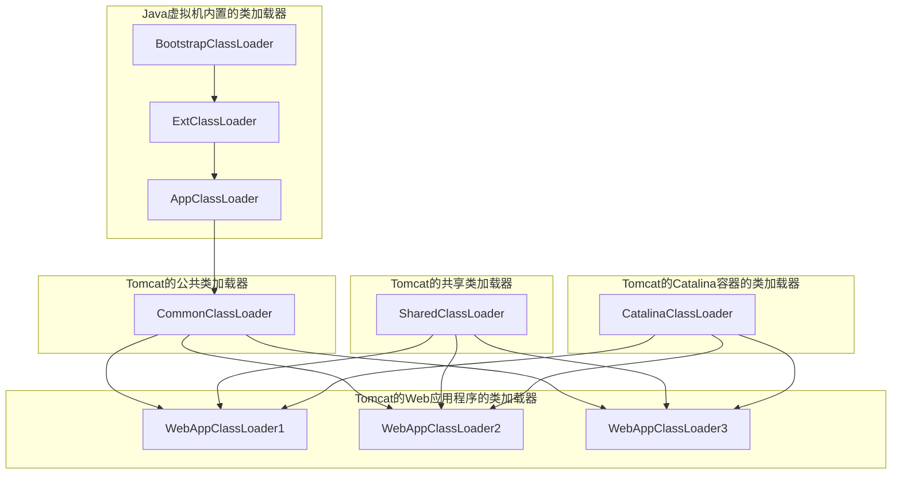

## 能说一下类的生命周期吗？  

是的，一个类在Java虚拟机（JVM）中从加载到卸载整个生命周期包括以下七个阶段：加载（Loading）、验证（Verification）、准备（Preparation）、解析（Resolution）、初始化（Initialization）、使用（Using）和卸载（Unloading）。其中，验证、准备和解析三个阶段合称为连接（Linking）。以下是对每个阶段的详细解释：

### 1. 加载（Loading）
- **描述**：将类的字节码文件加载到内存中，并创建一个代表该类的`Class`对象。
- **细节**：JVM通过类加载器（ClassLoader）读取字节码文件（.class文件），将其转换为内存中的数据结构，并生成一个`Class`对象来表示该类。

### 2. 验证（Verification）
- **描述**：验证阶段主要是对字节码文件进行验证，确保其符合Java虚拟机规范。
- **细节**：这一阶段检查字节码的正确性，确保不会破坏Java语言的安全性和类型系统。例如，检查类的结构、操作码是否合法、访问控制是否正确等。

### 3. 准备（Preparation）
- **描述**：准备阶段为类的静态变量分配内存空间，并设置默认初始值。
- **细节**：在这一阶段，JVM为类变量分配内存，并初始化为默认值。例如，数值类型的变量初始化为0，引用类型初始化为null。这个阶段不会执行任何初始化代码。

### 4. 解析（Resolution）
- **描述**：解析阶段主要是将符号引用转换为直接引用。
- **细节**：符号引用是指在字节码中使用符号（如类名、方法名）来引用类、字段或方法。在解析阶段，JVM将这些符号引用转换为内存地址等直接引用。

### 5. 初始化（Initialization）
- **描述**：初始化阶段是类的主动使用阶段，会执行类构造器`<clinit>()`方法的过程。
- **细节**：`<clinit>()`方法是由编译器自动生成的类构造器，用于初始化静态变量和执行静态代码块。这个阶段是类加载的最后一步，确保类在使用前完成所有初始化工作。

### 6. 使用（Using）
- **描述**：在类被加载和初始化之后，就可以使用该类创建对象，调用类的方法等。
- **细节**：这一阶段类已经完全准备好，可以进行实例化、方法调用、字段访问等操作。这是应用程序的主要操作阶段。

### 7. 卸载（Unloading）
- **描述**：当一个类不再被引用，且没有任何活动的实例时，Java虚拟机会卸载该类。
- **细节**：JVM会在合适的时机通过垃圾回收机制回收不再使用的类的`Class`对象和相关资源。这个过程是自动管理的，程序员无法直接控制。

示例

```java
public class MyClass {
    static {
        System.out.println("静态代码块执行");
    }

    static int staticVar = initializeStaticVar();

    static int initializeStaticVar() {
        System.out.println("静态变量初始化");
        return 1;
    }

    public static void main(String[] args) {
        System.out.println("main方法执行");
        MyClass obj = new MyClass();
    }
}
```

输出可能是：
```
静态代码块执行
静态变量初始化
main方法执行
```

通过了解类的生命周期，我们可以更好地理解类的加载、初始化及其在内存中的管理，从而优化程序性能和内存使用。

## 类加载的过程知道吗？

类加载的过程是Java虚拟机（JVM）将类的字节码文件（.class文件）加载到内存中的起点。这一过程包括以下三个主要步骤：

### 1. 获取二进制字节流
通过类的全限定名（如`com.example.MyClass`）来获取定义此类的二进制字节流。这一步可以通过各种方式实现，如从文件系统、网络、数据库等来源获取字节流。

### 2. 转换为方法区的运行时数据结构
将获取到的字节流所代表的静态存储结构（即.class文件内容）转换为方法区中的运行时数据结构。方法区是JVM中用于存储类结构信息的内存区域，包括常量池、字段和方法数据、方法代码等。

### 3. 创建Class对象
在内存中生成一个代表这个类的`java.lang.Class`对象。这个`Class`对象将作为方法区中该类数据的访问入口，允许程序通过`Class`对象访问类的元数据和结构信息。

### 详细描述

- **获取二进制字节流**：
  JVM通过类加载器（ClassLoader）根据类的全限定名查找和读取相应的字节码文件。不同的类加载器可以通过不同的方式获取字节流，例如，`Bootstrap ClassLoader`从JRE的lib目录加载类，`Application ClassLoader`从应用的classpath加载类。

- **转换为方法区的运行时数据结构**：
  JVM将字节流解析成方法区的运行时数据结构。这些数据结构包括类的元数据（如类名、父类名、接口列表）、字段信息、方法信息、常量池等。《Java虚拟机规范》没有规定方法区的数据存储格式，这允许不同的JVM实现有自己的优化和设计。

- **创建Class对象**：
  JVM在堆内存中实例化一个`java.lang.Class`对象，用于表示和访问方法区中的类信息。每个加载的类在堆中都有一个对应的`Class`对象，这个对象提供了访问类元数据的接口，如通过反射机制获取类的方法和字段信息。

### 加载阶段结束后
在加载阶段结束后，Java虚拟机外部的二进制字节流就按照虚拟机设定的格式存储在方法区中。方法区中的数据存储格式完全由虚拟机实现自行定义，《Java虚拟机规范》未规定此区域的具体数据结构。类型数据妥善安置在方法区之后，会在Java堆内存中实例化一个`java.lang.Class`类的对象，这个对象将作为程序访问方法区中的类型数据的外部接口。

### 小结
加载阶段是JVM类加载机制的起点，它的主要任务是通过全限定名获取类的字节码文件，将字节码文件转换为方法区的运行时数据结构，并在堆内存中创建一个`Class`对象来表示该类。这个过程确保类的元数据和结构信息可以被程序访问和使用。

## 类加载器有哪些？  

Java中的类加载器（ClassLoader）负责将类文件加载到Java虚拟机中。主要的类加载器有以下几种：

### 1. 启动类加载器（Bootstrap ClassLoader）
- **描述**：负责加载核心Java类库，如`java.lang.*`、`java.util.*`等。这些类库通常位于`<JAVA_HOME>/lib`目录下。
- **特点**：
  - 是最顶层的类加载器，由C++语言实现，嵌入在JVM内部。
  - 不属于`java.lang.ClassLoader`的子类。

### 2. 扩展类加载器（Extension ClassLoader）
- **描述**：负责加载扩展库中的类，这些类通常位于`<JAVA_HOME>/lib/ext`目录或者由系统变量`java.ext.dirs`指定的目录中。
- **特点**：
  - 是`java.lang.ClassLoader`的子类，由Java实现。
  - 其父加载器是启动类加载器。

### 3. 应用程序类加载器（Application ClassLoader）
- **描述**：负责加载应用程序类路径（classpath）上的类。这些类通常是应用程序自定义的类。
- **特点**：
  - 是`java.lang.ClassLoader`的子类，由Java实现。
  - 其父加载器是扩展类加载器。
  - 是默认的类加载器，当你调用`ClassLoader.getSystemClassLoader()`时，通常返回这个类加载器。

### 4. 自定义类加载器（Custom ClassLoader）
- **描述**：由开发者根据需要自定义的类加载器，用于加载特定来源或特定方式的类。
- **特点**：
  - 需要继承`java.lang.ClassLoader`类并重写`findClass`方法。
  - 可以实现自己的类加载逻辑，比如从网络、数据库、加密文件等加载类。

### 类加载器的层次结构
类加载器之间存在父子关系，形成树形层次结构。通常情况下，类加载器按照双亲委派模型（Parent Delegation Model）工作，即一个类加载请求会先委派给父类加载器处理，如果父类加载器无法加载该类，子加载器才会尝试加载。这一机制的好处是确保了核心Java类库的安全性和一致性。

### 示例代码
下面是一个简单的自定义类加载器示例：

```java
import java.io.*;

public class MyClassLoader extends ClassLoader {
    private String classPath;

    public MyClassLoader(String classPath) {
        this.classPath = classPath;
    }

    @Override
    protected Class<?> findClass(String name) throws ClassNotFoundException {
        byte[] classData = loadClassData(name);
        if (classData == null) {
            throw new ClassNotFoundException();
        }
        return defineClass(name, classData, 0, classData.length);
    }

    private byte[] loadClassData(String className) {
        String fileName = classPath + className.replace('.', '/') + ".class";
        try (InputStream inputStream = new FileInputStream(fileName);
             ByteArrayOutputStream byteStream = new ByteArrayOutputStream()) {
            int nextValue = 0;
            while ((nextValue = inputStream.read()) != -1) {
                byteStream.write(nextValue);
            }
            return byteStream.toByteArray();
        } catch (IOException e) {
            e.printStackTrace();
            return null;
        }
    }

    public static void main(String[] args) throws Exception {
        MyClassLoader classLoader = new MyClassLoader("/path/to/classes/");
        Class<?> clazz = classLoader.loadClass("com.example.MyClass");
        Object obj = clazz.newInstance();
        System.out.println(obj.getClass().getName());
    }
}
```

在这个示例中，`MyClassLoader`是一个自定义类加载器，通过覆盖`findClass`方法实现从指定路径加载类文件。在使用时，创建`MyClassLoader`对象并指定类文件路径，然后通过`loadClass`方法加载类。

通过理解和使用不同的类加载器，开发者可以控制类的加载行为，满足特定需求，如动态加载、热部署等。

## 什么是双亲委派机制？  

双亲委派机制（Parent Delegation Model）是Java类加载器的一种工作模式，它规定了类加载器在加载类时的顺序和方式。具体来说，类加载器在尝试加载一个类时，会先将请求委派给父类加载器，如果父类加载器无法加载该类，才会由自身进行加载。这一机制保证了Java核心类库的安全性和稳定性，避免了重复加载和冲突。下面是对双亲委派机制的详细解释：

### 工作原理
当一个类加载器收到类加载请求时，按照以下步骤处理：

1. **检查是否已加载**：检查当前类加载器是否已经加载过该类。如果已经加载，直接返回加载的类。
2. **委派给父加载器**：如果当前类加载器尚未加载该类，将请求委派给父类加载器。
3. **父加载器处理**：父类加载器接到请求后，重复步骤1和步骤2，逐级向上委派，直到引导类加载器（Bootstrap ClassLoader）。
4. **引导类加载器尝试加载**：引导类加载器尝试加载核心Java类库（如`java.lang.*`、`java.util.*`）。
5. **无法加载，逐级返回**：如果引导类加载器无法加载该类，返回给子加载器，由子加载器继续尝试加载。
6. **子加载器加载**：如果父类加载器均无法加载该类，当前类加载器尝试自己加载该类。
7. **加载失败抛异常**：如果当前类加载器仍无法加载该类，抛出`ClassNotFoundException`。

### 双亲委派机制的优点
1. **安全性**：防止核心类库（如`java.lang.Object`）被自定义类加载器重复加载或篡改，确保JVM运行环境的安全和稳定。
2. **避免重复加载**：通过委派机制，保证某个类只会被加载一次，从而避免了重复加载和内存浪费。
3. **确保一致性**：在整个JVM中，某个类由同一个类加载器加载，保证了类的类型一致性。

示例说明

以下是一个示例，展示了双亲委派机制的工作流程：

```java
public class ParentDelegationExample {
    public static void main(String[] args) throws ClassNotFoundException {
        ClassLoader classLoader = ParentDelegationExample.class.getClassLoader();
        System.out.println("Parent ClassLoader: " + classLoader.getParent());
        System.out.println("Grandparent ClassLoader: " + classLoader.getParent().getParent());
    }
}
```

输出

```plaintext
Parent ClassLoader: sun.misc.Launcher$AppClassLoader@18b4aac2
Grandparent ClassLoader: sun.misc.Launcher$ExtClassLoader@1b6d3586
```

在上述代码中：
- 应用程序类加载器（AppClassLoader）是`ParentDelegationExample`类的类加载器。
- AppClassLoader的父加载器是扩展类加载器（ExtClassLoader）。
- ExtClassLoader的父加载器是引导类加载器（Bootstrap ClassLoader），但由于Bootstrap ClassLoader是用本地代码实现的，所以显示为null。

总结

双亲委派机制是Java类加载器的核心机制，确保了类加载过程的安全性、一致性和高效性。通过逐级向上委派类加载请求，避免了重复加载和类冲突问题，确保了Java运行环境的稳定性。

## 为什么要用双亲委派机制？  

双亲委派机制是Java类加载机制的核心设计之一，它的出现主要有以下几个原因：

### 1. 确保类的唯一性和一致性
双亲委派机制确保了在整个Java虚拟机中，某个类只会被加载一次。通过逐级向上委派类加载请求，当一个类加载器尝试加载一个类时，它会首先委派给父类加载器，直到到达顶层的引导类加载器。这样可以避免同一个类被多个类加载器加载导致的类型冲突，保证了类的唯一性和一致性。

### 2. 避免重复加载类
双亲委派机制可以避免同一个类被多个类加载器重复加载，节省了内存空间，提高了系统性能。如果一个类已经被加载到内存中，其他类加载器再次加载同样的类时，会直接使用已加载的类，而不会重新加载。

### 3. 加载类的安全性
双亲委派机制保证了核心类库由Java虚拟机的引导类加载器加载，而不是由应用程序的类加载器加载。这样可以防止用户通过自定义类库篡改核心类库，确保了Java运行环境的安全性和稳定性。

### 4. 统一类加载规则
双亲委派机制定义了类加载器的委派规则，使得类加载过程更加统一和规范。这种统一的类加载规则使得Java平台的类加载行为更加可预测，降低了出现类加载相关问题的可能性，提高了系统的稳定性和可靠性。

### 5. 支持模块化开发和扩展性
双亲委派机制支持模块化开发，开发者可以通过自定义类加载器加载特定的类，而不会影响核心类库和其他模块的正常运行。这种灵活的扩展机制使得Java系统可以轻松地进行功能扩展和模块化开发，提高了系统的可维护性和可扩展性。

综上所述，双亲委派机制是Java类加载机制的重要设计，它通过确保类的唯一性和一致性、避免重复加载类、提高类加载安全性、统一类加载规则以及支持模块化开发和扩展性等方面，保证了Java平台的安全性、稳定性和可靠性。

## 如何破坏双亲委派机制？  

破坏双亲委派机制意味着绕过了Java类加载器的默认委派规则，直接使用自定义的类加载器加载类。这样做可能会导致类加载的混乱和冲突，降低系统的稳定性和安全性。以下是一些可能破坏双亲委派机制的方式：

### 1. 自定义类加载器
通过编写自定义的类加载器，并在其中重写loadClass 方法，实现自己的加载逻辑，可以破坏双亲委派机制。自定义类加载器可以绕过父类加载器的委派，直接加载特定的类。

以下是一个简单的代码示例，演示了如何通过自定义类加载器破坏双亲委派机制：

```java
// 自定义类加载器
public class CustomClassLoader extends ClassLoader {
    
    @Override
    public Class<?> loadClass(String name) throws ClassNotFoundException {
        // 自定义加载逻辑，绕过双亲委派机制
        if (name.startsWith("java.")) {
            // 对于Java核心类库，仍然委派给父类加载器
            return super.loadClass(name);
        }
        
        // 加载自定义类
        try {
            String fileName = name.replace(".", "/") + ".class";
            InputStream inputStream = getClass().getClassLoader().getResourceAsStream(fileName);
            if (inputStream == null) {
                // 如果资源不存在，则调用父类加载器加载
                return super.loadClass(name);
            }
            byte[] bytes = new byte[inputStream.available()];
            inputStream.read(bytes);
            return defineClass(name, bytes, 0, bytes.length);
        } catch (IOException e) {
            throw new ClassNotFoundException(name, e);
        }
    }
    
    // 测试方法
    public static void main(String[] args) throws Exception {
        // 使用自定义类加载器加载类
        ClassLoader customClassLoader = new CustomClassLoader();
        Class<?> clazz = customClassLoader.loadClass("com.example.TestClass");
        
        // 创建类的实例
        Object instance = clazz.newInstance();
        
        // 调用类的方法
        clazz.getMethod("sayHello").invoke(instance);
    }
}
```

```java
// 测试类
public class TestClass {
    public void sayHello() {
        System.out.println("Hello, I'm loaded by CustomClassLoader!");
    }
}
```

在这个示例中，我们定义了一个自定义的类加载器`CustomClassLoader`，重写了`loadClass`方法，实现了自己的加载逻辑。在加载类时，我们首先判断类名是否以"java."开头，如果是则委派给父类加载器加载，否则我们自己加载该类。这样就绕过了双亲委派机制的默认规则。

在测试方法中，我们使用自定义类加载器加载了一个`TestClass`类，并创建了它的实例，然后调用了它的`sayHello`方法。由于`TestClass`类是由自定义类加载器加载的，因此输出的信息是"Hello, I'm loaded by CustomClassLoader!"，而不是默认的委派加载器加载的信息。

### 2. 直接调用ClassLoader.loadClass方法
在Java中，ClassLoader类提供了loadClass方法用于加载类，而且loadClass方法默认是受双亲委派机制控制的。但是，如果直接调用ClassLoader.loadClass方法，而不是通过ClassLoader的子类（如URLClassLoader）加载类，就可能绕过双亲委派机制。

### 3. 修改ClassLoader类的defineClass方法
ClassLoader类的defineClass方法用于定义类并加载类的字节码。如果修改了ClassLoader类的defineClass方法，可能会绕过双亲委派机制，导致自定义的加载逻辑被执行。

### 4. OSGi等框架
一些基于Java的模块化开发框架（如OSGi）提供了自己的类加载器实现，并且允许在同一个JVM中加载多个版本的相同类。这种机制与双亲委派机制有所不同，可能会破坏双亲委派机制对类的唯一性和一致性的要求。

### 5. 应用服务器（如Tomcat）的类加载策略
一些Java应用服务器（如Tomcat）在实现中采用了自定义的类加载器策略，以支持应用程序的独立部署和隔离。这种情况下，可能会存在多个应用程序使用不同的类加载器加载相同的类，从而破坏了双亲委派机制。

虽然以上方法可以破坏双亲委派机制，但开发者应该谨慎使用，因为这可能会导致类加载的混乱和冲突，降低系统的稳定性和安全性。在合适的情况下，可以根据具体需求采取适当的措施，但务必注意潜在的风险和影响。

### 6.Thread.currentThread().setContextClassLoader

通过`Thread.currentThread().setContextClassLoader`方法可以设置当前线程的上下文类加载器，从而改变类加载的委派顺序，绕过双亲委派机制。这种方式可以在一定程度上实现自定义的类加载逻辑。

以下是一个简单的示例代码，演示了如何使用`setContextClassLoader`方法绕过双亲委派机制：

```java
public class BypassClassLoader {
    public static void main(String[] args) throws Exception {
        // 创建一个自定义的类加载器
        ClassLoader customClassLoader = new CustomClassLoader();
        
        // 创建一个线程
        Thread thread = new Thread(() -> {
            // 设置当前线程的上下文类加载器为自定义类加载器
            Thread.currentThread().setContextClassLoader(customClassLoader);
            
            // 加载并使用TestClass类
            try {
                Class<?> clazz = Thread.currentThread().getContextClassLoader().loadClass("com.example.TestClass");
                Object instance = clazz.newInstance();
                clazz.getMethod("sayHello").invoke(instance);
            } catch (ClassNotFoundException | IllegalAccessException | InstantiationException | NoSuchMethodException | InvocationTargetException e) {
                e.printStackTrace();
            }
        });
        
        // 启动线程
        thread.start();
    }
}

// 自定义类加载器
class CustomClassLoader extends ClassLoader {
    // 加载类的字节码（这里简化为返回一个固定的字节数组）
    private byte[] loadClassBytes() {
        // 这里可以根据实际需求加载类的字节码
        return new byte[]{ /* 类的字节码数据 */ };
    }
    
    @Override
    public Class<?> findClass(String name) throws ClassNotFoundException {
        if ("com.example.TestClass".equals(name)) {
            // 加载自定义类的字节码
            byte[] bytes = loadClassBytes();
            // 使用defineClass方法加载类到内存中
            return defineClass(name, bytes, 0, bytes.length);
        } else {
            // 对于其他类，委派给父类加载器加载
            return super.findClass(name);
        }
    }
}

// 测试类
class TestClass {
    public void sayHello() {
        System.out.println("Hello, I'm loaded by CustomClassLoader in a new Thread!");
    }
}
```

在这个示例中，我们创建了一个自定义的类加载器`CustomClassLoader`，然后创建了一个新的线程，并在该线程中设置了上下文类加载器为自定义类加载器。在新线程中，我们尝试加载了TestClass类，并调用了它的sayHello方法。由于设置了自定义的上下文类加载器，TestClass类会被自定义类加载器加载，而不是双亲委派机制下的默认加载流程。因此，输出的信息是"Hello, I'm loaded by CustomClassLoader in a new Thread!"。

## 历史上有哪几次双亲委派机制的破坏？

### 第一次破坏
在 Java JDK 1.2 之前，双亲委派机制还不存在。旧版本的 Java 中，类加载器的概念已经存在，但是由于技术限制，无法避免子类覆盖父类加载方法的可能性。为了向下兼容旧代码，JDK 1.2 引入了双亲委派模型，并在 `java.lang.ClassLoader` 中添加了一个新的 `protected` 方法 `findClass()`。这个方法的存在使得用户编写自己的类加载逻辑时更容易继承并重写这个方法，而不是直接重写 `loadClass()` 方法。

### 第二次破坏
在 Java 的早期版本中，JDBC 是一个典型的例子。不同厂商提供了各自的 JDBC 实现，这些实现无法放在核心包中，只能被应用类加载器加载。但是，由于启动类加载器无法加载这些实现，因此引入了线程上下文类加载器的概念。线程上下文类加载器可以在运行时动态设置，用于加载特定线程上下文中所需的类。这样就允许了父类加载器向子类加载器发出加载请求，绕过了双亲委派模型的限制。

### 第三次破坏
随着对程序动态性的追求，例如代码热替换和模块热部署，又一次破坏了双亲委派模型。OSGi 是一个典型的例子，它实现了模块化热部署，每个程序模块（称为 Bundle）都有自己的类加载器。当需要更换一个 Bundle 时，可以将 Bundle 和其对应的类加载器一起替换，从而实现了代码的热替换。在这种情况下，类加载器不再是双亲委派模型推荐的树状结构，而是更复杂的网状结构。

总的来说，这些破坏都是为了解决特定的问题或实现特定的功能，但也引入了额外的复杂性。在实际开发中，我们需要根据具体情况权衡利弊，选择合适的加载策略和模型。

## 你觉得应该怎么实现一个热部署功能？

实现热部署功能涉及到动态加载和卸载类，以及更新已加载类的实例。下面是一个简单的步骤来实现热部署功能：

### 1. 使用合适的类加载器
为了支持热部署，需要使用自定义的类加载器来加载类。这个类加载器应该具有动态加载和卸载类的能力。通常情况下，可以使用 URLClassLoader 或者自定义的类加载器来实现这个功能。

### 2. 监视类文件的变化
实现一个监视器，监视目标类文件的变化。当类文件被修改或者更新时，监视器应该能够检测到，并触发相应的热部署操作。

### 3. 动态加载新的类
当监视器检测到类文件的变化时，使用自定义的类加载器动态加载新的类。可以使用 `ClassLoader.defineClass` 方法将类的字节码加载到内存中，并使用 `Class.forName` 方法加载类。

### 4. 更新已加载类的实例
如果已经存在该类的实例，需要更新这些实例以反映新加载类的变化。这可能涉及到重新创建实例或者更新现有实例的状态。

### 5. 卸载旧的类
在加载新的类之前，可能需要卸载旧的类以释放资源并避免内存泄漏。可以通过适当的方式销毁旧类的实例，并从类加载器的缓存中卸载旧的类。

### 6. 错误处理和回滚
在实现热部署功能时，需要考虑到可能出现的错误情况，并实现相应的错误处理机制。如果出现了不可恢复的错误，可能需要回滚到之前的状态，以确保系统的稳定性和可靠性。

### 7. 测试和验证
在部署热部署功能之前，需要进行充分的测试和验证，以确保功能的正确性和稳定性。特别是在生产环境中使用热部署功能时，需要格外小心，避免可能导致系统崩溃或者数据丢失的错误。

综上所述，实现热部署功能需要考虑到多个方面，包括类加载器的选择、监视器的实现、动态加载和卸载类的操作、实例的更新、错误处理和回滚等。通过合理设计和实现，可以实现一个稳健和可靠的热部署功能，提高系统的灵活性和可维护性。

## 为什么自定义类加载器，有时是重写loadclass方法，有时是重写findClass方法，有时是重写defineClass方法？

自定义类加载器时，有时候会重写 `loadClass` 方法，有时候会重写 `findClass` 方法，有时候会重写 `defineClass` 方法，这取决于不同的加载需求和加载策略。

1. **重写 `loadClass` 方法**：
   - 当希望继承父类加载器的双亲委派行为时，通常会重写 `loadClass` 方法。在这种情况下，我们可以在 `loadClass` 方法中调用父类加载器的 `loadClass` 方法来委派加载类。这样做可以保持类加载的一致性和稳定性，符合双亲委派模型的设计原则。

2. **重写 `findClass` 方法**：
   - 当希望完全掌控类的加载过程时，通常会重写 `findClass` 方法。在这种情况下，我们需要自己实现类的查找逻辑，通常是通过读取字节码文件并调用 `defineClass` 方法来加载类。重写 `findClass` 方法可以绕过双亲委派模型，直接由自定义类加载器加载类，适用于一些特定的加载需求，例如加载动态生成的类或者非标准位置的类。

3. **重写 `defineClass` 方法**：
   - 当类的字节码已经在内存中，而不是从文件或网络中加载时，可能会直接重写 `defineClass` 方法。这种情况通常发生在自定义类加载器已经获取了类的字节码，并且希望将其加载到内存中时。重写 `defineClass` 方法可以直接加载类的字节码，而无需经过其他方法的中间过程。

综上所述，选择重写哪个方法取决于具体的加载需求和加载策略。重写 `loadClass` 方法通常用于继承父类加载器的双亲委派行为，重写 `findClass` 方法通常用于完全掌控类的加载过程，而重写 `defineClass` 方法通常用于直接加载类的字节码。

## Tomcat的类加载机制了解吗？

Java 虚拟机内置的类加载器 `BootstrapClassLoader`、`ExtClassLoader` 和 `AppClassLoader`，以及 Tomcat 中的各个类加载器之间的关系：



Tomcat采用了一种特殊的类加载器体系，以解决应用程序之间的类冲突和实现资源的共享。具体的类加载器如下：

1. **BootstrapClassLoader**：这是Java虚拟机内置的类加载器，负责加载Java的核心类库，例如`java.lang`包、`java.util`包等。

2. **CommonClassLoader**：Tomcat的公共类加载器，用于加载Tomcat本身的类库，比如`serlvet-api.jar`等。

3. **CatalinaClassLoader**：作为Tomcat的Catalina容器的类加载器，主要负责加载Catalina容器相关的类库，例如`Catalina.jar`等。

4. **SharedClassLoader**：这是Tomcat的共享类加载器，专门用于加载Tomcat的共享类库，例如Tomcat的JDBC驱动等。

5. **WebAppClassLoader**：每个Web应用程序都有自己的独立的WebAppClassLoader，负责加载Web应用程序目录下的class文件。当WebAppClassLoader无法加载类时，它会将加载任务交给共享的CommonClassLoader。

Tomcat在类加载机制上破坏了传统的双亲委派模型，以实现类的隔离和资源的共享。在默认的双亲委派模型下，如果多个应用程序共享同一个类加载器，那么只能加载其中一个版本的类库，而无法加载多个相同类名的不同版本，这可能导致应用程序之间的类冲突。为了解决这个问题，Tomcat提供了隔离的机制，为每个Web容器单独提供一个WebAppClassLoader类加载器。这样，每个Web应用程序都有独立的类加载器，可以加载自己的类和库，而不会与其他应用程序产生冲突。这种机制允许不同应用程序使用相同类名的不同版本，实现了类的隔离和资源的共享。
