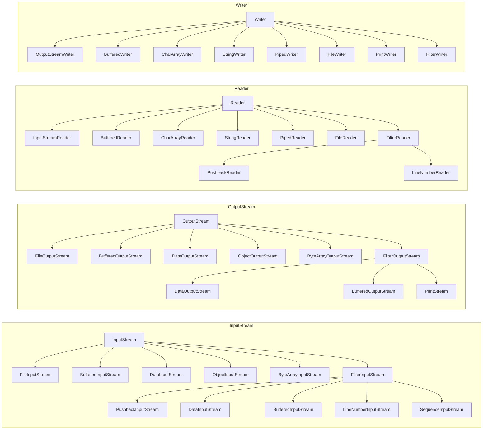
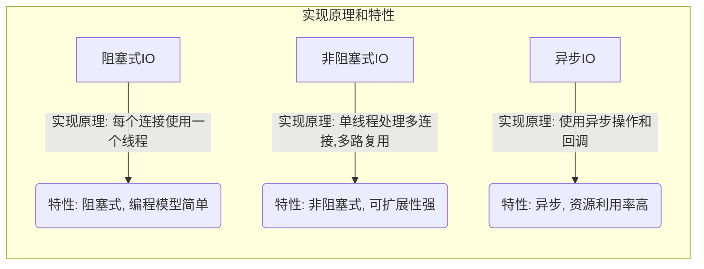

## Java 中 IO 流分为几种?  

- 按照流的流向分，可以分为 输入流 和 输出流
  - InputStream / Reader : 所有的输入流的基类，前者是字节输入流，后者是字符输入流
  - OutputStream / Writer : 所有输出流的基类，前者是字节输出流，后者是字符输出流
- 按照操作单元划分，可以划分为 字节流 和 字符流
- 按照流的角色划分为 节点流 和 处理流



## 既然有了字节流,为什么还要有字符流？

- **字节流**
  - 字节流则更适合处理二进制数据
  - 字节流以字节为单位进行输入输出，适用于处理二进制数据（例如图像、音频、视频等）或与底层设备进行通信时。字节流通常用于处理文件和网络连接中的数据传输。它们是处理数据的底层工具，提供了最基本的输入输出操作。
- **字符流**
  - 字符流更适合读取和写入文本文件
  - 字符流以字符为单位进行输入输出，适用于处理文本数据。字符流会自动处理字符编码和解码，而字节流则需要手动处理。这使得字符流在处理文本数据时更方便和高效，尤其是当涉及到国际化和本地化时、
- 尽管字节流可以处理所有类型的数据，但为了更方便地处理文本数据，Java提供了字符流

## BIO、NIO、AIO？



- BIO
  
  - 同步阻塞IO
  - 客户端有连接请求时服务器端就需要启动一个线程进行处理（可以使用连接池优化）
  - JDK1.4之前的选择
- NIO
  - 同步非阻塞IO

  - 服务器端用一个线程处理多个连接，客户端发送的连接请求会注册到多路复用器上，多路复用器轮询到连接有IO请求就进行处理

    - NIO工作原理

      ```mermaid
      graph TD;
          A[应用程序] -->|发起连接请求| B((Selector));
          B -->|Register| C[Channel];
          C -->|Accept Connection| B;
          B -->|Listen for Read/Write Events| D[Channel List];
          D -->|Read/Write Event Occurs| E[Ready Channels];
          E -->|Read Data| F[Buffer];
          E -->|Write Data| F;
          F -->|Process Data| E;
      
      ```

      

      1. 应用程序（A）通过选择器（B）发起连接请求
      2. 选择器（B）将通道（channel代表了服务端与客户端的连接）注册，使其成为监视对象，以便选择器可以监听多个通道的事件。
      3. 当有新的连接请求到达时，选择器（B）会处理这个事件，并将新的通道（C）加入到已注册的通道列表（D）中，以备后续操作。
      4. 选择器（B）不断监听通道列表（D）中通道的读写事件。
      5. 当某个通道（E）有读或写事件时，选择器（B）会将该通道标记为就绪状态，并执行相应的读取或写入操作。
      6. 读取或写入操作使用缓冲区（F）来处理数据，应用程序可以在缓冲区中读取或写入数据。
- AIO

  - 异步非阻塞IO
  - Java 的 NIO 就是 Reactor
  - 当有事件触发时，服务器端得到通知，进行相应的处理，完成后才通知(回调)服务端程序启动线程去处理
  - 一般适用于连接数较多且连接时间较长的应用
