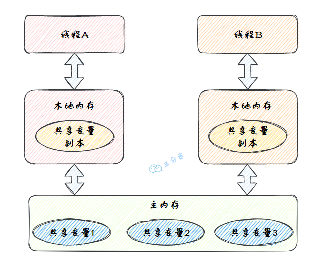
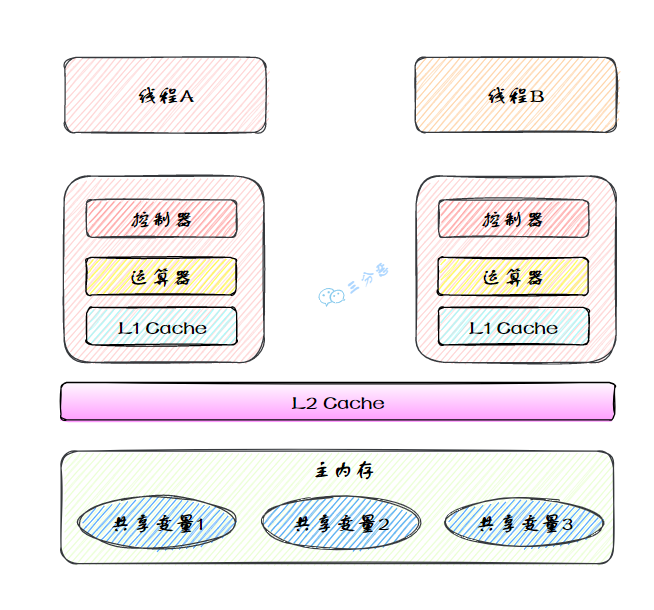
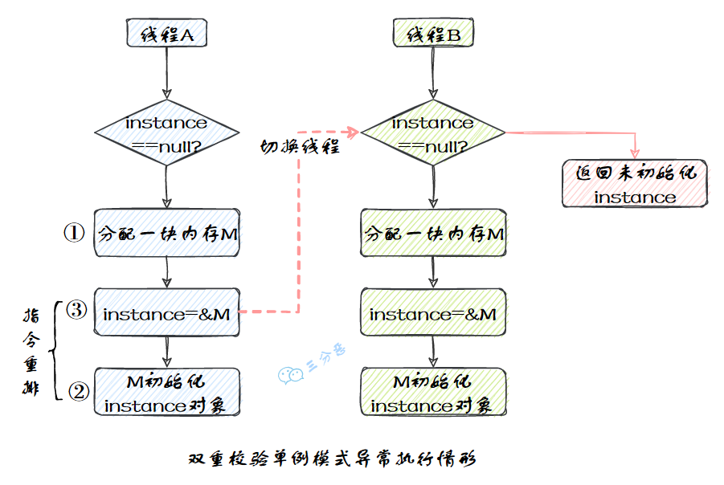

## 说一下你对Java内存模型（JMM）的理解 ？

- Java内存模型（Java Memory Model，JMM），是一种抽象的模型，被定义出来屏蔽各种硬件和操作系统的内存访问差异  

- JMM定义了线程和主内存之间的抽象关系  

    - 线程之间的共享变量存储在 主内存（Main Memory）中，每个线程都有一个私有的 本地内存 （Local Memory），本地内存中存储了该线程以读/写共享变量的副本  
      - Java内存模型的抽象图  

    
    
    
    - 本地内存是JMM的 一个抽象概念，并不真实存在，实际的线程工作模型如下图所示，其中每个线程都有自己的控制器和运算器，以及一级缓存。有些架构还有一个共享的二级缓存。这些硬件组件对应着JMM中的工作内存  
    
       
    - Java内存模型通过定义内存间的交互操作规则，例如读取、写入和同步操作，来确保多线程程序的可见性、有序性和原子性。
## 说说你对原子性、可见性、有序性的理解？

- 原子性、有序性、可见性是并发编程中非常重要的基础概念，用于描述多线程环境下的内存访问行为，JMM的很多技术都是围绕着这三大特性展开  
- 原子性（Atomicity）  
  - 原子性是指一个操作是不可分割的，要么完全执行，要么不执行。
  - 在多线程环境下，原子性保证了对共享变量的操作是原子的，不会被其他线程中断  
- 可见性（Visibility）  
  - 可见性是指当一个线程对共享变量进行修改后，其他线程能够立即看到这个修改  
  - 在多线程环境下，由于每个线程都有自己的本地内存，线程之间对共享变量的修改不一定能够及时同步到主内存和其他线程的本地内存中  
  - 可见性保证了共享变量的修改对其他线程是可见的，即能够正确读取到最新的值  
- 有序性（Ordering）  
  - 是指程序执行的顺序与代码的顺序一致  
  - 在多线程环境下，由于指令重排序和编译器优化的存在，代码的执行顺序可能与代码的编写顺序不一致  
  - 序性保证了程序的执行顺序与代码的顺序一致，即保证了代码的串行语义  
- 为了保证原子性、可见性和有序性，我们可以使用同步机制（如锁、volatile关键字、synchronized关键字等）来控制线程的访问和操作  

### 分析下面几行代码的原子性？  

```java
int i = 2;
int j = i;
i++;
i = i + 1;
```

- 第1句是基本类型赋值，是原子性操作  
- 第2句先读i的值，再赋值到j，两步操作，不能保证原子性  
- 第3和第4句其实是等效的，先读取i的值，再+1，最后赋值到i，三步操作了，不能保证原子性  

### 原子性、可见性、有序性都应该怎么保证呢？  

- 原子性  
  - 使用同步机制，如synchronized关键字、Lock接口、Atomic类等，来控制对共享变量的访问和操作，确保操作是不可分割的  
- 可见性  
  - 使用volatile关键字或者同步机制，如synchronized关键字、Lock接口等，来保证对共享变量的修改对其他线程是可见的  
- 有序性  
  - 使用volatile关键字或者同步机制，如synchronized关键字、Lock接口等，来保证程序执行的顺序与代码的顺序一致  

## 那说说什么是指令重排？  

- 在执行程序时，为了提高性能，编译器和处理器常常会对指令做重排序  
- 重排序分3种类型  
  - 编译器优化的重排序  
    - 编译器在不改变单线程程序语义的前提下，可以重新安排语句的执行顺序  
  - 指令级并行的重排序  
    - 现代处理器采用了指令级并行技术（Instruction-Level Parallelism，ILP）来将多条指令重叠执行。如果不存在数据依赖性，处理器可以改变语句对应 机器指令的执行顺序  
  - 内存系统的重排序  
    - 由于处理器使用缓存和读/写缓冲区，这使得加载和存储操作看上去可能是在乱序执行  
- 双重校验单例模式就是一个经典的指令重排的例子：Singleton instance=new Singleton()  
  - 对应的JVM指令分为三步：分配内存空间-->初始化对象--->对象指向分配的内存空间  
  - 经过了编译器的指令重排序，第二步和第三步就可能会重排序 
    
    
- JMM属于语言级的内存模型，它确保在不同的编译器和不同的处理器平台之上，通过禁止特定类型的编译器重排序和处理器重排序，为程序员提供一致的内存可见性保证
## 指令重排有限制吗？happens-before了解吗？  

- 指令重排也是有一些限制的，有两个规则 happens-before 和 as-if-serial 来约束  
- happens-before的定义  
  - 如果一个操作happens-before另一个操作，那么第一个操作的执行结果将对第二个操作可见，而且第一个操作的执行顺序排在第二个操作之前  
  - 两个操作之间存在happens-before关系，并不意味着Java平台的具体实现必须要按照 happens-before关系指定的顺序来执行。如果重排序之后的执行结果，与按happens-before关系来执行的结果一致，那么这种重排序并不非法  
- happens-before和我们息息相关的有六大规则  
  - 程序顺序规则  
    - 一个线程中的每个操作，happens-before于该线程中的任意后续操作  
  - 监视器锁规则  
    - 对一个锁的解锁，happens-before于随后对这个锁的加锁  
  - volatile变量规则   
    - 对一个volatile域的写，happens-before于任意后续对这个volatile域的读  
  - 传递性  
    - 如果A happens-before B，且B happens-before C，那么A happens-beforeC  
  - start()规则  
    - 如果线程A执行操作ThreadB.start()（启动线程B），那么A线程的ThreadB.start()操作happens-before于线程B中的任意操作  
  - join()规则  
    - 如果线程A执行操作ThreadB.join()并成功返回，那么线程B中的任意操作 happens-before于线程A从ThreadB.join()操作成功返回  

## as-if-serial又是什么？单线程的程序一定是顺序的吗？  

- as-if-serial语义的意思是：不管怎么重排序（编译器和处理器为了提高并行度），单线程程序的执行结果不能被改变  
- 编译器、runtime和处理器都必须遵守as-if-serial语义  
- 为了遵守as-if-serial语义，编译器和处理器不会对存在数据依赖关系的操作做重排序，因为这种重排序会改变执行结果  
- 如果操作之间不存在数据依赖关系，这些操作就可能被编译器和处理器重排序  

## volatile实现原理了解吗？  

- volatile有两个作用，保证可见性和有序性  

### volatile怎么保证可见性的呢？  

- 相比synchronized的加锁方式来解决共享变量的内存可见性问题，volatile就是更轻量的选择，它没有上下文切换的额外开销成本  
- volatile可以确保对某个变量的更新对其他线程马上可见
  - 一个变量被声明为volatile时，线程在写入变量时不会把值缓存在寄存器或者其他地方，而是会把值刷新回主内存 
  - 当其它线程读取该共享变量 ，会从主内存重新获取最新值，而不是使用当前线程的本地内存中的值  

### volatile怎么保证有序性的呢？  

- 重排序可以分为编译器重排序和处理器重排序，valatile保证有序性，就是通过分别限制这两种类型的重排序
- 为了实现volatile的内存语义，编译器在生成字节码时，会在指令序列中插入内存屏障来禁止特定类型的处理器重排序  
  1. 在每个volatile写操作的前面插入一个 StoreStore 屏障
     1. 功能：确保在屏障前的所有写操作（存储操作）都在屏障后的写操作之前被刷新到主内存中。即确保第一个存储操作的结果对后续的存储操作可见。
  2. 在每个volatile写操作的后面插入一个 StoreLoad 屏障
     1. 确保在屏障前的所有写操作在屏障后的所有读操作（加载操作）之前被刷新到主内存中。即防止写操作重排序到读操作之后
  3. 在每个volatile读操作的后面插入一个 LoadLoad 屏障
     1. 功能：确保在屏障前的所有读操作都完成之后，再进行屏障后的读操作。即确保第一个加载操作的结果对后续的加载操作可见。
  4. 在每个volatile读操作的后面插入一个 LoadStore 屏障  
     1. 功能：确保在屏障前的所有读操作都完成之后，再进行屏障后的写操作。即防止读操作重排序到写操作之后

​	

