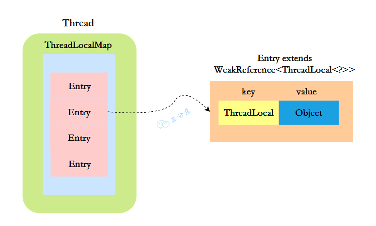
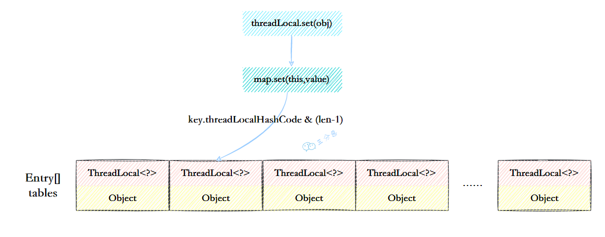

## ThreadLocal是什么？  

- ThreadLocal，也就是线程本地变量  

  - 创建了一个ThreadLocal变量，那么访问这个变量的每个线程都会有这个变量的一个本地拷贝  
  - 多个线程操作这个变量的时候，实际是操作自己本地内存里面的变量，从而起到线程隔离的作用，避免了线程
    安全问题  

- 创建

  - 创建了一个ThreadLoca变量localVariable，任何一个线程都能并发访问localVariable。  

    ```java
    //创建一个ThreadLocal变量
    public static ThreadLocal<String> localVariable = new ThreadLocal<>();
    ```

- 写入

  - 线程可以在任何地方使用localVariable，写入变量

    ```java
    localVariable.set("鄙人张三”);
    ```

- 读取

  - 线程在任何地方读取的都是它写入的变量。

    ```java
     localVariable.get();
    ```

## 你在工作中用到过ThreadLocal吗？  

- 用来做用户信息上下文的存储  
  - 存放token  

## ThreadLocal怎么实现的呢？  



- Thread类有一个类型为ThreadLocal.ThreadLocalMap的实例变量threadLocals，每个线程都有一个属于自己的ThreadLocalMap  
- ThreadLocalMap内部维护着Entry数组，每个Entry代表一个完整的对象，key是ThreadLocal的弱引用，value是ThreadLocal的泛型值  
- 每个线程在往ThreadLocal里设置值的时候，都是往自己的ThreadLocalMap里存，读也是以某个ThreadLocal作为引用，在自己的map里找对应的key，从而实现了线程隔离  
- ThreadLocal本身不存储值，它只是作为一个key来让线程往ThreadLocalMap里存取值  

## ThreadLocal 内存泄露是怎么回事？  

- ThreadLocalMap中使用的 key 为 ThreadLocal 的弱引用
  - 弱引用：只要垃圾回收机制一运行，不管JVM的内存空间是否充足，都会回收该对象占用的内存。  
- 弱引用很容易被回收，如果ThreadLocal（ThreadLocalMap的Key）被垃圾回收器回收了，但是ThreadLocalMap生命周期和Thread是一样的，它这时候如果不被回收，就会出现这种情况：ThreadLocalMap的key没了，value还在，这
  就会造成了内存泄漏问题  

### 那怎么解决内存泄漏问题呢？  

- 使用完ThreadLocal后，及时调用remove()方法释放内存空间 

### 为什么key还要设计成弱引用？  

- key设计成弱引用同样是为了防止内存泄漏问题  
  - 在ThreadLocal中，每个ThreadLocal实例都对应着一个ThreadLocalMap对象，而ThreadLocalMap使用ThreadLocal实例作为键，用于存储线程局部变量的值。
  - 如果将ThreadLocal实例作为强引用存储在ThreadLocalMap中，那么即使线程不再使用某个ThreadLocal实例，该实例也无法被垃圾回收，从而可能导致内存泄漏  

## ThreadLocalMap的结构了解吗？  


- 元素数组

  - 一个table数组，存储Entry类型的元素，Entry是ThreaLocal弱引用作为key，Object作为value的结构

    ```java
    private Entry[] table
    ```

- 散列方法

  - 散列方法就是怎么把对应的key映射到table数组的相应下标，ThreadLocalMap用的是哈希取余法，取出key的threadLocalHashCode，然后和table数组长度减一&运算（相当于取余）  

    ```java
    int i = key.threadLocalHashCode & (table.length - 1);
    ```

  - 这里的threadLocalHashCode计算有点东西，每创建一个ThreadLocal对象，它就会新增 0x61c88647   

  - 这个值很特殊，它是斐波那契数 也叫 黄金分割数  

  - hash 增量为 这个数字，带来的好处就是 hash 分布非常均匀  

    ```java
    private static final int HASH_INCREMENT = 0x61c88647;
    private static int nextHashCode() {
    	return nextHashCode.getAndAdd(HASH_INCREMENT);
    }
    ```
## ThreadLocalMap怎么解决Hash冲突的？  

- 开放定址法  

  

  - 简单来说，就是这个坑被人占了，那就接着去找空着的坑，往后找一圈没找到就会从头开始找
  
  - 如上图所示，如果我们插入一个value=27的数据，通过 hash计算后应该落入第 4 个槽位中，而槽位 4 已经有了 Entry数据，而且Entry数据的key和当前不相等。此时就会线性向后查找，一直找到 Entry为 null的槽位才会停止查找，把元素放到空的槽中
  - 在get的时候，也会根据ThreadLocal对象的hash值，定位到table中的位置，然后判断该槽位Entry对象中的key是否和get的key一致，如果不一致，就判断下一个位置  
## ThreadLocalMap扩容机制了解吗？  

-  rehash()时机

  - 在ThreadLocalMap.set()方法的最后，如果执行完启发式清理工作后，未清理到任何数据，且当前散列数组中 Entry 的数量已经达到了列表的扩容阈值 (len*2/3) ，就开始执行 rehash() 逻辑 

    ```java
    if (!cleanSomeSlots(i, sz) && sz >= threshold)
    	rehash();
    ```

- rehash

  - 会先去清理过期的Entry  

  - 然后还要根据条件判断size >= threshold - threshold / 4 也就是 size >= threshold* 3/4 来决定是否需要扩容  

    ```java
    private void rehash() {
        //清理过期Entry
        expungeStaleEntries();
    
        // Use lower threshold for doubling to avoid hysteresis
        if (size >= threshold - threshold / 4)
            resize();
    }
    ```

  - resize

    - 扩容后的 newTab 的大小为老数组的两倍  
    - 然后遍历老的table数组，散列方法重新计算位置  
    - 开放地址解决冲突，然后放到新的newTab ，遍历完成之后， oldTab 中所有的 entry 数据都已经放入到 newTab 中了，然后table引用指向 newTab  

    ```java
            private void resize() {
                Entry[] oldTab = table;
                int oldLen = oldTab.length;
                int newLen = oldLen * 2;
                Entry[] newTab = new Entry[newLen];
                int count = 0;
    
                for (Entry e : oldTab) {
                    if (e != null) {
                        ThreadLocal<?> k = e.get();
                        if (k == null) {
                            e.value = null; // Help the GC
                        } else {
                            int h = k.threadLocalHashCode & (newLen - 1);
                            while (newTab[h] != null)
                                h = nextIndex(h, newLen);
                            newTab[h] = e;
                            count++;
                        }
                    }
                }
    
                setThreshold(newLen);
                size = count;
                table = newTab;
            }
    ```

    

## 父子线程怎么共享数据？  

- InheritableThreadLocal

  - 在主线程的InheritableThreadLocal实例设置值，在子线程中就可以拿到了  

    ```java
    public class InheritableThreadLocalTest {
        public static void main(String[] args) {
            final ThreadLocal threadLocal = new InheritableThreadLocal();
            // 主线程
            threadLocal.set("不擅技术");
            //子线程
            Thread t = new Thread() {
                @Override
                public void run() {
                    super.run();
                    System.out.println("鄙人三某 ，" + threadLocal.get());
                }
            };
            t.start();
        }
    }
    ```

### InheritableThreadLocal原理是什么呢？  

- 原理很简单，在Thread类里还有另外一个变量  

  ```java
  ThreadLocal.ThreadLocalMap inheritableThreadLocals = null;
  ```

- 在Thread的构造函数中，如果父线程的 inheritableThreadLocals 不为空，就把它赋给当前线程（子线程）的 inheritableThreadLocals  

  ```java
          // thread locals
          if (!attached) {
              if ((characteristics & NO_INHERIT_THREAD_LOCALS) == 0) {
                  ThreadLocal.ThreadLocalMap parentMap = parent.inheritableThreadLocals;
                  if (parentMap != null && parentMap.size() > 0) {
                      //从父线程中取出inheritableThreadLocals
                      this.inheritableThreadLocals = ThreadLocal.createInheritedMap(parentMap);
                  }
                  if (VM.isBooted()) {
                      this.contextClassLoader = contextClassLoader(parent);
                  }
              } else if (VM.isBooted()) {
                  // default CCL to the system class loader when not inheriting
                  this.contextClassLoader = ClassLoader.getSystemClassLoader();
              }
          }
  ```

### 还有什么其它办法？TTL？  

- TransmittableThreadLocal（TTL） 
  - 是阿里巴巴开源的基于 InheritableThreadLocal 的增强版
  - 解决了线程池等场景下InheritableThreadLocal 的值传递问题
  - TTL通过重写 ThreadLocal 的方法和使用特定的数据结构，确保子线程能够正确获取父线程最新的值
  - 它还提供了自定义初始化方法和支持传递不可序列化对象的功能  