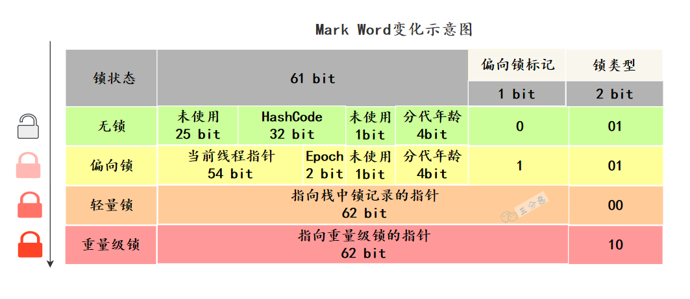
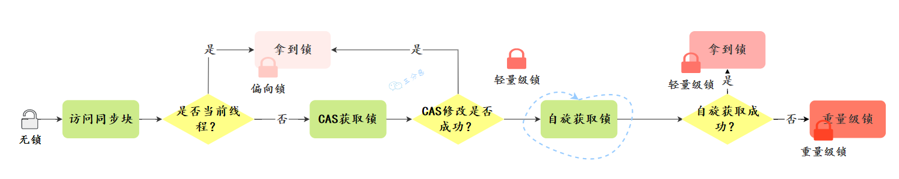
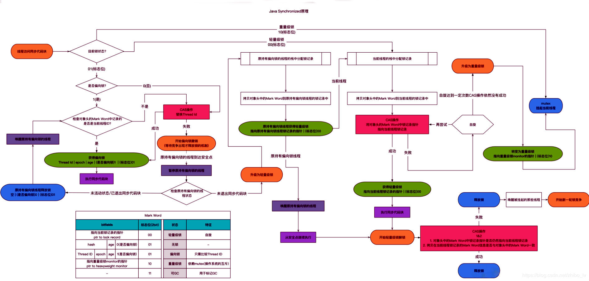
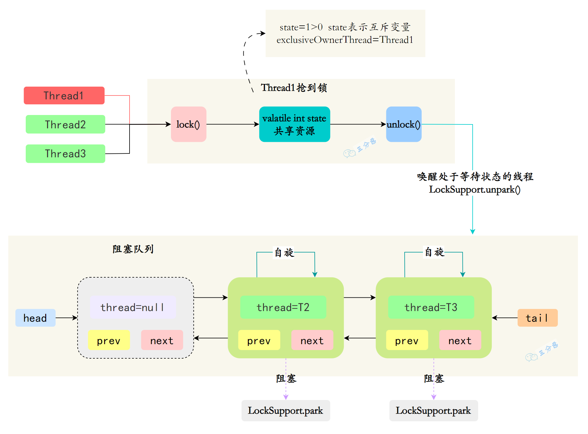
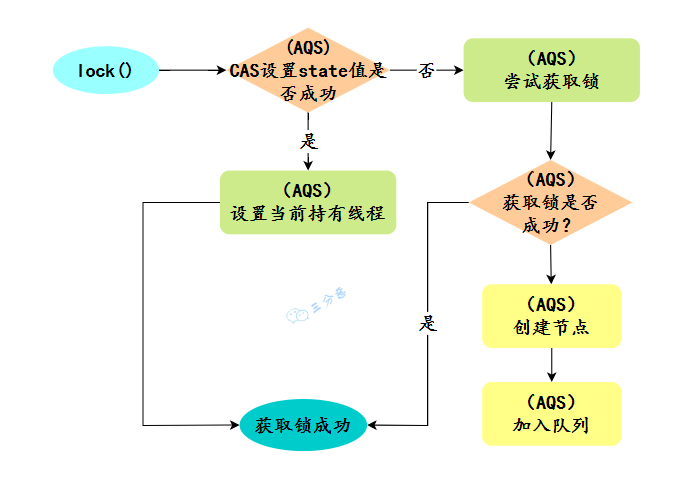

## synchronized用过吗？怎么使用？  

- 修饰实例方法  

  - 作用于当前对象实例加锁，进入同步代码前要获得 当前对象实例的锁  

    ```java
    synchronized void method() {
    	//业务代码
    }
    ```

- 修饰静态方法  

  - 也就是给当前类加锁，会作⽤于类的所有对象实例 ，进⼊同步代码前要获得当前 class 的锁  

  - 因为静态成员不属于任何⼀个实例对象，是类成员（ static 表明这是该类的⼀个静态资源，不管 new 了多少个对象，只有⼀份）  

    ```java
    synchronized void staic method() {
    //业务代码
    }
    ```

- 修饰代码块  

  - 指定加锁对象，对给定对象/类加锁。

  - synchronized(this|object) 表示进⼊同步代码库前要获得给定对象的锁。 

  - synchronized(类.class) 表示进⼊同步代码前要获得 当前 class 的锁  

    ```java
    synchronized(this) {
      //业务代码
    }
    ```

## synchronized的实现原理？  

### synchronized是怎么加锁的呢？

- synchronized修饰代码块时
  - JVM采用 monitorenter 、 monitorexit 两个指令来实现同步
  - monitorenter 指令指向同步代码块的开始位置
  - monitorexit 指令则指向同步代码块的结束位置  
- ynchronized修饰同步方法时  
  - JVM采用 ACC_SYNCHRONIZED 标记符来实现同步，这个标识指明了该方法是一个同步方法  

### synchronized锁住的是什么呢？

- monitorenter、monitorexit或者ACC_SYNCHRONIZED，其实都是基于对象的内置锁（Intrinsic Lock）或称为监视器锁（Monitor Lock）  

  - 每个对象都有一个内置锁  
  - 当一个线程获取了对象的内置锁时，其他线程必须等待该线程释放锁后才能获取锁  
  - 这样就保证了同一时间只有一个线程能够访问该对象的同步代码块或同步方法

- ObjectMonitor的工作原理

  - ObjectMonitor有两个队列： _ WaitSet、 _ EntryList，用来保存ObjectWaiter 对象列表  
  - _owner，获取 Monitor 对象的线程进入 _owner 区时， _count + 1。如果线程调用了 wait() 方法，此时会释放 Monitor 对象， _owner 恢复为空， _count - 1。同时该等待线程进入 _WaitSet 中，等待被唤醒  

  ```c++
  ObjectMonitor() {
      _header = NULL;
      _count = 0; // 记录线程获取锁的次数
      _waiters = 0,
      _recursions = 0; //锁的重入次数
      _object = NULL;
      _owner = NULL; // 指向持有ObjectMonitor对象的线程
      _WaitSet = NULL; // 处于wait状态的线程，会被加入到
      _WaitSet
      _WaitSetLock = 0 ;
      _Responsible = NULL ;
      _succ = NULL ;
      _cxq = NULL ;
      FreeNext = NULL ;
      _EntryList = NULL ; // 处于等待锁block状态的线程，会被加入
      到该列表
      _SpinFreq = 0 ;
      _SpinClock = 0 ;
      OwnerIsThread = 0 ;
  }
  ```

- 所以我们就知道了，同步是锁住的什么东西  

  - monitorenter，在判断拥有同步标识 ACC_SYNCHRONIZED 抢先进入此方法的线程会优先拥有 Monitor 的 owner ，此时计数器 +1  
  - monitorexit，当执行完退出后，计数器 -1，归 0 后被其他进入的线程获得。

## 除了原子性，synchronized可见性，有序性，可重入性怎么实现？

### synchronized怎么保证可见性？

- 线程加锁前，将清空工作内存中共享变量的值，从而使用共享变量时需要从主内存中重新读取最新的值  
- 线程加锁后，其它线程无法获取主内存中的共享变量  
- 线程解锁前，必须把共享变量的最新值刷新到主内存中  

### synchronized怎么保证有序性？

- synchronized同步的代码块，具有排他性，一次只能被一个线程拥有，所以synchronized保证同一时刻，代码是单线程执行的  
  - 因为as-if-serial语义的存在，单线程的程序能保证最终结果是有序的，但是不保证不会指令重排  
  - 所以synchronized保证的有序是执行结果的有序性，而不是防止指令重排的有序性  

### synchronized怎么实现可重入的呢？

- synchronized 是可重入锁，也就是说，允许一个线程二次请求自己持有对象锁的临界资源，这种情况称为可重入锁  
- synchronized 锁对象的时候有个计数器，他会记录下线程获取锁的次数，在执行完对应的代码块之后，计数器就会-1，直到计数器清零，就释放锁了  

## 锁升级？synchronized优化了解吗？

- 锁的状态

  - Mark Word 标记字段记录着锁的状态

    - Java对象头里，有一块结构，叫 Mark Word 标记字段，记录着锁的状态，这块结构会随着锁的状态变化而变化  

    - 64 位虚拟机 Mark Word 是 64bit，我们来看看它的状态变化  
    
      
    
    - Mark Word存储对象自身的运行数据，如哈希码、GC分代年龄、锁状态标志、偏向时间戳（Epoch） 等  

### synchronized做了哪些优化？

- 在JDK1.6之前
  - 在JDK1.6之前synchronized的实现直接调用ObjectMonitor的enter和exit，这种锁被称之为重量级锁  
- 从JDK6开始
  - 从JDK6开始HotSpot虚拟机开发团队对Java中的锁进行优化，如增加了适应性自旋、锁消除、锁粗化、轻量级锁和偏向锁等优化策略，提升了synchronized的性能  
  - 偏向锁  
    - 在无竞争的情况下，只是在Mark Word里存储当前线程指针，CAS操作都不做  
    - 在没有多线程竞争时，相对重量级锁，减少操作系统互斥量带来的性能消耗。但是，如果存在锁竞争，除了互斥量本身开销，还额外有CAS操作的开销  
  - 自旋锁  
    - 减少不必要的CPU上下文切换。在轻量级锁升级为重量级锁时，就使用了自旋加锁的方式  
  - 锁粗化  
    - 将多个连续的加锁、解锁操作连接在一起，扩展成一个范围更大的锁  
  - 锁消除  
    - 虚拟机即时编译器在运行时，对一些代码上要求同步，但是被检测到不可能存在共享数据竞争的锁进行消除  

### 锁升级的过程是什么样的？

- 锁升级方向：无锁-->偏向锁---> 轻量级锁---->重量级锁，这个方向基本上是不可逆的  

### 偏向锁

- 偏向锁的获取  
  1. 判断是否为可偏向状态--MarkWord中锁标志是否为‘01’，偏向锁标记是否为‘1‘
  2. 如果是可偏向状态，则查看线程ID是否为当前线程，如果是，则进入步骤'5'，否则进入步骤‘3’
  3. 通过CAS操作竞争锁，如果竞争成功，则将MarkWord中线程ID设置为当前线程ID，然后执行‘5’；竞争失败，则执行‘4’  
  4. CAS获取偏向锁失败表示有竞争。当达到safepoint时获得偏向锁的线程被挂起，偏向锁升级为轻量级锁 ，然后被阻塞在安全点的线程继续往下执行同步代码块  
  5. 执行同步代码  
- 偏向锁的撤销  
  1. 偏向锁不会主动释放(撤销)，只有遇到其他线程竞争时才会执行撤销，由于撤销需要知道当前持有该偏向锁的线程栈状态，因此要等到safepoint时执行，此时持有该偏向锁的线程（T）有‘2’，‘3’两种情况  
  2. 撤销  
     - T线程已经退出同步代码块，或者已经不再存活，则直接撤销偏向锁，变成无锁状态----该状态达到阈值20则执行批量重偏向  
  3. 升级  
     - T线程还在同步代码块中，则将T线程的偏向锁 升级为轻量级锁 ，当前线程执行轻量级锁状态下的锁获取步骤----该状态达到阈值40则执行批量撤销  

### 轻量级锁

- 轻量级锁的获取  
  1. 进行加锁操作时，jvm会判断是否已经是重量级锁，如果不是，则会在当前线程栈帧中划出一块空间，作为该锁的锁记录，并且将锁对象MarkWord复制到该锁记录中  
  2. 复制成功之后，jvm使用CAS操作将对象头MarkWord更新为指向锁记录的指针，并将锁记录里的owner指针指向对象头的MarkWord。如果成功，则执行‘3’，否则执行‘4’  
  3. 更新成功，则当前线程持有该对象锁，并且对象MarkWord锁标志设置为‘00’，即表示此对象处于轻量级锁状态  
  4. 更新失败，jvm先检查对象MarkWord是否指向当前线程栈帧中的锁记录，如果是则执行‘5’，否则执行6 ’
  5. 表示锁重入；然后当前线程栈帧中增加一个锁记录第一部分（Displaced Mark Word）为null，并指向Mark Word的锁对象，起到一个重入计数器的作用。  
  6. 表示该锁对象已经被其他线程抢占，则进行 自旋等待 （默认10次），等待次数达到阈值仍未获取到锁，则 升级为重量级锁  
- 简略的锁升级过程  
  
  
- 完整的升级过程
  
  
## 说说synchronized和ReentrantLock的区别？

- 锁的实现  
  - synchronized是Java语言的关键字，基于JVM实现  
  - ReentrantLock是基于JDK的API层面实现的（一般是lock()和unlock()方法配合try/finally 语句块来完成。）  
- 性能  
  - 在JDK1.6锁优化以前，synchronized的性能比ReenTrantLock差很多  
  - 但是JDK6开始，增加了适应性自旋、锁消除等，两者性能就差不多了  
- 功能特点  
  - ReentrantLock 比 synchronized 增加了一些高级功能，如等待可中断、可实现公平锁、可实现选择性通知  
    - ReentrantLock提供了一种能够中断等待锁的线程的机制，通过lock.lockInterruptibly()来实现这个机制  
    - ReentrantLock可以指定是公平锁还是非公平锁。而synchronized只能是非公平锁。所谓的公平锁就是先等待的线程先获得锁。  
    - synchronized与wait()和notify()/notifyAll()方法结合实现等待/通知机制，ReentrantLock类借助Condition接口与newCondition()方法实现  
    - ReentrantLock需要手工声明来加锁和释放锁，一般跟finally配合释放锁。而synchronized不用手动释放锁  

## AQS了解多少？

- AbstractQueuedSynchronizer 抽象同步队列，简称 AQS ，它是Java并发包的根基，并发包中的锁就是基于AQS实现的，是Java并发面试的高频题目  
- AQS是一个一个FIFO的双向队列，Node节点中的thread变量用来存放进入AQS队列里的线程，SHARED表示是获取共享资源时被阻塞挂起后放入AQS队列的，EXCLUSIVE表示是获取独占资源时被挂起后放入AQS队列的  
- AQS 使用一个 volatile 修饰的 int 类型的成员变量 state 来表示同步状态，修改同步状态成功即为获得锁  ，volatile 保证了变量在多线程之间的可见性，修改 state值时通过 CAS 机制来保证修改的原子性  
- 获取state的方式分为两种，
  - 独占方式 tryAcquire()
    - 一个线程使用独占方式获取了资源，其它线程就会在获取失败后被阻塞。  
    - 抽象方法，需要子类自行实现
  - 共享方式tryAcquireShared()  
    - 一个线程使用共享方式获取了资源，另外一个线程还可以通过CAS的方式进行获取  
    - 抽象方法，需要子类自行实现
- 如果共享资源被占用，需要一定的阻塞等待唤醒机制来保证锁的分配，AQS 中会将竞争共享资源失败的线程添加到队列中，线程进入队列后会进行自旋，自旋一定次数后，会使用LockSupport.park()进入阻塞状态  
- 获取到锁的线程可以重入，每重入一次，state+1，释放资源的时候，会使用CAS操作将state修改为0，重入多少次，释放多少次，并使用LockSupport.unpark()唤醒处于等待状态的线程

  

## ReentrantLock实现原理？

- ReentrantLock通过Sync类，间接继承了AQS  
- 它是可重入的独占锁，只能有一个线程可以获取该锁，其它获取该锁的线程会被阻塞而被放入该锁的阻塞队列里面  
- new ReentrantLock() 构造函数默认创建的是非公平锁 NonfairSync  

### 公平锁 FairSync

1. 公平锁是指多个线程按照申请锁的顺序来获取锁，线程直接进入队列中排队，队列中的第一个线程才能获得锁  
2. 公平锁的优点是等待锁的线程不会饿死。缺点是整体吞吐效率相对非公平锁要低，等待队列中除第一个线程以外的所有线程都会阻塞，CPU 唤醒阻塞线程的开销比非公平锁大

### 非公平锁 NonfairSync  

- 非公平锁是多个线程加锁时直接尝试获取锁，获取不到才会到等待队列的队尾等待。但如果此时锁刚好可用，那么这个线程可以无需阻塞直接获取到锁  
- 非公平锁的优点是可以减少唤起线程的开销，整体的吞吐效率高，因为线程有几率不阻塞直接获得锁，CPU 不必唤醒所有线程。缺点是处于等待队列中的线程可能会饿死，或者等很久才会获得锁  

### Lock()的执行过程

- 如果锁当前没有被其它线程占用，并且当前线程之前没有获取过该锁，则当前线程会获取到该锁，然后设置当前锁的拥有者为当前线程，并设置 AQS 的状态值为1 ，然后直接返回。
  - 如果当前线程之前己经获取过该锁，则这次只是简单地把AQS 的状态值加1后返回。  
- 如果该锁己经被其他线程持有，非公平锁会尝试去获取锁，获取失败的话，则调用该方法线程会被放入 AQS 队列阻塞挂起。  

  

## ReentrantLock怎么实现公平锁的？  

- new ReentrantLock() 构造函数默认创建的是非公平锁 NonfairSync  

  ```java
  public ReentrantLock() {
  	sync = new NonfairSync();
  }
  ```

- 同时也可以在创建锁构造函数中传入具体参数创建公平锁 FairSync

  ```java
  ReentrantLock lock = new ReentrantLock(true);
  	--- ReentrantLock
  // true 代表公平锁，false 代表非公平锁
  public ReentrantLock(boolean fair) {
  	sync = fair ? new FairSync() : new NonfairSync();
  }
  ```

  - FairSync、NonfairSync 代表公平锁和非公平锁，两者都是 ReentrantLock 静态内部类，只不过实现不同锁语义  

- 非公平锁和公平锁的两处不同  

  1. 非公平锁在调用 lock 后，首先就会调用 CAS 进行一次抢锁，如果这个时候恰巧锁没有被占用，那么直接就获取到锁返回了  
  2. 非公平锁在 CAS 失败后，和公平锁一样都会进入到 tryAcquire 方法，在tryAcquire 方法中，如果发现锁这个时候被释放了（state == 0），非公平锁会直接 CAS 抢锁，但是公平锁会判断等待队列是否有线程处于等待状态，如果有则不去抢锁，乖乖排到后面  
  3. 相对来说，非公平锁会有更好的性能，因为它的吞吐量比较大。当然，非公平锁让获取锁的时间变得更加不确定，可能会导致在阻塞队列中的线程长期处于饥饿状态  

## 什么是CAS?

- CAS（Compare And Swap）是一种原子操作，用于实现多线程环境下的同步操作  
- CAS 操作包含三个操作数：内存位置（V）、旧的预期值（A）和新值（B）  
- 当且仅当预期值 A 和内存位置 V 的值相同时，CAS 会将内存位置 V 的值更新为新值B  
- CAS 的操作过程如下  
  1. **比较**：比较内存位置 V 的当前值是否等于预期值 A
     - 如果相等，说明内存位置 V 的值没有被其他线程改变，继续执行第2步
     - 如果不相等，说明内存位置 V 的值已经被其他线程改变，CAS 操作失败，返回 false
  2. **交换**：将内存位置 V 的值更新为新值 B，CAS 操作成功，返回 true

## CAS 有什么问题？如何解决？  

- ABA 问题  
- 循环性能开销  
- 只能保证一个变量的原子操作  

### ABA 问题  

- A ->B ->A
- 并发环境下，假设初始条件是A，去修改数据时，发现是A就会执行修改  
- 但是看到的虽然是A，中间可能发生了A变B，B又变回A的情况  
- 此时A已经非彼A，数据即使成功修改，也可能有问题  

#### 怎么解决ABA问题？

- 加版本号

- 使用AtomicStampReference类  

  - Java提供了AtomicStampReference类，它的compareAndSet方法首先检查当前的对象引用值是否等于预期引用，并且当前印戳（Stamp）标志是否等于预期标志，如果全部相等，则以原子方式将引用值和印戳标志的值更新为给定的更新值  

    - 通过native方法实现以原子方式将引用值和印戳标志的值更新为给定的更新值

      ```java
          private boolean casPair(Pair<V> cmp, Pair<V> val) {
              return PAIR.compareAndSet(this, cmp, val);
          }
      ```

      ```java
          public final native
          @MethodHandle.PolymorphicSignature
          @IntrinsicCandidate
          boolean compareAndSet(Object... args);
      ```

### 循环性能开销  

- 自旋CAS，如果一直循环执行，一直不成功，会给CPU带来非常大的执行开销  

#### 怎么解决循环性能开销问题？

- 在Java中，很多使用自旋CAS的地方，会有一个自旋次数的限制，超过一定次数，就停止自旋  

### 只能保证一个变量的原子操作  

- CAS 保证的是对一个变量执行操作的原子性，如果对多个变量操作时，CAS 目前无法直接保证操作的原子性的  
- 可以考虑合并多个变量，将多个变量封装成一个对象，通过AtomicReference来保证原子性。  

## Java有哪些保证原子性的方法？如何保证多线程下i++ 结果正确？

- 使用循环原子类，例如AtomicInteger，实现i++原子操作  
- 使用juc包下的锁，如ReentrantLock ，对i++操作加锁lock.lock()来实现原子性  
- 使用synchronized，对i++操作加锁  

## 原子操作类了解多少？

- 原子操作类是Java提供的一组线程安全的工具类，用于在多线程环境下保证共享变量的操作是原子性的  
- 原子操作类一般都是通过底层的CAS（Compare and Swap）操作来实现的  
- Java中提供了多种原子操作类，如AtomicBoolean、AtomicInteger、AtomicLong、AtomicReference等，这些类都提供了一些原子操作方法，如getAndIncrement()、compareAndSet()、getAndSet()等，这些方法都是原子性的，可以保证对变量的操作是线程安全的  
- 原子操作类的优点在于，它们提供了一种更高效的线程安全机制，不需要像synchronized关键字那样对整个代码块进行加锁，而是只对需要进行原子操作的代码进行了保护，从而提高了程序的并发性能  

## AtomicInteger 的原理？

- 使用自旋+CAS实现  

  - 以AtomicInteger的添加方法为例

    ```java
        public final int getAndDecrement() {
            return U.getAndAddInt(this, VALUE, -1);
        }
    ```

    ```java
        public final int getAndAddInt(Object o, long offset, int delta) {
            int v;
            do {
                v = getIntVolatile(o, offset);
            } while (!weakCompareAndSetInt(o, offset, v, v + delta));
            return v;
        }
    ```

    ```java
        public final boolean weakCompareAndSetInt(Object o, long offset,
                                                  int expected,
                                                  int x) {
            return compareAndSetInt(o, offset, expected, x);
        }
    ```

    ```java
        public final native boolean compareAndSetInt(Object o, long offset,
                                                     int expected,
                                                     int x);
    ```

    - compareAndSetInt是个native方法，
    - 基于CAS来操作int类型变量。其它的原子操作类基本都是大同小异  

## 线程死锁了解吗？该如何避免？

- 死锁
  - 死锁是指两个或两个以上的线程在执行过程中，因争夺资源而造成的互相等待的现象，在无外力作用的情况下，这些线程会一直相互等待而无法继续运行下去  
- 死锁产生的四个条件
  - 互斥条件
    - 指线程对己经获取到的资源进行排它性使用，即该资源同时只由一个线程占用  
    - 如果此时还有其它线程请求获取获取该资源，则请求者只能等待，直至占有资源的线程释放该资源  
  - 请求并持有
    - 持有一个资源的同时请求一个新资源
    - 指一个 线程己经持有了至少一个资源，但又提出了新的资源请求，而新资源己被其它线程占有，所以当前线程会被阻塞，但阻塞 的同时并不释放自己已经获取的资源  
  - 不可剥夺条件
    - 指线程获取到的资源在自己使用完之前不能被其它线程抢占，只有在自己使用完毕后才由自己释放该资源  
  - 环路等待条件
    - 形成了一个等待环路，使得每个线程都在等待下一个线程占有的资源，从而形成循环等待
- 该如何避免死锁呢？  答案是至少破坏死锁发生的一个条件  
  - 其中，互斥这个条件我们没有办法破坏，因为用锁为的就是互斥。不过其他三个条件都是有办法破坏掉的，到底如何做呢？  
  - 对于“请求并持有”这个条件，可以一次性请求所有的资源  
  - 对于“不可剥夺”这个条件，占用部分资源的线程进一步申请其他资源时，如果申请不到，可以主动释放它占有的资源，然后重新尝试，这样不可抢占这个条件就破坏掉了。  
    - 如何做到的？
      - **超时机制**：在获取资源时设置超时，如果超过一定时间没有获取到资源，则释放已持有的资源，并重试或采取其他措施。
  - 对于“环路等待”这个条件，可以靠按序申请资源来预防。所谓按序申请，是指资源是有线性顺序的，申请的时候可以先申请资源序号小的，再申请资源序号大的，这样线性化后就不存在环路了  

## 死锁问题怎么排查呢？

- 可以使用JDK自带的命令行工具排查  
  1. 使用jps查找运行的Java进程：jps -l  
  2. 使用jstack查看线程堆栈信息：jstack -l 进程id  
- 还可以利用图形化工具，比如JConsole
  - 出现线程死锁以后，点击JConsole线程面板的 检测到死锁 按钮，将会看到线程的死锁信息  
- 死锁检测算法
  - 可以使用图算法如找环算法来检测死锁
- 死锁恢复
  - 终止死锁进程：强制终止一个或多个进程，释放它们持有的资源。
  - 资源剥夺：从一些死锁进程中剥夺资源，将这些资源分配给其他等待进程