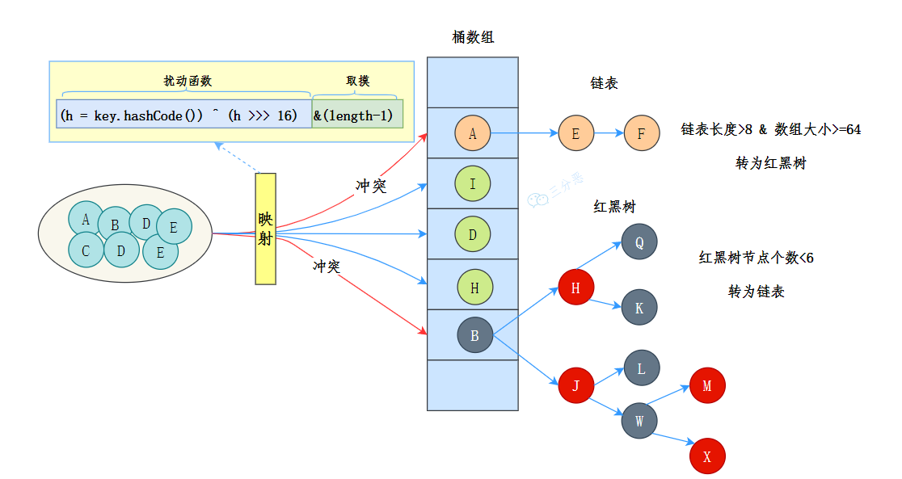
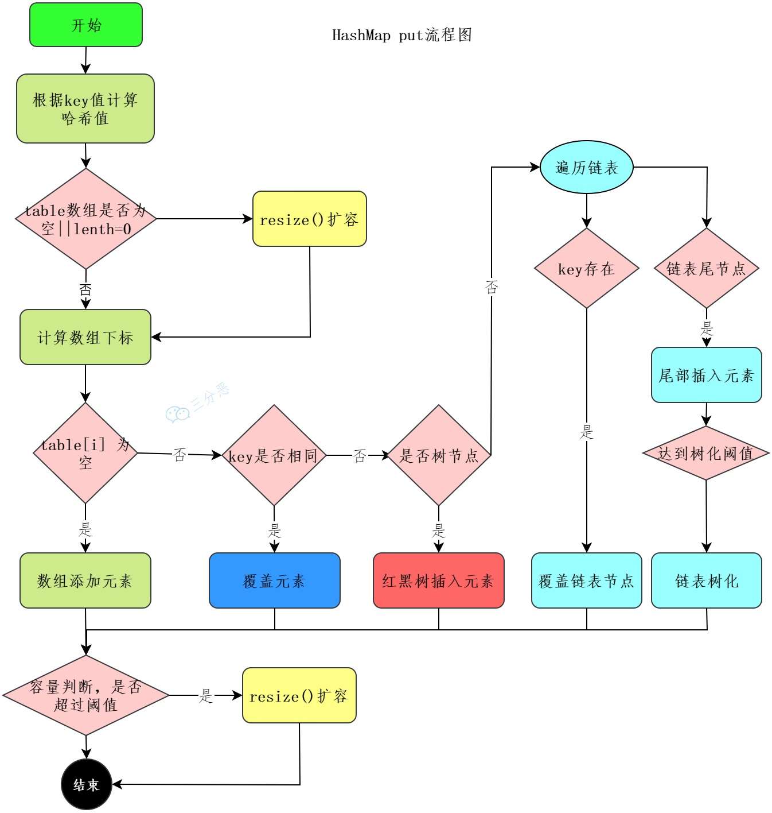
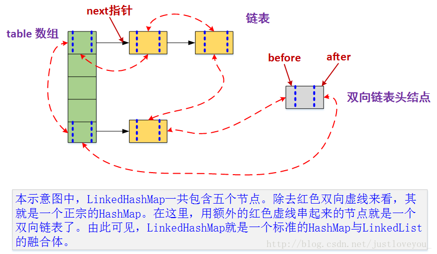

## 能说一下HashMap的数据结构吗？  

- 数组 + 链表（JDK1.7）

- 数组 + 链表 + 红黑树  （JDK1.8）

- 数据结构示意图

  
  - 存储结构
    - HashMap内部使用一个数组（Entry[]）来存储数据
    - 数组中的每个元素称为一个桶（Bucket），每个桶存储一个键值对（Entry）  
  - 哈希函数
    - HashMap使用键的哈希码（hash code）来计算存储位置  
    - 每个键值对根据哈希函数计算得到一个桶的索引，然后将键值对存储在该桶中  
  - 冲突处理
    - 由于哈希函数的计算结果可能会出现冲突，即不同的键计算得到相同的桶索引  
    - HashMap使用链表或红黑树来解决冲突  
    - 当桶中的元素较少时，使用链表存储键值对  
    - 当桶中的元素较多时，将链表转换为红黑树，以提高查找、插入和删除的效率  
## 你对红黑树了解多少？为什么不用二叉树/平衡树呢？  

### 什么是红黑树？  

- 红黑树是一种自平衡的二叉搜索树  

  - 二叉搜索树性质  

    - 左子节点的值小于等于当前节点的值，右子节点的值大于等于当前节点的值  

  - 节点颜色  

    - 每个节点要么是红色，要么是黑色

  - 根节点和叶子节点  

    - 根节点是黑色的，叶子节点（NIL节点）是黑色的  

  - 红色节点限制  

    - 红色节点的子节点必须是黑色的  

  - 黑色节点计数  

    - 从任一节点到其每个叶子节点的路径上，黑色节点的数量是相同的  

    ```mermaid
    graph TD;
        A[30,黑色] --> B[20,黑色];
        A --> C[50,黑色];
        B --> D[10,红色];
        B --> E[25,红色];
        C --> F[60,红色];
        C --> G[70,红色];
        D --> H[NIL,黑色];
        D --> I[NIL,黑色];
        E --> J[NIL,黑色];
        E --> K[NIL,黑色];
        F --> L[NIL,黑色];
        F --> M[NIL,黑色];
        G --> N[NIL,黑色];
        G --> O[NIL,黑色];
    
    ```

### 为什么不用二叉树？  

- 红黑树相对于普通的二叉搜索树的优势在于它能够保持良好的平衡，性能更加优秀和稳定
- 普通的二叉搜索树在最坏情况下可能会退化成链表 ,导致插入、删除和查找操作的时间复杂度变为O(n)  
- 而红黑树通过自平衡的特性，避免了这种退化情况，保证了操作的最坏时间复杂度为O(log n)，其中n是树中节点的数量  

### 为什么不用平衡二叉树？  

- 相比于平衡二叉树，红黑树在保持平衡的过程中旋转的次数较少，提高了插入和删除操作的效率  
- 红黑树通过引入节点颜色和特定性质，保证了树的相对平衡  
- 而平衡二叉树要求更严格的平衡条件，需要更多的旋转操作来保持平衡，导致插入和删除操作的效率较低  

## 红黑树怎么保持平衡的知道吗？  

- 红黑树有两种方式保持平衡： 旋转 和 染色 
- 旋转  
  - 旋转分为两种，左旋和右旋  
- 染色

## HashMap的put流程知道吗？  


1. 首先进行哈希值的扰动，获取一个新的哈希值

   ```java
   (key == null) ? 0 : (h =key.hashCode()) ^ (h >>> 16)
   ```

2. 判断tab是否位空或者长度为0，如果是则进行扩容操作

   ```java
   if ((tab = table) == null || (n = tab.length) == 0)
               n = (tab = resize()).length;
   ```

3. 根据哈希值计算下标，如果对应下标正好没有存放数据，则直接插入即可，否则需要覆盖  

   ```java
   if ((p = tab[i = (n - 1) & hash]) == null)
       tab[i] = newNode(hash, key, value, null);
   else {
       //覆盖
   }
   ```

4. 判断tab[i]是否为树节点，否则向链表中插入数据，是则向树中插入节点  

   ```java
   // 覆盖逻辑
   Node<K,V> e; K k;
   if (p.hash == hash &&
       ((k = p.key) == key || (key != null && key.equals(k))))
       e = p;
   else if (p instanceof TreeNode)
       e = ((TreeNode<K,V>)p).putTreeVal(this, tab, hash, key, value);
   else {
       for (int binCount = 0; ; ++binCount) {
           if ((e = p.next) == null) {
               p.next = newNode(hash, key, value, null);
               if (binCount >= TREEIFY_THRESHOLD - 1) // -1 for 1st
                   treeifyBin(tab, hash);
               break;
           }
           if (e.hash == hash &&
               ((k = e.key) == key || (key != null && key.equals(k))))
               break;
           p = e;
       }
   }
   ```

5. 如果链表中插入节点的时候，链表长度大于等于8，则需要把链表转换为红黑树  

   ```java
               if (binCount >= TREEIFY_THRESHOLD - 1) // -1 for 1st
                   treeifyBin(tab, hash);
   ```

6. 最后所有元素处理完成后，判断是否超过阈值； threshold ，超过则扩容  

   ```java
           if (++size > threshold)
               resize();
   ```

## HashMap怎么查找元素的呢？  

```java
    public V get(Object key) {
        Node<K,V> e;
        return (e = getNode(hash(key), key)) == null ? null : e.value;
    }
```

```java
    final Node<K,V> getNode(int hash, Object key) {
        Node<K,V>[] tab; Node<K,V> first, e; int n; K k;
        if ((tab = table) != null && (n = tab.length) > 0 &&
            (first = tab[(n - 1) & hash]) != null) {
            if (first.hash == hash && // always check first node
                ((k = first.key) == key || (key != null && key.equals(k))))
                return first;
            if ((e = first.next) != null) {
                if (first instanceof TreeNode)
                    return ((TreeNode<K,V>)first).getTreeNode(hash, key);
                do {
                    if (e.hash == hash &&
                        ((k = e.key) == key || (key != null && key.equals(k))))
                        return e;
                } while ((e = e.next) != null);
            }
        }
        return null;
    }
```

1. 使用扰动函数，获取新的哈希值  
2. 计算数组下标，获取节点  
3. 当前节点和key匹配，直接返回  
4. 否则，当前节点是否为树节点，查找红黑树  
5. 否则，遍历链表查找  

## HashMap的哈希/扰动函数是怎么设计的?  

- HashMap的哈希函数是先通过 hashCode() 获取到key的哈希值  
- 哈希值是一个32位的int类型的数值，然后再将哈希值右移16位（高位），然后与哈希值本身异或，达到高位与低位混合的效果  
- 这样的设计增加了哈希值的随机性，降低了哈希冲突的概率 。
- 异或操作使得低位的特征影响到高位，减少了相同低位的哈希值导致相同索引位置的情况  

## 为什么哈希/扰动函数能降hash碰撞？  

- 因为哈希值&(数组长度 - 1)保留的是hash值的地位特征，所以对扰动函数通过对哈希值进行变换，新hash值保留了高低位的特征，这样使得哈希值的分布更加均匀，从而降低哈希碰撞的概率

## 为什么HashMap的容量是2的倍数呢？ 

- 方便哈希取余
  - 取余是去除整数倍，保留整数倍以下的数据
  - hash值&(数组大小-1) ，也达到了取余的效果
    - 数组大小为2的倍数，(数组大小-1) 则为一个全是1的二进制数
    - hash值&(数组大小-1) 结果为直接保留hash值对(数组大小-1) 的低位的余数部分
      - 因为任意数&1得任意数
      - 任意数&0得0
      - hash值&(数组大小-1) ，将(数组大小-1)高位补0，补全到和hash值一样多的位数，那么hash值高位是与0做&运算，低位是与1做位运算，即保留了低位hash值，也是取余的效果
- 在扩容时，利用扩容后的大小也是2的倍数，将已经产生hash碰撞的元素完美的转移到新的table中去  

## 如果初始化HashMap，传一个17的值 new HashMap<> ，它会怎么处理？

-  初始化时，传的不是2的倍数时，HashMap会向上寻找 离得最近的2的倍数 ，所以传入17，但HashMap的实际容量是32  
- HashMap的容量必须是2的倍数

## 你还知道哪些哈希函数的构造方法呢？  

- 除留取余法  
  - HashMap里进行了优化改造，效率更高，散列也更均衡  
- 直接定址法  
  - 直接根据 key 来映射到对应的数组位置，例如1232放到下标1232的位置  
- 数字分析法  
  - 取 key 的某些数字（例如十位和百位）作为映射的位置  
- 平方取中法  
  - 取 key 平方的中间几位作为映射的位置  
- 折叠法  
  - 将 key 分割成位数相同的几段，然后把它们的叠加和作为映射的位置  

## 解决哈希冲突有哪些方法呢？  

- 链地址法  
  - 在冲突的位置拉一个链表，把冲突的元素放进去  
- 开放定址法  
  - 开放定址法就是从冲突的位置再接着往下找，给冲突元素找个空位  
  - 找到空闲位置的方法也有很多
    - 线行探查法  
      - 从冲突的位置开始，依次判断下一个位置是否空闲，直至找到空闲位置  
    - 平方探查法  
      - 从冲突的位置x开始，第一次增加 1^2 个位置，第二次增加2^2 …，直至找到空闲的位置  
- 再哈希法  
  - 换种哈希函数，重新计算冲突元素的地址
- 建立公共溢出区   
  - 再建一个数组，把冲突的元素放进去  

## 为什么HashMap链表转红黑树的阈值为8呢？

- 红黑树节点的大小大概是普通节点大小的两倍，所以转红黑树，牺牲了空间换时间，更多的是一种兜底的策略，保证极端情况下的查找效率  
- 链表转红黑树的阈值为什么要选8呢？
  - 和统计学有关。理想情况下，使用随机哈希码，链表里的节点符合泊松分布，出现节点个数的概率是递减的，节点个数为8的情况，发生概率仅为0.00000006  
- 红黑树转回链表的阈值为什么是6，而不是8？  
  - 是因为如果这个阈值也设置成8，假如发生碰撞，节点增减刚好在8附近，会发生链表和红黑树的不断转换，导致资源浪费  

### 扩容在什么时候呢？为什么扩容因子是0.75？  

- 为了减少哈希冲突发生的概率,当前HashMap的元素个数达到一个临界值的时候，就会触发扩容  
- 这个 临界值threshold 就是由加载因子和当前容器的容量大小来确定的  

### 那么为什么选择了0.75作为HashMap的默认加载因子呢？  

- 这是对 空间 成本和 时间 成本平衡的考虑  
  - 假如我们设的比较大，元素比较多，空位比较少的时候才扩容，那么发生哈希冲突的概率就增加了，查找的时间成本就增加了  
  - 我们设的比较小的话，元素比较少，空位比较多的时候就扩容了，发生哈希碰撞的概率就降低了，查找时间成本降低，但是就需要更多的空间去存储元素，空间成本就增加了  

## HashMap扩容机制了解吗？  

- 为了减少哈希冲突发生的概率,当前HashMap的元素个数达到一个临界值的时候，就会触发扩容  
- 链表结构扩容后
  - hash&老容量==0
    - 现在位置=原先位置
  - hash&老容量==1
    - 现在位置=原先位置+oldCap

## JDK1.8对HashMap主要做了哪些优化呢？为什么？  

- 数据结构  
  - 在JDK 1.8中，当哈希冲突较多时，HashMap会将链表转换为红黑树，以提高查找、插入和删除操作的效率  
  - 种优化是为了解决在极端情况下链表过长导致的性能问题。
  - 红黑树的平均时间复杂度为O(log n)，相比于链表的O(n)更高效  
- 哈希碰撞优化   
  - JDK 1.8对哈希碰撞的处理进行了优化  
  - 当发生哈希碰撞时，HashMap会使用更加均匀的哈希函数来计算索引位置，减少碰撞的概率  
  - JDK 1.8还引入了"树化阈值"和"链表转树阈值"的概念，动态调整链表和红黑树的阈值，以平衡性能和空间的消耗  
- 链表插入方式 
  - 在JDK 1.8中，当插入新的键值对时，HashMap采用了尾插法（将新键值对插入链表或红黑树末尾），而不是头插法  
  - 这样做可以减少链表或红黑树的重新排序次数，提高插入操作的效率  
- 扩容优化  
  - JDK 1.8对HashMap的扩容操作进行了优化  
  - 在扩容时，HashMap采用了"渐进式扩容"的策略，将扩容操作分散到多次进行，避免了一次性重新计算所有键的哈希值和索引位置，减少了扩容操作的时间和资源消耗  

## 你能自己设计实现一个HashMap吗？

- 散列函数  
  - hashCode()+除留余数法  
- 冲突解决  
  - 链地址法  
- 扩容  
  - 节点重新hash获取位置  

## HashMap 是线程安全的吗？多线程下会有什么问题？  

- 不是线程安全的
- 多线程下扩容死循环  
  - 在JDK1.7中，HashMap使用头插法插入元素，当多个线程同时进行扩容操作时，可能会导致环形链表的出现，从而形成死循环  
  - JDK1.8中的HashMap改为使用尾插法插入元素，在扩容时保持链表元素原本的顺序，避免了环形链表的问题  
- 多线程的put可能导致元素的丢失  
  - 当多个线程同时执行put操作时，如果计算出来的索引位置相同，就会导致后一个key覆盖前一个key，从而导致元素的丢失  
  - 这个问题在JDK1.7和JDK1.8中都存在  
- put和get并发时，可能导致get为null  
  - 当一个线程执行put操作导致扩容时，另一个线程同时执行get操作  
  - 由于扩容过程中元素迁移的不可见性，可能导致get操作返回null  
  - 这个问题在JDK1.7和JDK1.8中都存在  

## 有什么办法能解决HashMap线程不安全的问题呢？  

- 使用线程安全的包装类  
  - 使用 Collections.synchronizedMap() 方法将HashMap包装成线程安全的Map  
  - 这个方法返回一个线程安全的Map对象，对该对象的操作会自动进行同步，从而保证线程安全  
- 使用同步机制  
  - 可以使用 synchronized 关键字或其他同步机制（如ReentrantLock ）对HashMap进行加锁  
- 使用线程安全的并发容器   
  - 可以使用 ConcurrentHashMap 代替HashMap  
  - ConcurrentHashMap 是Java提供的线程安全的哈希表实现，通过使用锁分段技术和CAS操作来实现高效的并发性能  

## 能说一下ConcurrentHashmap的具体实现吗？  

- ConcurrentHashmap线程安全在jdk1.7版本是基于 分段锁 实现  
- 在jdk1.8是基于CAS+synchronized 实现  

### JDK1.7：分段锁  

- JDK1.7版本的ConcurrentHashMap采用分段锁机制  
  - 里面包含一个Segment数组，Segment继承于ReentrantLock，Segment则包含HashEntry的数组  
  - HashEntry本身就是一个链表的结构，具有保存key、value的能力能指向下一个节点的指针  
  - 实际上就是相当于每个Segment都是一个HashMap  
  - 默认的Segment长度是16，也就是支持16个线程的并发写，Segment之间相互不会受到影响  
- put流程
  - 计算hash，定位到segment，segment如果是空就先初始化  
  - 使用ReentrantLock加锁，如果获取锁失败则尝试自旋，自旋超过次数就阻塞获取，保证一定获取锁成功  
  - 遍历HashEntry，就是和HashMap一样，数组中key和hash一样就直接替换，不存在就再插入链表，链表同样操作 
- get流程
  - key通过hash定位到segment，再遍历链表定位到具体的元素上  
  - 需要注意的是value是volatile的，所以get是不需要加锁的  

### JDK1.8：CAS+synchronized  

- 数据结构

  - 数据结构和HashMap是一样的，数组+链表+红黑树  
  - 它实现线程安全的关键点在于put流程  

- put流程

  - 首先计算hash，遍历node数组，如果数组是空的话，就通过CAS+自旋的方式初始化数组

    ```java
                if (tab == null || (n = tab.length) == 0)
                    tab = initTable();
    ```

    - 初始化数组

      ```java
      private final Node<K,V>[] initTable() {
              Node<K,V>[] tab; int sc;
              while ((tab = table) == null || tab.length == 0) {
                  //如果正在初始化或者扩容
                  if ((sc = sizeCtl) < 0)
                      //等待(让出线程)
                      Thread.yield(); // lost initialization race; just spin
                  else if (U.compareAndSetInt(this, SIZECTL, sc, -1)) {//CAS操作
                      try {
                          if ((tab = table) == null || tab.length == 0) {
                              int n = (sc > 0) ? sc : DEFAULT_CAPACITY;
                              @SuppressWarnings("unchecked")
                              Node<K,V>[] nt = (Node<K,V>[])new Node<?,?>[n];
                              table = tab = nt;
                              sc = n - (n >>> 2);
                          }
                      } finally {
                          sizeCtl = sc;
                      }
                      break;
                  }
              }
              return tab;
          }
      ```

  - 如果当前数组位置是空则直接通过CAS自旋写入数据  

    ```java
    else if ((f = tabAt(tab, i = (n - 1) & hash)) == null) {
        if (casTabAt(tab, i, null, new Node<K,V>(hash, key, value)))
            break;                   // no lock when adding to empty bin
    }
    ```

  - 如果hash==MOVED，说明需要扩容，执行扩容  

    ```java
        final Node<K,V>[] helpTransfer(Node<K,V>[] tab, Node<K,V> f) {
            Node<K,V>[] nextTab; int sc;
            if (tab != null && (f instanceof ForwardingNode) &&
                (nextTab = ((ForwardingNode<K,V>)f).nextTable) != null) {
                int rs = resizeStamp(tab.length) << RESIZE_STAMP_SHIFT;
                while (nextTab == nextTable && table == tab &&
                       (sc = sizeCtl) < 0) {
                    if (sc == rs + MAX_RESIZERS || sc == rs + 1 ||
                        transferIndex <= 0)
                        break;
                    if (U.compareAndSetInt(this, SIZECTL, sc, sc + 1)) {
                        transfer(tab, nextTab);
                        break;
                    }
                }
                return nextTab;
            }
            return table;
        }
    ```

  - 如果都不满足，就使用synchronized写入数据  

    - 写入数据同样判断链表、红黑树，链表写入和HashMap的方式一样，key hash一样就覆盖，反之就尾插法，链表长度超过8就转换成红黑树  

- get查询  

  - 无锁化读取，和HashMap的get流程基本相同  
    - 头节点通过Unsafe获取

## HashMap 内部节点是有序的吗？  

- HashMap 内部节点的顺序是无序的  
- 因为 HashMap 使用的是哈希表的数据结构，它通过哈希函数将键映射到桶（bucket）中，而不是按照插入顺序进行存储  
- 如果需要有序的存储和遍历元素，可以考虑使用 LinkedHashMap 或者 TreeMap  

## 讲讲 LinkedHashMap 怎么实现有序的？  



- LinkedHashMap在 HashMap 的基础上维护了一个双向链表，用于记录元素的插入顺序或访问顺序  
- 通过这个链表， LinkedHashMap 可以按照插入顺序或访问顺序进行遍历。  

## 讲讲 TreeMap 怎么实现有序的？  

- TreeMap 是基于红黑树实现的，是一种有序的的集合  
- 在 TreeMap 中，元素是按照是按照 Key 的自然顺序或者 Comprator 的顺序进行排序，因此可以通过键值来遍历
  集合中的元素  
  - 不是通过插入顺序遍历