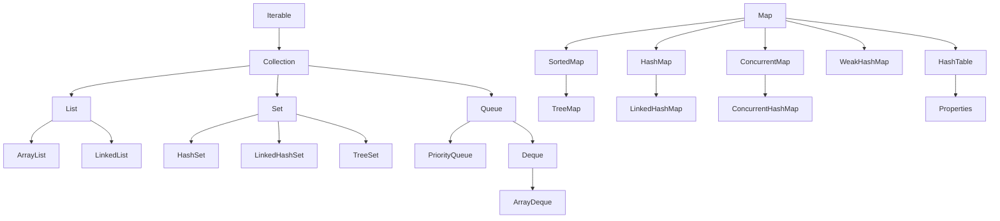

## 说说有哪些常见集合？

```mermaid
graph TD;
    A[Iterable] --> B[Collection]
    B --> C[List]
    B --> D[Set]
    C --> E[ArrayList]
    C --> F[LinkedList]
    D --> G[HashSet]
    D --> H[LinkedHashSet]
    D --> I[TreeSet]
    B --> J[Queue]
    J --> K[PriorityQueue]
    J --> L[Deque]
    L --> M[ArrayDeque]
    N[Map] --> O[SortedMap]
    O --> P[TreeMap]
    N --> Q[HashMap]
    Q --> R[LinkedHashMap]
    N --> S[HashTable]
    N --> T[WeakHashMap]
    N --> U[ConcurrentMap]
    U --> V[ConcurrentHashMap]
    S --> W[Properties]

```

- List
- Map
- Set
