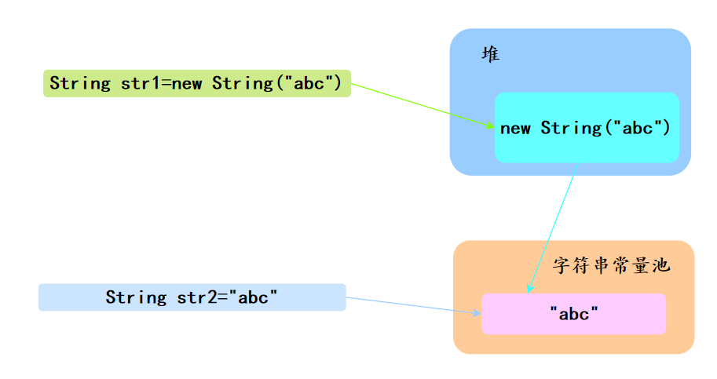
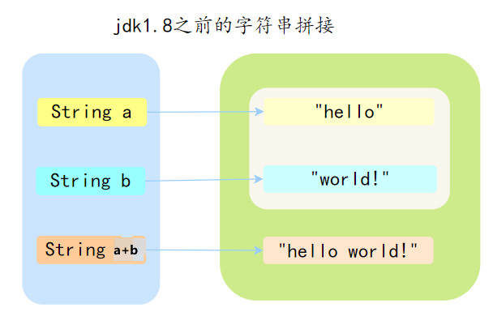

## String 是 Java 基本数据类型吗？可以被继承吗？

- String是Java基本数据类型吗？

  - 不是，引用数据类型

- String 类可以继承吗?

  - 不行。String类在Java中被声明为final类，这意味着它不能被继承

- 这样设计的原因

  - 字符串的不可变性

    - String类的不可变性使得它可以被安全地用于多线程环境下，不会出现线程安全问题

      > 任何对 `String` 对象的操作（如拼接、替换等）都会返回一个新的 `String` 对象，而不会修改原始对象的值

  - 字符串常量池的优化

    - 由于字符串是不可变的，Java可以对字符串进行缓存和共享，以提高性能和节省内存
    - 这就是通过字符串常量池来实现的，它存储了所有字符串字面量的唯一实例  

  - 安全性和可靠性

    - String类的不可变性使得它在安全性和可靠性方面更加可靠。例如，它可以被用作Map的键，因为它的哈希值是固定的  

## String和StringBuilder、StringBuffer？  

| 类名          | 可变性 | 线程安全性 | 性能 |
| ------------- | ------ | ---------- | ---- |
| String        | 不可变 | 线程安全   | 低   |
| StringBuffer  | 可变   | 线程安全   | 低   |
| StringBuilder | 可变   | 非线程安全 | 高   |

- String类
  - String是不可变的，使用 private final char value[] 来存储字符串，一旦创建就不能修改其值
    - jdk11使用byte[]存储字符串
  - 任何对String的修改都会创建一个新的String对象
  - String类是线程安全的，因为它的不可变性保证了多个线程可以安全地共享String对象
  - 由于不可变性的特性，对于频繁的字符串拼接操作，会产生大量的临时对象，影响性能
- StringBuffer类
  - StringBuffer是可变的，使用 char value[] 存储字符串，它的值可以被修改
  - 为了保证线程安全性，StringBuffer的方法都使用synchronized关键字进行同步，在多线程环境下，使用StringBuffer可以保证线程安全  
  - 由于同步的开销，StringBuffer的性能相对较低
- StringBuilder类
  - StringBuilder是StringBuffer的非线程安全版本，它的方法没有使用synchronized关键字进行同步
  - 在单线程环境下，使用StringBuilder可以获得更好的性能
  - 在多线程环境下使用StringBuilder，需要自行保证线程安全
- 使用建议
  - 操作的数据量较小，可以使用String类
  - 多线程环境下操作大量的数据，需要保证线程安全，可以使用StringBuffer类
  - 单线程环境下操作大量的数据，可以使用StringBuilder类以，性能更好

## String str1 = new String("abc")和String str2 = "abc" 和 区别？  



- 对象创建过程
  - 两个语句都会去字符串常量池中检查是否已经存在 “abc”，如果有则直接使用，如果没有则会在常量池中创建 “abc” 对象  
  - String str1 = new String("abc") 还会通过 new String() 在堆里创建一个"abc" 字符串对象实例
- String s = new String("abc")创建了几个对象？
  - 一个或两个
    - 如果字符串常量池已经有“abc”，则是一个；否则，两个

## String不是不可变类吗？字符串拼接是如何实现的？

- String的确是不可变的，“+”的拼接操作，其实是会生成新的对象
- 在jdk1.8之前，那么会生成多个中间对象
  - a和b初始化时位于字符串常量池，a+b拼接后的对象位于堆中。经过拼接新生成了String对象。如果拼接多次，那么会生成多个中间对象




- 在Java8时JDK对“+”号拼接会编译成StringBuilder的append方法

## intern方法有什么作用？

- 如果当前字符串内容存在于字符串常量池（即equals()方法为true，也就是内容一样），直接返回字符串常量池中的字符串
- 否则，将此String对象添加到池中，并返回String对象的引用

## Integer a= 127，Integer b = 127；Integer c= 128，Integer d =128；相等吗?  

- 是a和b相等，c和d不相等
  - Integer a= 127这种赋值，是用到了Integer自动装箱的机制。自动装箱的时候会去缓存池里取Integer对象，没有取到才会创建新的对象
  - 如果整型字面量的值在-128到127之间，那么自动装箱时不会new新的Integer对象，而是直接引用缓存池中的Integer对象，超过范围 a1==b1的结果是false
- 什么是Integer缓存？
  - 因为根据实践发现大部分的数据操作都集中在值比较小的范围，因此 Integer 搞了个缓存池，默认范围是 -128 到 127，可以根据通过设置 JVM-XX:AutoBoxCacheMax=来修改缓存的最大值，最小值改不了
  - 实现的原理是int 在自动装箱的时候会调用Integer.valueOf，进而用到了IntegerCache
  - IntegerCache是一个静态内部类， 在静态块中会初始化好缓存值

## String怎么转成Integer的？原理？  

- 方法

  - Integer.parseInt(String s)  

  - Integer.valueOf(String s)

- 原理

  - 最终都调用`parseInt(String s, int radix) ` 方法
    
    ```mermaid
    graph TD;
        Start((Start)) --> CheckNull[s 是否为null?];
        CheckNull -- 是 --> Error[抛出NumberFormatException异常Cannot parse null string];
        CheckNull -- 否 --> CheckRadix[检查 radix 范围];
        CheckRadix --> |radix < Character.MIN_RADIX| ErrorRadixLess[抛出NumberFormatException异常radix less than Character.MIN_RADIX];
        CheckRadix --> |radix > Character.MAX_RADIX| ErrorRadixGreater[抛出NumberFormatException异常radix greater than Character.MAX_RADIX];
        CheckRadix --> |radix 符合范围| Initialize[初始化变量 negative, i, len, limit];
        Initialize --> CheckLen[s长度是否大于0?];
        CheckLen -- 是 --> CheckSign[检查首字符是否为符号];
        CheckLen -- 否 --> ErrorEmpty[抛出NumberFormatException异常Cannot parse empty string];
        CheckSign --> |首字符是符号| HandleSign[处理符号];
        HandleSign --> CheckSingle[检查是否为单个符号];
        CheckSingle -- 是 --> ErrorSingle[抛出NumberFormatException异常Cannot have lone '+' or '-'];
        CheckSingle -- 否 --> ParseLoop[开始解析循环];
        ParseLoop --> ParseDigit[解析字符并计算结果];
        ParseDigit --> CheckDigit[检查是否为有效数字];
        CheckDigit -- 是 --> UpdateResult[更新结果];
        CheckDigit -- 否 --> ErrorDigit[抛出NumberFormatException异常Invalid digit];
        UpdateResult --> CheckOverflow[检查是否溢出];
        CheckOverflow -- 是 --> ErrorOverflow[抛出NumberFormatException异常Numeric overflow];
        CheckOverflow -- 否 --> CheckEnd[检查是否到达字符串末尾];
        CheckEnd -- 是 --> EndResult[返回结果];
        CheckEnd -- 否 --> ParseLoop;
        ErrorRadixLess --> EndError[结束];
        ErrorRadixGreater --> EndError;
        ErrorSingle --> EndError;
        ErrorDigit --> EndError;
        ErrorOverflow --> EndError;
        ErrorEmpty --> EndError;
        Error --> EndError;
        EndError((End));
        EndResult --> End((End));
    ```

## Object 类的常见方法?  

- 对象比较
  - hashCode()
  - equals(Object obj)
- 对象拷贝
  - clone()
- 对象转字符串
  - toString()
- 多线程调度
  - wait()
  - wait(long timeout)
  - wait(long timeout,int nanos)
  - notify()
  - notifyAll()
- 反射
  - getClass()
- 垃圾回收
  - finalize
