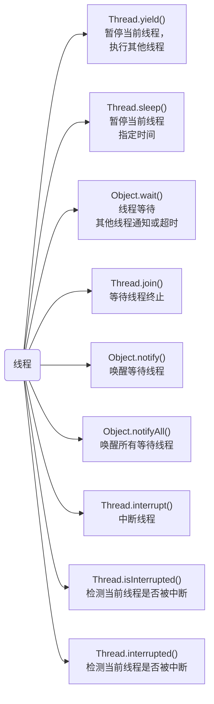
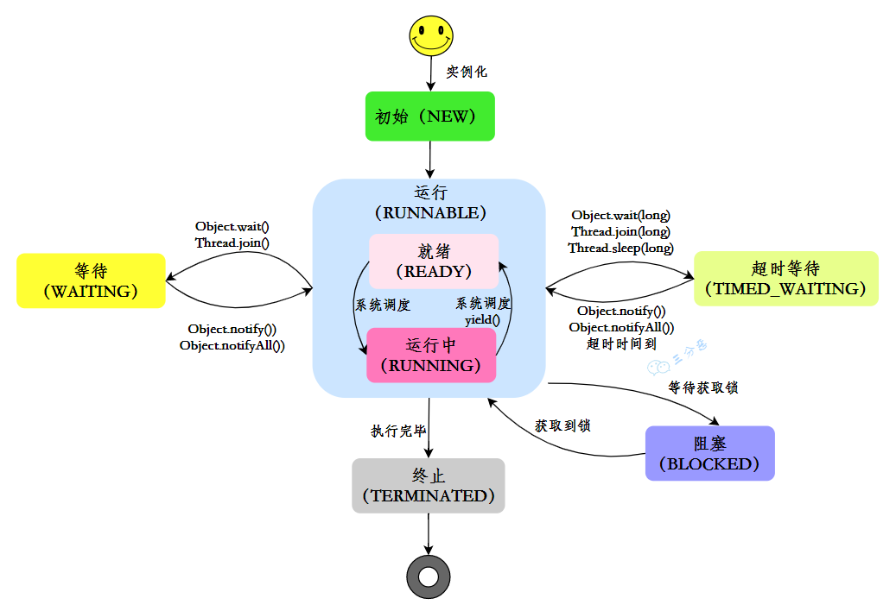

## 并行跟并发有什么区别？

- 并行就是同一时刻，两个线程都在执行。这就要求有两个CPU去分别执行两个线程  
- 并发就是同一时刻，只有一个执行，但是一个时间段内，两个线程都执行了  
  - 并发的实现依赖于CPU切换线程，因为切换的时间特别短，所以基本对于用户是无感知的  

## 说说什么是进程和线程？  

- 进程  
  - 进程是代码在数据集合上的一次运行活动，是系统进行资源分配和调度的基本单位  
  - 一个进程中有多个线程，多个线程共用进程的堆和方法区资源  
- 线程  
  - 线程是进程的一个执行路径，一个进程中至少有一个线程，进程中的多个线程共享进程的资源  
  - 每个线程有自己的程序计数器和栈  

## 说说线程有几种创建方式？  

- 继承Thread类  
  - 继承Thread类，重写run()方法，调用start()方法启动线程  
- 实现Runnable接口  
  - 实现 Runnable 接口，重写run()方法  
- 实现Callable接口  
  - 实现Callable接口，重写call()方法，这种方式可以通过FutureTask获取任务执行的返回值  

## 为什么调用start()方法时会执行run()方法，那怎么不直接调用run()方法？  

- JVM执行start方法，会先创建一条线程，由创建出来的新线程去执行thread的run方法，这才起到多线程的效果  
- 为什么我们不能直接调用run()方法？  
  - 如果直接调用Thread的run()方法，那么run方法还是运行在主线程中，相当于顺序执行，就起不到多线程的效果  

## Thread和Runnable有什么区别？  

| 特点      | Thread                          | Runnable                        |
| --------- | ------------------------------- | ------------------------------- |
| 继承关 系 | 是一个类                        | 是一个接口                      |
| 代码复 用 | 不方便，每个线程需要创建新实 例 | 方便，多个线程可以共享同一实 例 |
| 灵活性    | 相对较低，只能继承Thread类      | 相对较高，可以与其他接口组合    |
| 可控性    | 相对较低，需要手动管理线程      | 相对较高，可以通过线程池管理    |

- Thread类适合直接创建新线程
- 而Runnable接口适合定义线程要执行的任务，并可以与其他接口组合使用  

## 线程有哪些常用的调度方法？  

- 线程等待与通知
  - Object类方法
    - wait() 
      - 当一个线程A调用一个共享变量的 wait()方法时， 线程A会被阻塞挂起，发生下面几种情况才会返回  
      -  其他线程调用了线程A共享对象 notify()或者 notifyAll()方法  
      - 其他线程调用了线程A的 interrupt() 方法，线程A抛出InterruptedException异常返回  
    - wait(long timeout)  
      - 这个方法相比 wait() 方法多了一个超时参数
      - 在等待时间内没有其他线程调用相同对象的 `notify()` 或 `notifyAll()` 方法唤醒它，或者等待时间到期，线程会被自动唤醒，并且重新尝试获取对象的锁
      - 如果等待时间到期而线程没有获取到锁，则线程会被唤醒，但是它不会重新尝试获取锁。相反，它会在等待队列中等待，直到其他线程通过 `notify()` 或 `notifyAll()` 方法唤醒它，并且在获取锁之前，线程是不会继续执行的
    -  wait(long timeout, int nanos) 
      - 其内部调用的是 wait(long timout）函数  
    - notify() 
      - 一个线程A调用共享对象的 notify() 方法后，会唤醒一个在这个共享变量上调用 wait 系列方法后被挂起的线程。 一个共享变量上可能会有多个线程在等待，具体唤醒哪个等待的线程是随机的  
    - notifyAll()
      - 不同于在共享变量上调用 notify() 函数会唤醒被阻塞到该共享变量上的一个线程，notifyAll()方法则会唤醒所有在该共享变量上由于调用 wait 系列方法而被挂起的线程  
  - Thread类的方法
    - join()  
      - 如果一个线程A执行了thread.join()语句，其含义是：当前线程A等待thread线程终止之后从thread.join()返回  
- 线程休眠
  - sleep(long millis)  
    - Thread类中的静态方法  
    - 当一个执行中的线程A调用了Thread的sleep方法后，线程A会暂时让出指定时间的执行权  
    - 但是线程A所拥有的监视器资源，比如锁还是持有不让出的  
    - 指定的睡眠时间到了后该函数会正常返回，接着参与 CPU 的调度，获取到 CPU 资源后就可以继续运行  
- 让出优先权
  - yield()  
    - Thread类中的静态方法  
    - 当一个线程调用 yield 方法时，实际就是在暗示线程调度器当前线程请求让出自己的CPU ，但是线程调度器可以无条件忽略这个暗示  
- 线程中断  
  - 定义
    - Java 中的线程中断是一种线程间的协作模式  
    - 通过设置线程的中断标志并不能直接终止该线程的执行，而是被中断的线程根据中断状态自行处理  
  - 方法
    - void interrupt()  
      - 中断线程  
      - 例如，当线程A运行时，线程B可以调用线程interrupt() 方法来设置线程的中断标志为true 并立即返回  
      - 线程A实际并没有被中断， 会继续往下执行  
    - boolean isInterrupted()  
      - 检测当前线程是否被中断  
    - boolean interrupted()  
      - 检测当前线程是否被中断，与 isInterrupted 不同的是，该方法如果发现当前线程被中断，则会清除中断标志  

## 线程有几种状态？  

- 线程共有六种状态

  | 状态         | 说明                                                         |
  | :----------- | ------------------------------------------------------------ |
  | NEW          | 初始状态：线程被创建，但还没有调用start()方法                |
  | RUNNABLE     | 运行状态：Java线程将操作系统中的就绪和运行两种状态笼 统的称作“运行” |
  | BLOCKED      | 阻塞状态：表示线程阻塞于锁                                   |
  | WAITING      | 等待状态：表示线程进入等待状态，进入该状态表示当前线 程需要等待其他线程做出一些特定动作（通知或中断） |
  | TIME_WAITING | 超时等待状态：该状态不同于 WAITIND，它是可以在指定 的时间自行返回的 |
  | TERMINATED   | 终止状态：表示当前线程已经执行完毕                           |

  

### BLOCKED和WAITING有什么区别？

- BLOCKED状态表示线程被阻塞，无法继续执行，通常是因为等待获取锁
- WAITING状态表示线程正在等待其他线程的通知，通常是因为调用了wait()方法、join()方法或LockSupport.park()方法  
- 这两种状态的区别在于阻塞状态是等待获取锁，而等待状态是等待其他线程的通知或中断  

###   WAITING和TERMINATED有什么区别？  

- WAITING状态表示线程在等待其他线程的通知或中断  
- 而TERMINATED状态表示线程已经执行完毕，不再执行任何代码  
- WAITING状态是暂时的，可以再次进入RUNNABLE状态，而TERMINATED状态是永久的，线程不会再进入任何状态  

## 什么是线程上下文切换？

- 线程上下文切换是指在多线程环境下，CPU 从一个线程转而执行另一个线程的过程。
- 在这个过程中，操作系统会保存当前线程的上下文（包括寄存器状态、程序计数器、堆栈指针等信息），然后恢复下一个线程的上下文，以便该线程可以继续执行。
- 线程上下文切换是一种非常耗时的操作，因为操作系统需要保存和恢复线程的上下文信息。因此，在编写多线程应用程序时，应尽量减少线程上下文切换的次数，以提高系统的性能和效率

### 线程上下文切换通常发生在以下几种情况下

- 当一个线程的时间片用完时，操作系统会强制进行线程上下文切换，将 CPU 时间片分配给另一个处于就绪状态的线程。
- 当一个线程因为等待某些事件（如I/O操作、锁的释放等）而被阻塞时，操作系统会将 CPU 时间片分配给另一个处于就绪状态的线程
- 当一个线程调用了 `yield()` 方法主动放弃 CPU 时间片时，操作系统会将 CPU 时间片分配给另一个处于就绪状态的线程

## 守护线程了解吗？  

- Java中的线程分为两类，分别为 daemon 线程（守护线程）和 user 线程（用户线程）  
- 在JVM 启动时会调用 main 函数，main函数所在的钱程就是一个用户线程  
- 其实在JVM 内部同时还启动了很多守护线程， 比如垃圾回收线程  
- 那么守护线程和用户线程有什么区别呢  ？
  - 是当最后一个非守护线程束时，JVM会正常退出，而不管当前是否存在守护线程，也就是说守护线程是否结束并不影响 JVM退出  

## 线程间有哪些通信方式？  

- volatile和synchronized关键字  
  - 关键字volatile可以用来修饰字段（成员变量），就是告知程序任何对该变量的访问均需要从共享内存中获取，而对它的改变必须同步刷新回共享内存，它能保证所有线程对变量访问的可见性  
  - 关键字synchronized可以修饰方法或者以同步块的形式来进行使用，它主要确保多个线程在同一个时刻，只能有一个线程处于方法或者同步块中，它保证了线程对变量访问的可见性和排他性  
- 等待/通知机制
  - 可以通过Java内置的等待/通知机制（wait()/notify()）实现一个线程修改一个对象的值，而另一个线程感知到了变化，然后进行相应的操作  
- 管道输入/输出流  
  - 管道输入/输出流和普通的文件输入/输出流或者网络输入/输出流不同之处在于，它主要用于线程之间的数据传输，而传输的媒介为内存  
  - 管道输入/输出流主要包括了如下4种具体实现  
    - PipedOutputStream、PipedInputStream、 PipedReader和PipedWriter，前两种面向字节，而后两种面向字
      符  
- 使用Thread.join()  
  - 如果一个线程A执行了thread.join()语句，其含义是：当前线程A等待thread线程终止之后才从thread.join()返回  
  - 线程Thread除了提供join()方法之外，还提供了join(long millis)和join(long millis,int nanos)两个具备超时特性的方法  
- 使用ThreadLocal（线程内 ）
  - ThreadLocal，即线程变量，是一个以ThreadLocal对象为键、任意对象为值的存储结构  
  - 这个结构被附带在线程上，也就是说一个线程可以根据一个ThreadLocal对象查询到绑定在这个线程上的一个值

