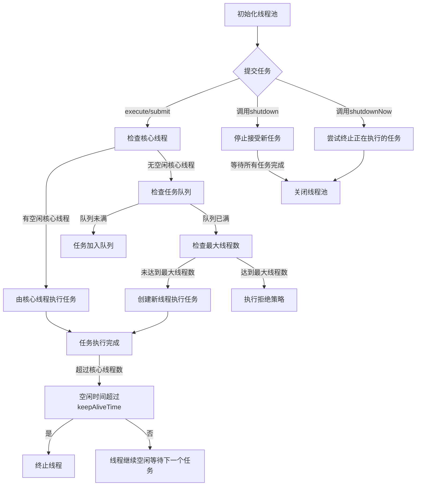
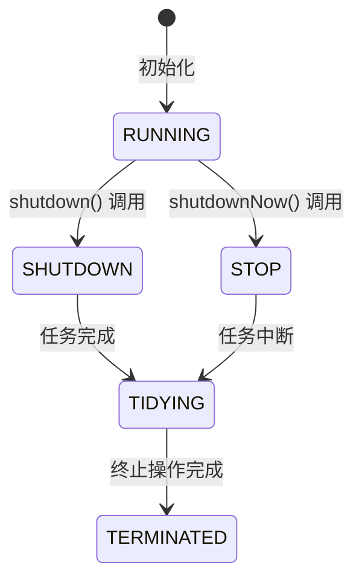

## 什么是线程池？

线程池是一种管理和控制多个线程并发执行的机制，旨在提高性能并优化资源使用。线程池通过预先创建一组线程，避免了频繁创建和销毁线程的开销，从而提高了系统效率。

### 1. 线程池的基本概念

- **线程复用**：线程池在初始化时创建一定数量的线程，这些线程在处理完一个任务后不会被销毁，而是被重用来处理下一个任务。
- **任务队列**：当所有线程都在忙碌时，新的任务会被放入一个队列中等待执行。
- **线程管理**：线程池会自动管理线程的生命周期，如创建新线程、回收空闲线程等。

### 2. 线程池的优势

- **提高性能**：减少了频繁创建和销毁线程的开销。
- **资源控制**：可以限制并发线程的数量，防止系统资源耗尽。
- **简化编程**：提供了统一的接口来管理和调度线程，简化了并发编程的复杂性。

### 3. Java中的线程池实现

Java通过`java.util.concurrent`包提供了多种线程池实现，主要通过`Executors`工具类来创建。

#### 3.1 常见的线程池类型

1. **FixedThreadPool**：固定大小的线程池，适用于已知线程数固定的场景。

    ```java
    ExecutorService fixedThreadPool = Executors.newFixedThreadPool(10);
    ```

2. **CachedThreadPool**：根据需要创建新线程的线程池，但在空闲时会重用先前创建的线程，适用于大量短生命周期任务。

    ```java
    ExecutorService cachedThreadPool = Executors.newCachedThreadPool();
    ```

3. **SingleThreadExecutor**：单线程线程池，适用于需要顺序执行任务的场景。

    ```java
    ExecutorService singleThreadExecutor = Executors.newSingleThreadExecutor();
    ```

4. **ScheduledThreadPool**：定时或周期性执行任务的线程池。

    ```java
    ScheduledExecutorService scheduledThreadPool = Executors.newScheduledThreadPool(5);
    ```

### 4. 线程池的使用示例

以下是一个使用固定大小线程池执行多个任务的示例：

```java
import java.util.concurrent.ExecutorService;
import java.util.concurrent.Executors;
import java.util.concurrent.TimeUnit;

public class ThreadPoolExample {
    public static void main(String[] args) {
        // 创建一个固定大小的线程池
        ExecutorService executor = Executors.newFixedThreadPool(5);

        // 提交多个任务
        for (int i = 0; i < 10; i++) {
            final int index = i;
            executor.submit(() -> {
                try {
                    System.out.println("任务 " + index + " 由线程 " + Thread.currentThread().getName() + " 执行");
                    Thread.sleep(2000); // 模拟任务执行
                } catch (InterruptedException e) {
                    Thread.currentThread().interrupt();
                }
            });
        }

        // 关闭线程池
        executor.shutdown();
        try {
            if (!executor.awaitTermination(60, TimeUnit.SECONDS)) {
                executor.shutdownNow();
            }
        } catch (InterruptedException e) {
            executor.shutdownNow();
        }
    }
}
```

### 5. 线程池的配置参数

线程池的配置参数影响其行为和性能，常见参数包括：

- **corePoolSize**：核心线程数，线程池维护的最小线程数。
- **maximumPoolSize**：最大线程数，线程池能够创建的最大线程数。
- **keepAliveTime**：空闲线程的存活时间，当线程池中的线程数超过核心线程数时，多余的空闲线程在终止前等待新任务的最长时间。
- **workQueue**：任务队列，用于保存等待执行的任务。

### 6. 自定义线程池

你可以使用`ThreadPoolExecutor`来创建自定义线程池，以更灵活地控制线程池的行为：

```java
import java.util.concurrent.ArrayBlockingQueue;
import java.util.concurrent.ThreadPoolExecutor;
import java.util.concurrent.TimeUnit;

public class CustomThreadPoolExample {
    public static void main(String[] args) {
        // 创建自定义线程池
        ThreadPoolExecutor executor = new ThreadPoolExecutor(
                5, // corePoolSize
                10, // maximumPoolSize
                60, // keepAliveTime
                TimeUnit.SECONDS, // keepAliveTime单位
                new ArrayBlockingQueue<>(100) // workQueue
        );

        // 提交多个任务
        for (int i = 0; i < 10; i++) {
            final int index = i;
            executor.submit(() -> {
                try {
                    System.out.println("任务 " + index + " 由线程 " + Thread.currentThread().getName() + " 执行");
                    Thread.sleep(2000); // 模拟任务执行
                } catch (InterruptedException e) {
                    Thread.currentThread().interrupt();
                }
            });
        }

        // 关闭线程池
        executor.shutdown();
        try {
            if (!executor.awaitTermination(60, TimeUnit.SECONDS)) {
                executor.shutdownNow();
            }
        } catch (InterruptedException e) {
            executor.shutdownNow();
        }
    }
}
```

通过自定义线程池，你可以精细控制线程池的各种参数，以满足不同应用场景的需求。

## 为什么说频繁创建和销毁线程的开销大？

频繁创建和销毁线程的开销大，主要是因为线程的创建和销毁涉及操作系统和JVM层面的多种资源管理和调度。具体来说，有以下几个原因：

### 1. 系统资源消耗

#### 1.1 内存开销

每个线程在创建时需要分配内存，用于其堆栈空间和线程本地存储（Thread Local Storage）。默认情况下，在典型的JVM中，每个线程的堆栈大小可能是1MB或者更大。频繁创建和销毁线程会导致内存分配和释放操作的频繁发生，从而增加内存管理的开销。

#### 1.2 操作系统资源

操作系统为每个线程分配了一些内核对象和数据结构，这些结构用于线程调度和管理。频繁创建和销毁线程会导致操作系统不断地创建和销毁这些内核对象，增加了系统调用的开销。

### 2. CPU消耗

#### 2.1 线程上下文切换

操作系统通过线程调度器在多个线程之间切换执行。每次切换执行线程时，需要保存当前线程的状态（寄存器、程序计数器等），然后恢复即将执行线程的状态。频繁的线程创建和销毁会增加上下文切换的次数，从而增加CPU的负担。

#### 2.2 同步开销

线程的创建和销毁需要在操作系统和JVM内部进行同步，以确保线程状态的一致性。这些同步操作会导致锁的竞争和开销，降低系统性能。

### 3. JVM的开销

#### 3.1 垃圾回收

频繁创建和销毁线程会导致大量短生命周期的对象被创建，例如线程对象、任务对象等。这些短生命周期的对象会加大垃圾回收的压力，频繁的垃圾回收会导致应用程序的性能下降。

#### 3.2 JIT优化

JVM中的即时编译器（JIT）会对热点代码进行优化，但频繁的线程创建和销毁会导致代码路径的变化，从而影响JIT的优化效果。

## 能说说工作中线程池的应用吗？

线程池在实际工作中有着广泛的应用，特别是在高并发和需要处理大量任务的场景中。以下是线程池在各种工作场景中的一些典型应用：

### 1. Web服务器

#### 场景描述

Web服务器需要处理大量的客户端请求。每个请求可能涉及复杂的处理逻辑，包括数据库访问、文件操作和计算等。频繁地为每个请求创建和销毁线程将导致性能瓶颈。

#### 解决方案

通过使用线程池，Web服务器可以预先创建一组线程来处理请求。线程池中的线程会在处理完一个请求后立即准备处理下一个请求，从而减少了线程创建和销毁的开销。

#### 代码示例

以下是一个使用线程池处理HTTP请求的简单示例：

```java
import java.io.IOException;
import java.net.ServerSocket;
import java.net.Socket;
import java.util.concurrent.ExecutorService;
import java.util.concurrent.Executors;

public class SimpleWebServer {
    private final ExecutorService threadPool;

    public SimpleWebServer(int port, int poolSize) throws IOException {
        ServerSocket serverSocket = new ServerSocket(port);
        threadPool = Executors.newFixedThreadPool(poolSize);
        
        while (true) {
            Socket clientSocket = serverSocket.accept();
            threadPool.submit(() -> handleRequest(clientSocket));
        }
    }

    private void handleRequest(Socket clientSocket) {
        // 处理请求逻辑
    }

    public static void main(String[] args) throws IOException {
        new SimpleWebServer(8080, 10); // 端口8080，线程池大小为10
    }
}
```

### 2. 数据库连接池

#### 场景描述

数据库操作通常是IO密集型的，需要消耗较多的时间。频繁地创建和销毁数据库连接会导致性能下降和资源浪费。

#### 解决方案

通过使用数据库连接池，应用程序可以复用一组数据库连接，减少连接创建和销毁的开销，并提高数据库操作的效率。

#### 代码示例

以Apache Commons DBCP为例，使用连接池管理数据库连接：

```java
import org.apache.commons.dbcp2.BasicDataSource;

import java.sql.Connection;
import java.sql.PreparedStatement;
import java.sql.ResultSet;
import java.sql.SQLException;

public class DatabaseConnectionPoolExample {
    public static void main(String[] args) {
        BasicDataSource dataSource = new BasicDataSource();
        dataSource.setUrl("jdbc:mysql://localhost:3306/mydatabase");
        dataSource.setUsername("username");
        dataSource.setPassword("password");
        dataSource.setMinIdle(5);
        dataSource.setMaxIdle(10);
        dataSource.setMaxOpenPreparedStatements(100);

        try (Connection conn = dataSource.getConnection();
             PreparedStatement stmt = conn.prepareStatement("SELECT * FROM mytable");
             ResultSet rs = stmt.executeQuery()) {
            while (rs.next()) {
                System.out.println("Column 1: " + rs.getString(1));
            }
        } catch (SQLException e) {
            e.printStackTrace();
        }
    }
}
```

### 3. 并行数据处理

#### 场景描述

在大数据处理和计算任务中，数据处理通常可以并行化以提高效率。例如，处理大型数据集时，可以将数据分割成多个块，并行处理每个块。

#### 解决方案

通过使用线程池，可以并行处理数据块，充分利用多核CPU的优势，提高数据处理的速度。

#### 代码示例

以下是一个使用线程池并行处理数据块的示例：

```java
import java.util.Arrays;
import java.util.List;
import java.util.concurrent.ExecutorService;
import java.util.concurrent.Executors;
import java.util.concurrent.TimeUnit;

public class ParallelDataProcessingExample {
    public static void main(String[] args) {
        List<Integer> data = Arrays.asList(1, 2, 3, 4, 5, 6, 7, 8, 9, 10);
        ExecutorService executor = Executors.newFixedThreadPool(4);

        for (Integer item : data) {
            executor.submit(() -> process(item));
        }

        executor.shutdown();
        try {
            if (!executor.awaitTermination(60, TimeUnit.SECONDS)) {
                executor.shutdownNow();
            }
        } catch (InterruptedException e) {
            executor.shutdownNow();
        }
    }

    private static void process(Integer item) {
        System.out.println("Processing item: " + item + " by " + Thread.currentThread().getName());
        try {
            Thread.sleep(1000); // 模拟处理时间
        } catch (InterruptedException e) {
            Thread.currentThread().interrupt();
        }
    }
}
```

### 4. 异步任务执行

#### 场景描述

在许多应用中，需要执行一些异步任务，例如发送邮件、日志记录、文件上传等。这些任务不需要立即完成，可以在后台执行。

#### 解决方案

通过使用线程池，可以将异步任务提交到线程池中执行，主线程可以继续处理其他工作。

#### 代码示例

以下是一个使用线程池执行异步任务的示例：

```java
import java.util.concurrent.ExecutorService;
import java.util.concurrent.Executors;

public class AsyncTaskExample {
    public static void main(String[] args) {
        ExecutorService executor = Executors.newFixedThreadPool(5);

        // 提交异步任务
        executor.submit(() -> {
            sendEmail("user@example.com");
        });

        // 主线程继续执行其他操作
        System.out.println("主线程继续执行其他操作...");

        executor.shutdown();
    }

    private static void sendEmail(String recipient) {
        System.out.println("发送邮件给: " + recipient);
        try {
            Thread.sleep(2000); // 模拟发送邮件时间
        } catch (InterruptedException e) {
            Thread.currentThread().interrupt();
        }
        System.out.println("邮件发送完成");
    }
}
```

### 5. 定时任务

#### 场景描述

需要定期执行一些任务，例如清理临时文件、定时备份数据库等。

#### 解决方案

通过使用`ScheduledThreadPoolExecutor`，可以调度定时任务，在指定时间或周期性执行。

#### 代码示例

以下是一个使用调度线程池执行定时任务的示例：

```java
import java.util.concurrent.Executors;
import java.util.concurrent.ScheduledExecutorService;
import java.util.concurrent.TimeUnit;

public class ScheduledTaskExample {
    public static void main(String[] args) {
        ScheduledExecutorService scheduler = Executors.newScheduledThreadPool(1);

        // 定期执行任务，每隔5秒执行一次
        scheduler.scheduleAtFixedRate(() -> {
            System.out.println("执行定时任务: " + System.currentTimeMillis());
        }, 0, 5, TimeUnit.SECONDS);

        // 关闭调度器
        Runtime.getRuntime().addShutdownHook(new Thread(() -> {
            scheduler.shutdown();
            try {
                if (!scheduler.awaitTermination(60, TimeUnit.SECONDS)) {
                    scheduler.shutdownNow();
                }
            } catch (InterruptedException e) {
                scheduler.shutdownNow();
            }
        }));
    }
}
```

## 能简单说一下线程池的工作流程吗？

线程池的工作流程可以分为以下几个步骤：初始化、任务提交、任务执行和资源回收。了解这些步骤有助于理解线程池如何管理线程和任务，提高并发编程的效率和资源利用率。

### 1. 线程池初始化

线程池在初始化时，会根据配置参数创建一定数量的核心线程，并准备好任务队列。这些参数通常包括核心线程数（corePoolSize）、最大线程数（maximumPoolSize）、空闲线程存活时间（keepAliveTime）和任务队列（workQueue）等。

```java
ExecutorService executor = new ThreadPoolExecutor(
    5, // corePoolSize
    10, // maximumPoolSize
    60L, // keepAliveTime
    TimeUnit.SECONDS, // 时间单位
    new LinkedBlockingQueue<Runnable>() // 任务队列
);
```

### 2. 任务提交

任务可以通过`execute()`或`submit()`方法提交到线程池。`execute()`方法提交的任务没有返回值，而`submit()`方法可以返回一个`Future`对象，用于获取任务的执行结果。

```java
executor.execute(() -> {
    // 任务逻辑
});

Future<String> future = executor.submit(() -> {
    // 任务逻辑
    return "任务结果";
});
```

### 3. 任务执行

当一个任务被提交到线程池后，线程池按照以下顺序处理任务：

1. **空闲核心线程执行任务**：如果有空闲的核心线程，则直接由核心线程执行任务。
2. **任务加入队列**：如果没有空闲的核心线程且任务队列未满，则将任务放入任务队列等待执行。
3. **创建新线程执行任务**：如果任务队列已满且线程数未达到最大线程数，则创建新的非核心线程执行任务。
4. **拒绝策略**：如果线程数已达到最大线程数且任务队列已满，则根据设置的拒绝策略处理新任务。常见的拒绝策略包括抛出异常、丢弃任务、丢弃队列最前的任务和由调用线程执行任务。

### 4. 任务执行完成

线程执行任务时，如果任务执行完成且当前线程数超过核心线程数，且空闲时间超过`keepAliveTime`，该线程将被终止。否则，线程将继续处于空闲状态，准备执行下一个任务。

### 5. 线程池关闭

线程池可以通过调用`shutdown()`或`shutdownNow()`方法关闭：

- `shutdown()`：停止接受新任务，并在所有已提交任务执行完成后关闭线程池。
- `shutdownNow()`：立即停止所有任务，尝试终止正在执行的任务，并返回未执行的任务列表。

```java
executor.shutdown(); // 优雅关闭
try {
    if (!executor.awaitTermination(60, TimeUnit.SECONDS)) {
        executor.shutdownNow(); // 强制关闭
    }
} catch (InterruptedException e) {
    executor.shutdownNow();
}
```

### 线程池的完整工作流程

线程池的工作流程如下图所示：

1. 初始化线程池，创建核心线程和任务队列。
2. 任务提交到线程池。
3. 空闲核心线程执行任务；如无空闲核心线程则将任务加入队列；队列已满则创建新线程；达到最大线程数则执行拒绝策略。
4. 任务执行完成，线程空闲或终止。
5. 线程池关闭，停止接受新任务，等待已提交任务完成或立即终止。

这个流程保证了线程资源的高效利用和任务的有效调度，使得线程池成为并发编程中重要的工具。



## 线程池主要参数有哪些？

线程池的主要参数包括：

1. **corePoolSize（核心线程数）**：线程池中保持活动状态的最小线程数。即使线程处于空闲状态，也不会被回收，除非设置了`allowCoreThreadTimeOut`。当有新任务提交时，线程池会优先使用核心线程来处理任务。

2. **maximumPoolSize（最大线程数）**：线程池中允许存在的最大线程数。当核心线程都在忙碌，并且任务队列已满时，新任务会触发创建额外的线程，直到达到最大线程数。

3. **keepAliveTime（线程空闲时间）**：当线程数超过核心线程数时，空闲线程在被终止前等待新任务的最长时间。如果线程空闲时间超过该值，则线程会被终止，直到线程数量等于核心线程数。

4. **TimeUnit（时间单位）**：用于指定keepAliveTime的时间单位，通常为秒、分钟等。

5. **workQueue（任务队列）**：用于存储等待执行的任务的队列。常见的任务队列包括有界队列（如ArrayBlockingQueue）和无界队列（如LinkedBlockingQueue、SynchronousQueue）。

6. **ThreadFactory（线程工厂）**：用于创建新线程的工厂。可以通过自定义ThreadFactory来指定线程的名称、优先级等属性。

7. **RejectedExecutionHandler（拒绝策略）**：当任务无法被接受执行时的处理策略。常见的拒绝策略包括抛出异常、丢弃任务、丢弃队列最前的任务和由调用线程执行任务。

这些参数可以根据应用场景的需求进行调整和配置，以优化线程池的性能和资源利用率。

## 线程池的拒绝策略有哪些？

线程池的拒绝策略用于定义当线程池无法接受新任务时应该采取的操作。以下是常见的线程池拒绝策略：

1. **AbortPolicy（默认策略）**：默认的拒绝策略。当任务无法被执行时，会抛出`RejectedExecutionException`异常。

2. **CallerRunsPolicy**：调用者运行策略。如果线程池无法接受新任务，会在调用线程中直接执行被拒绝的任务。这样做可能会导致调用线程的性能下降，因为调用线程需要承担执行任务的负责。

3. **DiscardPolicy**：丢弃策略。当任务无法被执行时，会默默地丢弃被拒绝的任务，不会抛出异常也不会进行任何处理。

4. **DiscardOldestPolicy**：丢弃最旧策略。当任务无法被执行时，会丢弃任务队列中最旧的任务，并尝试重新提交当前任务。

可以根据具体的业务需求和系统特性选择合适的拒绝策略，以保证系统的稳定性和可靠性。

## 线程池有哪几种工作队列？

线程池通常使用工作队列来存储等待执行的任务。常见的线程池工作队列包括：

1. **无界队列（Unbounded Queue）**：无界队列可以存储无限数量的任务，即使线程池中的线程都在忙碌，新任务也可以被放入队列等待执行。常见的无界队列包括`LinkedBlockingQueue`，它基于链表实现，具有高吞吐量和无限容量的特点。

2. **有界队列（Bounded Queue）**：有界队列有限制存储的任务数量，当队列已满时，新任务将被拒绝。有界队列可以有效地控制线程池中任务的数量，防止任务过载。常见的有界队列包括`ArrayBlockingQueue`，它基于数组实现，具有固定容量的特点。

3. **同步移交队列（Synchronous Transfer Queue）**：同步移交队列是一种特殊的队列，它不存储任务，而是将任务直接移交给线程池中的线程进行执行。如果没有空闲线程可用，新任务会被拒绝。常见的同步移交队列包括`SynchronousQueue`，它实际上不存储任何元素，只是用于线程之间的任务传递。

4. **优先级队列（Priority Queue）**：优先级队列根据元素的优先级来决定元素的顺序。在线程池中，可以使用优先级队列来根据任务的优先级高低来执行任务。Java中的`PriorityBlockingQueue`是一个线程安全的优先级队列实现。

5. **延迟队列（Delay Queue）**：延迟队列用于存储延迟执行的任务，即在指定延迟时间之后才能被消费。延迟队列通常用于实现定时任务调度。Java中的`Delayed`接口和`DelayedWorkQueue`类用于实现延迟队列。

6. **工作窃取队列（Work Stealing Queue）**：工作窃取队列是一种用于并行计算的特殊队列，每个线程都有自己的工作队列，并且可以从其他线程的队列中窃取任务来执行。工作窃取队列通常用于实现任务并行化的线程池。Java中的`ForkJoinPool`使用工作窃取队列来实现任务的并行执行。

这些不同类型的工作队列具有不同的特性和适用场景，可以根据具体的需求选择合适的队列类型来优化线程池的性能和行为。

## 线程池提交execute和submit有什么区别？

在Java的线程池中，`execute()`和`submit()`方法都用于向线程池提交任务，但它们之间存在一些区别：

1. **返回值类型**：
   - `execute()`方法没有返回值，因为它用于提交不需要返回结果的任务。
   - `submit()`方法返回一个`Future`对象，可以用来获取任务的执行结果或者监控任务的执行状态。这使得`submit()`方法更加灵活，可以处理需要返回结果的任务。

2. **异常处理**：
   - `execute()`方法无法处理任务执行过程中抛出的异常。如果任务抛出了未捕获的异常，线程池会将其记录下来，但不会通知调用者。
   - `submit()`方法可以通过`Future`对象来捕获任务执行过程中抛出的异常。调用`Future`对象的`get()`方法时，如果任务抛出了异常，会将异常包装在`ExecutionException`中重新抛出，从而让调用者能够捕获和处理异常。

3. **参数类型**：
   - `execute()`方法接受`Runnable`接口类型的任务作为参数，这种任务不返回结果。
   - `submit()`方法除了接受`Runnable`接口类型的任务外，还可以接受`Callable`接口类型的任务作为参数，这种任务可以返回结果。

综上所述，`execute()`方法用于提交不需要返回结果的任务，而`submit()`方法则更加灵活，既可以提交不需要返回结果的任务，也可以提交需要返回结果的任务，并且可以处理任务执行过程中抛出的异常。

## 线程池怎么关闭知道吗？

线程池的关闭可以通过调用`shutdown()`方法或`shutdownNow()`方法来实现。这两种方法都是用来关闭线程池的，但它们之间有一些细微的差别：

1. **shutdown()方法**：
   - `shutdown()`方法用于平缓地关闭线程池。调用`shutdown()`方法后，线程池将不再接受新的任务，但会继续执行已提交的任务，直到所有任务执行完毕后才会关闭。
   - `shutdown()`方法不会立即停止线程池，而是等待所有已提交的任务执行完成后再关闭线程池。

```java
executor.shutdown();
```

2. **shutdownNow()方法**：
   - `shutdownNow()`方法用于立即关闭线程池。调用`shutdownNow()`方法后，线程池会尝试停止所有正在执行的任务，并返回未执行的任务列表。
   - `shutdownNow()`方法会尝试中断正在执行的任务，以便更快地停止线程池，但并不保证所有任务都能被成功中断。
     - 它的原理是遍历线程池中的工作线程，然后逐个调用线程的interrupt方法来中断线程，所以无法响应中断的任务可能永远无法终止  

```java
executor.shutdownNow();
```

在调用了`shutdown()`或`shutdownNow()`方法后，可以通过调用`awaitTermination()`方法来等待线程池关闭，或者通过轮询`isTerminated()`方法来检查线程池是否已经关闭。

```java
try {
    if (!executor.awaitTermination(60, TimeUnit.SECONDS)) {
        executor.shutdownNow();
    }
} catch (InterruptedException e) {
    executor.shutdownNow();
}
```

总之，通过调用`shutdown()`方法或`shutdownNow()`方法可以安全地关闭线程池，确保所有任务得到正确处理，并释放线程池所占用的资源。

## 线程池的线程数应该怎么配置？

线程池的线程数配置应该根据你的应用场景和需求来决定，需要考虑以下几个因素：

1. **任务的性质**：首先要考虑的是你的任务的性质。如果你的任务是CPU密集型的（计算密集型），那么你可能需要配置较少的线程数，因为每个线程都会占用较多的CPU资源。如果你的任务是I/O密集型的（如网络请求、文件操作等），那么你可能需要配置较多的线程数，因为线程在执行任务时会阻塞等待I/O操作的完成。

2. **系统资源**：其次要考虑的是你的系统资源。你需要确保你的线程池的线程数不要超过系统资源的限制，包括CPU核心数、内存等。过多的线程可能会导致系统资源的竞争和浪费，从而降低系统的性能和稳定性。

3. **任务执行时间**：还需要考虑任务的执行时间。如果你的任务执行时间较长，那么可能需要更多的线程来处理任务队列中的任务，以避免任务等待时间过长。但是，如果线程数过多，可能会导致线程间上下文切换的开销增加，从而降低系统的性能。

4. **任务队列容量**：线程池的任务队列也是需要考虑的因素之一。如果任务队列容量较小，那么可能需要配置更多的线程来处理任务，以避免任务被拒绝。反之，如果任务队列容量较大，那么可能可以配置较少的线程来处理任务，减少线程间的竞争。

综上所述，线程池的线程数配置需要根据任务性质、系统资源、任务执行时间和任务队列容量等因素综合考虑。通常情况下，可以通过监控系统资源的使用情况和线程池的运行状态来动态调整线程数配置，以保证线程池的性能和稳定性。

## 线程池是怎么实现线程复用的？

- 核心应该是线程池+任务队列，使线程和队列解耦

  - 在线程池中，一开始会创建一定数量的线程，并将它们放入线程池中。

  - 当有任务需要执行时，可以通过向线程池提交任务的方式，将任务放入任务队列中。  

  - 线程池中的线程作为消费者，会不断地从任务队列中取出任务来执行。当线程取出任务后，会执行任务的run()方法。执行完任务后，线程并不会立即销毁，而是回线程池中，继续等待新的任务  

  - 这样，线程池中的线程就实现了复用 

## 有哪几种常见的线程池？

常见的线程池包括以下几种：

1. **FixedThreadPool（固定大小线程池）**：
   - 固定大小线程池包含固定数量的线程，线程池中的线程数量不会发生变化。
   - 当有新任务提交时，如果线程池中有空闲的线程，则将任务分配给空闲线程执行；如果线程池中的线程都在执行任务，新任务将在任务队列中等待。
   - 适用于需要限制线程数量的场景，例如并发量稳定的服务器应用。

2. **CachedThreadPool（缓存线程池）**：
   - 缓存线程池可以根据需要创建新线程，线程池中的线程数量会根据任务的数量自动调整。
   - 当有新任务提交时，如果线程池中有空闲的线程，则将任务分配给空闲线程执行；如果线程池中的线程都在执行任务，将创建新的线程来处理新任务。
   - 适用于短时任务较多、任务执行时间较短的场景，可以动态调整线程数量以适应任务量的变化。

3. **SingleThreadExecutor（单线程线程池）**：
   - 单线程线程池只包含一个线程，所有任务按照顺序在这个线程中执行。
   - 当有新任务提交时，如果线程池中的线程空闲，则将任务分配给该线程执行；如果线程正在执行任务，新任务将在任务队列中等待。
   - 适用于需要保证任务按照顺序执行、不需要并发执行的场景，例如任务依赖性较强的场景。

4. **ScheduledThreadPool（定时任务线程池）**：
   - 定时任务线程池用于执行定时任务和周期性任务，可以在指定的时间点执行任务，也可以按照固定的时间间隔执行任务。
   - 通过调用`schedule()`方法或`scheduleAtFixedRate()`方法提交定时任务或周期性任务。
   - 适用于需要执行定时任务和周期性任务的场景，例如定时任务调度、定时数据同步等。

## 能说一下四种常见线程池的原理吗？

### 1.FixedThreadPool（固定大小线程池）

```java
// 创建固定大小线程池
public static ExecutorService newFixedThreadPool(int nThreads) {
    return new ThreadPoolExecutor(nThreads, nThreads,
                                  0L, TimeUnit.MILLISECONDS,
                                  new LinkedBlockingQueue<Runnable>());
}
```

- 线程池特点
  - 核心线程数和最大线程数大小一样  
  - 没有所谓的非空闲时间，即keepAliveTime为0  
  - 阻塞队列为无界队列LinkedBlockingQueue，可能会导致OOM  
- 工作流程  
  - 提交任务  
  - 如果线程数少于核心线程，创建核心线程执行任务  
  - 如果线程数等于核心线程，把任务添加到LinkedBlockingQueue阻塞队列  
  - 如果线程执行完任务，去阻塞队列取任务，继续执行。  
- 适用场景
  - FixedThreadPool 适用于处理CPU密集型的任务，确保CPU在长期被工作线程使用的情况下，尽可能的少的分配线程，即适用执行长期的任务

### 2.CachedThreadPool（缓存线程池）

```java
// 创建缓存线程池
public static ExecutorService newCachedThreadPool() {
    return new ThreadPoolExecutor(0, Integer.MAX_VALUE,
                                  60L, TimeUnit.SECONDS,
                                  new SynchronousQueue<Runnable>());
}
```

- 线程池特点
  - 核心线程数为0  
  - 最大线程数为Integer.MAX_VALUE，即无限大，可能会因为无限创建线程，导致OOM  
  - 队列是同步移交队列`SynchronousQueue`
  - 非核心线程空闲存活时间为60秒  
- 工作流程  
  - 提交任务  
  - 因为没有核心线程，所以任务直接加到SynchronousQueue队列
  - 判断是否有空闲线程，如果有，就去取出任务执行  
  - 如果没有空闲线程，就新建一个线程执行  
  - 执行完任务的线程，还可以存活60秒，如果在这期间，接到任务，可以继续活下去；否则，被销毁  
- 适用场景
  - 用于并发执行大量短期的小任务  

### 3.SingleThreadExecutor（单线程线程池）

```java
// 创建单线程线程池
public static ExecutorService newSingleThreadExecutor() {
    return new FinalizableDelegatedExecutorService
        (new ThreadPoolExecutor(1, 1,
                                  0L, TimeUnit.MILLISECONDS,
                                  new LinkedBlockingQueue<Runnable>()));
}
```

- 线程池特点
  - 核心线程数为1  
  - 最大线程数也为1  
  - 阻塞队列是无界队列LinkedBlockingQueue，可能会导致OOM  
  - keepAliveTime为0  
- 工作流程  
  - 提交任务  
  - 线程池是否有一条线程在，如果没有，新建线程执行任务  
  - 如果有，将任务加到阻塞队列  
  - 当前的唯一线程，从队列取任务，执行完一个，再继续取，一个线程执行任务  
- 适用场景
  - 适用于串行执行任务的场景，一个任务一个任务地执行  

### 4.ScheduledThreadPool（定时任务线程池）

```java
// 创建定时任务线程池
    public ScheduledThreadPoolExecutor(int corePoolSize) {
        super(corePoolSize, Integer.MAX_VALUE,
              DEFAULT_KEEPALIVE_MILLIS, MILLISECONDS,
              new DelayedWorkQueue());
    }
```

- 线程池特点
  - 最大线程数为Integer.MAX_VALUE，也有OOM的风险  
  - 阻塞队列是DelayedWorkQueue  
  - keepAliveTime默认是10
- 工作流程  
  - 线程从DelayQueue中获取已到期的ScheduledFutureTask（DelayQueue.take()）。
  - 到期任务是指ScheduledFutureTask的time大于等于当前时间  
- 适用场景
  - 周期性执行任务的场景，需要限制线程数量的场景

## 线程池异常怎么处理知道吗？

线程池异常处理是一个常见的问题，特别是在高并发或多线程应用程序中。处理线程池中的异常可以确保程序的稳定性和可靠性。以下是一些处理线程池异常的常见方法和技巧：

### 1. 捕获并处理异常
在任务（Runnable 或 Callable）内部捕获并处理异常。这可以防止异常传播到线程池外部，从而避免线程池中的线程因未处理的异常而终止。

```java
ExecutorService executor = Executors.newFixedThreadPool(10);

executor.submit(() -> {
    try {
        // 任务逻辑
    } catch (Exception e) {
        // 处理异常
        e.printStackTrace();
    }
});
```

### 2. 自定义线程池
创建一个自定义的线程池，通过覆盖 `afterExecute` 方法来处理线程执行完毕后的异常。

```java
public class CustomThreadPool extends ThreadPoolExecutor {

    public CustomThreadPool(int corePoolSize, int maximumPoolSize, long keepAliveTime, TimeUnit unit, BlockingQueue<Runnable> workQueue) {
        super(corePoolSize, maximumPoolSize, keepAliveTime, unit, workQueue);
    }

    @Override
    protected void afterExecute(Runnable r, Throwable t) {
        super.afterExecute(r, t);
        if (t == null && r instanceof Future<?>) {
            try {
                Future<?> future = (Future<?>) r;
                if (future.isDone()) {
                    future.get();
                }
            } catch (CancellationException ce) {
                t = ce;
            } catch (ExecutionException ee) {
                t = ee.getCause();
            } catch (InterruptedException ie) {
                Thread.currentThread().interrupt();
            }
        }
        if (t != null) {
            // 处理异常
            t.printStackTrace();
        }
    }
}
```

### 3. 使用 UncaughtExceptionHandler
设置线程的 UncaughtExceptionHandler，处理未捕获的异常。

```java
ThreadFactory threadFactory = new ThreadFactory() {
    @Override
    public Thread newThread(Runnable r) {
        Thread thread = new Thread(r);
        thread.setUncaughtExceptionHandler((t, e) -> {
            // 处理未捕获的异常
            e.printStackTrace();
        });
        return thread;
    }
};

ExecutorService executor = Executors.newFixedThreadPool(10, threadFactory);
```

### 4. 使用自定义 RejectedExecutionHandler
如果任务被拒绝执行，可以通过自定义 RejectedExecutionHandler 来处理异常情况。

```java
RejectedExecutionHandler handler = new RejectedExecutionHandler() {
    @Override
    public void rejectedExecution(Runnable r, ThreadPoolExecutor executor) {
        // 处理被拒绝的任务
        System.err.println("Task rejected: " + r.toString());
    }
};

ExecutorService executor = new ThreadPoolExecutor(10, 10, 0L, TimeUnit.MILLISECONDS, new LinkedBlockingQueue<>(100), handler);
```

### 5. 使用 CompletableFuture 处理异步任务
对于需要处理异步任务的情况，可以使用 `CompletableFuture`，它提供了更加灵活的异常处理方式。

```java
CompletableFuture.runAsync(() -> {
    // 任务逻辑
}).exceptionally(e -> {
    // 处理异常
    e.printStackTrace();
    return null;
});
```

### 6. 使用 Callable 和 Future

在任务内部使用 `Callable`，并通过 `Future` 来捕获和处理异常。

```java
import java.util.concurrent.*;

public class FutureExceptionHandling {

    public static void main(String[] args) {
        ExecutorService executor = Executors.newFixedThreadPool(10);

        Callable<Integer> task = () -> {
            // 任务逻辑
            if (true) {
                throw new Exception("Callable Exception");
            }
            return 42;
        };

        Future<Integer> future = executor.submit(task);

        try {
            Integer result = future.get();
            System.out.println("Task result: " + result);
        } catch (InterruptedException e) {
            Thread.currentThread().interrupt(); // 恢复中断状态
            e.printStackTrace();
        } catch (ExecutionException e) {
            // 处理任务执行期间抛出的异常
            e.getCause().printStackTrace();
        }

        executor.shutdown();
    }
}
```

通过这些方法，您可以有效地处理线程池中的异常，确保程序的稳定运行。选择合适的方法取决于您的具体需求和应用场景。

## 能说一下线程池有几种状态吗？

线程池（Thread Pool）在执行过程中会经历多个状态，这些状态有助于管理线程池的生命周期和行为。Java 的 `ThreadPoolExecutor` 类定义了五种线程池状态，每种状态都表示线程池当前的不同运行阶段。以下是详细的线程池状态：

### 1. RUNNING
这是线程池的初始状态。在该状态下，线程池可以接受新任务，并处理已经在队列中的任务。

```plaintext
RUNNING
```

**特征：**
- 可以接受新任务。
- 可以处理队列中的任务。

### 2. SHUTDOWN
当调用 `shutdown()` 方法时，线程池进入 SHUTDOWN 状态。在该状态下，线程池不再接受新任务，但会继续执行已提交的任务和队列中等待的任务。

```plaintext
SHUTDOWN
```

**特征：**
- 不接受新任务。
- 继续处理已提交和队列中的任务。

### 3. STOP
当调用 `shutdownNow()` 方法时，线程池进入 STOP 状态。在该状态下，线程池不再接受新任务，也不处理队列中的任务，并且会尝试中断正在进行的任务。

```plaintext
STOP
```

**特征：**
- 不接受新任务。
- 不处理队列中的任务。
- 尝试中断正在执行的任务。

### 4. TIDYING
当线程池在 SHUTDOWN 状态下完成了所有任务，或在 STOP 状态下中断了所有任务后，会进入 TIDYING 状态。在该状态下，线程池中没有活动的线程，且任务队列为空。

```plaintext
TIDYING
```

**特征：**
- 所有任务都已完成。
- 线程池中没有活动的线程。

### 5. TERMINATED
当线程池在 TIDYING 状态下完成终止操作后，会进入 TERMINATED 状态。这是线程池的最终状态，表示线程池已经完全终止。

```plaintext
TERMINATED
```

**特征：**

- 线程池完全终止。
- 不再有任何活动线程。

### 状态转换图

以下是线程池状态的转换图：



## 线程池如何实现参数的动态修改？

下面是对答案的一些完善和补充：

1. 使用可调整的线程池（`ThreadPoolExecutor`）确实是一种常见的方式。通过调用 `ThreadPoolExecutor` 的构造函数或者提供的方法，可以动态地调整线程池的参数。例如，可以使用 `setCorePoolSize()`、`setMaximumPoolSize()`、`setQueue()` 方法来修改核心线程数、最大线程数以及任务队列等参数。

2. 使用动态代理也是一种有效的方式。通过在代理类中封装线程池，并在代理类中提供方法来动态修改线程池的参数，可以实现更灵活的控制。这种方式可以通过反射机制来实现，但需要一些额外的编码工作。

3. 使用配置文件是一种常见的方式，特别适用于需要频繁调整参数的情况。将线程池的参数配置在外部的配置文件或者配置中心中，可以实现在不修改代码的情况下动态修改线程池的参数。这种方式使得参数的修改更加便捷，并且可以配合其他配置管理工具来实现自动化管理。

4. 使用管理平台是一种更高级的方式，可以提供可视化界面让用户方便地修改线程池的参数，并实时查看线程池的状态和性能指标。管理平台可以根据实际需求提供各种功能，如监控、报警、日志记录等，帮助用户更好地管理线程池。

## 线程池调优了解吗？

1. **事前评估：** 在上线之前，通过对系统负载、任务类型和处理速度等进行评估，确定合适的线程池配置。这包括确定核心线程数、最大线程数、任务队列类型和大小等参数。评估的目的是为了在上线之前就能够预估系统的负载情况，并针对性地配置线程池，以满足系统的性能需求和稳定性要求。

2. **测试：** 在上线之前进行充分的测试，包括功能测试、性能测试、压力测试等。通过测试可以验证线程池的配置是否合理，是否能够满足系统的性能和稳定性要求。如果测试发现线程池存在性能瓶颈或者稳定性问题，需要及时调整配置并重新测试，直到达到预期的效果。

3. **监控机制：** 在上线之后建立完善的线程池监控机制，包括监控线程池的运行状态、性能指标、任务执行情况等。监控机制可以帮助及时发现线程池的问题，如线程池过载、任务堆积、线程死锁等，并采取相应的措施进行处理。

4. **告警机制：** 结合监控机制建立告警机制，及时发现线程池的异常情况，并发送告警通知给相关人员进行处理。告警机制可以帮助及时发现线程池的问题，避免问题进一步恶化。

5. **事中分析优化：** 结合监控告警机制，分析线程池的问题或者可优化点，根据实际情况动态调整线程池的配置。这包括调整核心线程数、最大线程数、任务队列大小等参数，以适应系统的动态变化和优化性能。

6. **事后观察调整：** 在线程池上线之后，需要仔细观察线程池的运行情况，随时调整线程池的配置，以确保线程池能够始终保持良好的性能和稳定性。

通过以上评估方案，可以有效地管理和调优线程池的配置，保障系统的性能和稳定性，提高系统的可靠性和可维护性。

## 你能设计实现一个线程池吗？

当然可以。以下是一个简单的线程池的设计和实现，包括线程池的初始化、任务提交、线程执行任务、线程池关闭等基本功能：

```java
import java.util.concurrent.BlockingQueue;
import java.util.concurrent.LinkedBlockingQueue;

public class CustomThreadPool {
    private final int poolSize;
    private final WorkerThread[] workers;
    private final BlockingQueue<Runnable> taskQueue;

    public CustomThreadPool(int poolSize) {
        this.poolSize = poolSize;
        taskQueue = new LinkedBlockingQueue<>();
        workers = new WorkerThread[poolSize];

        for (int i = 0; i < poolSize; i++) {
            workers[i] = new WorkerThread();
            workers[i].start();
        }
    }

    public void submit(Runnable task) {
        try {
            taskQueue.put(task);
        } catch (InterruptedException e) {
            Thread.currentThread().interrupt();
        }
    }

    public void shutdown() {
        for (WorkerThread worker : workers) {
            worker.stopWorker();
        }
    }

    private class WorkerThread extends Thread {
        private volatile boolean running = true;

        @Override
        public void run() {
            while (running) {
                try {
                    Runnable task = taskQueue.take();
                    task.run();
                } catch (InterruptedException e) {
                    running = false;
                    Thread.currentThread().interrupt();
                }
            }
        }

        public void stopWorker() {
            running = false;
            interrupt();
        }
    }

    // 测试
    public static void main(String[] args) {
        CustomThreadPool threadPool = new CustomThreadPool(3);

        // 提交任务
        for (int i = 0; i < 5; i++) {
            final int taskId = i;
            threadPool.submit(() -> {
                System.out.println("Task " + taskId + " is running on thread: " + Thread.currentThread().getName());
                try {
                    Thread.sleep(1000);
                } catch (InterruptedException e) {
                    Thread.currentThread().interrupt();
                }
                System.out.println("Task " + taskId + " is completed.");
            });
        }

        // 关闭线程池
        threadPool.shutdown();
    }
}
```

这个简单的线程池实现了基本的功能，包括线程池的初始化、任务提交、线程执行任务、线程池关闭等。你可以根据实际需求和场景进一步扩展和优化这个线程池的实现。

## 单机线程池执行断电了应该怎么处理？

当单机线程池执行断电时，系统无法继续执行任务，因此需要一些机制来处理这种情况，以确保任务的一致性和可靠性。以下是处理单机线程池断电情况的一般策略：

1. **持久化任务队列：** 将任务队列中的任务持久化到可靠的存储介质中，例如数据库、磁盘文件等。这样即使发生断电，任务队列中的任务数据也不会丢失。

2. **事务性执行任务：** 在执行任务时，确保任务操作是原子性的，即要么任务执行成功，要么任务执行失败需要回滚。可以使用事务管理的机制来实现这一点。

3. **日志记录和回滚：** 在执行任务之前和之后，记录任务的执行日志。当系统发生断电时，根据任务执行日志来回滚已经执行成功但未持久化的任务，以保证任务的一致性和可靠性。

4. **系统重启后的处理：** 当系统重新启动时，可以重新加载持久化的任务队列，并根据任务执行日志来恢复任务的执行状态。然后继续执行任务队列中的任务。

综上所述，通过持久化任务队列、事务性执行任务、日志记录和回滚等机制，可以确保单机线程池在断电情况下的任务一致性和可靠性。

## 线程池并发调用api，有个调用特别耗时，怎么优化？

当线程池中存在一个调用特别耗时的 API 时，可能会影响到整个线程池的性能和响应速度。为了优化这种情况，可以考虑以下几种策略：

1. **异步调用：** 将耗时的 API 调用改为异步调用，即将任务提交到线程池后立即返回，并在后台执行耗时的操作。这样可以避免阻塞线程池中的其他任务，提高线程池的并发能力。

2. **任务拆分：** 将耗时的操作拆分为多个小任务，并将这些小任务分配给线程池中的多个线程并行执行。这样可以利用多个线程同时执行任务，提高任务的并发性和执行效率。

3. **限制并发数：** 对耗时的 API 调用进行限流，限制同时执行的任务数量，避免线程池中的任务过多导致资源耗尽和性能下降。可以使用信号量或者线程池的控制参数来实现并发数的限制。

4. **超时机制：** 对耗时的 API 调用设置超时时间，如果调用超过预设的时间仍未返回结果，则取消调用并释放资源。这样可以避免线程被长时间阻塞，提高线程池的响应速度。

5. **缓存结果：** 对于频繁调用且结果稳定的耗时 API，可以将调用结果缓存起来，避免重复调用同一个耗时操作。这样可以减少对耗时 API 的调用次数，提高系统的性能和响应速度。

6. **优化算法：** 对耗时的操作进行算法上的优化，减少其执行时间。可以使用更高效的算法、数据结构或者并行计算等技术来优化耗时操作的执行效率。

综上所述，通过异步调用、任务拆分、限制并发数、超时机制、缓存结果和优化算法等策略，可以有效优化线程池中调用特别耗时的 API，提高线程池的性能和响应速度。

## Fork/Join框架了解吗？

Fork/Join框架是Java7提供的一个用于并行执行任务的框架，是一个把大任务分割成若干个小任务，最终汇总每个小任务结果后得到大任务结果的框架。  

要想掌握Fork/Join框架，首先需要理解两个点，分而治之和工作窃取算法。  

- 分而治之  
  - Fork/Join框架的定义，其实就体现了分治思想：将一个规模为N的问题分解为K个规模较小的子问题，这些子问题相互独立且与原问题性质相同。求出子问题的解，就可得到原问题的解。  
- 工作窃取算法  
  - 大任务拆成了若干个小任务，把这些小任务放到不同的队列里，各自创建单独线程来执行队列里的任务。
    那么问题来了，有的线程干活块，有的线程干活慢。干完活的线程不能让它空下来，得让它去帮没干完活的线程干活。它去其它线程的队列里窃取一个任务来执行，这就是所谓的工作窃取。
  - 工作窃取发生的时候，它们会访问同一个队列，为了减少窃取任务线程和被窃取任务线程之间的竞争，通常任务会使用双端队列，被窃取任务线程永远从双端队列的头部拿，而窃取任务的线程永远从双端队列的尾部拿任务执行  

Fork/Join框架的工作原理如下：

1. **任务分解（Fork）：** 当一个大任务到来时，Fork/Join框架会将这个大任务拆分成若干个小任务，直到拆分的任务足够小而可以被快速处理为止。这个过程是递归的，直到达到拆分任务的终止条件。

2. **任务执行（Join）：** 拆分出的小任务会被分配给线程池中的工作线程执行。每个工作线程会不断地从任务队列中获取任务并执行，直到任务队列为空为止。

3. **结果合并：** 当一个线程执行完一个小任务后，会将其结果合并到大任务的结果中。这个过程也是递归的，直到所有小任务的结果都被合并到大任务的结果中为止。

Fork/Join框架的关键组件包括：

- **ForkJoinPool：** ForkJoinPool是Fork/Join框架的线程池实现，管理着一组工作线程，用于执行Fork/Join任务。ForkJoinPool实现了工作窃取算法，使得任务能够动态地分配给空闲的线程，提高了线程的利用率和任务的并行性。

- **ForkJoinTask：** ForkJoinTask是Fork/Join框架中表示任务的抽象类，有两个主要的子类：RecursiveTask用于表示有返回值的任务，和RecursiveAction用于表示没有返回值的任务。开发者可以继承ForkJoinTask类来定义自己的任务。

下面是一个简单的示例代码，演示了如何使用Fork/Join框架来计算斐波那契数列的值：

```java
import java.util.concurrent.RecursiveTask;

public class FibonacciTask extends RecursiveTask<Integer> {
    private final int n;

    public FibonacciTask(int n) {
        this.n = n;
    }

    @Override
    protected Integer compute() {
        if (n <= 1) {
            return n;
        } else {
            FibonacciTask task1 = new FibonacciTask(n - 1);
            FibonacciTask task2 = new FibonacciTask(n - 2);
            task1.fork();
            int result2 = task2.compute();
            int result1 = task1.join();
            return result1 + result2;
        }
    }

    public static void main(String[] args) {
        FibonacciTask task = new FibonacciTask(10);
        int result = task.compute();
        System.out.println("Fibonacci(10) = " + result);
    }
}
```

以上代码示例演示了如何使用Fork/Join框架来计算斐波那契数列的值。下面是对代码示例的解释：

1. `FibonacciTask` 类继承了 `RecursiveTask<Integer>` 类，表示这是一个有返回值的递归任务，返回值类型为 `Integer`。

2. 在 `FibonacciTask` 类中，有一个私有的成员变量 `n`，表示要计算斐波那契数列的第 `n` 个数。

3. `compute()` 方法是 `RecursiveTask` 类的抽象方法，需要子类来实现。在 `FibonacciTask` 类中，我们重写了 `compute()` 方法来定义具体的任务逻辑。

4. 在 `compute()` 方法中，首先判断当前要计算的斐波那契数列的位置 `n` 是否小于等于1。如果是，直接返回 `n`，因为斐波那契数列的第一个数和第二个数都是1。

5. 如果 `n` 大于1，则将问题拆分成两个子任务，分别计算第 `n-1` 和第 `n-2` 个斐波那契数。使用 `FibonacciTask` 类自身的构造函数创建两个新的任务对象。

6. 调用 `fork()` 方法提交第一个子任务给线程池执行，并直接在当前线程中执行第二个子任务的 `compute()` 方法。

7. 在执行第二个子任务的过程中，如果需要继续拆分任务，则会递归调用 `compute()` 方法，直到计算到基本情况。

8. 使用 `join()` 方法等待第一个子任务的执行结果，然后将第一个子任务和第二个子任务的结果相加，得到当前位置的斐波那契数。

9. 在 `main()` 方法中，创建一个 `FibonacciTask` 对象，表示要计算斐波那契数列的第10个数。

10. 调用 `compute()` 方法开始执行任务，得到斐波那契数列的第10个数的值，并输出结果。

在这个示例中，我们定义了一个继承自`RecursiveTask<Integer>`的FibonacciTask类，用于计算斐波那契数列的值。在compute()方法中，如果n的值小于等于1，则直接返回n；否则，将问题拆分成两个子任务并使用fork()方法提交给线程池执行，并通过join()方法等待子任务的完成并合并结果。