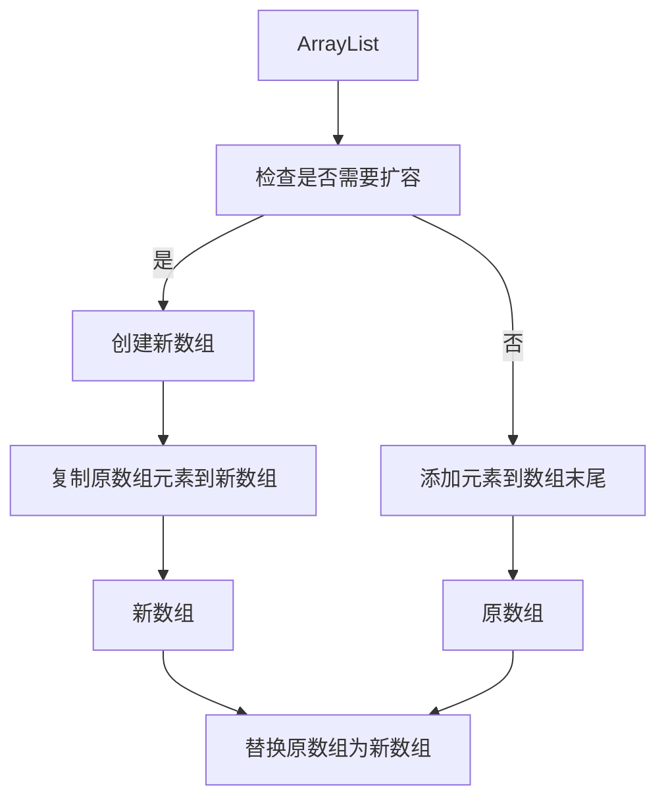

## ArrayList和LinkedList有什么区别？

- 数据结构不同  
  - ArrayList基于数组实现
  - LinkedList基于双向链表实现
- 多数情况下，ArrayList更利于查找，LinkedList更利于增删
  - 查找速率
    - ArrayList基于数组实现，get(int index)可以直接通过数组下标获取，时间复杂度是O(1) 
    - LinkedList基于链表实现，get(int index)需要遍历链表，时间复杂度是O(n)  
    - get(E element)这种查找，两种集合都需要遍历，时间复杂度都是O(n)  
  - 增删速率
    - ArrayList增删如果是数组末尾的位置，直接插入或者删除就可以了，但是如果插入中间的位置，就需要把插入位置后的元素都向前或者向后移动，甚至还有可能触发扩容
    - 双向链表的插入和删除只需要改变前驱节点、后继节点和插入节点的指向就行了，不需要移动元素
- 是否支持随机访问  
  - ArrayList基于数组，所以它可以根据下标查找，支持随机访问  
    - 它也实现了RandmoAccess 接口，这个接口只是用来标识是否支持随机访问  
  - LinkedList基于链表，所以它没法根据序号直接获取元素，它没有实现RandmoAccess 接口，标记不支持随机访问  
- 内存占用  
  - ArrayList基于数组，是一块连续的内存空间  
    - ArrayList是预先定义好的数组，可能会有空的内存空间，存在一定空间浪费  
  - LinkedList基于链表，内存空间不连续，它们在空间占用上都有一些额外的消耗  
    - LinkedList每个节点，需要存储前驱和后继，所以每个节点会占用更多的空间  

## ArrayList的扩容机制了解吗？



1. 数组满了，再插入时，触发扩容

2. 计算新数组容量，容量大小为原数组1.5倍

   ```java
       private int newCapacity(int minCapacity) {
           // overflow-conscious code
           int oldCapacity = elementData.length;
           int newCapacity = oldCapacity + (oldCapacity >> 1);
           if (newCapacity - minCapacity <= 0) {
               if (elementData == DEFAULTCAPACITY_EMPTY_ELEMENTDATA)
                   return Math.max(DEFAULT_CAPACITY, minCapacity);
               if (minCapacity < 0) // overflow
                   throw new OutOfMemoryError();
               return minCapacity;
           }
           return (newCapacity - MAX_ARRAY_SIZE <= 0)
               ? newCapacity
               : hugeCapacity(minCapacity);
       }
   ```

   -  int newCapacity = oldCapacity + (oldCapacity >> 1);

3. 复制原数组元素到新数组

## ArrayList怎么序列化的知道吗？ 为什么用transient修饰数组？  

- ArrayList的序列化不太一样，它使用 transient 修饰存储元素的 elementData 的数组
- transient 关键字的作用是让被修饰的成员属性不被序列化

### 为什么最ArrayList不直接序列化元素数组呢？  

- 出于效率的考虑
  - 数组可能长度100，但实际只用了50，剩下的50不用其实不用序列化，这样可以提高序列化和反序列化的效率，还可以节省内存空间

### 那ArrayList怎么序列化呢 ？

- ArrayList通过两个方法readObject、writeObject自定义序列化和反序列化策略，实际直接使用两个流 ObjectOutputStream 和 ObjectInputStream 来进行序列化和反序列化  

## 快速失败(fail-fast)和安全失败(fail-safe)了解吗？  

- 快速失败（fail—fast）：快速失败是Java集合的一种错误检测机制  
  - 触发
    - 在用迭代器遍历一个集合对象时，如果线程A遍历过程中，线程B对集合对象的内容进行了修改（增加、删除、修改），则会抛出Concurrent Modification Exception  
  - 原理
    - 迭代器在遍历时直接访问集合中的内容，并且在遍历过程中使用一个modCount 变量。集合在被遍历期间如果内容发生变化，就会改变 modCount的值。每当迭代器使用hashNext()/next()遍历下一个元素之前，都会检测
      modCount变量是否为expectedmodCount值，是的话就返回遍历；否则抛出异常，终止遍历。  
  - 注意
    - 这里异常的抛出条件是检测到 modCount！=expectedmodCount 这个条件。如果集合发生变化时修改modCount值刚好又设置为了expectedmodCount值，则异常不会抛出。因此，不能依赖于这个异常是否抛出而进行并发操作的编程，这个异常只建议用于检测并发修改的bug  
  - 场景
    - java.util包下的集合类都是快速失败的，不能在多线程下发生并发修改（迭代过程中被修改），比如ArrayList 类。  
- 安全失败（fail—safe）  
  - 策略
    - 采用安全失败机制的集合容器，在遍历时不是直接在集合内容上访问的，而是先复制原有集合内容，在拷贝的集合上进行遍历  
  - 原理  
    - 由于迭代时是对原集合的拷贝进行遍历，所以在遍历过程中对原集合所作的修改并不能被迭代器检测到，所以不会触发Concurrent Modification Exception  
  - 缺点  
    - 基于拷贝内容的优点是避免了Concurrent Modification Exception，但同样地，迭代器并不能访问到修改后的内容，即：迭代器遍历的是开始遍历那一刻拿到的集合拷贝，在遍历期间原集合发生的修改迭代器是不知道的  
  - 场景  
    - java.util.concurrent包下的容器都是安全失败，可以在多线程下并发使用，并发修改，比如CopyOnWriteArrayList类  

## 实现ArrayList线程安全有哪几种方法？  

- 用Vector代替ArrayList  
  - Vector是一个线程安全的动态数组类，可以直接使用它来替代ArrayList
  - Vector的所有方法都是同步的，因此在并发环境下可以安全地进行读写操作。
  - 但它的性能很低，不推荐使用。  
- 使用Collections.synchronizedList包装ArrayList   
  - 可以使用Collections工具类的synchronizedList方法将ArrayList转换为线程安全的List
  - 该方法返回一个包装后的线程安全List，对该List的所有操作都会进行同步处理，确保线程安全  
- 使用CopyOnWriteArrayList代替ArrayList  
  - CopyOnWriteArrayList是一种线程安全的并发List
  - 它通过在修改时创建副本来实现并发访问
  - 由于读操作不需要加锁，因此在读多写少的场景中，CopyOnWriteArrayList具有较高的性能  
- 使用同步机制控制ArrayList的读写 
  - 在使用ArrayList时，可以通过同步机制（如使用synchronized关键字或Lock）来控制对ArrayList的读写操作，以确保线程安全  

## CopyOnWriteArrayList了解多少？  

- CopyOnWriteArrayList就是线程安全版本的ArrayList，它的名字叫 CopyOnWrite，写时复制，已经明示了它的原理
- 特点
  - 线程安全性  
    - CopyOnWriteArrayList通过创建副本的方式实现线程安全，因此可以在多线程环境下安全地进行读操作，而不需要额外的同步措施  
  - 读写分离  
    - CopyOnWriteArrayList适合在读多写少的场景中使用，因为每次写操作都会创建一个新的副本，会带来一定的内存开销。但在读操作频繁、写操作较少的情况下，可以获得较高的读取性能  
  - 迭代器的弱一致性   
    - 由于CopyOnWriteArrayList在写操作时会创建副本，因此在遍历集合时使用的迭代器可能不反映最新的修改。迭代器提供的是一个一致性视图，即迭代器创建时的集合状态  
- 工作流程
  1. 将原数组拷贝一份
  2. 写操作在副本上，加锁
  3. 读操作在原数组上，无锁
  4. 写完将元素数组指向副本
- 缺点
  - 由于CopyOnWriteArrayList在每次写操作时都会创建副本，因此适用于写操作较少、读操作频繁且对实时性要求不高的场景。如果写操作频繁或对实时性要求较高，可能会带来较高的内存开销和延迟。  
- volatile修饰原数组array，保证了可见性

#### 数据拷贝的过程中，有其它线程写入数据怎么办？  

- 阻塞呗，数据拷贝在add方法中进行，add方法有锁
