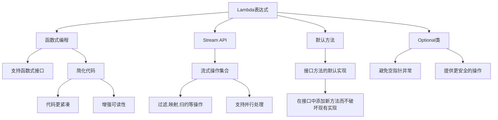
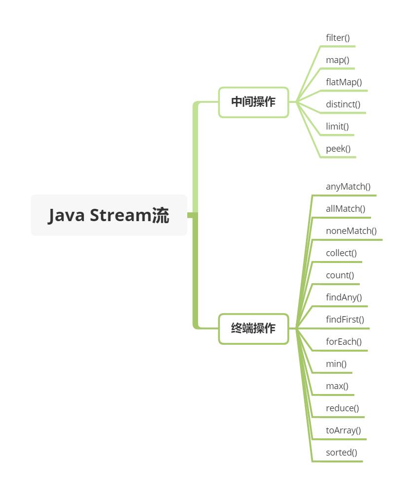

## JDK1.8都有哪些新特性？



- 接口的默认方法和静态方法
  - 在Java 8中，接口可以包含默认方法和静态方法
- Lambda 表达式和函数式接口
  - Lambda 表达式本质上是一段匿名内部类，可以传递一段代码
  - Lambda 允许把函数作为一个方法的参数（函数作为参数传递到方法中），使用 Lambda 表达式使代码更加简洁
  - 但是也不要滥用，否则会有可读性等问题
  - 《Effective Java》作者 Josh Bloch 建议使用 Lambda 表达式最好不要超过3行  
- Stream API
  - Stream API提供了一种更简洁、更易于并行处理数据集合的方式
  - 通过Stream API，我们可以对集合进行过滤、映射、排序、聚合等操作，提高了代码的可读性和简洁性  
- 新的日期和时间API
  - Java 8引入了新的日期和时间API（java.time包），提供了更好的日期和时间处理方式
  - 新的API解决了旧的Date和Calendar类在处理日期和时间时的一些问题，并提供了更多的功能和灵活性
- Optional 类
  - Optional类是一个容器类，用于表示一个值可能存在或不存在
  - 通过Optional类，我们可以避免空指针异常，并更好地处理可能为空的值

## Lambda 表达式了解多少？

- Lambda 表达式本质上是一段匿名内部类，也可以是一段可以传递的代码
- 只有函数式接口（FunctionalInterface）才能缩写成 Lambda 表示式

## Java8有哪些内置函数式接口？

- 添加了 @FunctionalInterface 注解的接口
  - Comparator
  - Runnable
  - Callable
  - Predicate
  - Function
  - Supplier
  - Consumer

## Optional了解吗？

- Optional 是用于防范 NullPointerException

- 可以将 Optional 看做是包装对象（可能是 null , 也有可能非 null ）的容器

  - 当我们定义了 一个方法，这个方法返回的对象可能是空，也有可能非空的时候，我们就可以考虑用 Optional 来包装它，这也是在 Java 8 被推荐使用的做法

    ```java
    Optional<String> optional = Optional.of("bam");
            optional.isPresent(); // true
            optional.get(); // "bam"
            optional.orElse("fallback"); // "bam"
            optional.ifPresent((s) -> System.out.println(s.charAt(0)));
    ```

## Stream 流用过吗？

- Stream 流，简单来说，使用 java.util.Stream 对一个包含一个或多个元素的集合做各种操作

- 这些操作可能是 中间操作 亦或是 终端操作

- 终端操作会返回一个结果，而中间操作会返回一个 Stream 流

- Stream流一般用于集合，Stream的常用操作有

  ```java
          List<String> stringCollection = new ArrayList<>();
          stringCollection.add("ddd2");
          stringCollection.add("aaa2");
          stringCollection.add("bbb1");
          stringCollection.add("aaa1");
          stringCollection.add("bbb3");
          stringCollection.add("ccc");
          stringCollection.add("bbb2");
          stringCollection.add("ddd1");
  ```

  - Filter 过滤

    ```java
    stringCollection
                    .stream()
                    .filter((s) -> s.startsWith("a"))
                    .forEach(System.out::println);
    ```

  - Sorted 排序

    ```java
            stringCollection
                    .stream()
                    .sorted()
                    .filter((s) -> s.startsWith("a"))
                    .forEach(System.out::println);
    ```

  - Map 转换

    ```java
            stringCollection
                    .stream()
                    .map(String::toUpperCase)
                    .sorted((a, b) -> b.compareTo(a))
                    .forEach(System.out::println);
    ```

  - Match 匹配

    ```java
    // 验证 list 中 string 是否有以 a 开头的, 匹配到第一个，即返回 true
    boolean anyStartsWithA =
            stringCollection
                    .stream()
                    .anyMatch((s) -> s.startsWith("a"))
    boolean allStartsWithA =
            stringCollection
                    .stream()
                    .allMatch((s) -> s.startsWith("a"));
    System.out.println(allStartsWithA); // false
    // 验证 list 中 string 是否都不是以 z 开头的,
    boolean noneStartsWithZ =
            stringCollection
                    .stream()
                    .noneMatch((s) -> s.startsWith("z"))    
    ```

  - Count 计数

    ```java
    // 先对 list 中字符串开头为 b 进行过滤，让后统计数量
    long startsWithB =
            stringCollection
                    .stream()
                    .filter((s) -> s.startsWith("b"))
                    .count();
    ```

    - count 是一个终端操作，它能够统计 stream 流中的元素总数，返回值是 long类型

  - Reduce归约

    ```java
    Optional<String> reduced =
                    stringCollection
                            .stream()
                            .sorted()
                            .reduce((s1, s2) -> s1 + "#" + s2);
    ```

    - Reduce 中文翻译为：减少、缩小。通过入参的 Function ，我们能够将 list归约成一个值。它的返回类型是 Optional 类型

- Stream的常用API

  
  

