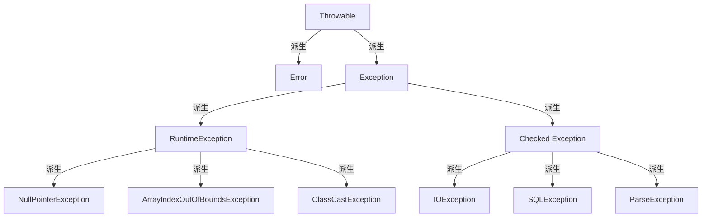
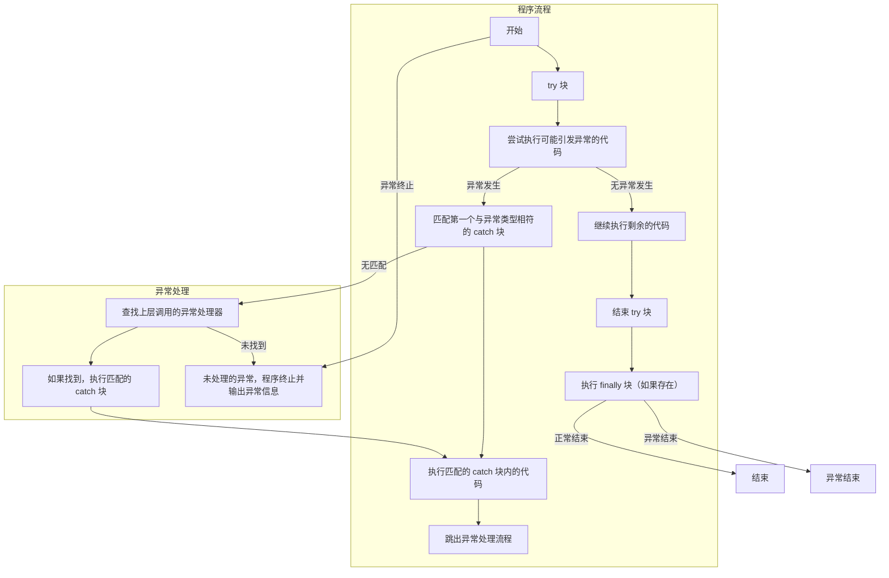

## Java 中异常层级结构?  



- Throwable
  - Error
    - 内部错误，是程序无法处理的，比如虚拟机异常
  - Exception
    - CheckedException
      - 受检异常：编译器会强制检查并要求处理的异常
    - RuntimeException
      - 运行时异常：程序运行中出现异常，比如我们熟悉的空指针、数组下标越界等等  
- Exception

## 异常的处理机制？



- 抛出异常
  - throw
  - throws
  - 系统自动抛异常
- 捕获异常
  - try catch

## finally一定会执行吗？  

可能不会执行的情况

- 程序还没有进入try语句块就因为异常导致程序终止
- 在try块中调用了System.exit()方法：System.exit()方法会终止Java虚拟机的运行，导致程序直接退出，此时finally块中的代码不会执行
- 在try块中发生了死循环或无限递归：如果try块中的代码导致了无限循环或无限递归，程序将无法继续执行，finally块中的代码也无法执行
- 在try块中发生了线程死锁：如果try块中的代码导致了线程死锁，程序将无法继续执行，finally块中的代码也无法执行


## 三道经典异常处理代码题

- 题目1：finally中正常执行（执行顺序：先finally，再catch中return）

  ```java
  public static void main(String[] args) {
      System.out.println(test());
  }
  
  public static int test() {
      try {
          return 1;
      } catch (Exception e) {
          return 2;
      } finally {
          System.out.print("3");
      }
  }
  ```

  - 执行结果：31
  - 解析：try、catch。finally 的基础用法，在 return 前会先执行 finally 语句块，所以是先输出 finally 里的 3，再输出 return 的 1

- 题目2：finally中return（按finally中return的为准）

  ```java
  public static void main(String[] args) {
      System.out.println(test());
  }
  
  public static int test() {
      try {
          return 2;
      } finally {
          return 3;
      }
  }
  ```

  - 执行结果：3
  - 解析：try 返回前先执行 finally，结果 finally 里不按套路出牌，直接 return 了，自然也就走不到 try 里面的 return 了

- 题目3：finally中修改try中return的值（修改是无效的）

  ```java
  public static void main(String[] args) {
      System.out.println(test());
  }
  
  public static int test() {
      int i = 0;
      try {
          i = 2;
          return i;
      } finally {
          i = 3;
      }
  }
  ```

  - 执行结果：2
  - 在执行 finally 之前，JVM 会先将 i 的结果暂存起来，然后 finally 执行完毕后，会返回之前暂存的结果，而不是返回 i，所以即使 i 已经被修改为 3，最终返回的还是之前暂存起来的结果 2

