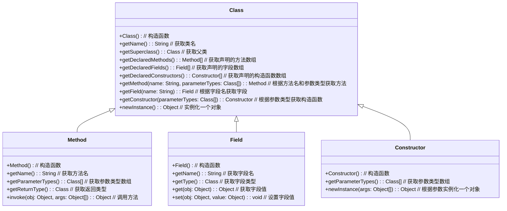

## 什么是反射？

- new  对象
  - 创建对象实例的方式
  - 在编译时候就确定了类型信息
- 反射
  - 在运行时动态地获取类信息、创建类实例、调用类方法这时候就要用到反射
  - 通过反射你可以获取任意一个类的所有属性和方法，你还可以调用这些方法和属性
- 反射相关类
  - Class
  - Method
  - Field
  - Constructor

## 反射的应用场景？

- Spring/Spring Boot、MyBatis 等等框架中都大量使用了反射机制
- Spring里的很多注解 ，它真正的功能实现就是利用反射
  - @Component
  - @Value

## 反射的实现原理

- 基于Java虚拟机（JVM）的类加载机制和类对象模型
- 在Java中，每个类都有一个对应的Class对象，该对象包含了类的名称、字段、方法等信息
- 通过反射，我们可以获取到Class对象信息，并在运行时动态地操作类和对象
