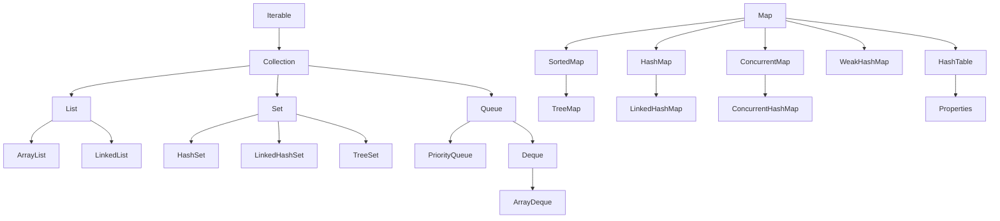

## Java中实现Map接口的有哪些类？  

- HashMap：基于哈希表实现的Map，无序，允许键和值为null。

- LinkedHashMap：基于哈希表和双向链表实现的Map，保持插入顺序或访问顺序。

- TreeMap：基于红黑树实现的有序Map，按照键的自然顺序或自定义顺序进行排序。

- Hashtable：基于哈希表实现的Map，线程安全，不允许键和值为null。

- ConcurrentHashMap：基于哈希表实现的线程安全的Map，支持高并发操作

## 遍历HashMap的几种方法？  

- 使用迭代器遍历
- 使用for-each循环遍历键集合或值集合
- 使用for-each循环遍历键值对
- 使用Java 8的Stream API遍历
