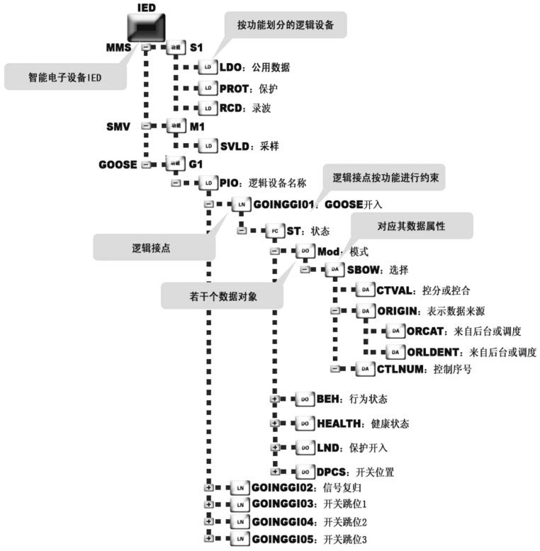
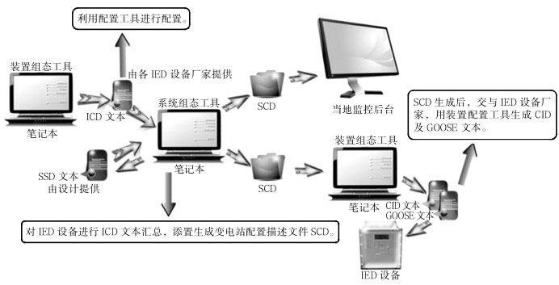

> 进度：

# 第1章 配置基础

## 1.1 概述

### 1.1.1 掌握智能变电站调试主动权

掌握智能变电站调试主动权理应从四个方面考虑，其内容应该包括如下四个方面。

- 掌握智能变电站基础理论及概念

  - 熟读IEC61850标准以及在其标准基础下形成的智能变电站“三层两网”的组网方式

  - 智能变电站核心配置文本，即变电站能力描述文本（Substation Configuration Description，SCD）

  - 智能变电站常用光纤连接器涵盖的种类
  - 智能变电站电子式互感器原理、采样标准、极性校验方法
  - 合并单元、智能终端的校验方法以及交换机虚拟局域网（Virtual LocalArea Network，VLAN）的划分

- 对于综自变电站保护逻辑回路概念的认知度

  - 110kV等级智能变电站
    - 清楚主变压器相关二次回路、各分支电流回路、电压回路、各个间隔所涉及的位置开入回路、失灵保护回路以及断路器机构控制原理回路等
  - 220kV及以上等级智能变电站
    - 除上述涉及内容外，还应对电压切换回路，包括保护电压切换及计量电压切换等、失灵联跳回路，包括主变压器失灵联跳、母差保护失灵联跳、间隔失灵启动开入及跳闸方式等、母差保护回路，包括母差保护启动开入及跳闸方式等有深入了解

- 掌握智能变电站报文分析能力

  - MMS报文
  - GOOSE报文
  - 采样值（Sampling Value，SV）报文

  从而做到独立分析或解决智能变电站典型故障问题。

- 掌握智能变电站配置技术

### 1.1.2 学习配置技术的意义

- 学习和掌握配置技术有利于IED出厂系统联调及变电站现场调试

- 学习和掌握配置技术有利于了解IEC61850标准模型文件的模型构成
  - 在工程建设前期便于审核和验证智能变电站虚端子回路，在工程建设期间便于调试和传动智能电子设备，即保护装置

- 学习配置技术有利于维护设备调试成果，约束厂家擅动装置的行为

## 1.2 配置技术基础

### 1.2.1 变电站通信网络和系统标准IEC61850

IEC61850系列标准的全称为变电站通信网络和系统标准（Communication Networks and Systems in Substations），以下简称IEC61850或IEC61850标准。它规范了变电站内智能电子设备，即IED之间的通信行为和相关的系统要求。

#### IEC61850标准规约的产生背景及新标准的优点

- 通信规约的多样化并不利于智能变电站的发展，因此需要一个更加完善的通信平台

#### IEC61850模型中配置技术相关缩略语

1）IED：Intelligent Electronic Device智能电子设备；
2）MMS：Manufacturing Message Specification制造报文规范；
3）GOOSE：Generic Object Oriented Substation Events面向通用对象的变电站事件；
4）SV：Sampled Value采样值；
5）LD：Logical Device逻辑设备；
6）LN：Logical Node逻辑节点；
7）PD：Physical Device物理设备；
8）FC：Functional Constraint功能约束；
9）FCDA：Functionally Constrained Data Attribute功能约束数据属性；
10）CDC：Common Data Cass公共数据类；
11）DO：Data Object数据对象；
12）DA：Data Attribute数据属性；
13）ACC：Accelerate加速；
14）BF：Breaker failure断路器失灵；
15）BRCB：Buffered Report Control Block有缓存报告控制块；
16）CID：Configured IED Description IED实例配置文件；
17）CT：Current transformer电流互感器；
18）Dev：Device设备；
19）Err：Error错误；
20）Fst：First第一个；
21）ICD：IED Capability Description IED能力描述文件；
22）Long：Long长期的；
23）Pers Persist，Persistent：持续性的；
24）Pmt：Permit，Permitted许可；
25）SCD：Substation Configuration Description全站系统配置文件；
26）Sig：Signal信号；
27）SSD：System Specification Description系统规格文件；
28）Strp Strap压板；
29）URCB：Unbuffered Report Control Block无缓存报告控制块；
30）UV：Under Voltage欠电压。

#### IEC61850装置数据模型的层次结构

IEC61850装置数据模型的层次结构如图1-1所示

图1-1表明，物理设备映射成为IED，然后将各个功能分解到逻辑节点，组织成一个或者多个逻辑设备。每个功能的保护数据映射到数据对象，并且根据功能约束进行拆分并映射到若干个数据属性

#### IEC61850标准规约的三大服务

- 了解IEC61850规约，即是建立配置基础
- 站在用户的角度，IEC61850提供给用户三大服务：制造报文规范服务MMS、面向通用对象的变电站事件服务GOOSE以及采样服务SV

##### 制造报文规范服务MMS功能

- MMS具备信号上送功能、测量上送功能、控制功能以及故障报告功能。

  - 信号上送功能，包括开入、事件、报警等信号类数据的上送功能通过有缓冲报告控制块，即BRCB来实现，映射到MMS的读写和报告服务。
  - 测量上送功能：遥测、保护测量类数据的上送功能通过无缓冲报告控制块，即URCB来实现，映射到MMS的读写和报告服务。
  - 控制功能，控制功能又分定值控制功能和遥控、遥调等控制功能。
  - 定值控制功能，通过定值控制块，即SGCB来实现选择定值区进行召唤、修改、定值区切换。映射到MMS的读写服务。
  - 遥控、遥调等控制功能，通过IEC61850的控制相关数据结构实现，映射到MMS的读写和报告服务。
  - 故障报告功能，包括通过RDRE逻辑节点实现，映射到MMS的报告和文件操作服务。

  > 总之，IEC61850中的MMS服务，包括了整个智能变电站遥信、遥测、遥控以及故障分析等领域，是站控层信息交换的基础体现方式和平台，这些信息也是调度掌握智能变电站运行情况的重要依据和手段。

##### 面向通用对象的变电站事件服务GOOSE功能

- GOOSE即面向通用对象的变电站事件，它是以太网多播报文传输为基础，代替传统的IED设备之间硬接线的通信方式，为逻辑节点间的通信提供了快速且高效可靠的方法。
- GOOSE服务支持由数据集组成的公共数据的交换，主要用于保护装置跳、合闸命令，测控装置的遥控命令，断路器位置和隔离开关位置、压力等以及间隔层联锁信息等实时性要求高的数据传输。
- GOOSE的功能主要体现在GOOSE的收发机制、GOOSE的报警功能和GOOSE的检修功能
- GOOSE收发机制，为了保证GOOSE服务的实时性，GOOSE报文不经过网络层协议，直接在以太网链路层上传输，并且采用带优先级的以太网报文转发方式
- 为了保证GOOSE服务的可靠性，GOOSE报文采用ASN.1语法编码后，发送采用心跳报文和变位报文快速重发相结合的机制
- GOOSE接收可以根据GOOSE报文中的允许生存时间（Time Allow toLive，TAL）来检测链路中断。GOOSE数据接收机制可以分为单帧接收和双帧接收两种
- GOOSE的报警功能，GOOSE对收发过程中产生的异常情况进行告警，主要包括：GOOSE A网/B网断链告警，GOOSE配置不一致告警，GOOSE信号异常告警。
- GOOSE的检修功能，保证检修的装置或设备不会影响到正常运行状态 的装置，提高了智能变电站装置检修的灵活性和可靠性；发送的GOOSE报文中带有测试标志，即test，它与发送端装置的检修状态对应，接收端就可以通过比较自身装置的检修状态进行相应处理。
- 当发送端和接收端置检修状态一致时，装置对接收到的GOOSE数据进行正常处理。当发送端和接收端置检修状态不一致时，装置可以对接收到的GOOSE数据做相应处理
- 总而言之，IEC61850中的GOOSE服务，包含整个数字站的跳闸出口，开关量以及故障分析等领域。

##### 采样服务SV功能

采样值的传输所交换的信息是基于发布/订阅机制。在发送侧发布方将值写入发送缓冲区，在接收侧订阅方从当地缓冲区读值。在值上加上时标，订户可以校验是否及时刷新，通信系统负责刷新订阅用户的当地缓冲区。

SV是针对智能变电站数据采样的一项标准服务，详见IEC61850规范标准第9章相关章节。SV同样具备检修功能。

#### 基于IEC61850规范标准下的IED设备内部结构功能组成

IEC61850提供了如此之大的服务体系平台，作为体系中的一个成员，IED设备自然也需要具备与相应服务进行对外交流的功能，如信息互动等。

现将IED装置内部进行分解，对其进行分析，如图1-2所示。

图1-2表示IED设备所具备的功能，这里把IED映射为一个数字保护装置的内部结构，保护装置需要完成数据传输上送、数据采样、逻辑判断执行等任务。因此具备了三个功能：S1映射为MMS功能，M1指SV采样功能，G1则映射为GOOSE功能。

需要清楚的是，不是所有IED设备都必须同时具备三大服务功能，比如合并单元属于过程层设备，因此只需要实现M1和G1功能。

需要清楚的是，不是所有IED设备都必须同时具备三大服务功能，比如合并单元属于过程层设备，因此只需要实现M1和G1功能。

图1-2的物理设备即为IED设备，直接将其映射为保护装置或测控装置，每一个装置按照其功能可分为采样、跳闸、遥信、控制等，保护装置要起到保护系统的作用，是通过逻辑功能来实现的，每一个功能的实现都要通过一个或多个逻辑设备组成，自然就会对应一个或多个逻辑节点，逻辑节点是逻辑设备的最小功能单位,在这些逻辑节点中，通过功能约束，每一个逻辑节点都会有很多数据对象对逻辑节点进行解释，而每个数据对象就会对应自己的数据属性。

### 1.2.2 配置对象和配置文本

配置所要针对的对象，特指智能变电站IED装置，包括保护装置、测控装置等。就是要对各类装置进行调取（上传）、下载（下传）相关配置文本的过程。其中包括已经建立通信参数和网络概念的CID文本，包括各个保护逻辑实现、断路器或隔离开关（虚端子）位置开入所使用的GOOSE文本，包括站内各类电流、电压采样传输所用SV文本。

智能变电站配置所涉及的主要文本有六个，按照配置过程排序如下。

（1）IED能力描述文件（IED Capability Description, ICD），以下简称ICD。该文件描述了IED提供的基本数据模型及服务，但不包含IED实例名称和通信参数。ICD文件应包含模型自描述信息，还应包含版本修改信息，明确描述修改时间、修改版本号等内容。

（2）系统规范描述文件（System Specification Description,SSD），以下简称SSD，全站唯一。该文件描述了变电站一次系统结构以及相关联的逻辑节点，最终包含在SCD文件中。

（3）全站配置描述文件SCD，全站唯一。该文件描述了所有IED的实例配置和通信参数、IED之间的通信配置以及变电站一次系统结构，由系统集成厂商完成。SCD文件应包含版本修改信息，明确描述修改时间、修改版本号等内容。

（4）IED实例配置描述文件（Configured IED Description, CID），以下简称CID。对应其ICD每个IED设备有一个CID。由装置厂商根据SCD文件中与特定的IED的相关配置生成。

（5）用于过程层各个保护逻辑信号传输、断路器及隔离开关位置传输的GOOSE配置文本。

（6）用于实现各个IED采样的SV配置文本。

### 1.2.3 配置文本关系

各个配置文本之间的关系如图1-3所示。

