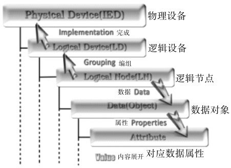

> 进度：

# 第1章 配置基础

## 1.1 概述

### 1.1.1 掌握智能变电站调试主动权

掌握智能变电站调试主动权理应从四个方面考虑，其内容应该包括如下四个方面。

- 掌握智能变电站基础理论及概念

  - 熟读IEC61850标准以及在其标准基础下形成的智能变电站“三层两网”的组网方式

  - 智能变电站核心配置文本，即变电站能力描述文本（Substation Configuration Description，SCD）

  - 智能变电站常用光纤连接器涵盖的种类
  - 智能变电站电子式互感器原理、采样标准、极性校验方法
  - 合并单元、智能终端的校验方法以及交换机虚拟局域网（Virtual LocalArea Network，VLAN）的划分

- 对于综自变电站保护逻辑回路概念的认知度

  - 110kV等级智能变电站
    - 清楚主变压器相关二次回路、各分支电流回路、电压回路、各个间隔所涉及的位置开入回路、失灵保护回路以及断路器机构控制原理回路等
  - 220kV及以上等级智能变电站
    - 除上述涉及内容外，还应对电压切换回路，包括保护电压切换及计量电压切换等、失灵联跳回路，包括主变压器失灵联跳、母差保护失灵联跳、间隔失灵启动开入及跳闸方式等、母差保护回路，包括母差保护启动开入及跳闸方式等有深入了解

- 掌握智能变电站报文分析能力

  - MMS报文
  - GOOSE报文
  - 采样值（Sampling Value，SV）报文

  从而做到独立分析或解决智能变电站典型故障问题。

- 掌握智能变电站配置技术

### 1.1.2 学习配置技术的意义

- 学习和掌握配置技术有利于IED出厂系统联调及变电站现场调试

- 学习和掌握配置技术有利于了解IEC61850标准模型文件的模型构成
  - 在工程建设前期便于审核和验证智能变电站虚端子回路，在工程建设期间便于调试和传动智能电子设备，即保护装置

- 学习配置技术有利于维护设备调试成果，约束厂家擅动装置的行为

## 1.2 配置技术基础

### 1.2.1 变电站通信网络和系统标准IEC61850

IEC61850系列标准的全称为变电站通信网络和系统标准（Communication Networks and Systems in Substations），以下简称IEC61850或IEC61850标准。它规范了变电站内智能电子设备，即IED之间的通信行为和相关的系统要求。

#### IEC61850标准规约的产生背景及新标准的优点

- 通信规约的多样化并不利于智能变电站的发展，因此需要一个更加完善的通信平台

#### IEC61850模型中配置技术相关缩略语

1）IED：Intelligent Electronic Device智能电子设备；
2）MMS：Manufacturing Message Specification制造报文规范；
3）GOOSE：Generic Object Oriented Substation Events面向通用对象的变电站事件；
4）SV：Sampled Value采样值；
5）LD：Logical Device逻辑设备；
6）LN：Logical Node逻辑节点；
7）PD：Physical Device物理设备；
8）FC：Functional Constraint功能约束；
9）FCDA：Functionally Constrained Data Attribute功能约束数据属性；
10）CDC：Common Data Cass公共数据类；
11）DO：Data Object数据对象；
12）DA：Data Attribute数据属性；
13）ACC：Accelerate加速；
14）BF：Breaker failure断路器失灵；
15）BRCB：Buffered Report Control Block有缓存报告控制块；
16）CID：Configured IED Description IED实例配置文件；
17）CT：Current transformer电流互感器；
18）Dev：Device设备；
19）Err：Error错误；
20）Fst：First第一个；
21）ICD：IED Capability Description IED能力描述文件；
22）Long：Long长期的；
23）Pers Persist，Persistent：持续性的；
24）Pmt：Permit，Permitted许可；
25）SCD：Substation Configuration Description全站系统配置文件；
26）Sig：Signal信号；
27）SSD：System Specification Description系统规格文件；
28）Strp Strap压板；
29）URCB：Unbuffered Report Control Block无缓存报告控制块；
30）UV：Under Voltage欠电压。

#### IEC61850装置数据模型的层次结构

IEC61850装置数据模型的层次结构如图1-1所示

图1-1表明，物理设备映射成为IED，然后将各个功能分解到逻辑节点，组织成一个或者多个逻辑设备。每个功能的保护数据映射到数据对象，并且根据功能约束进行拆分并映射到若干个数据属性

#### IEC61850标准规约的三大服务

- 了解IEC61850规约，即是建立配置基础
- 站在用户的角度，IEC61850提供给用户三大服务：制造报文规范服务MMS、面向通用对象的变电站事件服务GOOSE以及采样服务SV

##### 制造报文规范服务MMS功能

- MMS具备信号上送功能、测量上送功能、控制功能以及故障报告功能。

  - 信号上送功能，包括开入、事件、报警等信号类数据的上送功能通过有缓冲报告控制块，即BRCB来实现，映射到MMS的读写和报告服务。
  - 测量上送功能：遥测、保护测量类数据的上送功能通过无缓冲报告控制块，即URCB来实现，映射到MMS的读写和报告服务。
  - 控制功能，控制功能又分定值控制功能和遥控、遥调等控制功能。
  - 定值控制功能，通过定值控制块，即SGCB来实现选择定值区进行召唤、修改、定值区切换。映射到MMS的读写服务。
  - 遥控、遥调等控制功能，通过IEC61850的控制相关数据结构实现，映射到MMS的读写和报告服务。
  - 故障报告功能，包括通过RDRE逻辑节点实现，映射到MMS的报告和文件操作服务。

  > 总之，IEC61850中的MMS服务，包括了整个智能变电站遥信、遥测、遥控以及故障分析等领域，是站控层信息交换的基础体现方式和平台，这些信息也是调度掌握智能变电站运行情况的重要依据和手段。

##### 面向通用对象的变电站事件服务GOOSE功能
