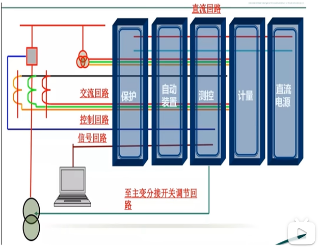
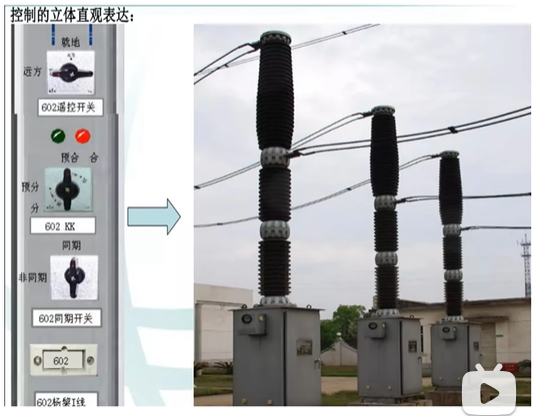
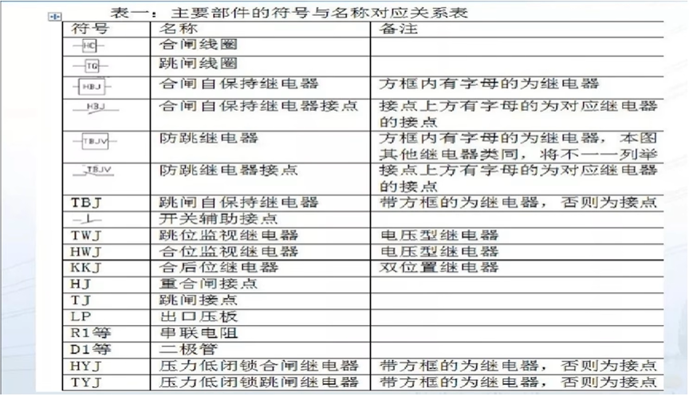
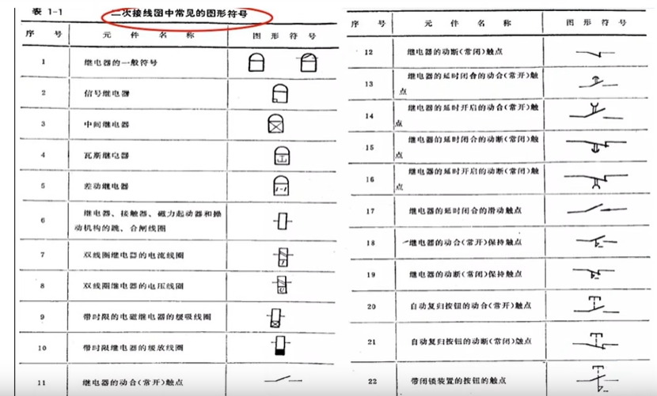
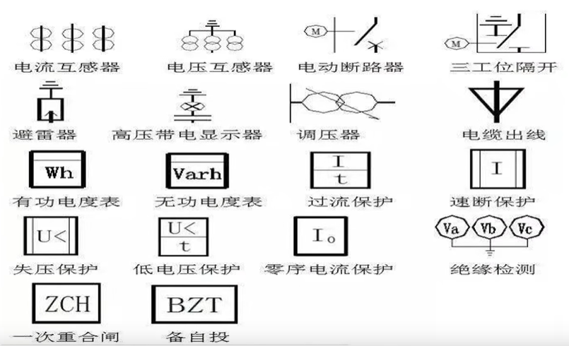
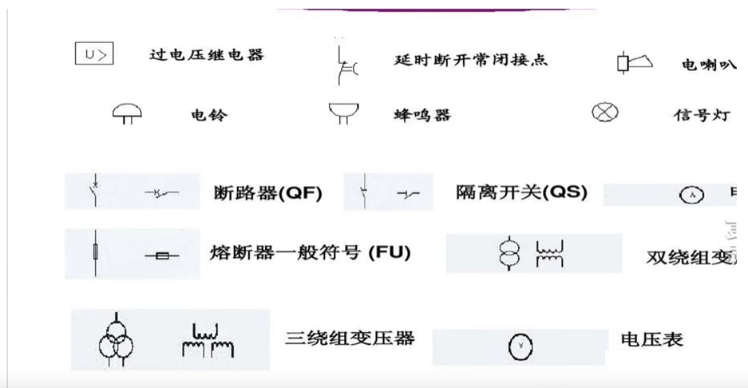
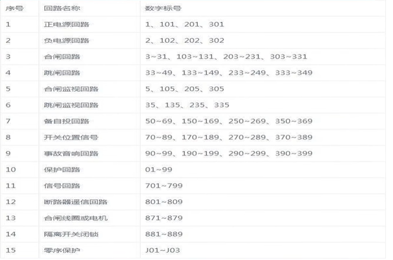
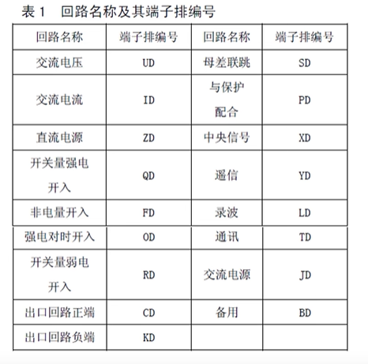
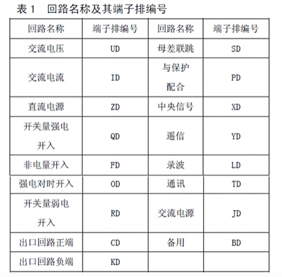
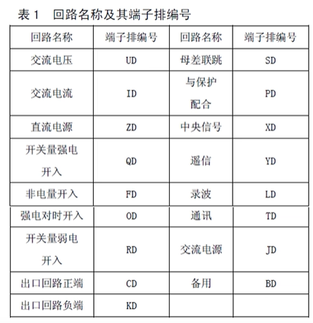

<iframe src="//player.bilibili.com/player.html?isOutside=true&aid=295480823&bvid=BV1gF411v7QY&cid=476084089&p=1" width="800" height="450" scrolling="no" border="0" frameborder="no" framespacing="0" allowfullscreen="true"></iframe>

# 二次回路的基本概念
## 1.1二次回路的基本概念
### 1.1.1一次二次设备的概念
一次设备：电力系统中直接参与发输变配电的电气设备，如变压器、输电线路、断路器、隔离开关、互感器、母线等等，由这些设备构成的电路就称为一次接线。
二次设备：二次设备是指对一次设备进行控制、调节、监视、保护、检测的设备，含有继电保护装置、综自系统、安自系统、故障录波、保信子站等等。
### 1.1.2二次回路的概念
二次回路主要是指对一次设备的工况进行监测、控制、调节、保护的二次设备，按照一定的要求连接在一起构成电路，称之为二次回路。描述二次回路的图纸称为二次回路图。
### 1.1.3二次回路的分类

二次回路主要包括二次设备的直流回路控制回路、信号回路、测量回路、调节回路、操作电源系统。
二次设备的控制和电气量的测量回路是变电站二次系统的重要部分。
二次回路的类别：按其作用、控制回路特点及性质进行分类可分为交流回信号回路路和直流回路；
交流回路又可分为交流电流回路和交流电压回路。
直流回路又可分为控制回路（也叫操至主变分接开关调节回路作回路）、信号回路及逻辑回路（保护装置内部及保护装置相互间配合回路）等；

### 1.1.4二次回路的重要性

一次设备和二次设备构成整体的电力系统，只有两者都处于良好运行状态才能保证电力系统的安全，所以继电保护从业人员必须熟悉各种二次回路的基本原理，充分理解回路的用途，能正确读懂二次回路，才能保证工作的正常开展。

## 1.2二次回路的分类

二次回路的概念

二次回路主要包括二次设备的控制回路、信号回路、测量回路、调节回路、电源系统、继电保护和自动装置回路。二次设备的控制和电气量的测量回路是变电站二次系统的重要部分。

### 1.2.1控制回路

是由控制开关和控制对象（断路器、隔离开关）的传送机构及执行（或操作）机构组成的。其作用是对开关设备进行“跳”、“合"闸操作。

(1）按自动化程度分：手动控制和自动控制；

(2）按控制距离分：就地控制和远方控制；

(3）按控制方式分：分散控制和集中控制；

(5）按操作电源电压和电流的大小分：强电控制预合和弱电控制；

### 1.2.2信号回路

信号回路：是由信号发送机构、传送机构和信号器具构成的。

其作用是反应一、二次设备的工作状态。

信号的种类及对其要求：

按信号的性质及用途进行分类，变电站的电气信号可分为：

1. 事故信号：一次设备故障，断路器跳闸；
2. 预告信号：一次设备运行参数越限或二次设备异常；
3. 位置及状态指示信号：一次设备位置、二次设备动作信号等
4. 其它信号：消防等

### 1.2.3测量回路

测量回路是由各种测量仪表及其相关回路组成。

其作用是指示或记录一次设备的运行参数，以便运行人员掌握一次设备运行情况。

变电站的测量是靠电压、电流互感器来实现的。互感器是一次回路和二次回路之间的中间设备，它们将一次高电压、大电流转化为二次低压、小电流，传送给测量仪表、远动和自动化装置，以便检测电力系统电压和电流的变化情况。同时实现了一次回路与二次回路的电气隔离，以保证二次设备和人身安全。

### 1.2.4调节回路

调节回路是指调节型自动装置。它是由测量机构、传送机构、调节器和执行机构组成的。其作用是根据一次设备运行参数的变化，实时在线调节一次设备的工作状态，以满足运行要求。

### 1.2.5电源系统

由电源系统和供电网络构成的交直流电源系统。

主要作用是给控制、保护、信号等回路提供工作电源和操作电源。

### 1.2.6继电保护和自动装置回路

自动判断一次设备的运行状态，在系统发生故障或异常运行时，自动跳开断路器（切除故障）或发出异常告警信号，故障或异常消失后，快速投入断路器，恢复系统的正常运行。

## 1.3二次回路中的图形符号

### 1.3.1主要部件的符号与名称对应关系表

### 1.3.2二次接线图中常见的图形符号

## 1.4二次回路中的回路编号

### 1.4.1端子排

| 序号 | 端子排 | 意义           | 序号 | 端子排 | 意义       |
| ---- | ------ | -------------- | ---- | ------ | ---------- |
| 1    | UD     | 交流电压       | 10   | FD     | 非电量开入 |
| 2    | ID     | 交流电流       | 11   | YD     | 遥信       |
| 3    | ZD     | 直流电源       | 12   | BD     | 备用       |
| 4    | JD     | 交流电源       | 13   | TD     | 通讯       |
| 5    | CD     | 出口回路正端   | 14   | LD     | 录波       |
| 6    | KD     | 出口回路负端   | 15   | XD     | 中央信号   |
| 7    | QD     | 开关量强电开入 | 16   | SD     | 母差联跳   |
| 8    | RD     | 开关量弱电开入 | 17   | PD     | 与保护配合 |
| 9    | OD     | 强电对时开入   |      |        |            |

### 1.4.2元件保护及辅助装置标号原则

| 序号 | 装置类型                             | 装置标号 | 屏（柜）端子排标号 |
| ---- | ------------------------------------ | -------- | ------------------ |
| 1    | 变压器保护、高压电抗器保护、母线保护 | 1n       | 1D                 |
| 2    | 操作箱                               | 4n       | 4D                 |
| 3    | 变压器、高压电抗器非电量保护         | 5n       | 5D                 |
| 4    | 交流电压切换箱                       | 7n       | 7D                 |
| 5    | 母联（分段）保护                     | 8n       | 8D                 |

### 1.4.3线路保护及辅助装置标号原则

| 序号 | 装置类型                   | 装置标号 | 屏（柜）端子排标号 |
| ---- | -------------------------- | -------- | ------------------ |
| 1    | 线路保护                   | 1n       | 1D                 |
| 2    | 线路独立后备保护（可选）   | 2n       | 2D                 |
| 3    | 断路器保护（带重合闸）     | 3n       | 3D                 |
| 4    | 操作箱                     | 4n       | 4D                 |
| 5    | 交流电压切换箱             | 7n       | 7D                 |
| 6    | 过电压及远方跳闸保护       | 9n       | 9D                 |
| 7    | 短引线保护                 | 10n      | 10D                |
| 8    | 远方信号传输装置、收发信机 | 11n      | 11D                |
| 9    | 继电保护通信接口装置       | 24n      | 24D                |

### 1.4.4回路编号（todo 待确定）

| 序号 | 回路名称         | 编号         | 作用   |
| ---- | ---------------- | ------------ | ------ |
| 1    | 电流回路（流互） | A411B411C411 | 计量   |
| 2    | A421B421C421     | 测量         |        |
| 3    | A431B431C431     | 保护         |        |
| 4    | 电压回路（压互） | A630B630C630 | 母电压 |
| 5    | A640B640C640     | Ⅱ母电压      |        |
| 6    | 中性线           | N600         |        |
| 7    | 零序             | L790~799     |        |
| 8    | 绝缘监察         | 700          |        |

## 1.5端子排编号及设计说明（一）交流电压、交流电流输入

变电站系统规划已逐步规范，但目前电气二次系统还无统一的标准要求，在工程进度大大缩短的情况下，二次系统设计是耽误工程进度的原因之一。进行二次系统标准化设计，简化设计回路，总结经验优化完善现有屏柜端子排编号，对减轻继电保护工作人员的工作量，提高工作效率，具有非常重要的意义。屏柜端子排标准化设计是规范电网继电保护配置和工程的重点，为了便于继电保护人员的现场工作，本视频对端子排编号及设计进行讲解，。

1、交流电压输入UD

空气开关ZKK两端都要接端子排，输入端接公用UD或压切后7UD，输出端接本装置电压端子排。UN不经空气开关关（N相接地系统）。主变保护交流电压端子排分侧设置（按高/中/低压侧分段）。线路PT在就地接地，母线PT在保护室接地。

2、交流电流输入ID

电流端子排列要求IA、IB、IC、IN、IA'、IB'、IC'、IN'。和电流在保护柜接地，专用的独立的CT二次回路在就地接地。主变保护交流电流端子排分侧设置。

## 1.6端子排编号及设计说明（二）开入量命名

3、直流电源输入ZD

空气开关DK输入端不要连在一起，应分别引到端子排，统一接入ZD端子

4、开关量强电开入QD

常见强电开入：保护用断路器辅助接点、非全相接点、刀闸辅助接点等；远距离跳闸接点、直跳接点、远距离起动失灵

5、非电量开入FD

非电量开入设计为独立模块较好

6、对时接点强电开入OD

用于接GPS有源强电对时接点

7、开关量弱电开入RD

不出小室的开入量可接入RD。如来自操作箱的TWJTJR、重合闸压力低及功能压板、按钮、转换开关等

8、出口（含跳合闸、起动失灵、闭锁重合闸等)

CD、KD公共端、同名出口端采用端子连线。跳合闸端子不靠一起，至少隔一个端子

## 1.6端子排编号及设计说明（三）开出量命名

9、母差联跳SD

220kV母线保护中含失灵保护时，失灵跳闸接点经SD联跳主变三侧。

10、与保护配合PD

主要用于操作箱、电压切换箱中与保护配合的输出接点

11、中央信号XD

保护跳合闸应该使用保持接点。要求按保护动作、装置异常、装置闭锁顺序排列。

12、遥信YD

应该使用不保持接点。可以通过串口传送的遥信根据用户要求决定是否引出，要求按保护动作、装置异常装置闭锁顺序排列。

13、录波LD

应该使用不保持接点。110kV及以上电压等级所有保护动作都要有接点启动录波。装置异常、装置闭锁不录波通道故障根据用户要求决定是否引出，

14、通讯回路TD

装置的通信回路应该接至端子排

15、交流电源JD

常用于打印机、照明灯、需要交流电源的外购件。建议取消照明回路；建议柜上不配打印机，但保护装置需将打印线引出。

16、备用BD每侧端子排预留适当的备用端子

## 1.7端子排编号及设计说明（四）端子排编号

以XYZDN（例：2I1D1、4Q2D2、1C2D3）表示。

X：来自装置编号。如装置编号为1n，其端子排编号应为1D。

Y：回路功能代码。交流电流回路为ID，开关量强电输入回路为QD，出口回路为CD。

Z：装置内同类回路再分段。母线保护各支路电流输入为I1D、I2D、I3D等；主变高中低压侧交流电压输入为U1D、U2D、U3D；3/2接线线路保护出口分为C1D、C2D，分别至2个断路器保护柜。

D：固定用于端子排代码。

N：端子号。

## 1.8端子排编号及设计说明（五）端子排布置原则1

端子排按功能分段后，如何布置很重要。要有一定的原则，即：端子排布置在柜后的上下右左应有规定，实现设计一面新柜的端子排时不必再讨论，根据原则就知道某段端子排的布置位置。

1、一面柜上有多个安装单位的端子排其布置应严格按单元划分，同一安装单元的不同装置的端子排应尽量排列在柜的一侧，各安装单位端子排的位置应与柜面布置相配合。

2、同一单元的端子排要统一按功能分区，如：交流输入区、开关量输入区、跳闸输出区、信号输出区等。当同一单元不止一台装置时，功能相同的端子应相邻布置，例如各装置的跳闸端子都要布置在跳闸区，但各装置自己的跳闸端子排还是要相对独立，如果不同装置跳闸接点需要并联，应该使用短接线连接。某些情况下可考虑设立公用功能区，不再按每个装置配置独立端子排（如1CD、2CD、3CD等），而要按具体情况整体配置端子排（如CD）。例如110kV主、后备保护分开配置的主变保护柜，集中按跳高、中、低压侧断路器配置跳闸回路段子排会很好，避免了很多短连线并节省端子。

3、装置端子排设计要按回路分段，且模块尽量细小，以便于拆分组合。

4、柜正面设备的布置顺序一般由左向右，因此柜背面设备的布置顺序应由右向左或先右后左，以避免走线交叉。例如：有2台装置1n(1D)、2n(2D)的端子排要布置在左右侧，1D应布置在柜后右侧，2D应布置在柜后左侧。

## 1.9端子排编号及设计说明（六）端子排布置原则2

5、交流直流回路分侧布置

交流回路端子放柜后右侧（UD、ID、JD），直流回路端子放柜后左侧（ZD、QD、OD、RD、CD、KD、XD、YD、LD、TD）。当两侧端子排长度相差较多时，可将XD、YD、LD、TD移至右侧。

6、柜后端子布置先输入后输出

输入回路端子放柜后上侧（ZD、QD、OD、RD），输出回路端子放柜后下侧（CD、KD、XD、YD、LD、TD）。

7、一侧布置

有时需把同单元交流直流端子放一侧，应上交流下直流，上输入下输出，JD、BD固定放下面。即：UD、ID、ZD、QD、OD、RD、CD、KD、XD、YD、LD、TD、JD、BD。某些柜内分段端子名不止所列，可根据回路功能参照执行。当柜内没有交流回路时，为方便现场接线，宜布置在左侧。例如光电转换柜。

8、固定的端子排优先

在不同工程中，比较固定的端子排放上面，可能变化的放下面，如母差保护柜中UD放上面，ID放下面。

9、操作箱端子排单独布置

操作箱端子较多且比较独立，按传统习惯，操作箱端子4D放柜后左侧，宜按装置成组布置。保护端子放柜后右侧，压切回路端子随保护。