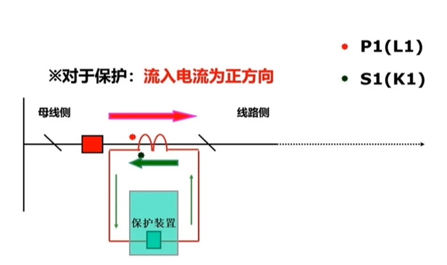

<iframe src="//player.bilibili.com/player.html?isOutside=true&aid=722966868&bvid=BV1dD4y1F7o7&cid=476439720&p=1"  width="800" height="450"  scrolling="no" border="0" frameborder="no" framespacing="0" allowfullscreen="true"></iframe>

# 交流回路

## 3.1交流回路的概念

### 3.1.1交流回路的作用

将高电压、大电流通过电压互感器PT和电流互感器CT转换为低压（100V/57.7V），小电流（5A/1A），供给保护、测量、计量使用。为什么要使用电压互感器和电流互感器将高电压、大电流转换为低电压、小电流？

电力系统中一次电压很高，电流很大，且运行的额定参数千差万别，用来对一次系统进行测量控制的仪器仪表和保护装置无法直接接入一次系统中，一次系统的高电压、大电流需要使用电压互感器、电流互感器进行转换和隔离，使二次的继电保护、自动装置和测量仪表能够安全准确的获取电气一次回路电流信息。(1）电气隔离，保证二次设备和人身安全。(2）仪器仪表和二次设备小型化，标准化，降低绝缘要求。

### 3.1.2交流回路的分类

#### 交流电流回路

二次电流回路是通过电流互感器二次线圈电缆、端子排、继电保护及仪表、电度表等二次设备构成。

以一个间隔为例：

1.从电流互感器二次线圈通过电缆接至就地端子箱的电流端子排；

2.从就地端子箱的电流端子排通过电缆接至主控室相关二次设备屏（测控屏、保护屏、电度表屏)的端子排；

#### 交流电压回路

二次电压回路是通过电压互感器二次线圈，电缆、端子排、电压小母线、继电保护及仪表、电度表等二次设备构成。

以一个间隔为例：

1.从电压互感器二次线圈通过电缆接至就地端子箱的电压端子排；

2.从就地端子箱的电压端子排通过电缆接至主控室电压并列柜(小母线)再接至各个装置；

## 3.2电流互感器的作用

### 3.2.1电流互感器的作用

电力系统的一次电流很高，电流互感器将一次的大电流转换为二次的小电流，用来对一次系统进行测量、控制和计量，电流互感器可以对一次系统的大电流进行隔离，保证二次设备和人身安全。

### 3.2.2电流互感器的特点

电流互感器是一个特殊型式的变换器，它的二次电流正比于一次电流，其二次回路的负载阻抗很小，一般仅几个欧姆，所以二次工作电压很低，当二次回路阻抗大时二次工作电压会升的很高，当二次回路开路时，电压会上升到危险的幅值，可能会损坏二次回路的绝缘，烧毁电流互感器，所以电流互感器的二次回路一定不能开路。

电流互感器一次匝数少，二次匝数多，内阻高。

### 3.2.3电流互感器说明

常用的电流互感器提供不同准确等级的二次端子，交流电流由开关或套管CT的二次端子引出，分别接入保护装置、测控装置、电能表，供给保护、测量、计量使用，二次装置根据需要选择不同准确等级的二次端子，其中：测量用0.5级，保护用P级（5P30），计量用S级（0.2S）。

## 3.3电流互感器的准确级

### 3.3.1电流互感器的准确级

电流互感器CT的准确等级指的是它的测量误差，一般有S级，P级，数字级，带S级为特殊电流互感器，数字级为测量线圈，用于测量装置，P级为保护级，用于继电保护装置。

0.2S：特殊电流互感器，用于计量。

0.2：测量线圈，额定一次电流时误差不能超过+0.2%。

5P10：P级为保护用，10倍额定电流下误差小于+5%。

## 3.4电流互感器的接线形式

电流回路中常见的电流互感器接线形式有单相接线、不完全星型接线、三相完全星型接线、和电流接线，下面对这四种接线形式进行分析。

### 3.4.1单相接线

单相接线，可以用于小电流接地系统中零序电流的测量，大电流系统中中性点零序电流的测量，只测量一相电流。

### 3.4.2不完全星型接线

不完全星型接线一般用于小电流接地系统的测量和保护回路，可以反映各类相间故障，但是不能反映B相接地短路故障，图示为10kV两相星型接线方式的电流回路图。

### 3.4.3三相星型接线

三相星型接线，一般用于大电流接地系统的测量和保护回路，可以反映任何一相、任何形式的电流变换。

### 3.4.4和电流接线

和电流接线，一般用于二分之三接线的测量和保护回路，现阶段已经不用。

## 3.5电流互感器的极性

### 3.5.1电流互感器极性的标注

CT一次的标注：P1P2(L1 L2)

CT二次的标注：S1S2(K1 K2)

### 3.5.2电流互感器的减极性标注

当一次电流从P1（L1）流入电流互感器一次绕组时，二次感应电流规定正方向从S1（K1）流出互感器的二次绕组，这种标注称为减极性标注。

### 3.5.3CT极性的重要性

CT的一二次侧都有两个引出端子，任何一侧的引出端子用错，都会使二次电流相位变换180°，影响保护装置的正常工作。

## 3.6电流互感器的极性测试方法

### 3.6.1电流互感器的极性测试方法

CT的一二次侧都有两个引出端子，任何一侧的引出端子用错，都会使二次电流相位变换180°，影响保护装置的正常工作。

### 3.6.2电流互感器的减极性标注

用1.5V-3V干电池将正极接到互感器的一次线圈L1，负极接到一次线圈L2，互感器二次侧K1接指针式万用表正极，K2接指针式万用表负极，接好后，指针式万用表打至直流电压档位，对电池正极进行合上、松开操作，合上时指针式万用表指针正偏转，松开后指针式万用表指针负偏转，说明互感器接在电池正极上的端头与接在指针式万用表正端的端头为同极性，即L1和K1为同极性，互感器为减极性，指针摆动与上述相反则为加极性。

## 3.7 10-35kV典型电流回路图分析

## 3.8 110kV线路典型电流回路图分析

