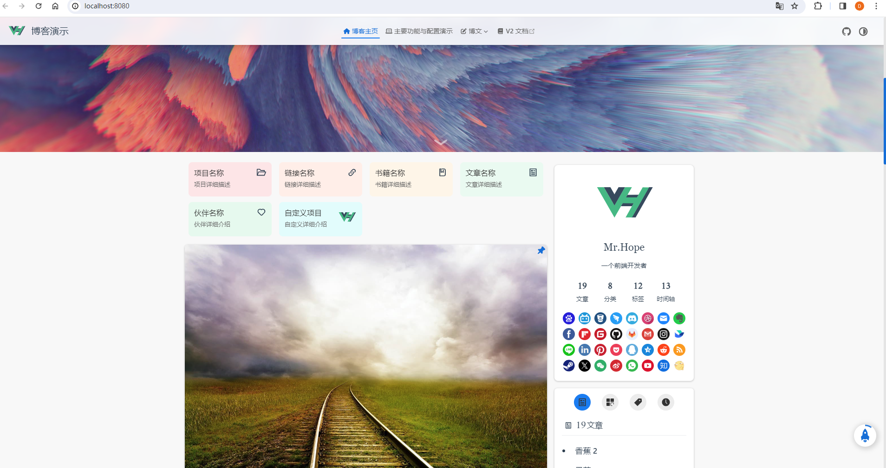
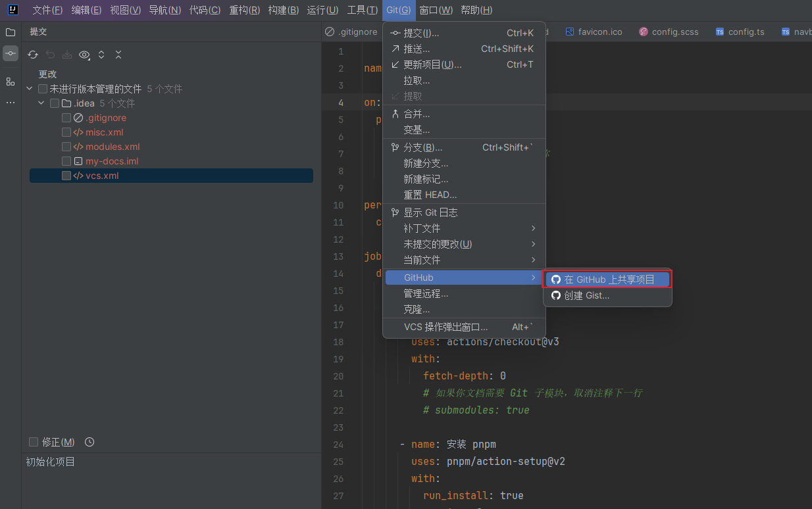
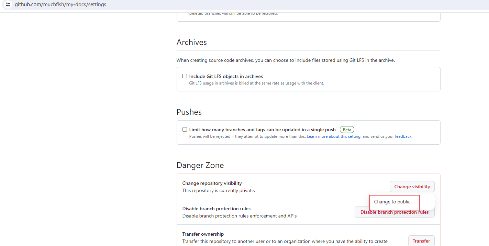
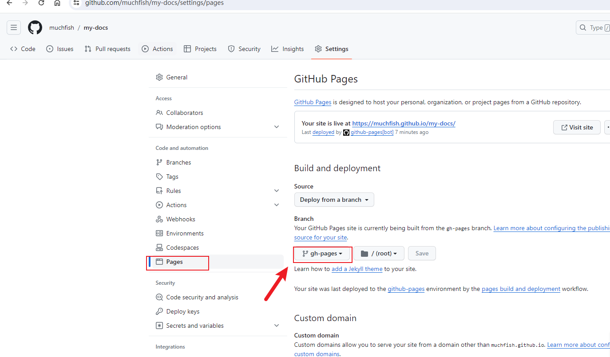
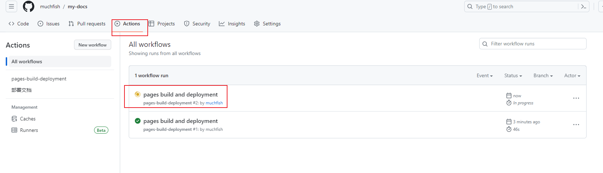
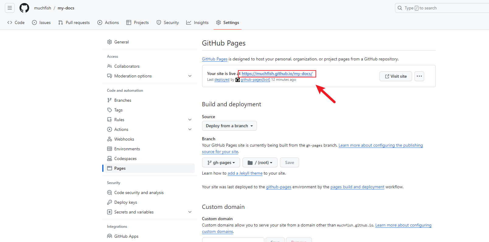

## 三分钟搭建一个博客


### 准备运行环境
1. 安装nodejs [下载地址](https://nodejs.org/en)
2. 安装pnpm [参考资料](https://blog.csdn.net/qq407995680/article/details/131593693)

### 创建项目模板
```shell
pnpm create vuepress-theme-hope my-docs
```

### 创建过程
```shell
PowerShell 7.4.0
PS C:\Users\daiwencheng\Documents\BaiduSyncdisk\ob\ob\blogs> pnpm create vuepress-theme-hope my-docs
.../Local/pnpm/store/v3/tmp/dlx-7428     |  +83 ++++++++
.../Local/pnpm/store/v3/tmp/dlx-7428     | Progress: resolved 83, reused 61, downloaded 22, added 83, done
? Select a language to display / 选择显示语言 简体中文
? 选择包管理器 pnpm
生成 package.json...
? 设置应用名称 vuepress-theme-hope-template
? 设置应用版本号 2.0.0
? 设置应用描述 A project of vuepress-theme-hope
? 设置协议 MIT
? 项目需要用到多语言么? No
? 是否需要一个自动部署文档到 GitHub Pages 的工作流？ Yes
? 你想要创建什么类型的项目？ blog
生成模板...
? 是否初始化 Git 仓库? Yes
安装依赖...
这可能需要数分钟，请耐心等待.
我们无法正确输出子进程的进度条，所以进程可能会看似未响应
 WARN  2 deprecated subdependencies found: rollup-plugin-terser@7.0.2, sourcemap-codec@1.4.8
Packages: +606
++++++++++++++++++++++++++++++++++++++++++++++++++++++++++++++++++++++++++++++++++++++++++++++++++++++++++++++++++++++
Progress: resolved 639, reused 409, downloaded 197, added 606, done
node_modules/.pnpm/esbuild@0.19.8/node_modules/esbuild: Running postinstall script, done in 825ms

devDependencies:
+ @vuepress/client 2.0.0-rc.0
+ vue 3.3.10
+ vuepress 2.0.0-rc.0
+ vuepress-theme-hope 2.0.0-rc.2

The dependency was already listed in devDependencies.
If you want to make it a prod dependency, then move it manually.

Done in 25.3s
模板已成功生成!
? 是否想要现在启动 Demo 查看? Yes
启动开发服务器...
启动成功后，请在浏览器输入给出的开发服务器地址(默认为 'localhost:8080')

> vuepress-theme-hope-template@2.0.0 docs:dev C:\Users\daiwencheng\Documents\BaiduSyncdisk\ob\ob\blogs\my-docs
> vuepress dev src


  vite v5.0.6 dev server running at:

  ➜  Local:   http://localhost:8080/
  ➜  Network: http://10.246.84.128:8080/


```
### 访问
打开http://localhost:8080/ 访问
### 效果



### 项目启动命令
- 需要先进入项目目录 my-docs
```shell
npm run docs:dev
```


## 发布到github
### 修改[deploy-docs.yml](../../.github/workflows/deploy-docs.yml)
```yaml
on:
  push:
    branches:
      # 确保这是你正在使用的分支名称
      - master
```
### 修改[config.ts](../.vuepress/config.ts)
```ts
export default defineUserConfig({
    base: "/my-docs/",

    lang: "zh-CN",
    title: "博客演示",
    description: "vuepress-theme-hope 的博客演示",

    theme,

    // Enable it with pwa
    // shouldPrefetch: false,
});
```
### 共享项目到GitHub

### 从master新建分支gh-pages,推送新分支到github
### GitHub上开源
1. 打开仓库my-docs
2. 打开Settings
3. 底部设置Change visibility 为change to public

### 配置Github Pages
1. 打开仓库my-docs的Settings项,选中侧边栏pages,配置部署分支为gh-pages,点击save.

2. 在actions菜单栏中应该会触发自动发布,没有的话随便修改下master分支代码,就会触发自动发布

3. 发布完成后,此时pages页会显示访问域名,点击访问即可


### 踩坑
踩了一些坑,可以看[提交记录](https://github.com/muchfish/my-docs/commits/master/)