# 输变电工程三维设计逻辑模型规范

## 1.范围

- 1.0.1 为规范输变电工程三维设计逻辑模型建模方法及技术原则，制定本标准。
- 1.0.2 本标准适用于 110(66)kV 及以上输变电工程初步设计、施工图设计和竣工图编制阶段的三维设计逻辑模型建模。
- 1.0.3 输变电工程三维设计逻辑模型建模应遵守国家相关法律法规及信息安全相关规定。
- 1.0.4 输变电工程三维设计除应符合本标准外，尚应符合国家现行有关标准的规定。

## 2.规范性引用文件

下列文件对于本文件的应用是必不可少的。凡是注日期的引用文件，仅注日期的版本适用于本文件。凡是不注日期的引用文件，其最新版本（包括所有的修改单）适用于本文件。

## 3.术语和定义

#### 逻辑模型

- logical model

- 主要设备之间关联关系、功能关系、层级关系的图形符号集合。

#### 物理回路

- physical circuit

- 描述二次设备物理网络连接关系总称，又称为实回路，用以标识过程层、间隔层、站控层及其之间 联系的二次回路物理连接关系。

#### 虚回路

- virtual circuit

- 描述 IED 设备虚端子及之间连接关系的二次回路，用以标识过程层、间隔层及其之间逻辑连接关系。

#### 单线图（SLD）

- single line diagram

- 采用 XML 文件格式，描述电气一次主接线拓扑结构。

#### 单装置物理描述文件（IPD）

- Individual physical description file

- 采用 XML 文件格式，描述单台装置的板卡、端口等物理能力的配置文件。

#### 屏柜物理描述文件（CPD）

- cubicle physical description file

- 采用 XML 文件格式，描述二次屏柜物理能力的配置文件。

#### 变电站物理描述文件（SPD）

- substation physical description file

- 采用 XML 文件格式，描述全站物理回路的配置文件。

## 4.缩略语

下列缩略语适用于本文件。

IED: 智能电子设备（Intelligent Electronic Unit）

IPD: 单装置物理能力描述

CPD: 屏柜物理能力描述

SPD: 变电站能力描述

XML: 可扩展标示语言（Extensive Markup Language）

## 5.模型

### 5.1建模总则

### 5.2实施流程

### 5.3模型文件文件格式

#### 5.3.1 IPD文件格式

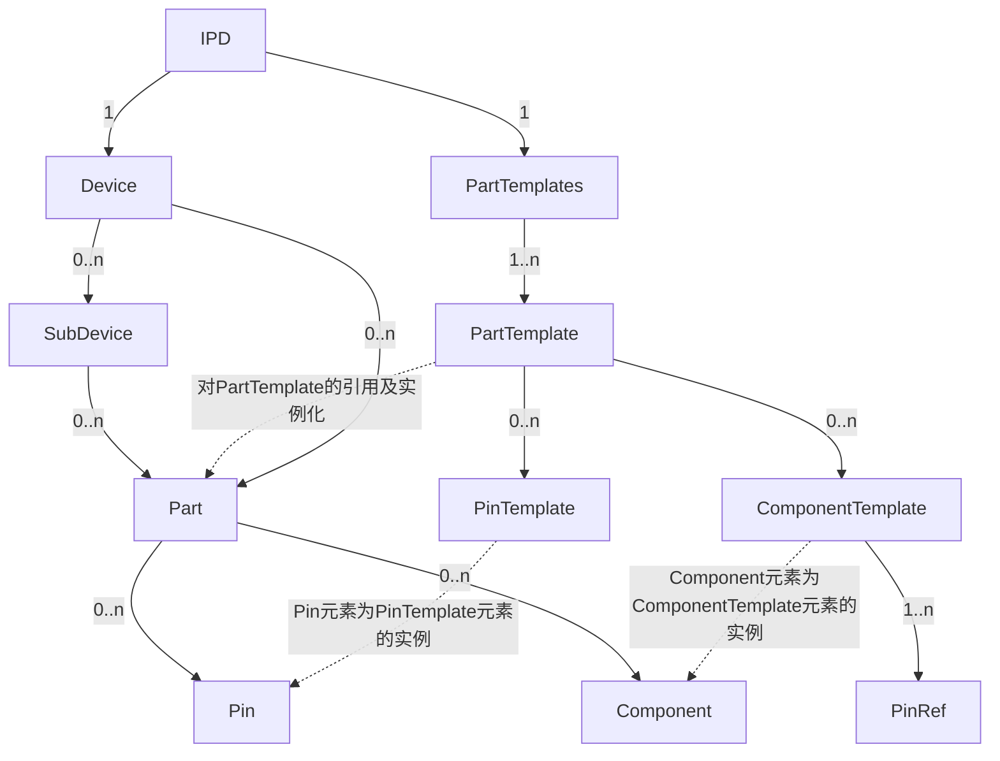


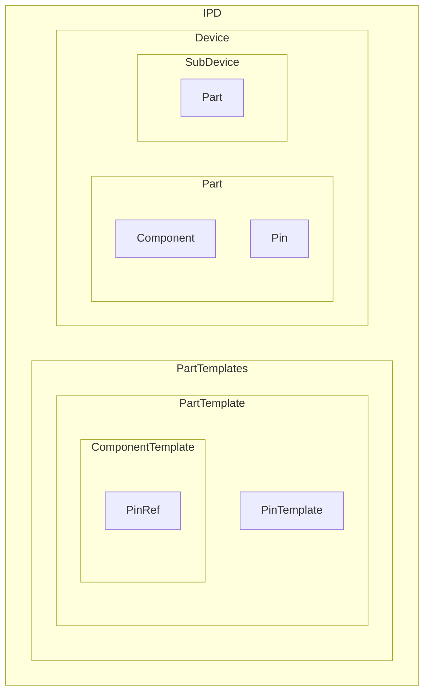

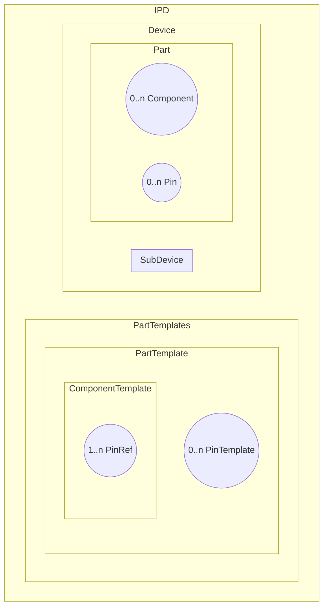


- IPD 元素 包含有一个 Device 元素和一个 PartTemplates 元素

  ```xml
  <IPD version="2021" revision="A">
      <Device name="1-1n" iedName="default" desc="线路保护装置" >
      </Device>
      <PartTemplates>
      </PartTemplates>
  </IPD>
  ```

    - Device 元素不仅可以表示装置，也可以表示元件
        - 但一个IPD文件只能表示一个（<font color=Red>只能表示装置或者只能表示元件吗？</font>)
    -  Device 元素具有唯一性（<font color=Red>一个IPD文件中只能有一个Device 元素吗？</font>）
    - PartTemplates 元素具有唯一性（<font color=Red>一个IPD文件中只能有一个PartTemplates元素</font>）

- PartTemplates元素包含1个或多个 PartTemplate 元素

  ```xml
      <PartTemplates>
          <PartTemplate name="NR.ZD_PCS-931A-FA-G-G9" type="PCS-931A-FA-G-G9"  class="IED" desc="超高压输电线路成套保护装置" manufacturer="NR">
          </PartTemplate>
          <PartTemplate name="NR.CJ_NR1161H" type="NR1161H"  class="Board" desc="DSP插件" manufacturer="NR">
          </PartTemplate>
      </PartTemplates>
  ```

    - PartTemplate元素可以为装置模板，可以为板卡模板

- PartTemplate元素包含 0 个或多个PinTemplate元素和ComponentTemplate 元素

  ```xml
          <PartTemplate name="NR.ZD_PCS-931A-FA-G-G9" type="PCS-931A-FA-G-G9"  class="IED" desc="超高压输电线路成套保护装置" manufacturer="NR">
              <PinTemplate name="GND" type="TerminalPin"/>
              <ComponentTemplate name="1" group="Logic" type="PE_1">
                  <PinRef pinIndex="1" pinName="GND"/>
              </ComponentTemplate>
          </PartTemplate>
  ```

    - PartTemplate表示储纤盒的模板时不含PinTemplate元素和ComponentTemplate元素

        - <font color=Red>在示例文件中，DSP插件也不包含PinTemplate元素和ComponentTemplate元素，DSP插件不属于储纤盒</font>

          ```xml
                  <PartTemplate name="NR.CJ_NR1161H" type="NR1161H"  class="Board" desc="DSP插件" manufacturer="NR">
                  </PartTemplate>
          ```

- ComponentTemplate元素包含 1 个或多个PinRef元素

  ```xml
              <ComponentTemplate name="Ethernet1" desc="以太网口1" group="Logic" type="ETH_1" comType="MMS">
                  <PinRef pinIndex="1" pinName="E1"/>
              </ComponentTemplate>
  ```

- Device 元素包含 0 个或多个 SubDevice元素

  ```xml
      <Device name="1-1n" iedName="default" desc="线路保护装置" >
          <SubDevice name="01">
              <Part name="NR.CJ_NR1101F" num="1"/>
          </SubDevice>
          <SubDevice name="07">
              <Part name="NR.CJ_NR1136A" num="1"/>
          </SubDevice>
      </Device>
  ```

    - Device 元素表示交换机时，没有SubDevice元素
    - Device 元素表示空开、压板、按钮、转换开关和继电器时，没有SubDevice元素的

- Device元素包含 0 个或多个Part 元素

  ```xml
      <Device name="1-1n" iedName="default" desc="线路保护装置" >
          <Part name="NR.ZD_PCS-931A-DA-G-G9" num="1"/>
      </Device>
  ```

    - 对于Device 元素，目前没找到存在1个以上的Part元素的情况，建议改为0个或1个

- SubDevice元素包含 0 个或多个Part 元素

  ```xml
  SubDevice name="01">
      <Part name="NR.CJ_NR1101F" num="1"/>
  </SubDevice>
  ```

    - 对于SubDevice元素来说，应为有且仅包含1个Part 元素

- Part 元素包含 0 个或多个Component和Pin 元素。

  <font color=Red>未找到Part 包含Pin 元素的示例？</font>

  ```xml
              <Part name="NR.CJ_NR1502D" num="1">
                  <Component name="BI_01" desc="对时"/>
                  <Component name="BI_02" desc="打印"/>
                  <Component name="BI_03" desc="检修状态投入" icdRef="S1.LD0.GGIO3.lnd1.stVal"/>
                  <Component name="BI_04" desc="信号复归" icdRef="S1.LD0.GGIO3.lnd2.stVal"/>
                  <Component name="BI_14" desc="远方操作投入" icdRef="S1.LD0.GGIO3.lnd3.stVal"/>
                  <Component name="BI_OPT" desc="光耦监视"/>
              </Part>
  ```

    - 0个表示与模板一样，采用隐式
        - <font color=Red>与哪个模板一样，模板是谁</font>

##### 5.3.1.1 IPD元素

- IPD 元素是 IPD 文件的根节点
- 根节点下仅包含一个 Device（设备）元素和一个 PartTemplates(部件模板库)元素。

###### IPD 元素格式定义

示例：

```xml
<?xml version="1.0" encoding="utf-8" ?>
<!--XML 声明段，编码格式固定为 UTF8-->
<IPD version="2021" revision="A">
    <Device>
        <!--Device 元素-->
    </Device>
    <PartTemplates>
        <!--PartTemplates 元素-->
    </PartTemplates>
</IPD>
```

###### IPD 元素属性定义

| 属性名称 | 属性说明           | 属性值类型   | 值范围或值说明   | O/M/C |
| -------- | ------------------ | ------------ | ---------------- | ----- |
| version  | IPD 格式版本号     | 数字         | 本标准固定为2021 | M     |
| revision | IPD 格式修订版本号 | 大写字母 A~Z | 本标准固定为A    | M     |


##### 5.3.1.2 Device元素

- Device元素表示屏柜内的设备或元件
- Device 元素包含一个或多个 Part（部件）元素
    - 应该为Device 元素包含零个或一个 Part（部件）元素
- 当设备由多个具有独立功能的元件组合而成时，Device 元素下可以包含一个或多个 SubDevice （子设备）元素
    - 应该为Device 元素下可以包含零个或多个 SubDevice （子设备）元素
    - 交换机、整背板装置、空开、压板、按钮，转换开关的下个层级均不存在SubDevice

对于继电保护装置的 Device 元素指装置本身，

- Device 元素的 name 属性为装置的编号，
- Part 元素为装置对应的部件
- SubDevice 元素为装置包含的插件
- SubDevice 的 name 属性标识插件的插槽号
- Part 元素为插件对应的部件。

对于端子排的Device元素指相同名称的一段端子排

- Device元素的name属性为端子排的编号
- SubDevice 元素为端子排中一片端子
- SubDevice 元素的 name 属性为一片端子的端子编号。

###### Device 元素格式定义

示例：

```xml
<Device name="1n" desc="110kV 乙二醇线路保护测控装置" iedName="PC1106">
    <Part name="NR.PCS-943A-DA-G-C" num="1"/>
    <!--Part 元素定义-->
    <SubDevice />
    <SubDevice/>
    <!--SubDevice 元素-->
</Device> 
```

###### Device 元素属性定义

| 属性名称             | 属性说明             | 属性值类型 | 值范围或值说明                                               | O/M/C |
| -------------------- | -------------------- | ---------- | ------------------------------------------------------------ | ----- |
| name                 | 屏柜中的设备编号     | 文本       | 对于 IPD 文件，设备编号固为  TEMPLATE；对于 CPD、SPD 文件，设备编号应与设计编号  一致。该属性在 Cubicle 元素下应唯一。 | M     |
| desc                 | 设备描述             | 文本       | 取设备描述                                                   | O     |
| label                | 设备的铭牌文本       | 文本       | 取设备的铭牌文本                                             | O     |
| iedName              | IED 设备的名称       | 文本       | 应与 SCD 文件中的 IED 设备名称一致。 对于非 IED 设备，该属性可为空。 | C     |
| gridId               | 设备电网标识系统编码 | 文本       | 取设备电网标识系统编码                                       | O     |
| deviceId             | 设备识别码           | 文本       | 取设备识别码                                                 | O     |
| parentDevice         | 主机设备             |            | 取主机设备                                                   |       |
| height               | 设备尺寸高           | Int32      | 设备高度采用mm为度量单位                                     | O     |
| width                | 设备尺寸宽           | Int32      | 设备宽度采用mm为度量单位                                     | O     |
| direction            | 方位                 | 枚举       | 枚举：Front、Rear                                            | O     |
| horizontalCoordinate | 横坐标               | Int32      | 单位 mm                                                      | O     |
| verticalCoordinate   | 纵坐标               | Int32      | 单位 mm                                                      | O     |


##### 5.3.1.3 Part元素

- Part元素表示部件，是对PartTemplate(部件模板)的引用及实例化
- Part 元素包含零个或多个Pin元素和Component元素
- 当Part元素对应的PartTemplate中包含连接点模板时Part元素的数量属性只能为1
    - 对于储纤盒，是不含连接点模板的，数量可为大于1的数
    - 当含连接点模板时，势必表示的是不同的Part，所以数量只能为1
- 当一个Device元素包含多个Part元素时，不同Part元素包含的连接点name属性不应重复
    - 目前还没看到Device元素包含多个Part元素的情况
- 端子排的下个层级是没有Part元素的
- 端子排端子的下个层级存在Part，且到Part为止，不在有下个层级
- 空开、压板、按钮、转换开关、继电器的下个层级都有Part元素
- 一个屏柜中存在3个储纤盒时，只需用一个Device元素描述，取Part元素中的num属性值为3，即可表示3个储纤盒
- 若三维中要体现3个储纤盒，建议还是用3个Device元素描述

###### Part元素格式定义

示例1：

```xml
<Part name="NR.PCS-943A-DA-G-C" num="1">

    <Pin/>
    <!--Pin 元素-->
    <Component/>
    <!--Component 元素-->

</Part>
```

示例2：

```xml
<IPD version="2021" revision="A">
    <Device name="CXH">
        <Part name="BR.NR-OFSB" num="3"/>
    </Device>

    <!--...-->
    <PartTemplate name="BR.NR-OFSB" type="NR-OFSB" class="Other" desc="储纤盒" manufacturer="常州博瑞">
    </PartTemplate>
</IPD>
```

###### Part元素属性定义

| 属性名称 | 属性说明   | 属性值类型 | 值范围或值说明                                               | O/M/C |
| -------- | ---------- | ---------- | ------------------------------------------------------------ | ----- |
| name     | 部件的名称 | 文本       | 对应的 PartTemplate(部件模板)元素的 name 属性                | M     |
| num      | 部件的数量 | 数字       | 当Part元素对应的PartTemplate  中包含连接点模板时，Part元素的数量属性只能为1。部件的数量,缺省值为1。 | M     |

##### 5.3.1.4 SubDevice元素

- SubDevice元素表示子设备
- SubDevice 元素包含一个或多个 Part（部件）元素
    - 应该改为SubDevice 元素有且仅包含一个 Part（部件）元素
- 屏柜内部设备只允许存在设备(Device)与子设备(SubDevice)两个层级的结构
    - 即 SubDevice 元素中不允许再嵌套另一个子设备（SubDevice）元素
- 属性定义与 Device 元素相同。

###### SubDevice元素格式定义

示例：

```xml
<SubDevice name="01" desc="CPU">

    <Part name="NR.NR1101F" num="1"/>

</SubDevice>
```

- 空开、压板、按钮，转换开关的下个层级均不存在SubDevice
- 端子排的下个层级存在SubDevice，端子排端子即为SubDevice，端子排端子的下个层级存在Part，且到Part为止，不在有下个层级

- 装置的下个层级存在SubDevice，板卡即为SubDevice
- 交换机等整背板装置没有SubDevice。

###### SubDevice 元素属性定义

| 属性名称 | 属性说明           | 属性值类型 | 值范围或值说明             | O/M/C |
| -------- | ------------------ | ---------- | -------------------------- | ----- |
| name     | 屏柜中的子设备编号 | 文本       | 子设备编号应与设计编号一致 | M     |
| desc     | 子设备描述         | 文本       |                            | O     |


##### 5.3.1.5 Pin元素

- Pin元素表示电气元件上的接线端子、光纤接口、以太网口等可对外进行连接的连接点或板卡内部的电阻、继电器节点和继电器线圈等
- Pin元素为PinTemplate元素的实例
- Pin 元素的属性与PinTemplate元素相同，且具有相同name属性
- Pin元素的可以显式的进行实例化，并声明与PinTemplate元素不同的属性值
- 当不需要修改Pin的属性时，也可以隐式的实例化，未声明的Pin元素默认采用部件的PinTemplate元素的属性值

###### Pin元素格式定义

示例：

```xml
<Device name="1-1n" iedName="default" desc="线路保护装置">
    <Part name="NR.NR1101F" num="1">

        <!--显式的实例化名称为“E1”的连接点-->

        <Pin name="E1" desc="以太网口 1"/>

    </Part>

    <Part name="NR.NR1502D" num="1">

        <!-- 不包含任何 Pin 元素，所有连接点取 PinTemplate 元素-->

    </Part>
</Device>
```

- 若与PinTemplate属性值一样，则不用写Pin
- 若有与PinTemplate属性值不一样的，只写不一样的即可，其他没写的还是采用PinTemplate属性值

###### Pin元素属性定义

| 属性名称     | 属性说明         | 属性值类型 | 值范围或值说明                                               | O/M/C |
| ------------ | ---------------- | ---------- | ------------------------------------------------------------ | ----- |
| name         | 连接点的名称     | 文本       | 属性不为空且在一个部件模板下应唯一<br />（1.当为板卡内电子元件，且CAD图纸中没有标识的情况时，按照格式“.标识.虚拟连接点%随机数”命名；2.当为光口或网口时，命名按照“数字-TX”或者“数字-RX”或者“数字-RT”或者“其他”；） | M     |
| scdName      | SCD中的端口名称  | 文本       | 取SCD中的端口名称                                            | O     |
| desc         | 连接点的功能描述 | 文本       | 是板卡内电子元件枚举：  Diode（二极管）、Resistance（电阻）、CPU（CPU）、Optocoupler（光耦）、ZenerDiode（稳压二极管）、U(电压线圈)、I(电流线圈)、电容、Other（其他） | O     |
| type         | 连接点的类型     | 枚举       | 枚举：TerminalPin（接线端子）  、SaddleJumper（鞍形跳线，用于端子短连片连接）、RJ45（RJ45 接口）、Fiber（光纤接口）、Other（其他） | M     |
| side         | 连接点内侧、外侧 | 枚举       | 枚举类值为 External外部/Inernal内部。   对于端子，此属性不为空 | C     |
| crossSection | 最大导线截面积   | 浮点数     | 单位：㎟  当type=TerminalPin时，存在此属性                   | O     |
| fiberType    | 光纤类型         | 枚举       | 枚举值 SM、   MM。SM 指单模，MM 指 多模  当type=Fiber时，存在此属性 | O     |
| portType     | 光纤接头类型     | 枚举       | 枚举   值为 FC、ST、LC、SC  当type=Fiber时，存在此属性       | O     |


##### 5.3.1.6 Component元素

- Component元素表示电气设备上的实现一个特定逻辑功能的连接点组合
    - 如果存在这个板卡端子和另外一个板卡端子是一个逻辑功能的组合的话，无法描述；
    - 换句话说，只能描述本板卡内的逻辑功能组合

- 可以包含一个或多个连接点
- Component 元素为ComponentTemplate元素的实例
- Component元素的属性与ComponentTemplate元素相同，且具有相同 name 属性
- Component 元素的可以显式的进行实例化，并声明与 ComponentTemplate 元素不同的属性值。
- 也可以隐式的实例化，未声明的Component元素默认采用部件的ComponentTemplate元素的属性值
- 针对 IED 设备，其Component元素可以包含 icdRef 属性，用于关联其icd模型。

###### Component元素格式定义

示例：

```xml
<Component name="BI_04" desc="开入 4" icdRef="S1/MEAS.CTRL.BinInGGIO1.Ind4.stVal"/>
```

- 若与ComponentTemplate属性值一样，则不用写Component
- 若有与ComponentTemplate属性值不一样的，只写不一样的即可，其他没写的还是采用ComponentTemplate属性值。

###### Component元素属性定义

| 属性名称 | 属性说明         | 属性值类型 | 值范围或值说明                                               | O/M/C |
| -------- | ---------------- | ---------- | ------------------------------------------------------------ | ----- |
| name     | 元件模板的名称   | 文本       | 对应的ComponentTemplate(元件模板)元素的name属性              | M     |
| icdRef   | 连接点的功能描述 | 文本       | 如果设备为IED设备，且功能可以映射到IED设备的ICD模型中变量，填写此引用关系。格式为： “AP.LD.LN.DO.DA.Value”，当存在多个映射时，不同变量使用“，”分隔 | O     |


#### 5.3.2 CPD文件格式

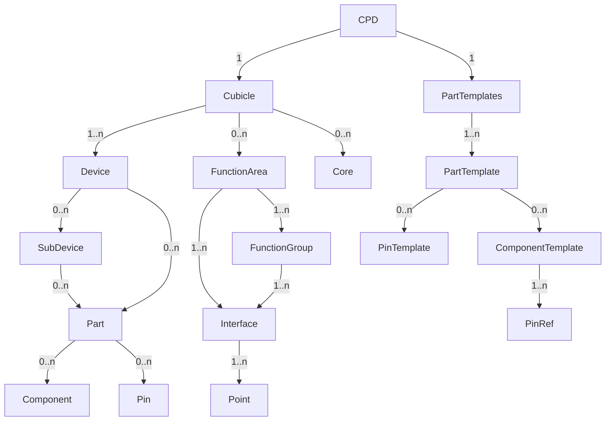

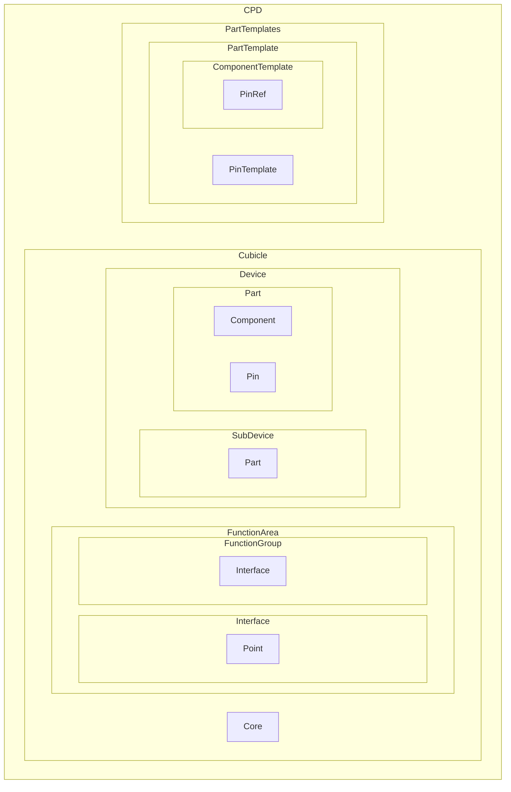


- CPD 元素包含有一个 Cubicle元素和一个 PartTemplates 元素
- Cubicle 元素包含 1 个或多个 Device 元素
- Cubicle 元素包含0 个或多个FunctionArea 和 Core 元素
- FunctionArea 元素包含 1 个或多个 Interface 元素
- Interface 元素包含 1 个或多个 Point 元素

##### 5.3.2.1 CPD元素

- CPD元素是 CPD 文件的根节点
- 根节点下包含一个 Cubicle(屏柜)元素和一个
- PartTemplates(部件模板库)元素

###### CPD元素格式定义

示例：

```xml
<?xml version="1.0" encoding="utf-8" ?>

<!--XML 声明段，编码格式固定为 UTF8-->

<CPD version="2021" revision="A">

    <Cubicle>
        <!--Cubicle 元素-->
    </Cubicle>

    <PartTemplates>
        <!--PartTemplates 元素-->
    </PartTemplates>

</CPD>
```

###### CPD元素属性定义

| 属性名称 | 属性说明           | 属性值类型   | 值范围或值说明    | O/M/C |
| -------- | ------------------ | ------------ | ----------------- | ----- |
| version  | CPD 格式版本号     | 数字         | 本标准固定为 2021 | M     |
| revision | CPD 格式修订版本号 | 大写字母 A~Z | 本标准固定为 A    | M     |


##### 5.3.2.2 Cubicle元素

- Cubicle元素表示屏柜
- 屏柜元素依次包含一个 FunctionArea(功能区域)元素、一个或多个Device(设备)元素、一个或多个 Core（连接）元素

###### Cubicle元素格式定义

示例：

```xml
<Cubicle name="=XXX+YYY">

    <FunctionArea>
        <!--FunctionArea 元素-->
    </FunctionArea>

    <Device>
        <!-- Device 元素-->
    </Device>

    <Core>
        <!-- Core 元素-->
    </Core>

</Cubicle>
```

###### Cubicle元素属性定义

| 属性名称             | 属性说明                     | 属性值类型 | 值范围或值说明                                               | O/M/C                 |
| -------------------- | ---------------------------- | ---------- | ------------------------------------------------------------ | --------------------- |
| name                 | 屏柜中的编号                 | 文本       | 对于 CPD 文件，屏柜编号固定为 TEMPLATE；对于 SPD 文件，屏柜编号应与设计编号一致。该属性在 Substation 元素下应唯一。 | M                     |
| desc                 | 屏柜描述                     | 文本       | 屏柜描述                                                     | O                     |
| class                | 屏柜的类型                   | 枚举       | 枚举值为 RS、MK、UT、BD、CC、VT。RS 指屏柜，MK 指汇控柜或智能控制柜，UT 为端子箱，BD 为机构箱，CC 为开关柜，VT 为虚拟屏柜。 | O                     |
| type                 | 屏柜型号                     | 文本       | 取height-width-depth                                         | O                     |
| style                | 机柜结构                     | 枚举       | 枚举值为 FT、RV、FK、BK。FT 指前接线机柜，RV 指摇架机柜，FK 指侧接线机柜，BK 指后接线机柜 | O                     |
| manufacturer         | 屏柜制造厂商名称             | 文本       | 取屏柜制造厂商名称                                           | O                     |
| width                | 屏柜宽度                     | 整数       | 单位 mm                                                      | M                     |
| height               | 屏柜高度                     | 整数       | 单位 mm                                                      | M                     |
| depth                | 屏柜深度                     | 整数       | 单位 mm                                                      | M                     |
| color                | 屏柜颜色                     | 文本       |                                                              | O                     |
| shaftDirection       | 面对屏柜时，屏柜前门门轴方向 | 枚举       | 枚举值为：LD、RD、DD。LD 为左门轴，RD 为右门轴，DD 为双开门  | O                     |
| gridId               | 屏柜电网标识系统编码         | 文本       |                                                              | O                     |
| objectId             | 实物 id                      | 文本       |                                                              |                       |
| doorDirection        | 屏柜柜门朝向                 | 枚举       | 枚举：Up、Down、Left、Right                                  | O[[24\]](#_msocom_24) |
| horizontalCoordinate | 横坐标                       | 整数       | 单位 mm                                                      | O[[25\]](#_msocom_25) |
| verticalCoordinate   | 纵坐标                       | 整数       | 单位 mm                                                      | O[[26\]](#_msocom_26) |


##### 5.3.2.3 FunctionArea元素

- FunctionArea元素表示功能区域
- 屏柜对外接口按主要器件(如二次装置、断路器、刀闸) 回路分成大区域
    - 二次屏柜按二次装置回路和公用回路划分功能区域
    - 一次设备机构箱按断路器、刀闸、CT、PT 等一次设备回路和公用回路划分功能区域
    - 一次设备智能控制柜按一次设备、二次装置和公用回路划分功能区域。
- FunctionArea元素包含一个或多个 Interface(接口)元素

###### FunctionArea元素格式定义

示例：

```xml
<FunctionArea name="CommonArea" desc="公共回路" >
    <FunctionGroup name="PwrCir" desc="电源回路" type="电源回路">
        <!-- FunctionGroup 元素定义见 6.2.5 节-->
    </FunctionGroup >
</FunctionArea>
```

```xml
<FunctionArea name="CommonArea" desc="公共回路">
    <Interface name="DCPWR1" desc="直流电源1" class="PWRIN" type="DC" voltage="220V">
        <Point type="+" deviceName="1ZD" subDeviceName="1" pinName="1"/>
        <Point type="-" deviceName="1ZD" subDeviceName="8" pinName="1"/>
    </Interface>
    <Interface name="DCPWR2" desc="直流电源2" class="PWRIN" type="DC" voltage="220V">
        <Point type="+" deviceName="2ZD" subDeviceName="1" pinName="1"/>
        <Point type="-" deviceName="2ZD" subDeviceName="8" pinName="1"/>
    </Interface>
    <Interface name="SYN" desc="对时回路" class="Communication" type="IRIG-B">
        <Point type="A" deviceName="TD" temrinalName="1" pinName="1"/>
        <Point type="B" deviceName="TD" temrinalName="2" pinName="1"/>
        <Point type="SGND" deviceName="TD" temrinalName="3" pinName="1"/>
        <Point type="SHLD" deviceName="TD" temrinalName="4" pinName="1"/>
    </Interface>
</FunctionArea>
```

- 除端子箱和机构箱外，其他屏柜的FunctionArea元素一般分为一个公共回路，加上一个装置对应一个FunctionArea

###### FunctionArea元素属性定义

| 属性名称 | 属性说明           | 属性值类型 | 值范围或值说明                                               | O/M/C |
| -------- | ------------------ | ---------- | ------------------------------------------------------------ | ----- |
| name     | 功能区域名称标识符 | 文本       | 由数字、字母、下划线组成，该属性值在屏柜下应唯一。对于一次设备相关的回路，可以使用一次设备的编码+Area 进行命名，二次设备相关的回路，可以使用二次设备的编码+Area进行命名。公共回路可使用CommonArea 命名。 | M     |
| desc     | 功能区域描述       | 文本       | 公共回路或装置name+接口                                      | O     |

##### 5.3.2.4 FunctionGroup (功能分组)元素

- FunctionGroup元素表示功能分组，将功能区域按照具体的回路功能进行细分，如：电源 回路、对时回路、电压回路、电流回路等
- 功能分组元素包含一个或多个 Interface（连接点）元素

###### FunctionGroup元素格式定义

示例：

```xml
<FunctionGroup name="PwrCir" desc="电源回路" type="电源回路">
    <Interface name="PWR1" desc="装置电源" class="PWRIN" type="DC" function=" 
装置电源+">
        <!-- Interface 元素定义见 6.2.6 节-->
    </Interface>
</FunctionGroup>
```

###### FunctionGroup元素属性定义

| 属性名称 | 属性说明       | 属性值类型 | 值范围或值说明     | O/M/C |
| -------- | -------------- | ---------- | ------------------ | ----- |
| name     | 分组名称标识符 | 文本       | 命名规范见表 6.2.5 | M     |
| desc     | 功能区域描述   | 文本       | 命名规范见表 6.2.5 | O     |
| type     | 功能区域类型   | 枚举       | 命名规范见表 6.2.5 | M     |


表6.2.5

| name                                      | desc         | type         | 备注                                                         |
| ----------------------------------------- | ------------ | ------------ | ------------------------------------------------------------ |
| PwrCir  (Power Circuit)                   | 电源回路     | 电源回路     |                                                              |
| AlmCir  (Alarm Circuit)                   | 告警信号     | 信号回路     | 用下划线和数字区分不同回路，如AlmCir_1、  AlmCir_2           |
| TmCir  (Time Circuit)                     | 对时回路     | 对时回路     |                                                              |
| CtCir  (Current transformer  Circuit)     | 电流回路     | 电流回路     |                                                              |
| PtCir  (Potential transformer  Circuit)   | 电压回路     | 电压回路     |                                                              |
| TrCir  (Trip Circuit)                     | 跳闸回路     | 跳闸回路     |                                                              |
| ParCir  (Parataxis Circuit)               | 并列回路     | 并列回路     |                                                              |
| FireCir  (Fire Circuit)                   | 主变消防回路 | 主变消防回路 |                                                              |
| OpCir  (Operation Circuit)                | 操作回路     | 操作回路     | 用下划线和数字区分不同回路，如 OpCir_1、  OpCir_2            |
| RecCir  (Reclosure Circuit)               | 重合闸回路   | 重合闸回路   | 用下划线和数字区分不同回路，如RecCir_1、  RecCir_2           |
| PosnCir  (Position Circuit)               | 位置信号     | 信号回路     | 用下划线和数字区分不同回路，如  PosnCir_1、PosnCir_2、PosnCir_3 |
| CtrlCir  (Control Circuit)                | 刀闸遥控     | 遥控回路     |                                                              |
| NeqCir  (No electrical quantity  Circuit) | 非电量回路   | 非电量回路   |                                                              |
| AqtyCir  (Analog quantity Circuit)        | 模拟量信号   | 模拟量回路   |                                                              |
| AucCir  (Auxiliary contact Circuit)       | 辅助接点     | 辅助接点     |                                                              |
| EllCir  (Electric locking Circuit)        | 外部闭锁回路 | 外部闭锁回路 |                                                              |
| ComCir  (Comunication Circuit)            | 通讯接点     | 通讯接点     | 对外的网线、光缆、同轴电缆等通讯，用下  划线和数字区分，ComCir_01,ComCir_02 |


##### 5.3.2.5 Interface元素

- Interface元素表示接口
- 用于描述屏柜对外的一组输入或者输出接口
    - 一般指的是直接对外的板卡端口，直接对外的端子排端子
- 接口元素包含一个或多个Point（连接点）元素
    - 注意此处为1时，一般表示端口，且端口comType="IRIG-B"或comType="MMS"
    - 一般含2个；可能有1,3,4个情况
- Interface 元素的类型包含 class 和 type 两个层级
- 根据接口类型的不同，Interface元素可以包含不同的附加属性和不同类型的 Point(接口连接点)。
-

###### Interface元素格式定义

示例：

```xml
<Interface name="BO_01" desc="遥控 1 分闸" class="DO" type="NO">

    <Point>
        <!-- Point 元素-->
    </Point>

</Interface>
```

示例：一个装置对应一个FunctionArea，一个FunctionArea中存在多个Interface

```xml

```

示例：数字量输出的描述

```xml
<FunctionArea name="XXX" desc="XX">
    <Interface name="FAIL" desc="装置闭锁" class="DO" type="NC">

        <Point type="1" deviceName="1-21YD" subDeviceName="1"/>

        <Point type="2" deviceName="1-21YD" subDeviceName="4"/>

    </Interface>

    <Interface name="ALM" desc="装置报警" class="DO" type="NO">

        <Point type="1" deviceName="1-21YD" subDeviceName="1"/>

        <Point type="2" deviceName="1-21YD" subDeviceName="5"/>

    </Interface>
</FunctionArea>
```

示例：数字量输入的描述

```xml
<FunctionArea name="1-21nArea" desc="测控装置">

    <Interface name="DI4" desc="开入 4" class="DI" type="DC" voltage="220V">

        <Point type="+" deviceName="1-21GD" subDeviceName="1"/>

        <Point type="DI" deviceName="1-21QD" subDeviceName="1"/>

    </Interface>

    <Interface name="DI5" desc="开入 5" class="DI" type="DC" voltage="220V">

        <Point type="+" deviceName="1-21GD" subDeviceName="1"/>

        <Point type="DI" deviceName="1-21QD" subDeviceName="2"/>

    </Interface>
</FunctionArea>    
```

```xml
<FunctionArea name="1-4nArea" desc="1-4n 接口">

    <Interface name="CBA_NO1" desc="断路器 A 相分位" class="DI" type="DC">

        <Point type="+" deviceName="1-4GD" subDeviceName="1" pinName="1"/>

        <Point type="DI" deviceName="1-4Q2D" subDeviceName="1" pinName="1"/>

    </Interface>

    <Interface name="CBA_NC1" desc="断路器 A 相合位" class="DI" type="DC">

        <Point type="+" deviceName="1-4GD" subDeviceName="1" pinName="1"/>

        <Point type="DI" deviceName="1-4Q2D" subDeviceName="2" pinName="1"/>

    </Interface>

    <Interface name="TJA" desc="A 相跳位监视" class="DI" type="DC">

        <Point type="-" deviceName="1-4Q1D" subDeviceName="40" pinName="1"/>

        <Point type="DI" deviceName="1-4Q2D" subDeviceName="8" pinName="1"/>

    </Interface>
</FunctionArea>    
```

示例：模拟量输入的描述

```xml
<FunctionArea name="1-13nArea" desc="1-13n 接口">

    <Interface name="I1" desc="A 相保护电流" class="AI" type="CT">

        <Point type="s1" deviceName="1-13ID" subDeviceName="1" pinName="1"/>

        <Point type="s2" deviceName="1-13ID" subDeviceName="4" pinName="1"/>

    </Interface>

    <Interface name="I2" desc="B 相保护电流" class="AI" type="CT">

        <Point type="s1" deviceName="1-13ID" subDeviceName="2" pinName="1"/>

        <Point type="s2" deviceName="1-13ID" subDeviceName="5" pinName="1"/>

    </Interface>
</FunctionArea>
```

示例：通信的描述

```xml
<FunctionArea name="1-4nArea" desc="1-4n 接口">

    <Interface name="GOOSE1" desc="GOOSE 组网" class="Communication" type="Fiber" comtype="GOOSE">

        <Point type="RX" deviceName="1-4n" subDeviceName="01" pinName="E1:RX"/>

        <Point type="TX" deviceName="1-4n" subDeviceName="01" pinName="E1:TX"/>

    </Interface>

    <Interface name="GOOSE2" desc="点对点(至线路保护)" class="Communication" type="Fiber" comtype="GOOSE">

        <Point type="RX" deviceName="1-4n" subDeviceName="01" pinName="E2:RX"/>

        <Point type="TX" deviceName="1-4n" subDeviceName="01" pinName="E2:TX"/>

    </Interface>

    <Interface name="GOOSE3" desc="点对点(至母线保护)" class="Communication" type="Fiber" comtype="GOOSE">

        <Point type="RX" deviceName="1-4n" subDeviceName="01" pinName="E3:RX"/>

        <Point type="TX" deviceName="1-4n" subDeviceName="01" pinName="E3:TX"/>

    </Interface>

    <Interface name="GOOSE7" desc="点对点(至母线合并单元)" class="Communication" type="Fiber" comtype="GOOSE">

        <Point type="RX" deviceName="1-4n" subDeviceName="01" pinName="E7:RX"/>

    </Interface>
</FunctionArea>
```

示例：电源输入的描述

```xml
<FunctionArea name="CommonArea" desc="公共回路">

    <Interface name="DCPWR" desc="直流电源输入" class="PWRIN" type="DC">

        <Point type="+" deviceName="1ZD" subDeviceName="1" pinName="1"/>

        <Point type="-" deviceName="1ZD" subDeviceName="6" pinName="1"/>

    </Interface>

</FunctionArea>
```

示例：电源输出的描述

```xml
<FunctionArea name="1-4nArea" desc="1-4n 接口">

    <Interface name="TQ1A" desc="A 相跳闸线圈 1" class="PWROUT" type="DC">

        <Point type="+" deviceName="1-4C1D" subDeviceName="1" pinName="1"/>

        <Point type="-" deviceName="1-4Q1D" subDeviceName="40" pinName="1"/>

    </Interface>

    <Interface name="HQ1A" desc="A 相合闸线圈 1" class="PWROUT" type="DC">

        <Point type="+" deviceName="1-4C1D" subDeviceName="10" pinName="1"/>

        <Point type="-" deviceName="1-4Q1D" subDeviceName="40" pinName="1"/>

    </Interface>
</FunctionArea>
```

示例：公共回路包括直流电源、对时两种

```xml
<FunctionArea name="CommonArea" desc="公共回路">

    <Interface name="DCPWR1" desc="直流电源 1" class="PWRIN" type="DC" voltage="220V">

        <Point type="+" deviceName="1ZD" subDeviceName="1" pinName="1"/>

        <Point type="-" deviceName="1ZD" subDeviceName="8" pinName="1"/>

    </Interface>

    <Interface name="DCPWR2" desc="直流电源 2" class="PWRIN" type="DC" voltage="220V">

        <Point type="+" deviceName="2ZD" subDeviceName="1" pinName="1"/>

        <Point type="-" deviceName="2ZD" subDeviceName="8" pinName="1"/>

    </Interface>

    <Interface name="SYN" desc="对时回路" class="Communication" type="IRIG-B">

        <Point type="A" deviceName="TD" temrinalName="1" pinName="1"/>

        <Point type="B" deviceName="TD" temrinalName="2" pinName="1"/>

        <Point type="SGND" deviceName="TD" temrinalName="3" pinName="1"/>

        <Point type="SHLD" deviceName="TD" temrinalName="4" pinName="1"/>

    </Interface>

</FunctionArea>
```

###### Interface元素属性定义

| 属性名称 | 属性说明       | 属性值类型 | 值范围或值说明                                               | O/M/C |
| -------- | -------------- | ---------- | ------------------------------------------------------------ | ----- |
| name     | 接口名称标识符 | 文本       | 由数字、字母、下划线组成，该   属性值在功能区域下应唯一      | M     |
| desc     | 接口描述       | 文本       | 取Point中端子所在的core的描述；含多个Point时，去掉公共端与N相，取相同部分文字；  当core没有描述时，取空；<font color=Red>(可视化不可用此项)</font> | O     |
| class    | 接口的一级分类 | 枚举       | 枚举：PWRIN电源输入、PWROUT电源输出、AI模拟量输入、AO模拟量输出、DI数字量输入、DO数字量输出、Communication | M     |
| type     | 接口的二级分类 | 枚举       | 见下表                                                       | M     |


| Interface元素  class     | Interface元素  type         | 附件属性                                                     | Point元素  type                      |
| ------------------------ | --------------------------- | ------------------------------------------------------------ | ------------------------------------ |
| DI  数字量输入  开入回路 | DC直流电                    | voltage 额定电压，单位 V                                     | +正电源  DI开入输入  -负电源         |
|                          | AC交流电                    | Current 额定电流，单位A                                      | L、DI开入输入、N                     |
| DO  数字量输出  开出回路 | NO常开触点                  | 无                                                           | 3、4                                 |
|                          | NC常闭触点                  | 无                                                           | 1、2                                 |
| AI  模拟量输入           | PT电压互感器[交流电压回路]  | secondVoltage 二次额定电压，单位V                            | s1极性端  s2非极性端                 |
|                          | CT电流互感器[交流电流回路]  | secondCurrent 二次额定电流，单位A                            | s1极性端  s2非极性端                 |
|                          | DCV直流电压[直流电压回路]   | 直流电压输入 minRange最小幅度，maxRange最大幅度              | +、-                                 |
|                          | DCA直流电流[直流电流回路]   | 直流电流输入                                                 | +、-                                 |
| AO  模拟量输出           | PT电压互感器                | primaryVoltage一次电压   secondVoltage二次额定电压，单位V   accuracy 精度 | s1极性端  s2非极性端                 |
|                          | CT电流互感器                | primaryCurrent一次电流   secondCurrent二次额定电流，单位A accuracy精度 | s1极性端  s2非极性端                 |
| Communication  通信      | RS485                       | comType：通讯口类型。枚举值为MMS、GOOSE、SV、SGM、HLDC、IRIG-B对时、Other。缺省值为Other。当包含多个枚举值时，使用\|分隔，例如MMS\|GOOSE | A、B、SGND、SHLD[三个一组或四个一组] |
|                          | RJ45以太网                  | 同上                                                         | ETH[单个一组]                        |
|                          | Fiber                       | 同上                                                         | RX、TX[一收一发一组或单个一组]       |
| PWRIN  电源输入          | DC直流电[直流电源回路-输入] | voltage 额定电压，单位 V  Power 功率                         | +、PE、-                             |
|                          | AC交流电[交流电源回路-输入] | Current 额定电流，单位A  Power 功率                          | A、B、C、L、N、PE                    |
| PWROUT  电源输出         | DC直流电                    | voltage 额定电压，单位 V  Power 功率                         | +、-                                 |
|                          | AC交流电                    | Current 额定电流，单位A  Power 功率                          | A、B、C、L、N                        |


##### 5.3.2.6 Point元素

- Point元素表示接口连接点
- 用于将接口的各个连接点映射到屏柜某个设备的连接点

###### Point元素的格式定义

示例：

```xml
<Point type="1" deviceName="ZD" subDeviceName="1" pinName="1"/> 

<Point type="RX" deviceName="1n" subDeviceName="01" pinName="G1"/>
```

- 空开、压板、按钮、转换开关和继电器等都没有Point；

- deviceName可为端子排，subDeviceName可为端子排端子，pinName可为端子排端子的连接点；

- deviceName可为装置，subDeviceName可为板卡，pinName可为板卡端子或端口；

Point元素属性定义

| 属性名称      | 属性说明           | 属性值类型 | 值范围或值说明                                               | O/M/C |
| ------------- | ------------------ | ---------- | ------------------------------------------------------------ | ----- |
| type          | 接口连接点类型     | 枚举       | 根据不同的接口类型有不同的枚举值                             | M     |
| deviceName    | 屏柜内设备的名称   | 文本       | 接口连接点所对应的屏柜内设备的名称                           | M     |
| subDeviceName | 屏柜内子设备的名称 | 文本       | 接口连接点所对应的屏柜内子设备的名称。如果对应设备不包含子设备，此属性为空。 | C     |
| pinName       | 设备的连接点名称   | 文本       | 接口连接点所对应的设备的连接点名称。如果对应设备为端子，此属性可以为空。 | C     |


#### 5.3.3 SPD文件格式

- SPD 元素包含有一个 Substation 元素和一个 PartTemplates 元素
- Substation 元素包含 1 个或多个 Region 元素和 Bay 元素
- Region 元素包含 1 个或多个 Cubicle 元素
- Bay 元素包含 1 个或多个 Cable 元素和多个 Device 元素的引用
- Cable 元素包含 0 个或多个 Core 元素

实例化关系图

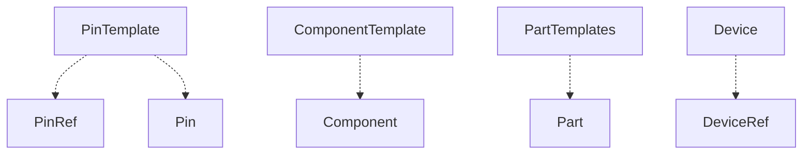

关系图

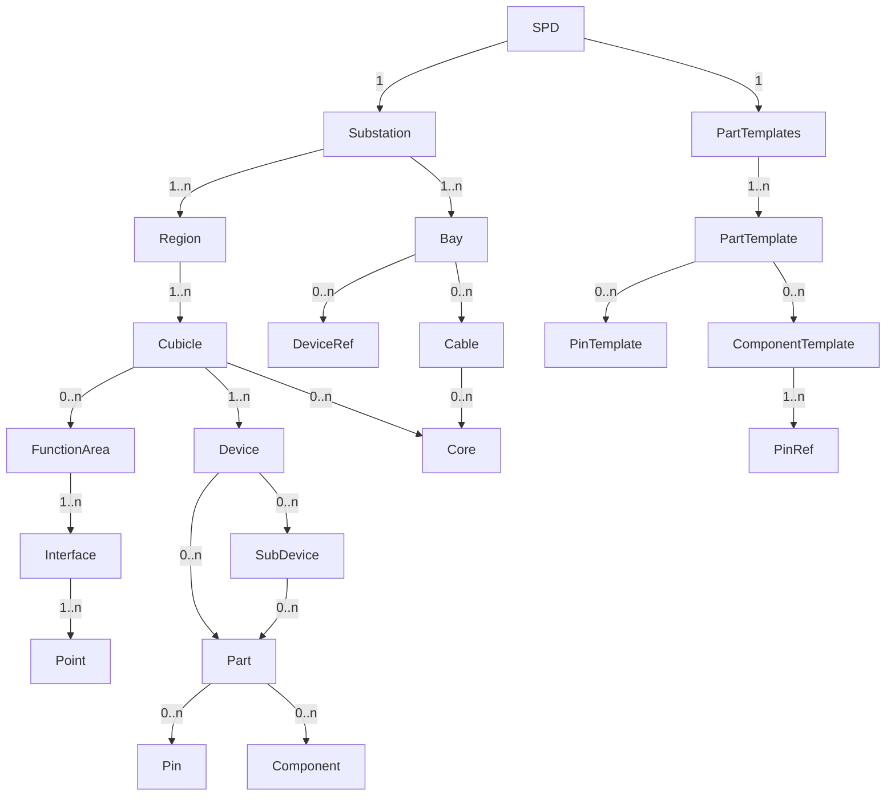

包含关系图

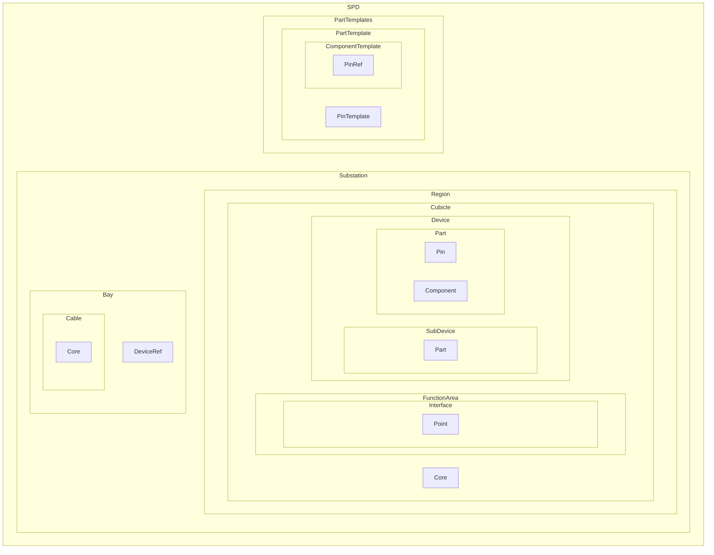

##### 5.3.3.1 SPD元素

- SPD元素是 SPD 文件的根节点
- 根节点下包含的子元素有 Substation(变电站)元素和 PartTemplates (部件模板库)

###### SPD 元素格式定义

示例：

```xml
<?xml version="1.0" encoding="utf-8" ?>
<!--XML 声明段，编码格式固定为 UTF8-->
<SPD version="2021" revision="A">
    <Substation/>

    <!--Substation 元素 -->

</SPD>
```

###### SPD元素属性定义

| 属性名称 | 属性说明          | 属性值类型   | 值范围或值说明    | O/M/C |
| -------- | ----------------- | ------------ | ----------------- | ----- |
| version  | SPD格式版本号     | 数字         | 本标准固定为 2021 | M     |
| revision | SPD格式修订版本号 | 大写字母 A~Z | 本标准固定为 A    | M     |

##### 5.3.3.2 Substation元素

- Substation元素表示变电站，变电站元素包含一个或多个 Cucible(屏柜)元素和一个或多 个 Cable(线缆)元素
    - 改为：变电站Substation 元素包含 1 个或多个 Region 元素和 Bay 元素

######  Substation 元素格式定义

示例：

```xml
<Substation name="GZ" desc="郭庄 220kV 变电站" gridName="SX" areaName="CZ"

            voltage="220kV">

    <Region/>
    <!-- Region 元素-->
    <Bay/>
    <!-- Bay 元素-->

</Substation>
```

###### Substation元素属性定义

| 属性名称 | 属性说明         | 属性值类型 | 值范围或值说明                                               | O/M/C |
| -------- | ---------------- | ---------- | ------------------------------------------------------------ | ----- |
| name     | 变电站名称标识符 | 文本       | 由英文字母、数字和下划线组   成，该属性值在 SPD 元素下应唯一，宜采用变电站名称的中文拼音首字母，遇到重名时，应通过附加数字或字母予以区分，变电站简称在同一地区相同电压等级内应唯一 | M     |
| desc     | 变电站描述       | 文本       | 取变电站中文名称                                             | O     |
| gridName | 所属电网名称     | 文本       | 应遵循 GB/T 33601 的要求                                     | O     |
| areaName | 所属地区名称     | 文本       | 由英文字母组成，宜采用地区名称的中文拼音首字母，遇到重名时，应通过附加数字或字母予以区分，地区简称在同一电网内应唯一 | O     |
| voltage  | 电压等级         | String     | 数字和英文字母表示                                           | O     |


##### 5.3.3.3 Region元素

- Region元素表示区域
- Region 元素包含一个或多个 Cucible(屏柜)元素

###### Region 元素格式 定义

示例：

```xml
<Region name="R220" desc="220kV 继保室 I" area="false">

    <Cucible/>

    <!-- Cucible 元素-->

</Region>
```

###### Region元素属性定义

| 属性名称 | 属性说明       | 属性值类型 | 值范围或值说明                                               | O/M/C |
| -------- | -------------- | ---------- | ------------------------------------------------------------ | ----- |
| name     | 区域名称标识符 | 文本       | 由英文字母、数字和下划线组成， 该属性值在 Substation 元素下应唯一 | M     |
| desc     | 区域描述       | 文本       |                                                              | O     |
| area     | 开关场标识     | 布尔       | 枚举值为 true、false，false 表示继电器室，true 标识开关场。该字段缺省值为 false。 | O     |


##### 5.3.3.4 Bay元素

- Bay元素表示间隔
- Bay 元素包含 0 个或多个 DeviceRef 元素和 Cable 元素

###### Bay 元素格式定义

```xml
<Bay name="=KBB01" desc="500kV I 母" voltageLevel="500kV">

    <DeviceRef/>

    <!-- DeviceRef 元素-->

    <Cable>
        <!-- Cable 元素-->
    </Cable>
</Bay>
```

###### Bay元素属性定义

| 属性名称     | 属性说明     | 属性值类型 | 值范围或值说明                                      | O/M/C |
| ------------ | ------------ | ---------- | --------------------------------------------------- | ----- |
| name         | 间隔的标识符 | 文本       | 该属性在 Substation 元素下应唯一                    | M     |
| desc         | 间隔描述     | 文本       |                                                     | O     |
| voltageLevel | 电压等级     | 文本       | 电压等级，单位 kV。当间隔为虚拟间隔时，电压等级为 0 | M     |

##### 5.3.3.5 DeviceRef元素

- Bay元素下的DeviceRef元素表示间隔中设备的引用

###### DeviceRef 元素格式定义

```xml
<DeviceRef cubicleName="=XXX+YYY" deviceName ="1n"/> 
```


###### DeviceRef元素属性定义

| 属性名称    | 属性说明             | 属性值类型 | 值范围或值说明 | O/M/C |
| ----------- | -------------------- | ---------- | -------------- | ----- |
| cubicleName | 设备所属的屏柜的名称 | 文本       |                | M     |
| deviceName  | 设备的名称           | 文本       |                | M     |


##### 5.3.3.6 Cable元素

- Cable元素表示用于连接屏柜间的线缆
- Cable 元素包含一个或多个 Core（连接）元素

###### Cable 元素格式定义

```xml
<Cable name="4210Z" desc="4 芯电缆(2 备 2)" length="100" coreNum="4" crossSection="4" startCubicle="EXLP1"
       endCubicle="ZLFP1" class="Cable" type="ZR-KVVP 4*4">

    <Core>

        <!-- Core 元素-->
    </Core>
</Cable>
```

###### Cable元素属性定义

| 属性名称     | 属性说明           | 属性值类型 | 值范围或值说明                                               | O/M/C |
| ------------ | ------------------ | ---------- | ------------------------------------------------------------ | ----- |
| name         | 线缆编号           | 文本       | 该属性在 Bay 元素下应唯一<font color=Red> （不能含中文，移动端，中文字符串在蓝牙传输时会转为16进制，16进制中文会出现乱码）</font> | M     |
| desc         | 线缆描述           | 文本       | 回路类型包括以下枚举：  起点与终点对应的回路类型不同时，中间可以用\|隔开；  起点与终点对应的回路类型相同时，填一个即可；<font color=red>（可视化软件不能取此数值）</font> | O     |
| class        | 线缆类型           | 枚举       | 枚举值为电缆Cable、光缆 FiberCable、 以太网线 NetWorkCabel（*以太网线可以表示是屏蔽双绞线，也可以表示是超五类屏蔽网线；有必要将网口和对时电端子区别开；需要加一个其他Other*） 、尾缆PigtailCable、同轴电缆CoaxialCable | M     |
| type         | 线缆的型号         | 文本       |                                                              | O     |
| length       | 线缆长度           | 整数       | 单位 mm                                                      | O     |
| coreNum      | 线缆芯数           | 整数       |                                                              | O     |
| crossSection | 线缆截面积         | 浮点数     | 仅针对电缆填写                                               | O     |
| startCubicle | 线缆的起点屏柜名称 | 文本       | 取屏柜编号                                                   | M     |
| endCubicle   | 线缆的终点屏柜名称 | 文本       | 取屏柜编号                                                   | M     |


##### 5.3.3.7 Core元素

- Core元素表示柜内或柜间的连接线

见示例。根据连接类型的不同，Core元素有不同的附件属性。

###### Core 元素的格式定义

示例：

```xml
<Core name="1" type="Wire" crossSection="1" color="RD" startDeviceName="ZD"
      startSubDeviceName="1" startPinSide="Internal" endDeviceName="1K" endPinName="3"/>
```

示例：装置的接地点需特别描述，如下，其startSubdeviceName与endSubdeviceName值为空

```xml
<Core name="13" type="Wiring" startDeviceName="GND" startPinName="1" endDeviceName="1-13n" endSubdeviceName="P1"
      endPinName="GND"/>
```

- startDeviceName与endDeviceName的值是必定存在的；可以为装置、端子排、压板、空开、按钮、转换开关、空开、继电器、其他等

- startSubdeviceName与endSubdeviceName，对于端子排来说其值为端子排端子编号，对于装置来说其值为板卡编号，对于压板、空开、按钮、转换开关、空开、继电器、其他等来说其值为空；

- startPinName与endPinName，对于端子排来说其值为端子排端子的连接点，对于装置来说其值为板卡端子或端口连接点，对于压板、空开、按钮、转换开关、空开、继电器、其他等来说其值为连接点；

示例：端子排短接端子描述如下

```xml
<Cable >
    <Core name="127" type="SaddleJumper" startDeviceName="1-1QD" startSubdeviceName="1" startPinName="4"
          endDeviceName="1-1QD" endSubdeviceName="2" endPinName="3"/>

    <Core name="128" type="SaddleJumper" startDeviceName="1-1QD" startSubdeviceName="7" startPinName="4"
          endDeviceName="1-1QD" endSubdeviceName="8" endPinName="3"/>
</Cable>      
```

​

示例：光纤连接写法如下

```xml
<Cable>
    <Core name="140" type="Fiber" fiberType="MM" startFiberSplice="LC" endFiberSplice="LC" startDeviceName="1-1n"
          startSubdeviceName="07" startPinName="E1:TX" endDeviceName="1-40n" endPinName="E1:TX"/>

    <Core name="141" type="Fiber" fiberType="MM" startFiberSplice="LC" endFiberSplice="LC" startDeviceName="1-1n"
          startSubdeviceName="07" startPinName="E2:TX" endDeviceName="2-40n" endPinName="E2:TX"/>
</Cable>      
```

示例：柜间Core写法如下


###### Core元素属性定义

| 属性名称           | 属性说明               | 属性值类型 | 值范围或值说明                                               | O/M/C |
| ------------------ | ---------------------- | ---------- | ------------------------------------------------------------ | ----- |
| name               | 连接的名称             | 文本       | 当连接为柜内连接时，可以使用流水号进行命名，应在一个屏柜内唯一。当连接为电缆内的连接时，可使用芯线序号进行命名，且在一根电缆内唯一 | M     |
| desc               | 连接的功能描述         | 文本       | 表示柜内连接，且存在多个时，中间用；隔开。  表示柜间连接，且为备用芯时，填备用；  表示柜间连接，如果存在多级描述，描述格式“连接端子A的一级描述.二级描述\|连接端子B的一级描述.二级描述”<font color=red>[可视化不能取此位置]</font> | O     |
| type               | 连接的类型             | 枚举       | 枚举:Wiring（导线）、SaddleJumper（鞍形跳线，用于端子短连片连接）、NetworkCable（以太网线接口）、<font color=red>[同上；Cable中用的calss，这里用的type，前后不一致]</font>Fiber（各类光纤）、Other（其他） | M     |
| designation        | 回路代号或回路编码     | 文本       |                                                              | O     |
| color              | 连接的颜色             | 文本       |                                                              | O     |
| startDeviceName    | 起点屏柜内设备的名称   | 文本       | 起点连接点所对应的屏柜内设备的名称                           | M     |
| startSubdeviceName | 起点屏柜内子设备的名称 | 文本       | 起点连接点所对应的屏柜内子设备的名称。如果对   应设备不包含子设备，此属性为空。 | C     |
| startPinName       | 起点设备的连接点名称   | 文本       | 起点连接点所对应的设备的连接点名称。如果对应   设备为端子，此属性可以为空。 | C     |
| endDeviceName      | 终点屏柜内设备的名称   | 文本       | 终点连接点所对应的屏柜内设备的名称                           | M     |
| endSubdeviceName   | 终点屏柜内子设备的名称 | 文本       | 终点连接点所对应的屏柜内子设备的名称。如果对应设备不包含子设备，此属性为空 | C     |
| endPinName         | 终点设备的连接点名称   | 文本       | 终点连接点所对应的设备的连接点名称。如果对应设备为端子，此属性可以为空 | C     |
| crossSection       | 导线截面积             | 浮点数     | 单位 mm2  当type=Wiring时存在                                | O     |
| coreMaterial       | 芯线材质               | 枚举       | 枚举值：CU (铜芯)、AL (铝芯) 当type=Wiring时存在             | O     |
| baseCarryingCap    | 电缆基础载流量(A)      | 整型       | 当type=Wiring时存在                                          | O     |
| correctionFactor   | 载流量校正系数         | 浮点数     | 当type=Wiring时存在                                          | O     |
| temFactor          | 温度系数               | 整型       | 当type=Wiring时存在                                          | O     |
| permisPressureDrop | 允许电压降落（%）      | 浮点数     | 当type=Wiring时存在                                          | O     |
| fiberType          | 光纤类型               | 枚举       | 枚举值 SM、MM。SM 指单模，MM指多模   当type=Fiber时存在      | O     |
| startFiberSplice   | 起点光纤接口类型       | 枚举       | 枚举值 LC、ST、FC、SC  当type=Fiber时存在                    | O     |
| endFiberSplice     | 终点光纤接口类型       | 枚举       | 枚举值 LC、ST、FC、SC  当type=Fiber时存在                    | O     |
| lILoss             | 总损耗                 |            | 单位 dB  当type=Fiber时存在                                  | O     |


#### 5.3.4 公共元素建模

###### 关系图


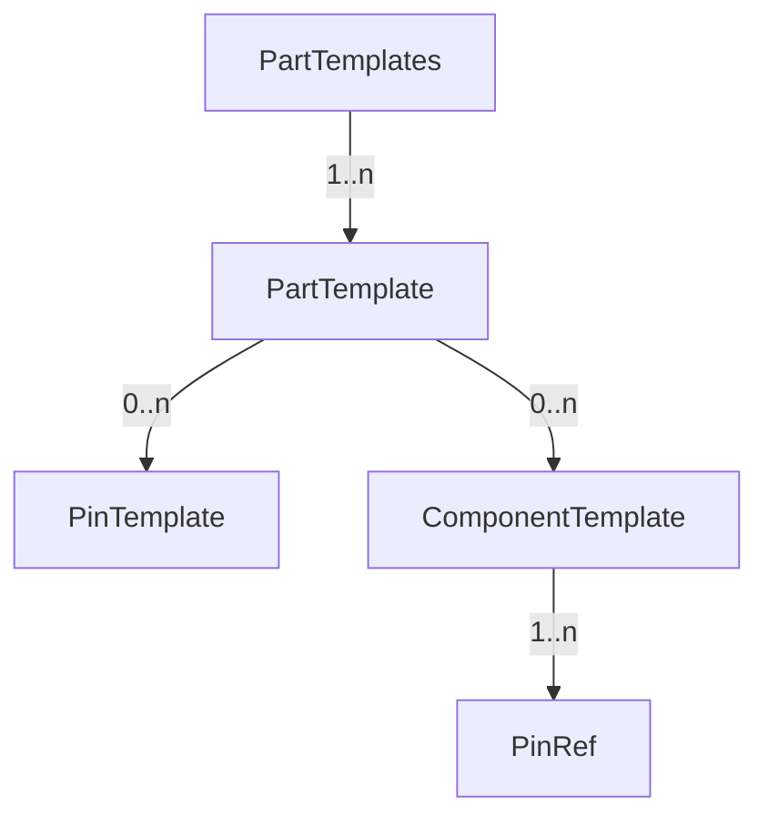

###### 实例化关系图

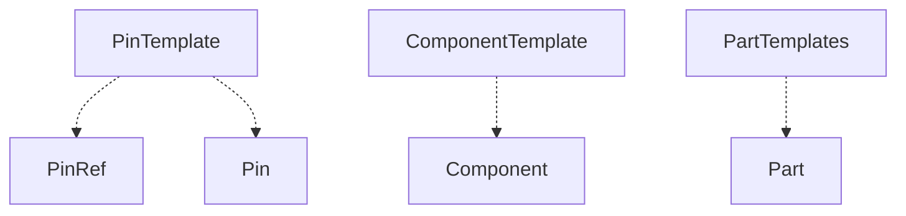

###### 包含关系图

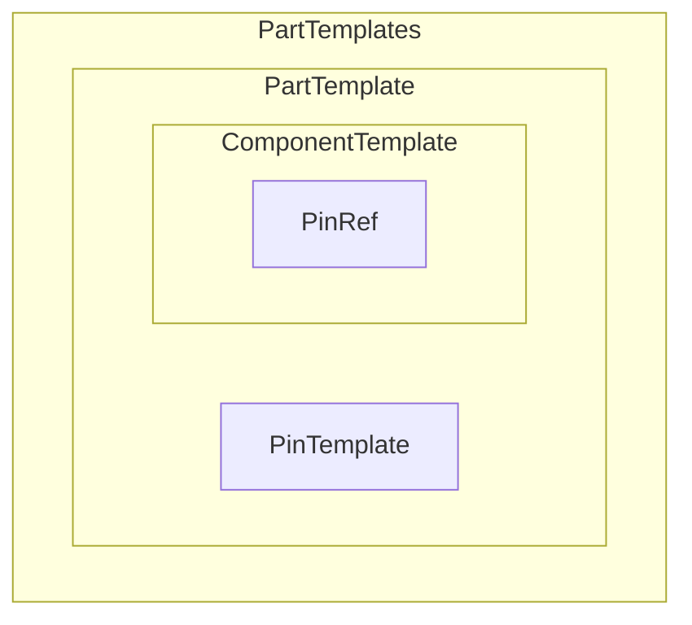


##### 5.3.4.1 PartTemplates元素

- PartTemplates(部件模板库)是PartTemplate元素的集合
- PartTemplates包含一个或多个 PartTemplate(部件模板)元素
- PartTemplates 元素不包含属性定义。

##### 5.3.4.2 PartTemplate元素

- PartTemplate元素表示某个型号的部件的模板
- PartTemplate元素包含零个或多个 PinTemplate (连接点模板)元素和ComponentTemplate(元件模板)元素
- PartTemplate 元素的

###### PartTemplate元素格式定义

示例：

```xml
<PartTemplate name="NR.NR1101F" desc="CPU插件"

              manufacturer="NR" type="NR1101F" class="Board">

    <PinTemplate>

        <!--PinTemplate 元素-->

    </PinTemplate>

    <ComponentTemplate>

        <!--ComponentTemplate 元素-->

    </ComponentTemplate>

</PartTemplate>
```

- 描述储纤盒时，不含PinTemplate元素和ComponentTemplate元素。

- 端子排的下个层级是没有Part元素的
- 端子排端子的下个层级存在Part，且到Part为止，不在有下个层级
- 所以端子排没有PartTemplate，端子排端子有PartTemplate

- 空开、压板、按钮、继电器的下个层级都有Part元素，且到Part为止，不在有下个层级
- 所以空开、压板、按钮、继电器有PartTemplate，其器件端子没有PartTemplate

- 转换开关的下个层级有Part元素，且其Part元素还可有下个层级
- 所以转换开关有PartTemplate，其器件端子有PartTemplate。

###### PartTemplate元素属性定义

| 属性名称     | 属性说明             | 属性值类型 | 值范围或值说明                                               | O/M/C |
| ------------ | -------------------- | ---------- | ------------------------------------------------------------ | ----- |
| name         | 部件的名称           | 文本       | 建议采用“制造商名称.部件型号”进行命名。该属性应在一个 IPD、SPD、CPD 文件中唯一 | M     |
| desc         | 部件的描述           | 文本       | Light表示指示灯，Power表示电源，Printer表示打印机，Meter表示表计，WFLock表示五防锁，RTK表示空调，PP表示风扇，Thermostat表示温控器，Other表示其他。<font color=red>[可视化不可用]</font> | O     |
| type         | 部件的型号           | 文本       |                                                              | M     |
| manufacturer | 部件的制造厂商的名称 | 文本       | 例如：NR（南京南瑞）、NARI（国电南瑞）洛阳华泰、PXC（菲尼克斯）、CZBR(常州博瑞)、Nader、四方、中元华电、南自、XJ(许继<font color=red>[取大写字母缩写]</font>)、天水、成都沪嘉华通 | M     |
| class        | 部件的类型           | 枚举       | 枚举:IED(智能设备)、ODF（光纤配线架）、Switch（交换机）、Terminal（端子）<font color=red>[指端子排中一片端子，用SubDevice表示]</font>)、Button（按钮）、Board（板卡）、MCB（微型断路器）、Link（压板  ）、SelectionSwitch（转换开关  ）、IndicationLight（指示灯  ）、Relay（继电器）、Other（其他未列举的类型） | M     |

##### 5.3.4.3 PinTemplate元素

- PinTemplate元素表示部件模板中的接线端子、光纤接口、以太网口等可对外进行连接的连接点。

###### PinTemplate元素格式定义

根据连接点类型的不同，PinTemplate 元素可以包含不同的附加属性。

示例：

```xml
<PartTemplate>
    <PinTemplate name="2" desc="RS485-A" type=" TerminalPin"/>
    <PinTemplate name="E1" desc="网口 1" type="RJ45"/>
    <PinTemplate name="G1:RX" desc="GOOSE1" type="Fiber" fiberType="SM" portType="LC"/>
    <PinTemplate name="1" side="Internal"/>
    <!--type 缺省，默认为 TerminalPin-->
</PartTemplate>
```

示例：每个装置的下个层级都有Part，对应有PartTemplate，PartTemplate的下个层级都有PinTemplate name=GND

```xml
<PartTemplate name="NR.ZD_PCS-9705-DA-1" type="PCS-9705-DA-1" class="IED" desc="测控装置" manufacturer="NR">
    <PinTemplate name="GND" type="TerminalPin"/>
    <ComponentTemplate name="1" group="Logic" type="PE_1">
        <PinTemplateRef pinIndex="1" pinName="GND"/>
    </ComponentTemplate>
</PartTemplate>
```

示例：每个板卡的下个层级都有Part，对应有PartTemplate，PartTemplate的下个层级可能会有PinTemplate name=GND，也可能没有

```xml
<PartTemplate name="NR.CJ_NR1307A" type="NR1307A" class="Board" desc="电源插件" manufacturer="NR">
    <PinTemplate name="GND" type="TerminalPin"/>
    <PinTemplate name="01" type="TerminalPin"/>
    <PinTemplate name="02" type="TerminalPin"/>
    <ComponentTemplate name="GND" group="Logic" type="PE_1">
        <PinTemplateRef pinIndex="1" pinName="GND"/>
    </ComponentTemplate>
</PartTemplate>    
```

示例：端子排端子下个层级有Part，对应的有PartTemplate，普通端子排端子有4个连接点，双层端子排端子有6个连接点

```xml
<PartTemplate name="PXC.UK 5 N" type="UK 5 N" class="Terminal" desc="直通式接线端子" manufacturer="PXC">
    <PinTemplate name="1" type="TerminalPin" side="Internal"/>
    <PinTemplate name="2" type="TerminalPin" side="External"/>
    <PinTemplate name="3" type="SaddleJumper"/>
    <PinTemplate name="4" type="SaddleJumper"/>
    <ComponentTemplate name="1" group="Connector" type="Terminal_Jumper_4">
        <PinTemplateRef pinIndex="1" pinName="1"/>
        <PinTemplateRef pinIndex="2" pinName="2"/>
        <PinTemplateRef pinIndex="3" pinName="3"/>
        <PinTemplateRef pinIndex="4" pinName="4"/>
    </ComponentTemplate>
</PartTemplate>
```

示例：对于压板、空开、按钮、转换开关、空开、继电器、其他等来说，连接点的名称即为器件端子名称

###### PinTemplate元素属性定义

| 属性名称     | 属性说明         | 属性值类型 | 值范围或值说明                                               | O/M/C |
| ------------ | ---------------- | ---------- | ------------------------------------------------------------ | ----- |
| name         | 连接点的名称     | 文本       | 属性不为空且在一个部件模板下应唯一<br /><font color=blue>当表示端口时，格式为“端口序号-端口方向”；<br />1.端口序号为大写字符A-Z或从1开始的十进制数；<br />2.端口方向的枚举值为Tx，Rx，RT；其中Tx表示本端口发送，Rx表示本端口接收，RT表示本端口收发；<br />3.当为板卡内电子元件，且CAD图纸中没有标识的情况时，按照格式“.标识.虚拟连接点%随机数”命名；<br /></font> | M     |
| desc         | 连接点的功能描述 | 文本       | Diode（二极管）、Resistance（电阻）、CPU（CPU）、Optocoupler（光耦）、ZenerDiode（稳压二极管）、U(电压线圈)、I(电流线圈)、电容、Other（其他）<font color=red>[不能用于判可视化回路]</font> | O     |
| type         | 连接点的类型     | 枚举       | 枚举：TerminalPin（接线端子）  、SaddleJumper（鞍形跳线，用于端子短连片连接）、RJ45（RJ45 接口）、Fiber（光纤接口）、Other（其他） | M     |
| side         | 连接点内侧、外侧 | 枚举       | 枚举类值为 External外部/Inernal内部。   对于端子，此属性不为空。 | C     |
| crossSection | 最大导线截面积   | 浮点数     | 单位：㎟  当type=TerminalPin时，存在此属性                   | O     |
| fiberType    | 光纤类型         | 枚举       | 枚举值 SM、   MM。SM 指单模，MM指多模。当type=Fiber时，存在此属性<font color=blue>[光纤按传输模式分为单模光纤（Single Mode Fiber）和多模光纤（Multi Mode Fiber）。光以一特定的入射角度射入光纤，在光纤和包层间发生全发射，当直径较小时，只允许一个方向的光通过，即为单模光纤；当光纤直径较大时，可以允许光以多个入射角射入并传播，此时就称为多模光纤]</font> | O     |
| portType     | 光纤接头类型     | 枚举       | 枚举值为 FC、ST、LC、SC  当type=Fiber时，存在此属性          | O     |


##### 5.3.4.4 ComponentTemplate元素

- ComponentTemplate元件模板元素表示电气设备上的由一个或多个连接点组成的、实现一个特定功能的逻辑单元
- ComponentTemplate 元素包含零个或多个 PinRef 连接点引用。<font color=blue>[应该改为ComponentTemplate 元素包含1个或多个 PinRef 连接点引用]</font>

###### ComponentTemplate元素格式定义

根据类型的不同，ComponentTemplate 元素可以包含不同的附加属性，见附录 A。

示例：

```xml
<ComponentTemplate name="1" desc="RS485-A" group="Connector" type="Terminal_2_4">
    <PinRef name="1"/>
    <PinRef name="2"/>
    <PinRef name="3"/>
    <PinRef name="4"/>
</ComponentTemplate>
```

- 每个装置的下个层级都有Part，对应有PartTemplate，PartTemplate的下个层级都有PinTemplate name=GND（储纤盒除外），PartTemplate的下个层级都有ComponentTemplate；

- ODF的光口都是单独写ComponentTemplate的；

示例：

```xml
<PartTemplate name="NR.ZD_PCS-9705-DA-1" type="PCS-9705-DA-1" class="IED" desc="测控装置" manufacturer="NR">
    <PinTemplate name="GND" type="TerminalPin"/>
    <ComponentTemplate name="1" group="Logic" type="PE_1">
        <PinRef pinIndex="1" pinName="GND"/>
    </ComponentTemplate>
</PartTemplate>
```

- PartTemplate的下个层级有PinTemplate时，必定有ComponentTemplate；PartTemplate的下个层级没有PinTemplate时，必定没有ComponentTemplate；

- 所有ComponentTemplate的下个层级PinRef都是取的PinTemplate中某一个或几个，组合而成；备用的PinTemplate，可能不会出现在ComponentTemplate的PinRef中。

###### ComponentTemplate元素属性定义

| 属性名称 | 属性说明       | 属性值类型 | 值范围或值说明                                               | O/M/C |
| -------- | -------------- | ---------- | ------------------------------------------------------------ | ----- |
| name     | 元件模板的名称 | 文本       | 在一个部件模板下应唯一，可采用流水号进行命名                 | M     |
| desc     | 元件模板的描述 | 文本       | 其他元件描述<font color=blue>[在模板中为空，在实例化显示描述中Component元素中的desc取端子所在的core的描述；含多个Point时，去掉公共端与N相，取相同部分文字；]</font> | O     |
| group    | 元件模板的分组 | 枚举       | 当core没有描述时，取空；枚举值见附录                         | M     |
| type     | 元件模板的类型 | 枚举       | 枚举值见附录NCA6_2                                           | M     |

##### 5.3.4.5 PinRef元素

- PinRef元素表示元件模板 ComponentTemplate 中引用的连接点。

###### PinRef 元素属性定义

| 属性名称 | 属性说明     | 属性值类型 | 值范围或值说明               | O/M/C |
| -------- | ------------ | ---------- | ---------------------------- | ----- |
| pinIndex | 连接点序号   | 整数       | 元件模板对应类型的连接点序号 | M     |
| pinName  | 连接点的名称 | 文本       | 引用连接点的名称             | M     |


## 附录A：元件模板

黄色部分为修改后的

### A.1、Connector连接件分组

Connector连接件分组包含端子、插针、隔离端子等的元件模板类型，见表A.1

表A.1 Connector分组的元件模板类型

| 序号         | 类型type            | 连接点  数量 | 说明                                                         | 参考图例 | 附加属性         | 属性  类型 | 属性  说明                                                   |
| ------------ | ------------------- | ------------ | ------------------------------------------------------------ | -------- | ---------------- | ---------- | ------------------------------------------------------------ |
| 1.           | Terminal_Jumper_3   | **3**        | 端子，可以连接短连片，3个连接点，连接点1/2分别为端子两侧<font color=blue>[1为外侧，2为内侧]</font>，连接点3为端子的上下连接 |          | withstandVoltage | 浮点型     | 端子耐受电压(V)                                              |
| 2.           | Terminal_Jumper_5   | 5            | 双进双出端子，无短连片，5个连接点，连接点1、2和3、4分别为一层端子两侧，连接点5为短连片连接点 |          | withstandVoltage | 浮点型     | 端子耐受电压(V)                                              |
| 3.           | Terminal_2          | 2            | 端子，无短连片，2个连接点，连接点1/2分别为端子两侧           |          | withstandVoltage | 浮点型     | 端子耐受电压(V)<font color=blue>[理解为不存在这种端子排端子，因为实际上端子排端子必定可以连接短接端子的，只是实际接线有没有接短接端子的问题，不能因为实际接线没有接短接端子就选择这个模板；]</font> |
| 4.           | Terminal_4          | 4            | 双进双出端子，无短连片，4个连接点，连接点1、2和3、4分别为一层端子两侧 |          | withstandVoltage | 浮点型     | 端子耐受电压(V)                                              |
| 5.           | Pin_Male_2          | 2            | 公插针，2个连接点，连接点1是公插针连接点，连接点2为插接点    |          |                  |            |                                                              |
| 6.           | Pin_Female_2        | 2            | 母插针，2个连接点，连接点1是母插针连接点，连接点2为插接点    |          |                  |            |                                                              |
| 7.           | Pin_MaleFemale_2    | 2            | 公母插针，连接点1是母插针连接点，连接点2为公插针连接点       |          |                  |            |                                                              |
| 8.           | FiberPin_Female_2   | 2            | 光纤插座，2个连接点，连接点2为插接点                         |          |                  |            |                                                              |
| 9.           | Socket_2            | 2            | 插座，2个连接点。                                            |          | ratedVoltage     | 浮点型     | 额定电压(V)                                                  |
| ratedCurrent | 浮点型              | 额定电流(A)  |                                                              |          |                  |            |                                                              |
| 10.          | Socket_3            | 3            | 插座，3个连接点，连接点3为PE。                               |          | ratedVoltage     | 浮点型     | 额定电压(V)                                                  |
| ratedCurrent | 浮点型              | 额定电流(A)  |                                                              |          |                  |            |                                                              |
| 11.          | IsolatingTerminal_2 | 2            | 用于断开或隔离端子，2个连接点。                              |          |                  |            |                                                              |
| 12.          | IsolatingTerminal_3 | 3            | 用于断开或隔离端子，3个连接点。连接点2为公共端。             |          |                  |            |                                                              |
| 13.          | BusBar_n            | n            | 母线，连接点可以为任意数量                                   |          |                  |            |                                                              |
| 14.          | Connector_Other     | n            | 其他直接连接的类型，连接点可为任意数量。                     |          |                  |            |                                                              |


### A.2、Logic逻辑设备分组

Logic分组由继电保护装置等逻辑设备的包含交流电流、交流电压、开关量输入等元件模板类型，见表A.2

表A.2 Logic分组的元件模板类型

| 序号                     | 类型type     | 连接点数量         | 说明                                                         | 参考图例                                                     | 附加属性                  | 属性类型 | 属性说明                                                     |
| ------------------------ | ------------ | ------------------ | ------------------------------------------------------------ | ------------------------------------------------------------ | ------------------------- | -------- | ------------------------------------------------------------ |
| 1.                       | AICT_2       | 2                  | 交流电流模拟量采样，连接点1为极性端，连接点2为非极性端       |  | ratedFrequency            | 浮点型   | 额定频率（Hz）                                               |
| ratedCurrent             | 枚举         | 额定电流1A或5A     |                                                              |                                                              |                           |          |                                                              |
| ratedLoss                | 浮点型       | 额定功耗（W）      |                                                              |                                                              |                           |          |                                                              |
| accuracy                 | 浮点型       | 保护通道精度（％） |                                                              |                                                              |                           |          |                                                              |
| operatingRange           | 浮点型       | 线性工作范围       |                                                              |                                                              |                           |          |                                                              |
| 2.                       | AIPT_2       | 2                  | 交流电压模拟量采样，连接点1为极性端，连接点2为非极性端       |  | ratedFrequency            | 浮点型   | 额定频率（Hz）                                               |
| ratedCurrent             | 浮点型       | 额定电压（V）      |                                                              |                                                              |                           |          |                                                              |
| ratedLoss                | 浮点型       | 额定功耗（W）      |                                                              |                                                              |                           |          |                                                              |
| accuracy                 | 浮点型       | 保护通道精度（％） |                                                              |                                                              |                           |          |                                                              |
| operatingRange           | 浮点型       | 线性工作范围       |                                                              |                                                              |                           |          |                                                              |
| 3.                       | AIDCA_2      | 2                  | 直流电流模拟量采样，连接点1为正极，连接点2为负极             |  | inputRange                | 浮点型   | 输入范围，ma                                                 |
| input Impedance          | 浮点型       | 输入阻抗(Ω)        |                                                              |                                                              |                           |          |                                                              |
| accuracy                 | 浮点型       | 采样精度（％）     |                                                              |                                                              |                           |          |                                                              |
| 4.                       | AIDCV_2      | 2                  | 直流电压模拟量采样，连接点1为正极，连接点2为负极             |  | inputRange                | 浮点型   | 输入范围(V)                                                  |
| input Impedance          | 浮点型       | 输入阻抗(Ω)        |                                                              |                                                              |                           |          |                                                              |
| accuracy                 | 浮点型       | 采样精度（％）     |                                                              |                                                              |                           |          |                                                              |
| 5.                       | BI_2         | 2                  | 开关量输入                                                   |  | ratedVoltage              | 浮点型   | 额定电压(V)                                                  |
| ratedCurrent             | 浮点型       | 额定电流(A)        |                                                              |                                                              |                           |          |                                                              |
| start-up  Voltage        | 浮点型       | 启动电压(V)        |                                                              |                                                              |                           |          |                                                              |
| return Voltage           | 浮点型       | 返回电压(V)        |                                                              |                                                              |                           |          |                                                              |
| withstand  Voltage Level | 浮点型       | 耐压水平(V)        |                                                              |                                                              |                           |          |                                                              |
| 6.                       | BONO_2       | 2                  | 常开接点开关量输出                                           |  | maximumOperating  Voltage | 浮点型   | 最高工作电压(V)                                              |
| startTime                | 浮点型       | 启动时间(ms)       |                                                              |                                                              |                           |          |                                                              |
| returnTime               | 浮点型       | 返回时间(ms)       |                                                              |                                                              |                           |          |                                                              |
| 7.                       | BONC_2       | 2                  | 常闭接点开关量输出                                           |  | 同BONO_2                  |          |                                                              |
| 8.                       | BONOC_3      | 3                  | 常闭常开接点输出，连接点1为COM，连接点2为常闭节点，连接点3为常开节点 |  | 同BONO_2                  |          |                                                              |
| 9.                       | RS232_3      | 3                  | RS232串口，连接点1为RXD,连接点2为TXD，连接点3为信号地        |  | comType                   | 枚举     | 枚举值为PRT、Modbus、Other。缺省值为Other。当包含多个枚举值时，使用\|分隔。 |
| 10.                      | RS485_2      | 2                  | RS485串口，连接点1为RS485_A，连接点2为RS485_B。              |  | comType                   | 枚举     | 枚举值为IEC103、IRIG-B、Modbus、Other。缺省值为Other。当包含多个枚举值时，使用\|分隔，例如Modbus\|IEC103。 |
| 11.                      | RS485_3      | 3                  | RS485串口，连接点1为RS485_A，连接点2为RS485_B，连接点3为信号地 |  |                           |          |                                                              |
| 12.                      | RS485_4      | 4                  | RS485串口，连接点1为RS485_A，连接点2为RS485_B，连接点3为信号地，连接点4为屏蔽地 |  |                           |          |                                                              |
| 13.                      | ETH_1        | 1                  | 以太网口                                                     |  | comType                   | 枚举     | 枚举值为MMS、GOOSE、SV、SGM、HLDC、IRIG-B、Other。缺省值为Other。当包含多个枚举值时，使用\|分隔，例如MMS\|GOOSE |
| 14.                      | Fiber_RX_1   | 1                  | 光纤接口，连接点1为接收                                      |  |                           |          |                                                              |
| 15.                      | Fiber_TX_1   | 1                  | 光纤接口，连接点1为发送                                      |  |                           |          |                                                              |
| 16.                      | Fiber_RXTX_2 | 2                  | 光纤接口，连接点1为接收，连接点2为发送                       |  |                           |          |                                                              |
| 17.                      | PE_1         | 1                  | 接地                                                         |  |                           |          |                                                              |
| 18.                      | Logic_Other  | n                  | 其他逻辑设备的元件模板类型，连接点数量不限                   |                                                              |                           |          |                                                              |

### A.3、SCP开关、控制和保护分组

SCP(Switchgear,controlgear and protective device)开关、控制和保护分组由断路器、隔离开关、熔断器、按钮、转换开关、线圈等元件模板类型，见表A.3

表A.3 SCP分组的元件模板类型

| 序号              | 类型type                        | 连接点数量                | 说明                                                         | 参考图例                                                     | 附加属性                   | 属性类型 | 属性说明            |
| ----------------- | ------------------------------- | ------------------------- | ------------------------------------------------------------ | ------------------------------------------------------------ | -------------------------- | -------- | ------------------- |
| 1.                | CB_2                            | 2                         | 单相断路器                                                   |  | ratedVol                   | 整型     | 额定电压(V)         |
| lnm               | 整型                            | 壳架等级额定电流(A)       |                                                              |                                                              |                            |          |                     |
| rscc              | 整型                            | 额定短路分断电流(KA)      |                                                              |                                                              |                            |          |                     |
| stwc              | 整型                            | 短时耐受电流(KA)          |                                                              |                                                              |                            |          |                     |
| sdptUpperLimit    | 浮点型                          | 短延时保护时间上限(S)     |                                                              |                                                              |                            |          |                     |
| sdptLowerLimit    | 浮点型                          | 短延时保护时间下限(S)     |                                                              |                                                              |                            |          |                     |
| fullBreakTime     | 浮点型                          | 全分断时间(S)             |                                                              |                                                              |                            |          |                     |
| faultClearingTime | 浮点型                          | 故障切除时间(S)           |                                                              |                                                              |                            |          |                     |
| InR               | 浮点型                          | 内阻(mΩ)                  |                                                              |                                                              |                            |          |                     |
| itcLowerLimit     | 浮点型                          | 瞬时脱扣范围最小值（A）   |                                                              |                                                              |                            |          |                     |
| itcUpperLimit     | 浮点型                          | 瞬时脱扣范围最大值（A）   |                                                              |                                                              |                            |          |                     |
| sdpcLowerLimit    | 浮点型                          | 短延时脱扣范围最小值（A） |                                                              |                                                              |                            |          |                     |
| sdpcUpperLimit    | 浮点型                          | 短延时脱扣范围最大值（A） |                                                              |                                                              |                            |          |                     |
| 2.                | CB_4                            | 4                         | 两极断路器，                                                 |  | 同CB_2[[58\]](#_msocom_58) |          |                     |
| 3.                | CB_6                            | 6                         | 三相断路器                                                   |  | 同CB_2                     |          |                     |
| 4.                | CB_8                            | 8                         | 四极断路器                                                   |  | 同CB_2                     |          |                     |
| 5.                | Disconnector_2                  | 2                         | 单相隔离开关                                                 |  | ratedVol                   | 整型     | 额定电压(V)         |
| ratedCurrent      | 整型                            | 额定电流(A)               |                                                              |                                                              |                            |          |                     |
| 6.                | Disconnector_4                  | 4                         | 两极隔离开关                                                 |  | ratedVol                   | 整型     | 额定电压(V)         |
| ratedCurrent      | 整型                            | 额定电流(A)               |                                                              |                                                              |                            |          |                     |
| 7.                | Disconnector_6                  | 6                         | 三相隔离开关                                                 |  | ratedVol                   | 整型     | 额定电压(V)         |
| ratedCurrent      | 整型                            | 额定电流(A)               |                                                              |                                                              |                            |          |                     |
| 8.                | Fuse_2                          | 2                         | 熔断器                                                       |  | ratedVol                   | 整型     | 额定电压(V)         |
| ratedCurrent      | 整型                            | 额定电流(A)               |                                                              |                                                              |                            |          |                     |
| icu               | 浮点型                          | 极限分断能力(A)           |                                                              |                                                              |                            |          |                     |
| inR               | 浮点型                          | 内阻(R)                   |                                                              |                                                              |                            |          |                     |
| 9.                | RelayCoil_2[[59\]](#_msocom_59) | 2                         | 继电器线圈                                                   |  | time                       | 整型     | 继电器动作时间（S） |
| 10.               | LathingCoil_3                   | 3                         | 磁保持继电器线圈，连接点1为继电器动作输入，连接点2为公共端，连接点3为继电器复归输入。 |  | time                       | 整型     | 继电器动作时间（S） |
| 11.               | LathingCoil_4                   | 4                         | 磁保持继电器线圈，连接点1、2为继电器动作输入，连接点3、4为继电器复归输入。 |  | actionTime                 | 浮点型   | 继电器动作时间（S） |
| 12.               | PickupDelayCoil_2               | 2                         | 吸合延时继电器线圈                                           |  | actionTime                 | 浮点型   | 继电器动作时间（S） |
| 13.               | DropoutDelayCoil_2              | 2                         | 动作复归继电器线圈                                           |  | actionTime                 | 浮点型   | 继电器动作时间（S） |
| 14.               | MakeContact_2                   | 2                         | 常开触点                                                     |  |                            |          |                     |
| 15.               | BreakContact_2                  | 2                         | 常闭触点                                                     |  |                            |          |                     |
| 16.               | ChangeoverContact_3             | 3                         | 转换触点，连接点1为常闭触点，连接点2为公共端，连接点3为常开触点 |  |                            |          |                     |
| 17.               | DelayedOpeningNO_2              | 2                         | 断开延时常开触点                                             |  | delayTime                  | 浮点型   | 动作延时（S）       |
| 18.               | DelayedClosingNO_2              | 2                         | 吸合延时常开触点                                             |  | delayTime                  | 浮点型   | 动作延时（S）       |
| 19.               | DelayedOpeningNC_2              | 2                         | 断开延时常闭触点                                             |  | delayTime                  | 浮点型   | 动作延时（S）       |
| 20.               | DelayedClosingNC_2              | 2                         | 吸合延时常闭触点                                             |  | delayTime                  | 浮点型   | 动作延时（S）       |
| 21.               | DelayedOpeningCO_3              | 3                         | 断开延时转换触点，连接点1为常闭触点，连接点2为公共端，连接点3为常开触点 |  | delayTime                  | 浮点型   | 动作延时（S）       |
| 22.               | DelayedClosingCO_3              | 3                         | 吸合延时转换触点，连接点1为常闭触点，连接点2为公共端，连接点3为常开触点 |  | delayTime                  | 浮点型   | 动作延时（S）       |
| 23.               | PushbuttonNO_2                  | 2                         | 按钮常开触点                                                 |  |                            |          |                     |
| 24.               | PushbuttonNC_2                  | 2                         | 按钮常闭触点                                                 |  |                            |          |                     |
| 25.               | PushbuttonCO_3                  | 3                         | 按钮转换触点，连接点1为常闭触点，连接点2为公共端，连接点3为常开触点 |  |                            |          |                     |
| 26.               | SwitchNO_2                      | 2                         | 转换开关常开触点                                             |  |                            |          |                     |
| 27.               | SwitchNC_2                      | 2                         | 转换开关常闭触点                                             |  |                            |          |                     |
| 28.               | LimitSwitchNO_2                 | 2                         | 限位开关常开触点                                             |  |                            |          |                     |
| 29.               | LimitSwitchNC_2                 | 2                         | 限位开关常闭触点                                             |  |                            |          |                     |
| 30.               | LimitSwitchCO_3                 | 3                         | 限位开关转换触点，连接点1为常闭触点，连接点2为公共端，连接点3为常开触点 |  |                            |          |                     |
| 31.               | SCP_Other                       | n                         | 其他逻辑设备的元件模板类型，连接点数量不限                   |                                                              |                            |          |                     |

### A.4、MLS测量仪表、灯和信号器件分组

MLS(Measuring instrument,lamps and signaling devices) 测量仪表、灯和信号器件等元件模板类型，见表A.4

表A.4 MLS分组的元件模板类型

| 序号      | 类型type         | 连接点数量      | 说明                                       | 参考图例                                                     | 附加属性 | 属性类型 | 属性说明     |
| --------- | ---------------- | --------------- | ------------------------------------------ | ------------------------------------------------------------ | -------- | -------- | ------------ |
| 1.        | IndicatorLight_2 | 2               | 信号指示灯，2个连接点                      |  | voltage  | 字符串   | 输入电压范围 |
| power     | 浮点数           | 额定功率，单位W |                                            |                                                              |          |          |              |
| 2.        | Galvanometer_2   | 2               | 电流计，2 个连接点                         |  | range    | 浮点数   | 量程范围，A  |
| precision | 浮点数           | 测量精度％      |                                            |                                                              |          |          |              |
| 3.        | Voltmeter_2      | 2               | 电压计，2 个连接点                         |  | range    | 浮点数   | 量程范围，A  |
| precision | 浮点数           | 测量精度％      |                                            |                                                              |          |          |              |
| 4.        | ElectricBell_2   | 2               | 电铃/警铃，信号设备,发声,单个,2 个连接点   |  |          |          |              |
| 5.        | MLS_n            | n               | 其他逻辑设备的元件模板类型，连接点数量不限 |                                                              |          |          |              |

### A.5、PCE电能的发生与转换分组

PCE(Production and conversion of electric energy)电能的发生与转换元件模板类型，包含变压器、电压互感器、电流互感器等元件类型，见表A.5

表A.5 SCP分组的元件模板类型

| 序号                     | 类型type  | 连接点数量      | 说明                                      | 参考图例                                                     | 附加属性            | 属性类型 | 属性说明        |
| ------------------------ | --------- | --------------- | ----------------------------------------- | ------------------------------------------------------------ | ------------------- | -------- | --------------- |
| 1.                       | PT_4      | 4               | 变压器, 4 个连接点 (输入: 1+3, 输出: 2+4) |  | ratedPrimaryCurrent | 浮点型   | 额定一次电流(A) |
| ratedPrimaryVoltage      | 浮点型    | 额定一次电压(V) |                                           |                                                              |                     |          |                 |
| ratedCapacity            | 浮点型    | 额定容量(VA)    |                                           |                                                              |                     |          |                 |
| ratedTransformationRatio | 浮点型    | 额定变比        |                                           |                                                              |                     |          |                 |
| ratedSecondaryCurrent    | 浮点型    | 额定二次电流(A) |                                           |                                                              |                     |          |                 |
| ratedSecondaryVoltage    | 浮点型    | 额定二次电压(V) |                                           |                                                              |                     |          |                 |
| error                    | 浮点型    | 误差(％)        |                                           |                                                              |                     |          |                 |
| accuracyLevel            | 浮点型    | 准确级          |                                           |                                                              |                     |          |                 |
| 2.                       | PT_2      | 2               | 电压互感器线圈，2个连接点                 |  | 同PT_4              |          |                 |
| 3.                       | CT _2     | 2               | 电流互感器， 2个连接点                    |  | ratedPrimaryCurrent | 浮点型   | 额定一次电流(A) |
| ratedPrimaryVoltage      | 浮点型    | 额定一次电压(V) |                                           |                                                              |                     |          |                 |
| ratedCapacity            | 浮点型    | 额定容量(VA)    |                                           |                                                              |                     |          |                 |
| ratedSecondaryCurrent    | 浮点型    | 额定二次电流(A) |                                           |                                                              |                     |          |                 |
| accuracyLevel            | 字符串    | 准确级          |                                           |                                                              |                     |          |                 |
| 4.                       | CT_4      | 4               | 电流互感器，  4个连接点                   |  | 同CT_2              |          |                 |
| 5.                       | ACMotor_3 | 3               | 带有 PE 的电机,3 个连接点                 |  | power               | 浮点数   | 额定功率，单位W |
| RatedCurrent             | 浮点型    | 额定电流（A）   |                                           |                                                              |                     |          |                 |
| RatedVol                 | 浮点型    | 额定电压（V）   |                                           |                                                              |                     |          |                 |
| 6.                       | ACMotor_2 | 2               | 无 PE 和绕组的电机,2 个连接点             |  | power               | 浮点数   | 额定功率，单位W |
| ratedCurrent             | 浮点型    | 额定电流（A）   |                                           |                                                              |                     |          |                 |
| ratedVol                 | 浮点型    | 额定电压（V）   |                                           |                                                              |                     |          |                 |


### A.6、BPC基本无源元件

BPC(Basic passive components)基本无源元件模板类型，见表A.5

表A.6 BPC分组的元件模板类型

| 序号       | 类型type               | 连接点数量    | 说明                                       | 参考图例                                                     | 附加属性       | 属性类型 | 属性说明               |
| ---------- | ---------------------- | ------------- | ------------------------------------------ | ------------------------------------------------------------ | -------------- | -------- | ---------------------- |
| 1.         | Resistance_2           | 2             | 单一电阻，2个连接点                        |  | resistance     | 浮点型   | 电阻的阻值，R          |
| 2.         | AdjustableResistance_3 | 3             | 电阻，范围可调，3 个连接点                 |  | variable Range | 浮点型   | 滑动变阻器可调范围，％ |
| resistance | 浮点型                 | 电阻的阻值，R |                                            |                                                              |                |          |                        |
| 3.         | Capacitance_2          | 2             | 电容,可变电容，2个连接点                   |  | capacitance    | 浮点型   | 电容的容智，C          |
| 4.         | BPC_n                  | n             | 其他逻辑设备的元件模板类型，连接点数量不限 |                                                              |                |          |                        |


### A.7、SQQ符号要素、限定符号和其他常用符号

SQO(Symbol elements,qualifying symbols and other symbols have general application) 符号要素、限定符号和其他常用符号等元件模板类型，见表A.7

表A.7 SQQ分组的元件模板类型

| 序号 | 类型type | 连接点数量 | 说明                | 参考图例                                                     |
| ---- | -------- | ---------- | ------------------- | ------------------------------------------------------------ |
| 1    | GND_1    | 1          | 接地符号，1个连接点 |  |

### A.8、电源模块分组

PM(PowerModule) 电源模块等元件模板类型，见表A.8。

表A.8 PM分组的元件模板类型

| 序号                | 类型type    | 连接点数量          | 说明                                                       | 参考图例                                                     | 附加属性           | 属性类型 | 属性说明      |
| ------------------- | ----------- | ------------------- | ---------------------------------------------------------- | ------------------------------------------------------------ | ------------------ | -------- | ------------- |
| 1.                  | PowerIn_2   | 2                   | 电源模块输入，连接点1为电源输入+或L，连接点2为电源输入-或N |  | voltage            | 字符串   | 输入电压范围  |
| power               | 浮点数      | 输入额定功率，单位W |                                                            |                                                              |                    |          |               |
| 2.                  | PowerOut_2  | 2                   | 电源模块输出                                               |  | voltage            | 字符串   | 输出电压范围  |
| power               | 浮点数      | 输出额定功率，单位W |                                                            |                                                              |                    |          |               |
| 3.                  | STR_BATA_2  | 2                   | 电池，两个连接点                                           |  | signalVol          | 浮点型   | 单体电压      |
| nominalVol          | 整型        | 系统标称电压(V)     |                                                            |                                                              |                    |          |               |
| floatingChargeVol   | 浮点型      | 浮充电压(V)         |                                                            |                                                              |                    |          |               |
| equalizingChargeVol | 浮点型      | 均充电压(V)         |                                                            |                                                              |                    |          |               |
| finalChargingVol    | 浮点型      | 放电终止电压(V)     |                                                            |                                                              |                    |          |               |
| accDischargeTime    | 浮点型      | 事故放电时间（s）   |                                                            |                                                              |                    |          |               |
| capFactor           | 浮点型      | 容量系数Kc          |                                                            |                                                              |                    |          |               |
| cap                 | 浮点型      | 蓄电池容量（Ah）    |                                                            |                                                              |                    |          |               |
| InR                 | 浮点型      | 内阻(mΩ)            |                                                            |                                                              |                    |          |               |
| 4.                  | PW_Change_4 | 4                   | 电源变换模块，4个连接点                                    |  | signalRatedCurrent | 浮点型   | 额定电流（A） |
| signalRatedVol      | 浮点型      | 额定电压（V）       |                                                            |                                                              |                    |          |               |
| inputVol            | 整型        | 交流输入电压（V）   |                                                            |                                                              |                    |          |               |
| 5.                  | DC_n        | n                   | 其他逻辑设备的元件模板类型，连接点数量不限                 |                                                              |                    |          |               |

### A.9、新加分组

KZ(kuozhan)扩展元件模板类型，见表A.9。

表A.8 PM分组的元件模板类型

| 序号                                                         | 类型type     | 连接点数量          | 说明                                                       | 参考图例                                                     | 附加属性           | 属性类型 | 属性说明                                                     |
| ------------------------------------------------------------ | ------------ | ------------------- | ---------------------------------------------------------- | ------------------------------------------------------------ | ------------------ | -------- | ------------------------------------------------------------ |
|                                                              | CTerminal_1  | **1**               | 端子排端子、压板端子等元件端子；1个连接点                  |                                                              |                    |          |                                                              |
| 1.                                                           | Terminal_1   | **1**               | 板卡端子，1个连接点                                        |  |                    |          |                                                              |
| 2.                                                           | AI_2         | 2                   | 任意一组逻辑单元，  连接点1为极性端，连接点2为非极性端     |  |                    |          |                                                              |
| 3.                                                           | NO_2         | 2                   | 一组并联的常开触点，含2个元件编号                          |  | text1              | 文本1    |                                                              |
| text2                                                        | 文本2        |                     |                                                            |                                                              |                    |          |                                                              |
| 4.                                                           | NO_3         | 2                   | 一组并联的常开触点，含3个元件编号                          |                                                              | text1              | 文本1    |                                                              |
| text2                                                        | 文本2        |                     |                                                            |                                                              |                    |          |                                                              |
|  | text3        | 文本3               |                                                            |                                                              |                    |          |                                                              |
| 5.                                                           | NO_4         | 4                   | 一组并联的常开触点，含4个元件编号                          |  | text1              | 文本     |                                                              |
| text2                                                        | 文本         |                     |                                                            |                                                              |                    |          |                                                              |
| text3                                                        | 文本         |                     |                                                            |                                                              |                    |          |                                                              |
| text4                                                        | 文本         |                     |                                                            |                                                              |                    |          |                                                              |
| 6.                                                           | PW_Change_2  | 2                   | 电源变换模块，2个连接点[[60\]](#_msocom_60)                |  | signalRatedCurrent | 浮点型   | 额定电流（A）                                                |
| signalRatedVol                                               | 浮点型       | 额定电压（V）       |                                                            |                                                              |                    |          |                                                              |
| inputVol                                                     | 整型         | 交流输入电压（V）   |                                                            |                                                              |                    |          |                                                              |
| 7                                                            | LAN_1        | 1                   |                                                            |  | comType            | 枚举     | 枚举值为MMS、GOOSE、SV、SGM、HLDC、IRIG-B、Other。缺省值为Other。当包含多个枚举值时，使用\|分隔，例如MMS\|GOOSE |
|                                                              | RS485_2      | 2                   | RS485串口，连接点1为RS485_A，连接点2为RS485_B。            |  | comType            | 枚举     | 枚举值为IEC103、IRIG-B、Modbus、Other。缺省值为Other。当包含多个枚举值时，使用\|分隔，例如Modbus\|IEC103。 |
|                                                              | PowerIn_2    | 2                   | 电源模块输入，连接点1为电源输入+或L，连接点2为电源输入-或N |  | voltage            | 字符串   | 输入电压范围                                                 |
| power                                                        | 浮点数       | 输入额定功率，单位W |                                                            |                                                              |                    |          |                                                              |
|                                                              | PowerOut_2   | 2                   | 电源模块输出                                               |  | voltage            | 字符串   | 输入电压范围                                                 |
| power                                                        | 浮点数       | 输入额定功率，单位W |                                                            |                                                              |                    |          |                                                              |
|                                                              | Fiber_RXTX_2 | 2                   | 光纤接口，连接点1为接收，连接点2为发送                     |  |                    |          |                                                              |
|                                                              | TY_3         | 3                   | 通用接口，连接点1为极性，连接点2为非极性，连接点3为接地    |  |                    |          |                                                              |
|                                                              |              |                     |                                                            |                                                              |                    |          |                                                              |


### A.10图框模板

**若使用图框模板，建议采用如下两个，或者软件自己用代码画出；**

#### 1.  模板一

屏柜布置图、柜内元件图、装置背板图、材料表图、二次原理图，可都使用模板一


#### 2.  模板二

端子排图使用模板二


## 附录B：各类模型文件示例文件

### B.1、IPD文件示例

IPD文件格式示例：

```xml
<?xml version="1.0" encoding="utf-8" ?>
<IPD version="2021" revision="A">
    <Device name="1-1n" iedName="default" desc="线路保护装置">
        <Part name="NR.ZD_PCS-931A-DA-G-G9" num="1"/>
        <SubDevice name="01">
            <Part name="NR.CJ_NR1101F" num="1"/>
        </SubDevice>
        <SubDevice name="04">
            <Part name="NR.CJ_NR1161H" num="1"/>
        </SubDevice>
        <SubDevice name="05">
            <Part name="NR.CJ_NR1213BM" num="1"/>
        </SubDevice>
        <SubDevice name="07">
            <Part name="NR.CJ_NR1136A" num="1"/>
        </SubDevice>
        <SubDevice name="08">
            <Part name="NR.CJ_NR1502D" num="1">
                <Component name="BI_01" desc="对时"/>
                <Component name="BI_02" desc="打印"/>
                <Component name="BI_03" desc="检修状态投入" icdRef="S1.LD0.GGIO3.lnd1.stVal"/>
                <Component name="BI_04" desc="信号复归" icdRef="S1.LD0.GGIO3.lnd2.stVal"/>
                <Component name="BI_14" desc="远方操作投入" icdRef="S1.LD0.GGIO3.lnd3.stVal"/>
                <Component name="BI_OPT" desc="光耦监视"/>
            </Part>
        </SubDevice>
        <SubDevice name="P1">
            <Part name="NR.CJ_NR1301M" num="1">
                <Component name="PWR" desc="装置电源"/>
                <Component name="BO_FAIL1" desc="装置闭锁"/>
                <Component name="BO_ALM1" desc="装置报警"/>
            </Part>
        </SubDevice>
    </Device>
    <PartTemplates>
        <PartTemplate name="NR.ZD_PCS-931A-FA-G-G9" type="PCS-931A-FA-G-G9" class="IED"
                      desc="超高压输电线路成套保护装置" manufacturer="NR">
            <PinTemplate name="GND" type="TerminalPin"/>
            <ComponentTemplate name="1" group="Logic" type="PE_1">
                <PinRef pinIndex="1" pinName="GND"/>
            </ComponentTemplate>
        </PartTemplate>
        <PartTemplate name="NR.CJ_NR1101F" type="NR1101F" class="Board" desc="CPU插件" manufacturer="NR">
            <PinTemplate name="01" type="TerminalPin"/>
            <PinTemplate name="02" type="TerminalPin"/>
            <PinTemplate name="03" type="TerminalPin"/>
            <PinTemplate name="04" type="TerminalPin"/>
            <PinTemplate name="05" type="TerminalPin"/>
            <PinTemplate name="06" type="TerminalPin"/>
            <PinTemplate name="07" type="TerminalPin"/>
            <PinTemplate name="08" type="TerminalPin"/>
            <PinTemplate name="09" type="TerminalPin"/>
            <PinTemplate name="10" type="TerminalPin"/>
            <PinTemplate name="11" type="TerminalPin"/>
            <PinTemplate name="12" type="TerminalPin"/>
            <PinTemplate name="13" type="TerminalPin"/>
            <PinTemplate name="14" type="TerminalPin"/>
            <PinTemplate name="15" type="TerminalPin"/>
            <PinTemplate name="16" type="TerminalPin"/>
            <PinTemplate name="E1" type="RJ45"/>
            <PinTemplate name="E2" type="RJ45"/>
            <PinTemplate name="E3" type="RJ45"/>
            <ComponentTemplate name="Ethernet1" desc="以太网口1" group="Logic" type="ETH_1" comType="MMS">
                <PinRef pinIndex="1" pinName="E1"/>
            </ComponentTemplate>
            <ComponentTemplate name="Ethernet2" desc="以太网口2" group="Logic" type="ETH_1" comType="MMS">
                <PinRef pinIndex="1" pinName="E2"/>
            </ComponentTemplate>
            <ComponentTemplate name="Ethernet3" desc="以太网口3" group="Logic" type="ETH_1" comType="MMS">
                <PinRef pinIndex="1" pinName="E3"/>
            </ComponentTemplate>
            <ComponentTemplate name="RS485_1" desc="RS485串口1" group="Logic" type="RS485_4" comType="IEC103|Modbus">
                <PinRef pinIndex="1" pinName="01"/>
                <PinRef pinIndex="2" pinName="02"/>
                <PinRef pinIndex="3" pinName="03"/>
                <PinRef pinIndex="4" pinName="04"/>
            </ComponentTemplate>
            <ComponentTemplate name="RS485_2" desc="RS485串口2" group="Logic" type="RS485_4" comType="IEC103|Modbus">
                <PinRef pinIndex="1" pinName="05"/>
                <PinRef pinIndex="2" pinName="06"/>
                <PinRef pinIndex="3" pinName="07"/>
                <PinRef pinIndex="4" pinName="08"/>
            </ComponentTemplate>
            <ComponentTemplate name="SYN" desc="对时" group="Logic" type="RS485_4" comType="IRIG-B">
                <PinRef pinIndex="1" pinName="09"/>
                <PinRef pinIndex="2" pinName="10"/>
                <PinRef pinIndex="3" pinName="11"/>
                <PinRef pinIndex="4" pinName="12"/>
            </ComponentTemplate>
            <ComponentTemplate name="PRT" desc="打印" group="Logic" type="RS232_3" comType="PRT">
                <PinRef pinIndex="1" pinName="13"/>
                <PinRef pinIndex="2" pinName="14"/>
                <PinRef pinIndex="3" pinName="15"/>
            </ComponentTemplate>
        </PartTemplate>
        <PartTemplate name="NR.CJ_NR1161H" type="NR1161H" class="Board" desc="DSP插件" manufacturer="NR"></PartTemplate>
        <PartTemplate name="NR.CJ_NR1136A" type="NR1136A" class="Board" desc="GOOSE插件" manufacturer="NR">
            <PinTemplate name="E1:TX" type="LC" fiberType="MM"/>
            <PinTemplate name="E2:TX" type="LC" fiberType="MM"/>
            <PinTemplate name="E3:TX" type="LC" fiberType="MM"/>
            <PinTemplate name="E4:TX" type="LC" fiberType="MM"/>
            <PinTemplate name="E5:TX" type="LC" fiberType="MM"/>
            <PinTemplate name="E6:TX" type="LC" fiberType="MM"/>
            <PinTemplate name="E7:TX" type="LC" fiberType="MM"/>
            <PinTemplate name="E8:TX" type="LC" fiberType="MM"/>
            <PinTemplate name="E1:RX" type="LC" fiberType="MM"/>
            <PinTemplate name="E2:RX" type="LC" fiberType="MM"/>
            <PinTemplate name="E3:RX" type="LC" fiberType="MM"/>
            <PinTemplate name="E4:RX" type="LC" fiberType="MM"/>
            <PinTemplate name="E5:RX" type="LC" fiberType="MM"/>
            <PinTemplate name="E6:RX" type="LC" fiberType="MM"/>
            <PinTemplate name="E7:RX" type="LC" fiberType="MM"/>
            <PinTemplate name="E8:RX" type="LC" fiberType="MM"/>
            <ComponentTemplate name="Ethernet1" desc="GOOSE1" group="Logic" type="Fiber_RXTX_2" comType="MMS">
                <PinRef pinIndex="1" pinName="E1:RX"/>
                <PinRef pinIndex="2" pinName="E1:TX"/>
            </ComponentTemplate>
            <ComponentTemplate name="Ethernet2" desc="GOOSE2" group="Logic" type="Fiber_RXTX_2" comType="MMS">
                <PinRef pinIndex="1" pinName="E2:RX"/>
                <PinRef pinIndex="2" pinName="E2:TX"/>
            </ComponentTemplate>
            <ComponentTemplate name="Ethernet3" desc="GOOSE3" group="Logic" type="Fiber_RXTX_2" comType="MMS">
                <PinRef pinIndex="1" pinName="E3:RX"/>
                <PinRef pinIndex="2" pinName="E3:TX"/>
            </ComponentTemplate>
            <ComponentTemplate name="Ethernet4" desc="GOOSE4" group="Logic" type="Fiber_RXTX_2" comType="MMS">
                <PinRef pinIndex="1" pinName="E4:RX"/>
                <PinRef pinIndex="2" pinName="E4:TX"/>
            </ComponentTemplate>
            <ComponentTemplate name="Ethernet5" desc="GOOSE5" group="Logic" type="Fiber_RXTX_2" comType="MMS">
                <PinRef pinIndex="1" pinName="E5:RX"/>
                <PinRef pinIndex="2" pinName="E5:TX"/>
            </ComponentTemplate>
            <ComponentTemplate name="Ethernet6" desc="GOOSE6" group="Logic" type="Fiber_RXTX_2" comType="MMS">
                <PinRef pinIndex="1" pinName="E6:RX"/>
                <PinRef pinIndex="2" pinName="E6:TX"/>
            </ComponentTemplate>
            <ComponentTemplate name="Ethernet7" desc="GOOSE7" group="Logic" type="Fiber_RXTX_2" comType="MMS">
                <PinRef pinIndex="1" pinName="E7:RX"/>
                <PinRef pinIndex="2" pinName="E7:TX"/>
            </ComponentTemplate>
            <ComponentTemplate name="Ethernet8" desc="GOOSE8" group="Logic" type="Fiber_RXTX_2" comType="MMS">
                <PinRef pinIndex="1" pinName="E8:RX"/>
                <PinRef pinIndex="2" pinName="E8:TX"/>
            </ComponentTemplate>
        </PartTemplate>
        <PartTemplate name="NR.CJ_NR1301M" type="NR1301M" class="Board" desc="电源插件" manufacturer="NR">
            <PinTemplate name="GND" type="TerminalPin"/>
            <PinTemplate name="01" type="TerminalPin"/>
            <PinTemplate name="02" type="TerminalPin"/>
            <PinTemplate name="03" type="TerminalPin"/>
            <PinTemplate name="04" type="TerminalPin"/>
            <PinTemplate name="05" type="TerminalPin"/>
            <PinTemplate name="06" type="TerminalPin"/>
            <PinTemplate name="07" type="TerminalPin"/>
            <PinTemplate name="08" type="TerminalPin"/>
            <PinTemplate name="09" type="TerminalPin"/>
            <PinTemplate name="10" type="TerminalPin"/>
            <PinTemplate name="11" type="TerminalPin"/>
            <PinTemplate name="12" type="TerminalPin"/>
            <ComponentTemplate name="GND" group="Logic" type="PE_1">
                <PinRef pinIndex="1" pinName="GND"/>
            </ComponentTemplate>
            <ComponentTemplate name="PWR" desc="电源" group="Logic" type="PowerIn_2" voltage="AC88V-AC264V/DC88V-DC264V"
                               power="20">
                <PinRef pinIndex="1" pinName="09"/>
                <PinRef pinIndex="2" pinName="11"/>
            </ComponentTemplate>
            <ComponentTemplate name="24V_OUT" desc="24V电源输出" group="Logic" type="PowerOut_2" voltage="DC24V">
                <PinRef pinIndex="1" pinName="10"/>
                <PinRef pinIndex="2" pinName="11"/>
            </ComponentTemplate>
            <ComponentTemplate name="BO_FAIL1" desc="装置闭锁1" group="Logic" type="BONC_2">
                <PinRef pinIndex="1" pinName="01"/>
                <PinRef pinIndex="2" pinName="02"/>
            </ComponentTemplate>
            <ComponentTemplate name="BO_ALM1" desc="装置报警1" group="Logic" type="BONO_2">
                <PinRef pinIndex="1" pinName="01"/>
                <PinRef pinIndex="2" pinName="03"/>
            </ComponentTemplate>
            <ComponentTemplate name="BO_FAIL2" desc="装置闭锁2" group="Logic" type="BONC_2">
                <PinRef pinIndex="1" pinName="04"/>
                <PinRef pinIndex="2" pinName="05"/>
            </ComponentTemplate>
            <ComponentTemplate name="BO_ALM2" desc="装置报警2" group="Logic" type="BONO_2">
                <PinRef pinIndex="1" pinName="04"/>
                <PinRef pinIndex="2" pinName="06"/>
            </ComponentTemplate>
        </PartTemplate>
        <PartTemplate name="NR.CJ_NR1502D" type="NR1502D" class="Board" desc="开入插件" manufacturer="NR">
            <PinTemplate name="01" type="TerminalPin"/>
            <PinTemplate name="02" type="TerminalPin"/>
            <PinTemplate name="03" type="TerminalPin"/>
            <PinTemplate name="04" type="TerminalPin"/>
            <PinTemplate name="05" type="TerminalPin"/>
            <PinTemplate name="06" type="TerminalPin"/>
            <PinTemplate name="07" type="TerminalPin"/>
            <PinTemplate name="08" type="TerminalPin"/>
            <PinTemplate name="09" type="TerminalPin"/>
            <PinTemplate name="10" type="TerminalPin"/>
            <PinTemplate name="11" type="TerminalPin"/>
            <PinTemplate name="12" type="TerminalPin"/>
            <PinTemplate name="13" type="TerminalPin"/>
            <PinTemplate name="14" type="TerminalPin"/>
            <PinTemplate name="15" type="TerminalPin"/>
            <PinTemplate name="16" type="TerminalPin"/>
            <PinTemplate name="17" type="TerminalPin"/>
            <PinTemplate name="18" type="TerminalPin"/>
            <PinTemplate name="19" type="TerminalPin"/>
            <PinTemplate name="20" type="TerminalPin"/>
            <PinTemplate name="21" type="TerminalPin"/>
            <PinTemplate name="22" type="TerminalPin"/>
            <PinTemplate name="23" type="TerminalPin"/>
            <PinTemplate name="24" type="TerminalPin"/>
            <PinTemplate name="25" type="TerminalPin"/>
            <PinTemplate name="26" type="TerminalPin"/>
            <PinTemplate name="27" type="TerminalPin"/>
            <PinTemplate name="28" type="TerminalPin"/>
            <PinTemplate name="29" type="TerminalPin"/>
            <PinTemplate name="30" type="TerminalPin"/>
            <ComponentTemplate name="BI_01" desc="开入1" group="Logic" type="BI_2">
                <PinRef pinIndex="1" pinName="01"/>
                <PinRef pinIndex="2" pinName="15"/>
            </ComponentTemplate>
            <ComponentTemplate name="BI_02" desc="开入2" group="Logic" type="BI_2">
                <PinRef pinIndex="1" pinName="02"/>
                <PinRef pinIndex="2" pinName="15"/>
            </ComponentTemplate>
            <ComponentTemplate name="BI_03" desc="开入3" group="Logic" type="BI_2">
                <PinRef pinIndex="1" pinName="03"/>
                <PinRef pinIndex="2" pinName="15"/>
            </ComponentTemplate>
            <ComponentTemplate name="BI_04" desc="开入4" group="Logic" type="BI_2">
                <PinRef pinIndex="1" pinName="04"/>
                <PinRef pinIndex="2" pinName="15"/>
            </ComponentTemplate>
            <ComponentTemplate name="BI_05" desc="开入5" group="Logic" type="BI_2">
                <PinRef pinIndex="1" pinName="05"/>
                <PinRef pinIndex="2" pinName="15"/>
            </ComponentTemplate>
            <ComponentTemplate name="BI_06" desc="开入6" group="Logic" type="BI_2">
                <PinRef pinIndex="1" pinName="06"/>
                <PinRef pinIndex="2" pinName="15"/>
            </ComponentTemplate>
            <ComponentTemplate name="BI_07" desc="开入7" group="Logic" type="BI_2">
                <PinRef pinIndex="1" pinName="07"/>
                <PinRef pinIndex="2" pinName="15"/>
            </ComponentTemplate>
            <ComponentTemplate name="BI_08" desc="开入8" group="Logic" type="BI_2">
                <PinRef pinIndex="1" pinName="08"/>
                <PinRef pinIndex="2" pinName="15"/>
            </ComponentTemplate>
            <ComponentTemplate name="BI_09" desc="开入9" group="Logic" type="BI_2">
                <PinRef pinIndex="1" pinName="09"/>
                <PinRef pinIndex="2" pinName="15"/>
            </ComponentTemplate>
            <ComponentTemplate name="BI_10" desc="开入10" group="Logic" type="BI_2">
                <PinRef pinIndex="1" pinName="10"/>
                <PinRef pinIndex="2" pinName="15"/>
            </ComponentTemplate>
            <ComponentTemplate name="BI_11" desc="开入11" group="Logic" type="BI_2">
                <PinRef pinIndex="1" pinName="11"/>
                <PinRef pinIndex="2" pinName="15"/>
            </ComponentTemplate>
            <ComponentTemplate name="BI_12" desc="开入12" group="Logic" type="BI_2">
                <PinRef pinIndex="1" pinName="12"/>
                <PinRef pinIndex="2" pinName="15"/>
            </ComponentTemplate>
            <ComponentTemplate name="BI_13" desc="开入13" group="Logic" type="BI_2">
                <PinRef pinIndex="1" pinName="17"/>
                <PinRef pinIndex="2" pinName="15"/>
            </ComponentTemplate>
            <ComponentTemplate name="BI_14" desc="开入14" group="Logic" type="BI_2">
                <PinRef pinIndex="1" pinName="18"/>
                <PinRef pinIndex="2" pinName="15"/>
            </ComponentTemplate>
            <ComponentTemplate name="BI_15" desc="开入15" group="Logic" type="BI_2">
                <PinRef pinIndex="1" pinName="19"/>
                <PinRef pinIndex="2" pinName="15"/>
            </ComponentTemplate>
            <ComponentTemplate name="BI_16" desc="开入16" group="Logic" type="BI_2">
                <PinRef pinIndex="1" pinName="20"/>
                <PinRef pinIndex="2" pinName="15"/>
            </ComponentTemplate>
            <ComponentTemplate name="BI_17" desc="开入17" group="Logic" type="BI_2">
                <PinRef pinIndex="1" pinName="21"/>
                <PinRef pinIndex="2" pinName="15"/>
            </ComponentTemplate>
            <ComponentTemplate name="BI_18" desc="开入18" group="Logic" type="BI_2">
                <PinRef pinIndex="1" pinName="22"/>
                <PinRef pinIndex="2" pinName="15"/>
            </ComponentTemplate>
            <ComponentTemplate name="BI_19" desc="开入19" group="Logic" type="BI_2">
                <PinRef pinIndex="1" pinName="23"/>
                <PinRef pinIndex="2" pinName="15"/>
            </ComponentTemplate>
            <ComponentTemplate name="BI_20" desc="开入20" group="Logic" type="BI_2">
                <PinRef pinIndex="1" pinName="24"/>
                <PinRef pinIndex="2" pinName="15"/>
            </ComponentTemplate>
            <ComponentTemplate name="BI_21" desc="开入21" group="Logic" type="BI_2">
                <PinRef pinIndex="1" pinName="25"/>
                <PinRef pinIndex="2" pinName="15"/>
            </ComponentTemplate>
            <ComponentTemplate name="BI_22" desc="开入22" group="Logic" type="BI_2">
                <PinRef pinIndex="1" pinName="26"/>
                <PinRef pinIndex="2" pinName="15"/>
            </ComponentTemplate>
            <ComponentTemplate name="BI_23" desc="开入23" group="Logic" type="BI_2">
                <PinRef pinIndex="1" pinName="27"/>
                <PinRef pinIndex="2" pinName="15"/>
            </ComponentTemplate>
            <ComponentTemplate name="BI_24" desc="开入24" group="Logic" type="BI_2">
                <PinRef pinIndex="1" pinName="28"/>
                <PinRef pinIndex="2" pinName="15"/>
            </ComponentTemplate>
            <ComponentTemplate name="BI_25" desc="开入25" group="Logic" type="BI_2">
                <PinRef pinIndex="1" pinName="29"/>
                <PinRef pinIndex="2" pinName="15"/>
            </ComponentTemplate>
            <ComponentTemplate name="BI_OPT" desc="光耦电源监视" group="Logic" type="BI_2">
                <PinRef pinIndex="1" pinName="14"/>
                <PinRef pinIndex="2" pinName="15"/>
            </ComponentTemplate>
        </PartTemplate>
        <PartTemplate name="NR.CJ_NR1213BM" type="NR1213BM" class="Board" desc="通道板" manufacturer="NR">
            <PinTemplate name="TX1" type="FC" fiberType="SM"/>
            <PinTemplate name="RX1" type="FC" fiberType="SM"/>
            <PinTemplate name="TX2" type="FC" fiberType="SM"/>
            <PinTemplate name="RX2" type="FC" fiberType="SM"/>
            <ComponentTemplate name="HDLC1" desc="光纤通道1" group="Logic" type="Fiber_RXTX_2" comType="HDLC">
                <PinRef pinIndex="1" pinName="RX1"/>
                <PinRef pinIndex="2" pinName="TX1"/>
            </ComponentTemplate>
            <ComponentTemplate name="HDLC2" desc="光纤通道2" group="Logic" type="Fiber_RXTX_2" comType="HDLC">
                <PinRef pinIndex="1" pinName="RX2"/>
                <PinRef pinIndex="2" pinName="TX2"/>
            </ComponentTemplate>
        </PartTemplate>
    </PartTemplates>
</IPD>
```

​

​


### B.2、CPD文件示例

CPD文件格式示例：

```xml
<?xml version="1.0" encoding="utf-8" ?>
<CPD version="2021" revision="A">
    <Cubicle name="TEMPLATE" desc="220kV线路光差保护柜" class="Panel" type="PPC31A-DA-G" manufacturer="NR" height="2260"
             width="800" depth="600">
        <FunctionArea name="CommonArea" desc="公共回路">
            <Interface name="DCPWR1" desc="直流电源1" class="PWRIN" type="DC" voltage="220V">
                <Point type="+" deviceName="1ZD" subDeviceName="1" pinName="1"/>
                <Point type="-" deviceName="1ZD" subDeviceName="8" pinName="1"/>
            </Interface>
            <Interface name="DCPWR2" desc="直流电源2" class="PWRIN" type="DC" voltage="220V">
                <Point type="+" deviceName="2ZD" subDeviceName="1" pinName="1"/>
                <Point type="-" deviceName="2ZD" subDeviceName="8" pinName="1"/>
            </Interface>
            <Interface name="SYN" desc="对时回路" class="Communication" type="IRIG-B">
                <Point type="A" deviceName="TD" temrinalName="1" pinName="1"/>
                <Point type="B" deviceName="TD" temrinalName="2" pinName="1"/>
                <Point type="SGND" deviceName="TD" temrinalName="3" pinName="1"/>
                <Point type="SHLD" deviceName="TD" temrinalName="4" pinName="1"/>
            </Interface>
        </FunctionArea>            <!--柜内其他Device元素此处省略，详细示例见附录B-->
        <Device name="1-40n" desc="变电站网络交换机">
            <Part name="NR.ZD_NR-PCS9882-G-F16G4" num="1"/>
        </Device>
        <Device name="1-1QLP1" desc="" label="远方操作投入">
            <Part name="LYHT.XH17W2T/DKZ" num="1"/>
        </Device>                    <!--柜内其他Core元素此处省略-->
        <Core name="1" type="Wiring" startDeviceName="GND" endDeviceName="1-40n" endPinName="1"/>
        <Core name="11" type="SaddleJumper" startDeviceName="1ZD" startSubdeviceName="1" startPinName="3"
              endDeviceName="1ZD" endSubdeviceName="2" endPinName="3"></Core>
    </Cubicle>
    <PartTemplates>            <!--柜内其余PartTemplates元素见附录B-->
        <PartTemplate name="NR.ZD_NR-PCS9882-G-F16G4" type="NR-PCS9882-G-F16G4" class="Switch" desc="以太网交换机"
                      manufacturer="NR">
            <PinTemplate name="GND" type="TerminalPin"/>
            <PinTemplate name="1" type="TerminalPin" desc="GND"/>
            <PinTemplate name="2" type="TerminalPin" desc="PWR1+"/>
            <PinTemplate name="3" type="TerminalPin" desc="PWR1-"/>
            <PinTemplate name="4" type="TerminalPin" desc="PWR2+"/>
            <PinTemplate name="5" type="TerminalPin" desc="PWR2-"/>
            <PinTemplate name="6" type="TerminalPin" desc="BO_FAIL"/>
            <PinTemplate name="7" type="TerminalPin"/>
            <PinTemplate name="8" type="TerminalPin" desc="BO_ALM"/>
            <PinTemplate name="E1:TX" type="LC" fiberType="MM"/>
            <PinTemplate name="E2:TX" type="LC" fiberType="MM"/>
            <PinTemplate name="E3:TX" type="LC" fiberType="MM"/>
            <PinTemplate name="E4:TX" type="LC" fiberType="MM"/>
            <PinTemplate name="E5:TX" type="LC" fiberType="MM"/>
            <PinTemplate name="E6:TX" type="LC" fiberType="MM"/>
            <PinTemplate name="E7:TX" type="LC" fiberType="MM"/>
            <PinTemplate name="E8:TX" type="LC" fiberType="MM"/>
            <PinTemplate name="E9:TX" type="LC" fiberType="MM"/>
            <PinTemplate name="E10:TX" type="LC" fiberType="MM"/>
            <PinTemplate name="E11:TX" type="LC" fiberType="MM"/>
            <PinTemplate name="E12:TX" type="LC" fiberType="MM"/>
            <PinTemplate name="E13:TX" type="LC" fiberType="MM"/>
            <PinTemplate name="E14:TX" type="LC" fiberType="MM"/>
            <PinTemplate name="E15:TX" type="LC" fiberType="MM"/>
            <PinTemplate name="E16:TX" type="LC" fiberType="MM"/>
            <PinTemplate name="E17:TX" type="LC" fiberType="MM"/>
            <PinTemplate name="E18:TX" type="LC" fiberType="MM"/>
            <PinTemplate name="E19:TX" type="LC" fiberType="MM"/>
            <PinTemplate name="E20:TX" type="LC" fiberType="MM"/>
            <PinTemplate name="E1:RX" type="LC" fiberType="MM"/>
            <PinTemplate name="E2:RX" type="LC" fiberType="MM"/>
            <PinTemplate name="E3:RX" type="LC" fiberType="MM"/>
            <PinTemplate name="E4:RX" type="LC" fiberType="MM"/>
            <PinTemplate name="E5:RX" type="LC" fiberType="MM"/>
            <PinTemplate name="E6:RX" type="LC" fiberType="MM"/>
            <PinTemplate name="E7:RX" type="LC" fiberType="MM"/>
            <PinTemplate name="E8:RX" type="LC" fiberType="MM"/>
            <PinTemplate name="E9:RX" type="LC" fiberType="MM"/>
            <PinTemplate name="E10:RX" type="LC" fiberType="MM"/>
            <PinTemplate name="E11:RX" type="LC" fiberType="MM"/>
            <PinTemplate name="E12:RX" type="LC" fiberType="MM"/>
            <PinTemplate name="E13:RX" type="LC" fiberType="MM"/>
            <PinTemplate name="E14:RX" type="LC" fiberType="MM"/>
            <PinTemplate name="E15:RX" type="LC" fiberType="MM"/>
            <PinTemplate name="E16:RX" type="LC" fiberType="MM"/>
            <PinTemplate name="E17:RX" type="LC" fiberType="MM"/>
            <PinTemplate name="E18:RX" type="LC" fiberType="MM"/>
            <PinTemplate name="E19:RX" type="LC" fiberType="MM"/>
            <PinTemplate name="E20:RX" type="LC" fiberType="MM"/>
            <PinTemplate name="G1:TX" type="LC" fiberType="MM"/>
            <PinTemplate name="G1:RX" type="LC" fiberType="MM"/>
            <PinTemplate name="G2:TX" type="LC" fiberType="MM"/>
            <PinTemplate name="G2:RX" type="LC" fiberType="MM"/>
            <PinTemplate name="G3:TX" type="LC" fiberType="MM"/>
            <PinTemplate name="G3:RX" type="LC" fiberType="MM"/>
            <PinTemplate name="G4:TX" type="LC" fiberType="MM"/>
            <PinTemplate name="G4:RX" type="LC" fiberType="MM"/>
            <PinTemplate name="E21" type="RJ45"/>
            <PinTemplate name="E22" type="RJ45"/>
            <ComponentTemplate name="GND1" group="Logic" type="PE_1">
                <PinTemplateRef pinIndex="1" pinName="GND"/>
            </ComponentTemplate>
            <ComponentTemplate name="GND2" group="Logic" type="PE_1">
                <PinTemplateRef pinIndex="1" pinName="1"/>
            </ComponentTemplate>
            <ComponentTemplate name="PWR1" desc="电源1" group="Logic" type="PowerIn_2"
                               voltage="AC88V-AC264V/DC88V-DC264V" power="20">
                <PinTemplateRef pinIndex="1" pinName="2"/>
                <PinTemplateRef pinIndex="2" pinName="3"/>
            </ComponentTemplate>
            <ComponentTemplate name="PWR2" desc="电源2" group="Logic" type="PowerIn_2"
                               voltage="AC88V-AC264V/DC88V-DC264V" power="20">
                <PinTemplateRef pinIndex="1" pinName="4"/>
                <PinTemplateRef pinIndex="2" pinName="5"/>
            </ComponentTemplate>
            <ComponentTemplate name="BO_FAIL" desc="装置闭锁" group="Logic" type="BONC_2">
                <PinTemplateRef pinIndex="1" pinName="7"/>
                <PinTemplateRef pinIndex="2" pinName="6"/>
            </ComponentTemplate>
            <ComponentTemplate name="BO_ALM" desc="装置报警" group="Logic" type="BONO_2">
                <PinTemplateRef pinIndex="1" pinName="7"/>
                <PinTemplateRef pinIndex="2" pinName="8"/>
            </ComponentTemplate>
            <ComponentTemplate name="Ethernet1" desc="以太网口1" group="Logic" type="Fiber_RXTX_2">
                <PinTemplateRef pinIndex="1" pinName="E1:RX"/>
                <PinTemplateRef pinIndex="2" pinName="E1:TX"/>
            </ComponentTemplate>
            <ComponentTemplate name="Ethernet2" desc="以太网口2" group="Logic" type="Fiber_RXTX_2">
                <PinTemplateRef pinIndex="1" pinName="E2:RX"/>
                <PinTemplateRef pinIndex="2" pinName="E2:TX"/>
            </ComponentTemplate>
            <ComponentTemplate name="Ethernet3" desc="以太网口3" group="Logic" type="Fiber_RXTX_2">
                <PinTemplateRef pinIndex="1" pinName="E3:RX"/>
                <PinTemplateRef pinIndex="2" pinName="E3:TX"/>
            </ComponentTemplate>
            <ComponentTemplate name="Ethernet4" desc="以太网口4" group="Logic" type="Fiber_RXTX_2">
                <PinTemplateRef pinIndex="1" pinName="E4:RX"/>
                <PinTemplateRef pinIndex="2" pinName="E4:TX"/>
            </ComponentTemplate>
            <ComponentTemplate name="Ethernet5" desc="以太网口5" group="Logic" type="Fiber_RXTX_2">
                <PinTemplateRef pinIndex="1" pinName="E5:RX"/>
                <PinTemplateRef pinIndex="2" pinName="E5:TX"/>
            </ComponentTemplate>
            <ComponentTemplate name="Ethernet6" desc="以太网口6" group="Logic" type="Fiber_RXTX_2">
                <PinTemplateRef pinIndex="1" pinName="E6:RX"/>
                <PinTemplateRef pinIndex="2" pinName="E6:TX"/>
            </ComponentTemplate>
            <ComponentTemplate name="Ethernet7" desc="以太网口7" group="Logic" type="Fiber_RXTX_2">
                <PinTemplateRef pinIndex="1" pinName="E7:RX"/>
                <PinTemplateRef pinIndex="2" pinName="E7:TX"/>
            </ComponentTemplate>
            <ComponentTemplate name="Ethernet8" desc="以太网口8" group="Logic" type="Fiber_RXTX_2">
                <PinTemplateRef pinIndex="1" pinName="E8:RX"/>
                <PinTemplateRef pinIndex="2" pinName="E8:TX"/>
            </ComponentTemplate>
            <ComponentTemplate name="Ethernet9" desc="以太网口9" group="Logic" type="Fiber_RXTX_2">
                <PinTemplateRef pinIndex="1" pinName="E9:RX"/>
                <PinTemplateRef pinIndex="2" pinName="E9:TX"/>
            </ComponentTemplate>
            <ComponentTemplate name="Ethernet10" desc="以太网口10" group="Logic" type="Fiber_RXTX_2">
                <PinTemplateRef pinIndex="1" pinName="E10:RX"/>
                <PinTemplateRef pinIndex="2" pinName="E10:TX"/>
            </ComponentTemplate>
            <ComponentTemplate name="Ethernet11" desc="以太网口11" group="Logic" type="Fiber_RXTX_2">
                <PinTemplateRef pinIndex="1" pinName="E11:RX"/>
                <PinTemplateRef pinIndex="2" pinName="E11:TX"/>
            </ComponentTemplate>
            <ComponentTemplate name="Ethernet12" desc="以太网口12" group="Logic" type="Fiber_RXTX_2">
                <PinTemplateRef pinIndex="1" pinName="E12:RX"/>
                <PinTemplateRef pinIndex="2" pinName="E12:TX"/>
            </ComponentTemplate>
            <ComponentTemplate name="Ethernet13" desc="以太网口13" group="Logic" type="Fiber_RXTX_2">
                <PinTemplateRef pinIndex="1" pinName="E13:RX"/>
                <PinTemplateRef pinIndex="2" pinName="E13:TX"/>
            </ComponentTemplate>
            <ComponentTemplate name="Ethernet14" desc="以太网口14" group="Logic" type="Fiber_RXTX_2">
                <PinTemplateRef pinIndex="1" pinName="E14:RX"/>
                <PinTemplateRef pinIndex="2" pinName="E14:TX"/>
            </ComponentTemplate>
            <ComponentTemplate name="Ethernet15" desc="以太网口15" group="Logic" type="Fiber_RXTX_2">
                <PinTemplateRef pinIndex="1" pinName="E15:RX"/>
                <PinTemplateRef pinIndex="2" pinName="E15:TX"/>
            </ComponentTemplate>
            <ComponentTemplate name="Ethernet16" desc="以太网口16" group="Logic" type="Fiber_RXTX_2">
                <PinTemplateRef pinIndex="1" pinName="E16:RX"/>
                <PinTemplateRef pinIndex="2" pinName="E16:TX"/>
            </ComponentTemplate>
            <ComponentTemplate name="Ethernet17" desc="以太网口17" group="Logic" type="Fiber_RXTX_2">
                <PinTemplateRef pinIndex="1" pinName="G1:RX"/>
                <PinTemplateRef pinIndex="2" pinName="G1:TX"/>
            </ComponentTemplate>
            <ComponentTemplate name="Ethernet18" desc="以太网口18" group="Logic" type="Fiber_RXTX_2">
                <PinTemplateRef pinIndex="1" pinName="G2:RX"/>
                <PinTemplateRef pinIndex="2" pinName="G2:TX"/>
            </ComponentTemplate>
            <ComponentTemplate name="Ethernet19" desc="以太网口19" group="Logic" type="Fiber_RXTX_2">
                <PinTemplateRef pinIndex="1" pinName="G3:RX"/>
                <PinTemplateRef pinIndex="2" pinName="G3:TX"/>
            </ComponentTemplate>
            <ComponentTemplate name="Ethernet20" desc="以太网口20" group="Logic" type="Fiber_RXTX_2">
                <PinTemplateRef pinIndex="1" pinName="G4:RX"/>
                <PinTemplateRef pinIndex="2" pinName="G4:TX"/>
            </ComponentTemplate>
            <ComponentTemplate name="Ethernet21" desc="以太网口21" group="Logic" type="ETH_1">
                <PinTemplateRef pinIndex="1" pinName="E21"/>
            </ComponentTemplate>
            <ComponentTemplate name="Ethernet22" desc="以太网口22" group="Logic" type="ETH_1">
                <PinTemplateRef pinIndex="1" pinName="E22"/>
            </ComponentTemplate>
        </PartTemplate>
    </PartTemplates>
</CPD> 
```

### B.3、SPD文件示例

SPD文件格式示例：

```xml
<?xml version="1.0" encoding="utf-8" ?>
<SPD version="2021" revision="A">
    <Substation name="CY" desc="朝阳220kV变电站 " gridName="JS" areaName="CZ" voltage="220kV">
        <Region name="U2" desc="220kV变电场区" area="false">
            <Cubicle name="=KDL01+LSP" desc="220kVGIS智能控制柜"
                     class="MK">                <!--Cubicle元素此处省略，示例见附录B-->              </Cubicle>
            <Cubicle name="=KDL01+UT1" desc="220kV电流互感器端子箱"
                     class="UT">                <!--Cubicle元素此处省略，示例见附录B-->              </Cubicle>
            <Cubicle name="=KDL01+UT2" desc="220kV断路器本体机构箱"
                     class="BD">                <!--Cubicle元素此处省略，示例见附录B-->              </Cubicle>
        </Region>
        <Region name="21Room" desc="220kV预制舱" area="false">
            <Cubicle name="=KDL01+RS1" desc="220kV线路光差保护柜" class="Panel" type="PPC31A-DA-G" manufacturer="NR"
                     height="2260" width="800"
                     depth="600">                <!--Cubicle元素此处省略，示例见附录B-->              </Cubicle>
        </Region>
        <Bay name="=KDL01" desc="220kV出线1间隔">
            <DeviceRef cubicleName="=KDL01+LSP" deviceName="1-4n"/>
            <DeviceRef cubicleName="=KDL01+LSP" deviceName="1-13n"/>
            <DeviceRef cubicleName="=KDL01+RS1" deviceName="1-1n"/>
            <DeviceRef cubicleName="=KDL01+RS1" deviceName="1-21n"/>
            <Cable name="301" desc="" coreNum="4" crossSection="6" startCubicle="=KDL01+UT1" endCubicle="=KDL01+LSP"
                   class="Cable" type="ZR-KVVP 4*6">
                <Core name="1" type="Wire" crossSection="6" startDeviceName="LCP" startSubDeviceName="1"
                      startPinName="1" endDeviceName="1-13ID" endSubDeviceName="1" endPinName="1" designation="A411"
                      desc="保护1电流A相"/>
                <Core name="2" type="Wire" crossSection="6" startDeviceName="LCP" startSubDeviceName="2"
                      startPinName="1" endDeviceName="1-13ID" endSubDeviceName="2" endPinName="1" designation="B411"
                      desc="保护1电流B相"/>
                <Core name="3" type="Wire" crossSection="6" startDeviceName="LCP" startSubDeviceName="3"
                      startPinName="1" endDeviceName="1-13ID" endSubDeviceName="3" endPinName="1" designation="C411"
                      desc="保护1电流C相"/>
                <Core name="4" type="Wire" crossSection="6" startDeviceName="LCP" startSubDeviceName="9"
                      startPinName="1" endDeviceName="1-13ID" endSubDeviceName="4" endPinName="1" designation="N411"
                      desc="保护1电流N相"/>
            </Cable>
            <Cable name="302" desc="" coreNum="4" crossSection="6" startCubicle="=KDL01+UT1" endCubicle="=KDL01+LSP"
                   class="Cable" type="ZR-KVVP 4*6">
                <Core name="1" type="Wire" crossSection="6" startDeviceName="LCP" startSubDeviceName="25"
                      startPinName="1" endDeviceName="1-13ID" endSubDeviceName="9" endPinName="1" designation="A431"
                      desc="测量电流A相"/>
                <Core name="2" type="Wire" crossSection="6" startDeviceName="LCP" startSubDeviceName="26"
                      startPinName="1" endDeviceName="1-13ID" endSubDeviceName="10" endPinName="1" designation="B431"
                      desc="测量电流B相"/>
                <Core name="3" type="Wire" crossSection="6" startDeviceName="LCP" startSubDeviceName="27"
                      startPinName="1" endDeviceName="1-13ID" endSubDeviceName="11" endPinName="1" designation="C431"
                      desc="测量电流C相"/>
                <Core name="4" type="Wire" crossSection="6" startDeviceName="LCP" startSubDeviceName="33"
                      startPinName="1" endDeviceName="1-13ID" endSubDeviceName="12" endPinName="1" designation="N431"
                      desc="测量电流N相"/>
            </Cable>
            <Cable name="303" desc="" coreNum="10" crossSection="2.5" startCubicle="=KDL01+UT2" endCubicle="=KDL01+LSP"
                   class="Cable" type="ZR-KVVP 10*2.5">
                <Core name="1" type="Wire" crossSection="2.5" startDeviceName="X1" startSubDeviceName="5"
                      startPinName="1" endDeviceName="1-4C1D" endSubDeviceName="1" endPinName="1" designation="I3-11"
                      desc="A相断路器跳圈1"/>
                <Core name="2" type="Wire" crossSection="2.5" startDeviceName="X2" startSubDeviceName="5"
                      startPinName="1" endDeviceName="1-4C1D" endSubDeviceName="2" endPinName="1" designation="I3-14"
                      desc="B相断路器跳圈1"/>
                <Core name="3" type="Wire" crossSection="2.5" startDeviceName="X3" startSubDeviceName="5"
                      startPinName="1" endDeviceName="1-4C1D" endSubDeviceName="3" endPinName="1" designation="I3-17"
                      desc="C相断路器跳圈1"/>
                <Core name="4" type="Wire" crossSection="2.5" startDeviceName="X1" startSubDeviceName="6"
                      startPinName="1" endDeviceName="1-4Q1D" endSubDeviceName="40" endPinName="1" designation="KM1-"
                      desc="跳闸电源-"/>
                <Core name="5" type="Wire" crossSection="2.5" startDeviceName="X1" startSubDeviceName="9"
                      startPinName="1" endDeviceName="1-4C1D" endSubDeviceName="10" endPinName="1" designation="I3-1"
                      desc="A相断路器合闸线圈"/>
                <Core name="6" type="Wire" crossSection="2.5" startDeviceName="X2" startSubDeviceName="9"
                      startPinName="1" endDeviceName="1-4C1D" endSubDeviceName="13" endPinName="1" designation="I3-4"
                      desc="B相断路器合闸线圈"/>
                <Core name="7" type="Wire" crossSection="2.5" startDeviceName="X3" startSubDeviceName="9"
                      startPinName="1" endDeviceName="1-4C1D" endSubDeviceName="16" endPinName="1" designation="I3-7"
                      desc="C相断路器合闸线圈"/>
            </Cable>
            <Cable name="304" desc="" coreNum="10" crossSection="2.5" startCubicle="=KDL01+UT2" endCubicle="=KDL01+LSP"
                   class="Cable" type="ZR-KVVP 10*2.5">
                <Core name="1" type="Wire" crossSection="2.5" startDeviceName="X1" startSubDeviceName="1"
                      startPinName="1" endDeviceName="1-4GD" endSubDeviceName="1" endPinName="1" designation="I3-11"
                      desc=""/>
                <Core name="2" type="Wire" crossSection="2.5" startDeviceName="X1" startSubDeviceName="2"
                      startPinName="1" endDeviceName="1-4Q2D" endSubDeviceName="3" endPinName="1" designation="I3-11"
                      desc="A相断路器分位"/>
                <Core name="3" type="Wire" crossSection="2.5" startDeviceName="X1" startSubDeviceName="4"
                      startPinName="1" endDeviceName="1-4Q2D" endSubDeviceName="5" endPinName="1" designation="I3-11"
                      desc="B相断路器分位"/>
                <Core name="4" type="Wire" crossSection="2.5" startDeviceName="X2" startSubDeviceName="2"
                      startPinName="1" endDeviceName="1-4Q2D" endSubDeviceName="7" endPinName="1" designation="I3-11"
                      desc="C相断路器分位"/>
                <Core name="5" type="Wire" crossSection="2.5" startDeviceName="X2" startSubDeviceName="4"
                      startPinName="1" endDeviceName="1-4Q2D" endSubDeviceName="4" endPinName="1" designation="I3-11"
                      desc="A相断路器合位"/>
                <Core name="6" type="Wire" crossSection="2.5" startDeviceName="X3" startSubDeviceName="2"
                      startPinName="1" endDeviceName="1-4Q2D" endSubDeviceName="6" endPinName="1" designation="I3-11"
                      desc="B相断路器合位"/>
                <Core name="7" type="Wire" crossSection="2.5" startDeviceName="X3" startSubDeviceName="4"
                      startPinName="1" endDeviceName="1-4Q2D" endSubDeviceName="8" endPinName="1" designation="I3-11"
                      desc="C相断路器合位"/>
            </Cable>
            <Cable name="GL-100A" desc="" coreNum="12" startCubicle="=KDL01+LSP" endCubicle="=KDL01+RS1" class="Fiber">
                <Core name="1" type="Fiber" startDeviceName="ODF1" startPinName="1.1" endDeviceName="ODF1"
                      endPinName="1.1" designation="TX001" desc=""/>
                <Core name="2" type="Fiber" startDeviceName="ODF1" startPinName="1.2" endDeviceName="ODF1"
                      endPinName="1.2" designation="TX002" desc=""/>
                <Core name="3" type="Fiber" startDeviceName="ODF1" startPinName="1.3" endDeviceName="ODF1"
                      endPinName="1.3" designation="TX003" desc=""/>
                <Core name="4" type="Fiber" startDeviceName="ODF1" startPinName="1.4" endDeviceName="ODF1"
                      endPinName="1.4" designation="TX004" desc=""/>
                <Core name="5" type="Fiber" startDeviceName="ODF1" startPinName="1.5" endDeviceName="ODF1"
                      endPinName="1.5" designation="TX005" desc=""/>
                <Core name="6" type="Fiber" startDeviceName="ODF1" startPinName="1.6" endDeviceName="ODF1"
                      endPinName="1.6" designation="TX006" desc=""/>
                <Core name="7" type="Fiber" startDeviceName="ODF1" startPinName="1.7" endDeviceName="ODF1"
                      endPinName="1.7" designation="TX007" desc=""/>
                <Core name="8" type="Fiber" startDeviceName="ODF1" startPinName="1.8" endDeviceName="ODF1"
                      endPinName="1.8" designation="TX008" desc=""/>
            </Cable>
        </Bay>
    </Substation>
    <PartTemplates>            <!--PartTemplate元素此处省略，示例见附录B-->    </PartTemplates>
</SPD>
```